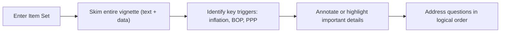

## Overview

So, you’ve made it to CFA Level II—congrats! But now the exam is asking questions in item set (vignette) format, which is a bit of a game-changer, right? At Level I, you might have sailed through single standalone multiple-choice questions. Here at Level II, you’ll be given a lengthy scenario, jam-packed with real-world details—like economic indicators and monetary policy announcements—and then asked a series of related questions. That’s our focus in this section: how to dissect these vignettes so you don’t walk out of the exam feeling totally overwhelmed.

## Why Item Sets Matter at Level II

Unlike the straightforward question-by-question approach at Level I, item sets challenge your ability to:

• Integrate different concepts—think currency quotations, balance of payments, and carry trades all thrown into the same scenario.  
• Interpret data in the context of a single storyline (e.g., a hypothetical country’s economic woes).  
• Identify the most relevant formulas or theories from the given text—a tall order, especially under time pressure.

Trust me, at first glance, vignettes can feel like epic short stories. But the better you are at scanning for relevant information, the likelier you’ll stay calm and zero in on what actually matters.

## Key Elements of a Vignette

Typically, an exam vignette has these main building blocks:

• Textual Narrative: This is the “story” portion, detailing economic scenarios such as central bank rate decisions, inflation stats, or maybe a rumor about currency market interventions.  
• Data Tables or Charts: Could be interest rates, inflation figures, forward rate quotes, or trade balance data. It’s never arbitrary—some table entries might be distractors, but most are included for a reason.  
• 4–6 Related Questions: Each question references the scenario and typically tests a specific aspect. For instance, one might focus on covered interest rate parity, while another might test your ability to compute a forward premium.

Being able to navigate these elements and figure out which numeric data go with which question is half the battle.

## Reading the Entire Vignette First

You might be tempted to read the first paragraph, jump to the question, then come back to the text—like a back-and-forth dance. But here’s a strong piece of advice: read the entire vignette before tackling any questions. Why?

1. Context is King: If the second paragraph discloses that the inflation data is from last year, you might have to adjust your interpretation.  
2. Avoid Surprises: Sometimes a crucial piece of information (like “the capital flow data is seasonally adjusted”) appears near the end.  

Think of it like scanning a new restaurant menu. Once you see the entire set of options, you know what to order. Reading bits out of context can lead to confusion, missed details, and wasted time.

To illustrate the recommended workflow, check out this simple flow diagram:

Reading the entire passage first might feel time-consuming at the start, but trust me, it prevents those panic-stricken moments when you realize you missed an important footnote.

## Recognizing Key Triggers

Have you ever read an economic news article and noticed terms that make you perk up—like “inflation spike” or “bullish forward quotes”? That’s what we mean by key triggers. For the CFA exam, some triggers (or “signal words”) specific to Economics might be:

• “Purchasing Power Parity (PPP)”  
• “Uncovered Interest Rate Parity”  
• “Inflation Differential”  
• “Balance of Payments”  
• “Exchange Rate Forecasts”  
• “Policy Shifts” (like changes in tariffs or subsidies)

When you see these terms, you know your mental alarm bells should be ringing. They’re the points around which the exam question probably revolves.

## Structuring Your Reading

When you go through the vignette, try to jot down (or underline) essential facts in short bullet notes. I used to do these mini-summaries myself:  

• Paragraph 1: “Country A’s interest rate 4%, Country B’s interest rate 2%. Forward quotes are given.”  
• Paragraph 2: “Trade deficit data. Possibly relevant for BOP or currency effect.”  
• Paragraph 3: “Monetary policy shift. Expect interest rate cut.”  

These notes help you swiftly recall which paragraph holds which piece of data. This approach also keeps your mind organized, so you’re not rereading everything from scratch each time you answer a question.

## Time Management and Tactical Approaches

Let’s talk about time, because you only get so many precious minutes per item set (roughly 10–15 minutes, depending on question complexity). No matter how confident you feel, it’s easy to get sidetracked by an especially tricky detail or a red herring. Here are a few strategies:

• Set Your Time Budget: If you have 4–6 questions tied to a vignette, decide upfront you’ll spend, say, 12 minutes total. That’s about 2–3 minutes for a quick read and data annotation, then 2 minutes or so per question.  
• Prioritize Easy Wins: The first question in an item set might be a low-hanging fruit—like computing a covered interest rate parity condition from given interest rates. If you see something straightforward, do it first and build momentum.  
• Mark a Hard Question for Later Review: If you encounter a question you truly can’t crack on the first go, circle or mark it, then come back if you have time.  

It’s like a personal marathon pace. You don’t want to sprint the first portion and then be too tired (or short on time) to handle the rest.

## Facing Distractors

Distractors are those sneaky little bits of data that add to the realism of a scenario but aren’t strictly needed to answer the question. You might see:

• “Average Rainfall in Country A”  
• “Demographic data not tied to the question”  
• “GDP of a region not mentioned in the question’s currency references”

But keep an eye out. Some data that look irrelevant might become relevant if the question is about, say, potential GDP or long-run capacity constraints. The trick is to read carefully enough to judge what’s essential. Don’t let distractors lure you into overthinking.

## Note-Taking and Annotation Techniques

Annotation is a fancy word for marking up the text—underlining or highlighting important tidbits. Here’s a method that often helps:

• Circle Key Figures: E.g., the interest rate or inflation rate that might appear in a question.  
• Write a Quick Word in the Margin: If a paragraph is about “government budget deficits,” just note “budget deficits” next to it. That way, if a question mentions deficits, you’ll know exactly where to look.  
• Summarize Each Paragraph: A quick bullet in the margin, such as “PPP concept,” “Forward premium noted,” or “Hint about future policy.”  

Be sure to keep it short; you don’t want to rewrite entire paragraphs. You just want a fast way to jump back to the right spot.

## Common Pitfalls

• Overlooking the Fine Print: Maybe the text says “interest rates are annualized for 180-day forwards,” but you calculate a 360-day forward. Oops.  
• Not Reading All Answer Choices: Sometimes multiple choices can be partially correct, but you need the best or the most accurate.  
• Rushing the Setup: In your eagerness to do the math, you might skip clarifying if the question needs a direct or indirect quotation for the exchange rate.  
• Confusing Real and Nominal Values: If the vignette states a nominal GDP growth rate but calls for real GDP, you need the inflation data.  

I’ve seen many candidates run into these pitfalls. And yes, I’ve tripped up on a few of them myself. Understanding how to approach the problem systematically is a lifesaver.

## Personal Anecdote

Back when I was first studying for Level II, I remember being stumped by a question about uncovered interest rate parity. I’d carefully extracted half the data but hadn’t realized there was a footnote about “risk premiums” hidden near the bottom of the page. I totally miscalculated because I’d neglected that one detail. My takeaway was: always read it all—footnotes included—because the test writers love burying gold in the nooks and crannies.

## Linking to Other Chapters

As you move through the rest of Volume 2, especially currency market mechanics (Chapter 2) or international parity conditions (Chapter 3), you’ll see how these item sets can incorporate multiple topics in one neat (and sometimes chaotic) package. For instance, a single vignette might ask about forward rate calculations (Chapter 2) and covered interest rate parity (Chapter 3). That’s why reading the entire scenario is critical—you’ll have to juggle multiple theories and formulas in one go.

## Glossary (Key Terms)

• Item Set (Vignette): A group of questions tied to a single scenario, typically with text, data tables, and 4–6 related questions.  
• Trigger Words: Terms (e.g., “PPP,” “Interest Rate Parity,” “Balance of Payments”) signaling relevant concepts or formulas.  
• Question Stem: The part of the question that poses the specific inquiry, often referencing the vignette data directly.  
• Distractor: An irrelevant or partially relevant piece of information included to test your ability to isolate what matters.  
• Annotation: The act of marking up the vignette, underlining, or writing short notes to track essential data.  
• Time Budgeting: Allocating a specific amount of time to read the vignette and solve each question.

## References & Suggested Readings

• CFA Institute’s Level II CFA® Program Curriculum on exam-taking strategies (see official reading assignments).  
• Official CFA Institute candidate resources: <https://www.cfainstitute.org/>.  
• “How to Read a Paragraph” by Richard Paul and Linda Elder. This classic helps you learn active reading techniques.  
• Practice item sets in the CFA Institute Learning Ecosystem to see real exam formatting and question structures.

## Final Notes

Mastering item sets is about balancing speed and accuracy. Yes, there’s a lot of reading, but it’s not just reading—it's reading with purpose. Mark up your vignettes, keep track of important data, watch out for those distractors, and remember to manage your time carefully. You’ve got this. Level II might be daunting, but once you crack the code of these vignettes, you’ll see the bigger picture come into focus—and that big pass letter just might be on the horizon.

## Test Your Knowledge: Tackling the CFA Level II Economics Item Set Format



### In a Level II Economics item set, what is the primary reason to read the entire vignette before answering any questions?

- [ ] It helps you memorize the introduced formulas more effectively.
- [x] It ensures you capture all contextual details and avoid missing critical information.
- [ ] You cannot proceed to the questions otherwise.
- [ ] It isn't necessary if you're only comfortable with a single subtopic.

> **Explanation:** By reading the entire vignette, you gather all data points—interest rates, charts, footnotes—that could drastically change how you apply formulas or interpret the scenario.

### Which of the following best describes a “distractor” in a CFA Economics vignette?

- [ ] Key data used to address the question directly.
- [x] Additional data not strictly needed for the solution, potentially misleading.
- [ ] Another name for the correct answer choice.
- [ ] Any mention of government policy in the vignette.

> **Explanation:** Distractors are intentionally included pieces of text or data that might feel relevant but do not directly affect the correct answer, testing your skill in filtering out noise.

### A common pitfall when tackling item sets is:

- [ ] Reading all paragraphs closely.
- [ ] Calculating real GDP growth after finding the inflation rate.
- [x] Using nominal figures when the question explicitly requires real figures (or vice versa).
- [ ] Checking footnotes and disclaimers.

> **Explanation:** Although reading everything thoroughly is important, mixing up real vs. nominal data remains a frequent error that can derail your calculation.

### “Trigger words” refer to:

- [ ] Words that notify you the question was poorly written.
- [x] Terms or phrases that hint at a specific concept or formula (e.g., PPP, parity, inflation).
- [ ] Expletives used by the examining body.
- [ ] Time management tools.

> **Explanation:** Trigger words such as “covered interest rate parity” or “balance of payments” indicate which theoretical framework you might need to apply for the solution.

### What is the best initial approach when an item set contains multiple tables of economic indicators?

- [x] Skim all tables and textual parts, noting the type of each indicator and the relevant time frames.
- [ ] Focus on only one table at a time and ignore subsequent data until the question explicitly directs you there.
- [ ] Calculate as many metrics as possible, even if there’s no direct question reference.
- [ ] Rely on memory of common data relationships instead of reading the tables.

> **Explanation:** You should quickly review all data, organizing in your mind (or notes) the big picture of what each table provides. That ensures you know where to find specific figures when you see the related questions.

### Which note-taking strategy can effectively help manage data in a long Economics vignette?

- [ ] Avoid any annotation to save time.
- [ ] Write long summaries of each paragraph.
- [x] Write quick bullet notes or keywords in the margins and circle key figures.
- [ ] Highlight every sentence for thoroughness.

> **Explanation:** Brief bullet notes and circled numbers allow you to locate data quickly without wasting time rewriting or scanning entire paragraphs again.

### How does time budgeting typically apply to item sets at CFA Level II?

- [ ] You should plan at least 30 minutes per vignette, no matter how many questions it has.
- [x] You allocate around 10–15 minutes per vignette, adjusting slightly based on your personal pace and the question complexity.
- [ ] It’s best to spend most of your exam time on one or two item sets you’re most comfortable with.
- [ ] Time budgeting is irrelevant; you’ll finish when you finish.

> **Explanation:** With 4–6 questions per vignette, about 10–15 minutes total is a good benchmark to ensure you can address all item sets in the exam period.

### When the item set references forward currency quotes, which chapters in Volume 2 might you cross-reference?

- [ ] None; currency quotes are unrelated to Economics.
- [x] Chapters on Currency Market Mechanics (Chapter 2) and International Parity Conditions (Chapter 3).
- [ ] The only relevant area is the chapter on Behavioral Economics.
- [ ] The chapter about Monetary and Fiscal Policy Effects on Exchange Rates is irrelevant.

> **Explanation:** Forward quotes are heavily featured in Chapter 2 (Currency Market Mechanics) and Chapter 3 (International Parity Conditions) as both discuss forward premiums, discounts, and parity frameworks.

### One major advantage of reading the entire passage before reading the questions is:

- [ ] You learn all the formulas from memory before seeing the question.
- [x] You prevent confusion by having the full context, including any monetary policy announcements or footnotes.
- [ ] It guarantees you won’t run out of time.
- [ ] It’s the best way to memorize random details.

> **Explanation:** Contextual details might be buried in later paragraphs or footnotes, so having a bird’s-eye view of the entire scenario makes question-by-question analysis more efficient and accurate.

### True or False: Distractor data in a vignette is always completely unrelated to any concept in Economics.

- [x] True
- [ ] False

> **Explanation:** Distractors may sometimes appear related at first glance but turn out not to be needed for your final calculation. They’re placed to test your ability to differentiate relevant information from irrelevant details.


