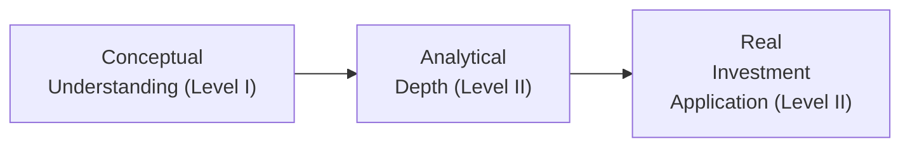

## Introduction 
Well, before you dive headlong into Level II Economics, let me just say—if you thought Level I covered a broad range of economic topics, you’re right, it did. But as you may already know, Level II is where the CFA Program usually kicks things up a notch. It’s not just about, “What is inflation?” or “How do interest rates affect exchange rates?” anymore. Instead, the exam wants you to show how and why these concepts matter for actual investment and portfolio decisions. And trust me, it can feel like you’re juggling multiple concepts at once: from foreign exchange forecasting to analyzing business cycles, from mark-to-market forward contracts to interpreting economic indicators.

In Level II, you’ll see deeper, more integrated vignettes. You won’t just read a single data point—like a spot exchange rate—and recite a formula. Now you’ll have to figure out how that spot rate, plus a series of interest rate forecasts, plus a shifting business cycle, might affect an equity portfolio strategy or a multinational company’s earnings. This definitely means more complexity, but also more excitement. After all, it’s the real application of these concepts that make them click.

Below, we’ll explore how these differences roll out. We’ll look at the higher-level analysis, integrated problem-solving, multiple-step calculations, and direct ties to valuation. Ultimately, the mentality shifts from “Do you know this concept?” to “Can you use it in a real-world, big-picture scenario?”

## Shift from Basic Comprehension to Analysis
You might have breezed through Level I with definitions and simple formula applications. Now at Level II, you’ll be asked not just to define interest rate parity but to illustrate what happens to a currency’s forward value when interest rates shift—and then determine how to profit from it (or avoid losses). 

A quick personal anecdote: I remember the first time I tackled a Level II practice item set on exchange rates. I saw a big table with spot exchange rates, forward points, interest rates for multiple countries, and a scenario about a potential carry trade. My immediate reaction was, “Uh…where do I even start?” That’s a typical reaction! Because now, you’re expected to:
• Extract relevant information from a multi-page vignette.  
• Evaluate whether covered or uncovered interest rate parity holds.  
• Calculate forward prices or net payoff over a given period.  
• Determine the arbitrage implications for a portfolio.  

All in one question set. And guess what? This type of exercise doesn’t test your memory alone; it tests your ability to interpret data, integrate concepts, and form an investment decision.

### Emphasis on Practical Investment Scenarios
Economics is full of big-picture theories: supply/demand, inflation, etc. At Level I, you mostly identified those concepts in a neat, theoretical sense. But in Level II, every single economic phenomenon must be tied back to some real-world scenario: how it impacts the yield curve, how corporate profits might shift in different phases of the business cycle, or how currency volatility can whack your portfolio returns if you’re not hedging properly. 

If you notice, the Table of Contents for Volume 2 (Economics) has entire chapters on applying these theories—like forecasting exchange rates under parity conditions (Chapter 3), analyzing central bank actions (Chapter 4), or tying macroeconomic growth trends back into asset valuation (Chapter 9). You’ll be asked to step beyond just recognizing a formula and instead determine how the formula’s output influences an investment approach.

## Deepening Quantitative Application
Gone are the days of only plugging in a simple inflation figure into the Fisher Equation. (Well, okay, you might still do that, but you’ll do a lot more too!) At Level II, your calculations may require a multi-step approach. For instance, you might:

• Use interest rate parity to compute a forward exchange rate:  
  
  F = S \times \frac{(1 + i_d)}{(1 + i_f)}
    
• Realize from the vignette that the domestic interest rate (i_d) and foreign interest rate (i_f) are annualized but the forward contract covers only three months. So you must adjust them accordingly.  
• Proceed to compute an implied profit or loss from a forward contract position using the mark-to-market formula.  
• Conclude whether an arbitrage opportunity exists and what that implies for your currency hedging strategy.  

That’s what we mean by “deeper application.” You still rely on the same underlying concepts—like interest rate parity or purchasing power parity—but you tend to deploy them in more complex ways and possibly chain multiple formulas together.

## Integrated Problem-Solving: Combined Subtopics
A hallmark of Level II vignettes is that they often blend multiple economic theories in a single problem. Maybe you’ll start with business cycle analysis: the vignette sets up which phase of the cycle the global economy is in, how unemployment and inflation are trending, and which sectors are gaining momentum. Then, it transitions to exchange rate forecasting: in that scenario, you might use purchasing power parity (PPP) or uncovered interest rate parity to see where the currency might be heading. Finally, you might have a question that merges these insights: is the currency overvalued or undervalued given the stage of the economic cycle, and how does that affect domestic equity markets?

“Integration,” in Level II speak, is the notion that you should seamlessly combine theories. It’s not just a single-step question. Instead, a question might read: 
• “Given the BOP data, does the country appear to be running a capital account surplus or deficit?” 
• “How would that reflect in the forward market for the currency?” 
• “Does uncovered interest rate parity hold given the provided yield differential?”

You’re basically constructing the puzzle piece by piece, which demands you keep all relevant frameworks in mind—rather than focusing on one concept in isolation.

### A Quick Visual Overview
Below is a simple flowchart summarizing how your approach evolves from Level I to Level II:

## Real-World and Valuation Implications
What’s new? You now see how a change in interest rates might influence, for example, bond prices and stock valuations—plus how currency fluctuations can amplify or reduce your returns in a cross-border investment. Let’s say uncovered interest rate parity doesn’t hold in a given scenario. Suddenly, you might see the potential for a carry trade, where you borrow in a low-interest currency, convert those funds to a high-interest currency, and invest for a profit. All these steps aren’t hypothetical anymore; they directly relate to portfolio gains or losses you’d realize in the real market.

And you’ll notice more references to big-picture events: For instance, if you read Chapter 5 in this volume, you’ll look at how monetary or fiscal policies can drastically shift exchange rates, and thus your entire investment position. If in a vignette, a central bank is about to deploy quantitative easing or capital controls, you’ll have to evaluate how that modifies currency flows, interest rates, or bond prices.

## Tying Economics to Portfolio Decisions
Ah, this is my favorite part. Because if you think about it, all these economic theories—PPP, IRP, business cycles, growth models—should eventually inform your portfolio strategy. Is the local currency likely to appreciate against your base currency? That might be good for your equity returns (especially if you own local shares). But if you’re worried about a big downturn, maybe your portfolio allocation to that currency-rich asset is too heavy.  

At Level II, questions can push you to interpret macro data like unemployment rates or inflation figures in the context of yield curves, credit spreads, or sector rotation strategies. You might recall that in expansions, cyclical sectors often do well, while in contractions, defensive sectors (like consumer staples) might hold up better. The exam wants you to see how these ideas come together, not just spout them off.

## Example of a Multi-Step Calculation
Let’s consider a simplified scenario you might face. Suppose you are given:

- Spot rate: 1.2500 USD/EUR  
- 90-day domestic interest rate: 6% annualized (i_d = 0.06)  
- 90-day foreign interest rate: 2% annualized (i_f = 0.02)  
- The question: “What is the 90-day forward USD/EUR rate under covered interest rate parity, and does it suggest a possible arbitrage opportunity?”

Step 1: Adjust interest rates for 90 days.  
• Domestic rate for 90 days ≈ 0.06 × (90/360) = 0.015 (1.5%)  
• Foreign rate for 90 days ≈ 0.02 × (90/360) = 0.005 (0.5%)  

Step 2: Compute the forward rate.  

F = 1.2500 \times \frac{1 + 0.015}{1 + 0.005} \approx 1.2500 \times \frac{1.015}{1.005} \approx 1.2604


This means the forward quote should be roughly 1.2604 USD/EUR. If the actual forward quote of the market (based on the vignette’s data) differs significantly from that, you might identify an arbitrage opportunity. Then you’d consider whether you can borrow in one currency and lend in another to lock in a risk-free return.

In Level I, you might have just been tested on the formula. At Level II, you might be asked four or five follow-up questions:
1. Is the forward rate trading at the correct level or is it off?  
2. What trades would you make if it’s off?  
3. Does your trade remain profitable after considering transaction costs or bid–offer spreads?  
4. How would changes in the domestic or foreign interest rates influence your final payoff?

## Common Pitfalls in Level II Economics
• Focusing on definitions alone: If you rely solely on memorized knowledge (like the definition of interest rate parity), you risk missing the application steps.  
• Skipping data: Vignette data can be lengthy. Don’t skim it. Every piece of data (like forward points, yield curves, or BOP components) might become relevant.  
• Ignoring integration: Resist the urge to treat each question as an isolated concept check. The exam might blend multiple subtopics.  
• Not interpreting the “why”: Merely computing a number is not enough unless you can connect it to a conclusion about valuation or strategy.  
• Overlooking real-world constraints: Sometimes, a theoretical arbitrage might be offset by transaction costs, liquidity issues, or capital controls. You need to consider those.  

## Glossary of Key Terms
• Analysis vs. Comprehension: At Level II, you perform deeper analysis of data (like charts or tables) rather than merely demonstrating you understand a theory.  
• Integration: Expect to combine multiple economic concepts or frameworks within a single problem set.  
• Application: Use formulas (e.g., interest rate parity, PPP) in real scenarios—think currency hedging, carry trades, or corporate capital budgeting.  
• Carry Trade: Borrowing in a low-interest-rate currency to invest in a high-interest-rate currency, pocketing the rate differential if no big currency moves destroy your profits.  
• Business Cycle Analysis: Assessing whether the economy is in expansion, peak, contraction, or trough, and how each phase influences assets or currencies.

## References & Further Reading
• CFA Curriculum Level II—Economics topic area coverage, especially “Currency Exchange Rates.”  
• “Global Macro Fundamentals for Investment Managers” (CFA Institute publication).  
• Official CFA Program practice exams and mock exams for integrated questions.  

## Final Thoughts
Essentially, the leap from Level I to Level II is about complexity and completeness. You’ve already learned the fundamental frameworks, but now you need to put them all together, crunch some numbers, interpret them accurately, and figure out how you’d use that knowledge in an actual investment context. It’s a lot to juggle, but it’s also where economics starts feeling genuinely relevant to portfolio and asset management. 

Practice reading vignettes thoroughly, identifying key data points, and quickly recalling the relevant formulas. Then, interpret your results carefully. If you see interest rates rising, think about how that might affect not just currency values, but also bond prices, stock valuations, and even corporate capital structures. The “why” and “how” behind each movement becomes your new best friend at Level II Economics.

---

## Practice Questions: Key Differences from Level I Economics



### Which of the following best describes the main shift from Level I to Level II Economics in the CFA Program?

- [ ] Moving from macroeconomic theory to microeconomic theory  
- [ ] Replacing fundamental valuation with purely qualitative analysis  
- [x] Transitioning from conceptual understanding to deeper application and multi-step analysis  
- [ ] Focusing solely on memorizing formulas with little real-world context  

> **Explanation:** Level II emphasizes how candidates apply and integrate economic concepts in more complex, multi-step investment scenarios rather than just recalling definitions.

### When an item set in the CFA Level II exam depicts a scenario involving interest rate differentials, forward rates, and possible arbitrage, what is the primary expected candidate skill?

- [ ] Recalling the standard definition of an interest rate differential  
- [ ] Discussing the historical evolution of each relevant concept  
- [x] Calculating implied forward rates and determining whether an arbitrage opportunity exists  
- [ ] Noting that interest rate parity rarely holds in practice  

> **Explanation:** Candidates must integrate the concepts of interest rate parity and forward-rate calculations, then apply them to find mispricing or arbitrage opportunities.

### In Level II Economics, a question about currency markets may combine spot quotes, forward quotes, and balance of payments data. What does this combination highlight?

- [ ] The need to memorize additional formula variations for complex calculations  
- [ ] The shift to an entirely qualitative approach in currency valuation  
- [ ] The diminishing role of interest rate parity in currency analysis  
- [x] The emphasis on integrated problem-solving using multiple economic frameworks simultaneously  

> **Explanation:** Level II stresses how to tie together multiple economic perspectives—like BOP, PPP, and IRP—within one vignette to form a holistic investment conclusion.

### Consider a scenario in which uncovered interest rate parity fails to hold. Which statement best reflects what Level II expects you to do?

- [ ] Ignore arbitrage because the exam rarely focuses on such details  
- [x] Identify and possibly propose a carry trade strategy, and evaluate the real-world constraints  
- [ ] Immediately assume the data is incorrect and disregard the question  
- [ ] Conclude that PPP automatically does not hold and move to the next question  

> **Explanation:** If uncovered interest rate parity doesn’t hold, you might exploit the rate differential via a carry trade, but you must also factor in transaction costs, capital controls, or currency volatility.

### In a multi-step problem involving forward currency contracts, which of the following is the most critical addition at Level II?

- [ ] Translating nominal rates directly into real rates without additional context  
- [ ] Keeping calculations strictly theoretical  
- [x] Considering factors like bid–ask spreads and transaction costs to evaluate arbitrage  
- [ ] Only referencing a single exchange rate without analyzing interest rate differentials  

> **Explanation:** At Level II, complexity arises from real-world factors such as transaction costs and bid–ask spreads, which can affect whether an arbitrage truly exists.

### A candidate faces a vignette showing domestic and foreign interest rates, spot exchange rates, and an expected inflation differential. What new approach does Level II demand compared to Level I?

- [x] Linking the data to actual investment implications, like currency-hedged returns  
- [ ] Strictly limiting the analysis to foreign rates and ignoring domestic data  
- [ ] Calculating only the nominal exchange rate without further interpretation  
- [ ] Focusing on concept definitions solely  

> **Explanation:** The exam wants you to demonstrate how those rates and inflation views impact potential currency returns after hedging or how they might influence portfolio allocation decisions.

### Which best describes the Level II treatment of business cycle analysis?

- [ ] Basic definitions of peak, trough, and recession only  
- [ ] Isolated memorization of phases without linking to assets  
- [x] Detailed examination of how business cycle phases affect equities, fixed income, and currencies  
- [ ] Replacing quantitative data with purely qualitative historical anecdotes  

> **Explanation:** Candidates must apply the understanding of each cycle phase to see how it shapes investment preferences and market dynamics.

### An item set requires calculating a currency forward rate, identifying an arbitrage, and discussing how it affects a portfolio’s strategic currency hedge. What key difference from Level I is illustrated here?

- [ ] The exam replaces all multiple-choice items with short answers  
- [x] The integrated approach that demands multiple computations and final interpretation for investment decisions  
- [ ] The format is now purely theoretical and no calculations are necessary  
- [ ] No real economic data are provided; it’s all hypothetical  

> **Explanation:** Level II item sets often entail two or three separate steps—calculations followed by deeper analysis and insights on how returns or hedges are affected.

### When analyzing capital flows in Balance of Payments data at Level II, which outcome might you be expected to draw?

- [x] Conclusions about currency valuation and the potential effect on bond or equity markets  
- [ ] Simple statements about whether the private sector invests abroad  
- [ ] Only a classification of items in the current versus financial account  
- [ ] A statement that capital flows never influence currency rates  

> **Explanation:** Balance of Payments analysis at Level II is more investment-oriented, examining how capital inflows/outflows can drive exchange rates and subsequently affect broader markets.

### True or False: Level II Economics vignettes focus primarily on memorizing macroeconomic definitions rather than applying them in real-world investment scenarios.

- [x] True  
- [ ] False  

> **Explanation:** It’s actually the opposite—Level II questions require real-world application and integration of economic concepts. Stating them from memory alone isn’t sufficient.


