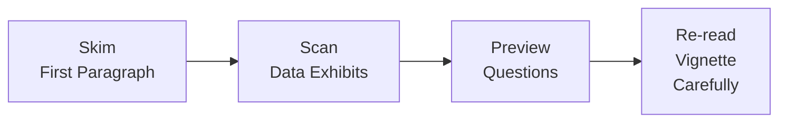

## Tailoring Your Approach to Vignette Reading

So, you're staring down a six-paragraph scenario plus a couple of data tables, and you’ve only got a limited time window. Welcome to the CFA® Level II item set! Is there a perfect one-size-fits-all method for tackling these vignettes? Honestly, not exactly—different approaches suit different people. But there are proven strategies to make sure you grab every possible point without getting lost in the details. I remember the first time I attempted a timed CFA mock; let’s just say, I nearly forgot to breathe. Anyway, let’s walk through some core reading and time management tips that can save you from a similar fate.

## Step-by-Step Reading Strategy

A helpful reading plan typically follows a four-step cycle:

1. Skim the first paragraph or two: Grab the “story” or big-picture context.  
2. Look at the data exhibits: Note major tables, graphs, or summary figures.  
3. Read each question stem (ignoring answer choices for the moment): This is where you figure out exactly what’s being tested.  
4. Reread the vignette carefully, annotating details that connect to the questions.

This sequence sounds straightforward, but in the heat of the exam, it’s easy to skip or jumble steps. If you find yourself flipping back and forth between questions and the passage, or if you’re reading the entire vignette multiple times, a structured, stepwise approach allows you to keep it all in check.

Below is a visual flowchart of this reading strategy:

### Step 1: Skim the First Paragraph
Open with a quick read of the vignette’s introductory lines. Usually, you’ll see context such as a company’s operational focus, a macroeconomic background, or an overview of recent financial results. Don’t aim for absolute retention here—just get a sense of what you’re dealing with.

### Step 2: Check Out the Data Exhibits
Look at any tables, graphs, or sidebars. Note relative magnitudes: Are they showing a currency exchange table? A forward premium or discount? A chart with interest rates, inflation figures, or GDP growth predictions? You want to understand which variables are in play because the multiple-choice questions often hinge on how well you interpret these data points.

### Step 3: Preview the Questions
Now, glance over (but don’t deeply analyze) each question’s stem. So if the first question says, “Based on the data, what would be the most accurate forward rate for ABC currency in six months?” you instantly recognize you’ll need spot rates, forward quotes, or interest differentials. This helps you read the vignette with a targeted mindset—you spot relevant numbers right away instead of reading aimlessly.

### Step 4: Reread for Detail
You’ve got a sense of where you’re headed. Now do a more careful reading. Some folks highlight or annotate. Others jot quick notes in the margin. The technique doesn’t matter as much as ensuring you keep track of crucial statements. Maybe the data table mentions 3-month interest rates, but the question is about 6-month forward rates—perfect time to note that discrepancy. Good annotation also prevents those dreadful “Wait, was that figure nominal or real?” confusions.

## Typical Reading Time Per Vignette

Next: time management. Typically, you have about 3 minutes per question (some say 2.5 minutes, others 3.5, depending on the exam’s overall structure). If an item set has six questions, that implies roughly 18 minutes total, which needs to cover reading plus answering. But please remember that’s an average. You might spend a bit longer on a more comprehensive set with multiple tables, then bank a little time on a simpler set. In practice, try to:

• Spend no more than 2–3 minutes on your initial read (including Step 1 and Step 2).  
• Use about 1 minute to glance at the questions (Step 3).  
• Save about 2 minutes to go over the vignette carefully (Step 4).  
• Reserve some buffer time for calculations or re-checking.  

It’s not a rigid formula—some folks first read all the questions, then circle back to the vignette. My buddy swears by scanning every question first. I prefer a partial question scan after I see the data exhibits. Experiment during mock sessions to find your groove.

## Chunking the Vignette

The concept of “chunking” can be a lifesaver. Rather than reading a big block of text and trying to store everything at once, break it into segments:

• Background or introduction (usually the first paragraph or two)  
• Policy discussion or scenario details (central portion)  
• Data sets or exhibits (tables, charts)  
• Conclusions or wrap-up (final paragraph)

Chunking helps you manage complexity. As soon as you label each segment, it’s easier to mentally file the details away. If the question references something from the capital flows table, you instantly recall that it’s chunk #3 of your mental breakdown. This approach reduces the risk of missing a subtle detail because you deliberately processed the vignette in small portions.

## Practice Under Timed Conditions

I can’t stress this enough: if you’re not practicing under realistic time constraints, you might be in for a rude awakening come exam day. Time management is a skill, and it’s built by repeated exposure. So:

• Use official CFA Institute practice item sets, set a timer, and train your internal clock.  
• Pick a reading strategy, measure how long it takes you, and note where you get stuck.  
• Don’t linger: if you sense a question is taking forever, apply “triage” (more on this soon).  

A common complaint is, “I run out of time by the last item set.” That usually means you might be over-reading or not triaging complex questions. Or maybe you’re retreading data to verify something that only needed a quick check. On the flip side, if you finish extremely early but discover numerous careless mistakes, consider reading more slowly and deliberately.  

## Verifying Your Pace: Too Slow or Too Quick?

• Too slow: If you never see the final item set or you constantly guess on the last two or three questions, you’re probably spending too much time rereading the vignette or second-guessing your calculations. Maybe you’re writing out every single step for each formula in detail.  
• Too quick: If you wrap up with 30 minutes to spare but your accuracy is below par, that’s a red flag that you’re skipping crucial details, or you’re not verifying your numeric data. Speed is never good if it leads to systematic errors.

## Handling Numeric Data

When the vignette includes a table with multiple currencies, interest rates, or price indexes, you’ve got to keep your eyes peeled for:

• Consistent Units: Are exchange rates quoted in direct or indirect terms (e.g., USD/EUR vs. EUR/USD)? If the question uses a different convention than the table, convert accordingly.  
• Time Periods: Forward rate questions often revolve around different maturities than the ones provided in the data.  
• Potential Red Herrings: Some data might be less relevant, included just to see if you can decide what to use and what to ignore.  
• Rewriting or Summarizing: Jot down the essential numeric parts in a concise format. That might mean rewriting a portion of the table “long-hand” in your scratch paper if it helps you spot relationships more easily.

Double-check your formulas—especially if you are dealing with forward premium/discount calculations, mark-to-market values, or similar areas where input mistakes are easy. Trust me: in the rush, it’s common to forget an exponent or misread a decimal. A quick “unit sense” check can save you from embarrassing slip-ups.

## The Triage Technique

Sometimes a question just seems monstrous: it might require multiple steps, elaborate formulas, or several references back to the text. That’s prime time for “triage.” Skip it temporarily, answer the quicker ones, and come back later with a calmer mind (and maybe more time if you answered the simpler questions swiftly). Triage is about maximizing overall points. It’s too easy to let a single complicated question torpedo the rest of your item set.

## Bringing It All Together

Putting this into practice typically looks like:

• Start reading the vignette, chunk it out in your mind.  
• Identify the main data exhibits.  
• Peek at each question stem.  
• Go back to the text, focusing on relevant sections.  
• For simpler questions—knock them out quickly.  
• If you see a question that looks like a multi-step puzzle with a tough formula, triage it.  
• Manage your time so that you’re not stuck on tiny details at the expense of the entire set.  

Once you internalize this rhythm, you might find you don’t need to watch the clock constantly. You develop a natural pace. But that ease only comes with practice under timed conditions.

## Glossary

• Chunking  
  Organizing text or data into smaller, more manageable groups for better comprehension and recall.  

• Triage Technique  
  Temporarily skipping overly time-consuming or complex problems—for instance, a multi-step calculation question—so you can earn quicker points on simpler questions first, then return later if time remains.  

• Reading Plan  
  A personalized approach to reading a vignette, annotating key points, and cross-referencing them with the questions.  

• Time Block Budgeting  
  Allocating a set amount of minutes to each vignette and question, ensuring you progress efficiently without dwelling too long on individual items.  

• Data Exhibits  
  Tables, charts, or supplementary information embedded in the vignette that contain key quantitative or qualitative insights you’ll need to answer the questions.

## References & Suggested Readings

• “Study Tips for the Level II CFA® Exam” – CFA Institute Blog  
• Articles on standardized test time management (e.g., Beat the GMAT blog). Many of the underlying strategies are similar.  
• CFA Institute Learning Ecosystem timed practice tests.  

## Final Exam Tips

• Maintain a flexible reading strategy. Test out different methods (e.g., skimming questions first vs. reading the vignette thoroughly) in your mocks.  
• Remember chunking and triage: break down the text and skip complicated questions until you’ve collected easier points.  
• Keep an eye on your pace. In many item sets, you have about 3 minutes per question—adjust as needed, but don’t fixate too rigidly.  
• If something feels off, reevaluate your approach. Are you over-highlighting or scanning too superficially? Fine-tune with each practice session.

## Time Management Practice: 10 Sample Questions



### 1. According to the recommended step-by-step reading strategy, which action should you take immediately after skimming the first paragraph?

- [ ] Carefully read all answer choices.
- [ ] Re-read the first paragraph in detail.
- [x] Scan the data exhibits or tables to identify key figures.
- [ ] Highlight every term in the introductory paragraph.

> **Explanation:** After a quick skim of the opening context, it’s most efficient to check any provided data, charts, or tables so you know what type of numerical information you’ll be working with.

### 2. A candidate frequently runs out of time on the last item set of the exam. Based on typical time management recommendations, what is the most likely cause?

- [ ] Underreading the vignettes.
- [ ] Finishing each item set too quickly.
- [x] Over-reading or spending too much time on certain questions.
- [ ] Wasting time by skimming questions instead of reading them thoroughly.

> **Explanation:** Running out of time is often tied to spending too long on specific items or repeatedly re-checking details. Practice pacing and triage strategies help avoid this pitfall.

### 3. A “chunking” approach to reading a vignette primarily helps candidates:

- [x] Organize information in smaller segments and boost recall.
- [ ] Ensure every single detail is memorized before looking at the questions.
- [ ] Decrease the total reading time by ignoring certain paragraphs.
- [ ] Convert all data into a single table.

> **Explanation:** Chunking organizes information into more manageable portions, making it easier to retain details and align them with the question stems.

### 4. If a candidate finds a question that involves multiple steps and complex calculations, how should they respond under a triage approach?

- [ ] Spend extra time on it immediately to ensure accuracy.
- [x] Temporarily skip it, answer quicker questions, then return later.
- [ ] Guess the answer to save time.
- [ ] Eliminate the question entirely as it may be too difficult.

> **Explanation:** The triage technique suggests skipping lengthier, complicated questions at first in order to secure easier points, then circling back if time permits.

### 5. Which scenario best describes a “red herring” in an item set’s data?

- [x] Extra figures provided in the table that have no bearing on the question asked.
- [ ] A chart that contradicts the text of the vignette.
- [ ] A highlight of interest rates that is reused in every question.
- [ ] A mismatch between the required interest rate and the provided inflation rate.

> **Explanation:** A red herring is any piece of information that can distract or mislead you, usually not needed for the correct solution.

### 6. A candidate finishes each item set 10 minutes early but repeatedly scores lower than desired. This might indicate:

- [ ] Perfect efficiency in time management.
- [x] The candidate may be missing nuances by reading the vignette too superficially.
- [ ] There are too many tricky data exhibits.
- [ ] The candidate should guess more strategically.

> **Explanation:** Finishing too soon but underperforming often means the candidate is glossing over important details and failing to cross-check data carefully.

### 7. Which of the following is the best initial reading plan if a candidate prefers to see the “goal” of each question before immersing in the text?

- [x] Quickly scan the question stems first, then read the vignette thoroughly.
- [ ] Take notes for each line of the vignette, ignoring question stems.
- [ ] Solve all numeric calculations before looking at the question stems.
- [ ] Check the answers right away and see which ones match the data exhibits.

> **Explanation:** Some candidates prefer knowing the questions in advance. Scanning question stems before a full read is a valid strategy that aligns reading with what you’ll eventually need.

### 8. If you generally have 3 minutes per question, and an item set has 6 questions, about how many minutes total should you budget for that item set?

- [ ] 12 minutes
- [ ] 16 minutes
- [x] 18 minutes
- [ ] 24 minutes

> **Explanation:** At approximately 3 minutes per question for 6 questions, you’d budget around 18 minutes, including reading time, data review, and answering.

### 9. Chunking the text into segments often includes:

- [ ] Reading everything at once to form a single mental picture.
- [x] Breaking the vignette into introduction, policy discussion, data sets, and conclusion.
- [ ] Merging all paragraphs into one large table.
- [ ] Focusing only on the introduction and exhibits.

> **Explanation:** Successful chunking separates the vignette into key sections, usually introduction, main details, data, and conclusions, making it easier to locate needed information.

### 10. True or False: Once you decide on a specific reading strategy, you should never experiment with alternatives during practice.

- [ ] True
- [x] False

> **Explanation:** It’s wise to test multiple strategies under time constraints to see which method produces the best accuracy and comfort level. A rigid approach could limit adaptability.


