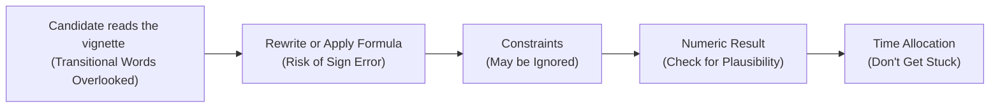

## Introduction

So, let's chat (slightly informally) about the common pitfalls we see in CFA Level II Economics item sets—and more importantly, how to dodge them. I remember my first attempt at practicing vignettes: I'd skim the passage, spot a formula that I (sort of) remembered, do a quick calculation, and promptly arrive at a bizarre or out-of-context result. Not fun! Many of us can relate to that feeling of confidence followed by a sinking stomach once we realize we missed a small detail that flipped everything on its head.

In Level II, vignettes are designed to test both technical knowledge and your ability to parse relevant details. That means small mistakes—like misunderstanding a transitional word or rewriting a parity condition incorrectly—can snowball. Below, we’ll walk through each major pitfall, with plenty of examples and tips to help you keep your calculations, logic, and time management under control.

## Overlooking Transitional Words

One of the easiest ways to go wrong in an Economics vignette is to skip over transitional words like “However,” “Despite,” “Although,” or “Nevertheless.” In item sets, these words often signal a shift in direction or a condition that modifies the original statement. Suppose the vignette says, “The Analyst predicts the domestic currency to appreciate due to a shift in trade balances. However, new capital controls are expected to reduce foreign investment inflows.” The “However” might negate or greatly reduce the effect of that original predicted appreciation.

• Why This Matters: Overlooking that transitional word can lead to the wrong conclusion about whether the currency is still expected to appreciate or if it’s going to depreciate because of the capital controls.  
• How to Avoid It: Slow down. Mark or highlight these transitional words in the vignette. Then ask yourself: “What exactly does this do to the statement right before it?”

## Rewriting Formulas from Memory Incorrectly

You’ve probably studied interest rate parity, purchasing power parity, or growth models a thousand times by now. But in the exam room, with nerves ramping up, it’s easy to mix up a minus sign for a plus sign (or vice versa!). For instance, incorrectly recalling the forward premium formula could throw off your entire currency forecast or arbitrage calculation.

• Why This Matters: Even a small sign error in forward calculations (e.g., forgetting to express the forward points as a discount) leads to a chain error that carries through all subsequent steps.  
• How to Avoid It: Practice formula writing and double-check. Sometimes, writing a mini “cheat sheet” in your mind is fine—just ensure it’s accurate. If you have time, confirm each line of your final formula with the concept: “Does it make sense that a higher domestic interest rate leads to a forward discount on the currency, or a forward premium?”  

## Ignoring Constraints (Like Protective Regulations)

Now and then, a vignette will mention a rarely used constraint: “Due to capital controls, foreign investors are limited to a maximum investment of 10% in domestic currency assets.” If you blow past details like that, you might assume that money can flow freely above the 10%, leading you to apply a typical interest rate parity approach. But the presence of a regulation can mean your standard parity condition is out the window.

• Why This Matters: Protective regulations or capital controls can fully or partially invalidate standard assumptions of free capital movement, covered or uncovered interest parity, or even typical supply-demand relationships.  
• How to Avoid It: Be on the lookout for disclaimers about government policy. If you see “capital controls,” “protective regulations,” or “foreign ownership restrictions,” pause and consider how these constraints alter the usual formulas.

## Getting Stuck on One Sub-Question

Ever lost track of time because you lingered on a single complicated question? I’m definitely guilty of that. For example, you might see a multi-part item set about forward rates, forward premiums, and arbitrage conditions. You do fine up to part (d), but part (e) is some tricky side scenario about partial equilibrium with a new capital control. You keep fiddling with it, and next thing you know, you’ve spent a quarter of the exam time on one question.

• Why This Matters: Time is precious. Each question is worth a certain number of possible points, but if you sink too long into a single calculation or sub-question, you risk losing out elsewhere.  
• How to Avoid It: If you sense you’re stuck, mark it and move on. You can revisit if you have time at the end. A partial guess with reasoned logic is better than no attempt at the next questions.

## Failing to Check the Consistency of Your Answer

Time pressure can push us to accept the first numeric answer we get. Yet if the question yields a forward premium of 50% over a 90-day horizon, that might be a giant red flag—unless you’re dealing with a highly volatile emerging market scenario. Always ask: “Does 50% in 90 days sound absolutely bizarre for the currency or growth scenario described?” If yes, reevaluate.

• Why This Matters: Inconsistent final answers are a neon sign telling you that you missed something: a decimal place, a sign, a transitional word, or an important assumption.  
• How to Avoid It: Check the plausibility of your result in the real-world sense. If it’s an extreme outlier, see if the question context allows such an outlier—maybe it’s a hypothetical scenario or a crisis environment. If not, rethink the steps.

## Skimming Over Footnotes in Exhibits

Vignette exhibits often include a table showing, for instance, domestic interest rates, foreign interest rates, inflation expectations, or trade balances. At the bottom of the table (in tiny font) you might see something like “Note: Annual interest rates are not compounded monthly” or “All data expressed in real terms unless otherwise stated.” Miss that, and you’re calculating nominal rates with the assumption of monthly compounding (a typical approach), but the exhibit stated otherwise in the footnote.

• Why This Matters: Footnotes can drastically change your approach. They might clarify whether it’s an annualized rate, a monthly rate, a real rate, or if it includes or excludes certain flows.  
• How to Avoid It: Before you jump into the question, read the entire exhibit thoroughly. Underline or note the footnote. Then interpret the data in line with that footnote.

## Falling for Mental Shortcuts (Ignoring Part of the Question)

Sometimes the question is: “Based on the partial equilibrium analysis, how would a tariff on raw materials impact the domestic currency?” But if you’re on autopilot, you might dive into a full equilibrium reasoning that includes second-round effects on consumption, investment, etc. Meanwhile, the question specifically asked about partial equilibrium—only the direct effect within one market or sector.

• Why This Matters: In test conditions, you might see the word “tariff” and think “Oh, this is going to affect the entire economy, so let me consider the entire general equilibrium approach.” But it can lead you astray if the question specifically says partial equilibrium.  
• How to Avoid It: Re-read the question prompt. Notice whether they specify partial vs. general equilibrium. Identify if they want the direct or indirect effect. Answer exactly what they asked for—no more, no less.

## Diagram: Where Pitfalls Creep In

Below is a quick diagram highlighting the journey from reading the vignette to arriving at a final answer. Notice all the potential missteps on the way:

By keeping each step in perspective—reading transitional words, accurately using formulas, respecting constraints, verifying numeric outcomes, and watching the clock—you reduce the risk of error.

## Glossary (Key Terms to Watch For)

• Transitional Words: Terms like “However,” “Despite,” “Meanwhile,” or “Nevertheless” that alter or qualify preceding statements.  
• Protective Regulation (Capital Control): A government restriction on currency trades or capital flows (e.g., maximum foreign ownership of local assets). Upends standard free-market assumptions.  
• Chain Error: An initial formula or sign error that creates a cascade of inaccuracies throughout your calculations.  
• Footnotes in Exhibits: Additional clarifications in small print that can drastically change data interpretation (e.g., whether rates are real vs. nominal, or if they are annualized or monthly).

## Best Practices and Final Tips

• Practice with Real Timing: Do practice vignettes with a stopwatch. Get used to deciding when to move on.  
• Write Formulas Slowly: For parity conditions, growth models, or discount rates, write them out meticulously. A plus-minus slip can be ruinous.  
• Compare Magnitudes: If your calculated forward rate implies an extreme premium or discount, question it before finalizing.  
• Revisit After a Quick Guess: If stuck, leave a placeholder guess. Return later with fresh eyes—sometimes the second pass clarifies essential details.  
• Highlight Footnotes: I promise, there’s at least one question in the exam that throws a curveball in the footnotes.  
• Partial vs. General Equilibrium: Confirm which approach is relevant. Partial equilibrium isolates one market; general equilibrium links all markets. The difference can be huge.

## References & Suggested Readings

• Official CFA Institute Practice Questions in the Economics topic area. Focus especially on partial vs. general equilibrium analysis.  
• “Common Mistakes in Economic Reasoning” – freely accessible resources from university open courseware (e.g., MIT OpenCourseWare).  
• AnalystForum discussions on time traps and reading nuances in CFA vignettes. Real candidate experiences can be eye-opening.  

--------------------------------------------------------------------------------

## Mastering the Common Pitfalls: Practice Questions



### In a vignette, transitional words such as “However” or “Despite” generally:

- [ ] Do not affect the logic of the statements.
- [ ] Simply reinforce the previous sentence.
- [x] Modify or potentially reverse the prior conclusion.
- [ ] Are irrelevant unless the question specifically mentions them.

> **Explanation:** Transitional words can significantly change the meaning of a sentence or analysis. Missing them often leads to incorrect conclusions about exchange rate directions or growth outcomes.

### When rewriting the formula for a forward premium or discount:

- [x] A sign reversal can lead to a drastically incorrect conclusion.
- [ ] The sign of the interest rate differential is usually not important.
- [ ] Any slight variation in the formula will not affect the final result.
- [ ] Only the nominal interest rate matters; real rates are irrelevant.

> **Explanation:** Forward premium calculations heavily rely on the correct sign of the interest rate differential. An incorrect sign changes a forward premium to a discount or vice versa, leading to a cascading chain error.

### If a vignette includes a statement about capital controls:

- [ ] You can still apply standard covered interest rate parity freely.
- [x] Standard free-trade assumptions may no longer hold.
- [ ] It only affects the forward currency calculations, not spot rates.
- [ ] It typically has no impact on item set analysis.

> **Explanation:** Protective regulations or capital controls mean standard assumptions of free capital movement may not hold. The approach to interest parity or currency arbitrage must be adjusted.

### A candidate spends 20 minutes on a single sub-question of a six-question vignette and finishes five minutes late. The main problem here is:

- [x] Time management.
- [ ] Formula inaccuracy.
- [ ] Missing footnotes.
- [ ] Overlooking transitional words.

> **Explanation:** While many issues can arise, in this scenario the primary shortcoming is spending too much time on one sub-question, throwing consistent time allocation off balance.

### A forward contract question yields a 65% premium for a three-month horizon in a developed market. Which action is most appropriate?

- [ ] Accept the figure because you solved carefully.
- [ ] Assume it should be a 65% discount instead.
- [x] Re-check the calculations for possible sign or decimal placement errors.
- [ ] Immediately jump to the next question.

> **Explanation:** A 65% premium in a short period for a developed market is an extreme outlier. Always verify plausibility.

### Footnotes in an exhibit frequently contain:

- [ ] Only references to the original data source, never crucial disclaimers.
- [x] Clarifications about compounding, real vs. nominal rates, or data definitions.
- [ ] Distracting facts not required for the analysis.
- [ ] Explanations that can be safely ignored under exam conditions.

> **Explanation:** Footnotes often specify crucial distinctions such as annual vs. monthly compounding, or real vs. nominal rates, which can radically change your computations.

### A question specifically asks about partial equilibrium effects of a new tariff. A common pitfall is:

- [ ] Spending too little time on the analysis.
- [ ] Ignoring interest rates altogether.
- [x] Applying a general equilibrium approach and overcomplicating the answer.
- [ ] Focusing on short-term exchange rate fluctuations rather than long-term growth.

> **Explanation:** Partial equilibrium analysis focuses on one market or sector in isolation. Using a general equilibrium approach might introduce irrelevant interactions, complicating the results.

### A “chain error” in calculations typically refers to:

- [ ] An error in currency chain conversions for cross rates.
- [x] A single initial error that propagates through multiple steps, compounding the effect.
- [ ] A misunderstanding of capital controls leading to incomplete parity.
- [ ] A total misapplication of a macroeconomic theory.

> **Explanation:** Chain errors happen when a small slip (like reversing a sign) moves through your entire calculation, causing larger errors in subsequent steps.

### When reading an Economics vignette, slowing down to highlight transitional words and footnotes:

- [ ] Is a waste of time that could be spent on calculations.
- [ ] Is only necessary for those lacking formula knowledge.
- [x] Improves accuracy by ensuring you capture crucial conditional changes.
- [ ] Increases the chance you’ll make a sign error.

> **Explanation:** Identifying transitional words and footnotes helps avoid misinterpretation and ensures your analysis aligns with actual question conditions.

### Generally, does partial equilibrium assume interconnected markets?

- [x] True
- [ ] False

> **Explanation:** This question is a bit tricky. Partial equilibrium does not generally assume all markets are interconnected; it focuses on one market (or a subset) in isolation. Thus the statement, as written, is false. However, the question is phrased in a slightly confusing way. The correct interpretation is that partial equilibrium typically does NOT assume fully interconnected markets, so the correct answer to “Does partial equilibrium assume interconnected markets?” is “False.”


