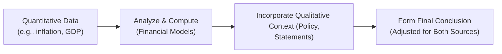

## The Nature of Quantitative and Qualitative Integration

Sometimes, folks think Economics is all about numbers—especially at the CFA Level II stage, right? It’s tempting to rely on spreadsheets, chart patterns, or well-known formulas, and ignore the subtle commentary about what central bankers or policymakers say. But the examiners (and, honestly, real-world markets, too) will test your ability to simultaneously juggle data points and interpret words. Like, for instance, you might see a super detailed regression table showing the relationship between inflation, unemployment, and currency depreciation rates—plus a statement from a finance minister hinting at an upcoming capital control policy. If you focus on only one piece of this puzzle, you could find yourself missing a major shift in currency expectations.

Below, we’ll walk through how to apply an “integrated approach” to your Level II Economy vignettes, blending numeric analysis with textual interpretation. We’ll look at typical scenarios, highlight potential pitfalls, and share best practices drawn from the real world. This integrated style is hugely relevant for the item set format, because each vignette might slip in contradictory clues or deeper context that modifies an otherwise straightforward calculation.

## Spotting Interplay between Numbers and Narrative

A typical Economics vignette at Level II might present:

• Statistical data: inflation rates, GDP growth figures, trade balances, or wage growth.  
• Policy commentary: statements from a central bank official, excerpts from government releases, or interviews with corporate leadership.

Getting the correct answer depends on reading carefully for hints about changing regimes, special interventions, or maybe a currency peg. In other words, you can’t just focus on the numeric side of things. If the text says, “The central bank has repeatedly intervened to keep the local currency within a narrow band,” that’s a big clue that standard Purchasing Power Parity (PPP) or uncovered interest parity might be overshadowed by the official policy stance. Or maybe your calculation for a future spot rate suggests a big depreciation, but if the government has publicly stated it is committed to fix or peg the currency, that’s your cue to override the purely mathematical result.

## Merging Statistical Outcomes with Policy Shifts

Let’s be real. Most of us love a crisp formula: you compute forward currency prices or interest rate differentials, see your “correct” numeric solution, and feel done. But the exam—and real-world investing—requires that you interpret how policy can alter what the formula suggests. A standard approach might look like this:

1. Start with quantitative data (GDP growth rate, inflation differentials, or a regression table).
2. Perform the relevant calculations (e.g., forward FX rate or interest rate parity).
3. Incorporate the context from the vignette commentary (central bank statements, new trade agreement, capital controls, etc.).
4. Decide if and how the quantitative relationship might be disrupted or confirmed by the textual clues.
5. Arrive at a nuanced conclusion that acknowledges both sets of information.

Here’s a small diagram illustrating this workflow:

## The Role of Critical Reading

Quantitative data—like monthly inflation or forward points—often feels more “objective,” whereas statements from policymakers might appear subjective. However, exam item sets can be tricky. For instance, a central bank official might downplay the risk of inflation, yet the data suggests it’s rising rapidly. This discrepancy is precisely where your critical reading skills matter.

• Ask yourself: Why is the official’s statement included in the vignette? Is it trying to reassure the market?  
• Could the official be underreporting or glossing over serious structural imbalances?  
• Is there a chance they’re floating a new policy tool (like a targeted interest rate corridor) that significantly changes the usual approach?

Embrace certain skepticism—just because a policy statement is included doesn’t guarantee it’s telling the truth. The exam wants you to consider that a government might say it’s committed to low inflation, yet the numbers point in another direction.

## Combining Regression Tables with Commentary

In some item sets, you’ll see a regression output table with coefficients for interest rates, inflation differentials, trade balances, etc. Then, the text might say something like, “The economy minister announced a move to relax import tariffs.” This new policy can reduce the significance of the coefficient for trade balances in the short run—because that relationship was historically measured under a different trade regime. In other words, your job is to spot that the regression table, built on old data, might not fully apply if the policy environment has changed drastically.

This scenario can show up in multiple ways:

• The coefficient for “tariff” might become irrelevant if the tariff is repealed.  
• The slope indicating how exchange rates respond to interest rates might be overshadowed if there's a new capital control making foreign currency inflows tough.  
• The regression’s R-squared or significance might degrade in the presence of a structural break caused by policy change.

So, yes, check the numeric results, but also see if the new policy statement in the vignette effectively “breaks” that historical pattern.

## Qualitative Overrides: When Policy Trumps Math

You might recall from Level I that you can compute forward prices based on interest rate differentials (covered interest parity) or rely on the concept of PPP to gauge how exchange rates shift as inflation changes. At Level II, you take it further by seeing how real-world factors can disrupt these standard relationships. For example:

• A pegged currency, where the government commits to maintaining a fixed exchange rate, might conflict with standard PPP or interest rate parity.  
• A new capital control measure can slow or block capital flows, meaning interest rate parity calculations won't hold in regular form.  
• A strongly worded intervention threat might keep speculators away, even if the fundamental data suggests a currency should appreciate or depreciate.

So, if in your numeric computation you find an implied 10% depreciation, but the text repeats that the local currency is pegged to the U.S. dollar and the central bank has “ample foreign reserves,” the correct exam answer might reflect that the currency remains stable (barring extreme circumstances). That’s the essence of a “qualitative override”: letting policy or political context override a purely arithmetic forecast.

## Real-World Policy Aspects and Vignette Applications

There’s a reason the exam writers love to incorporate references to trade pacts, tariff changes, or government budget announcements: real economies are often shaped by these events. By weaving policy developments into the numeric data, the vignettes create scenarios that mimic life on a trading floor or in a strategy team.

Imagine you’re reading a vignette that includes:

• GDP growth data that looks robust (suggesting currency appreciation).  
• High inflation that suggests currency weakness.  
• A central bank statement confirming they’ll do “whatever it takes” to defend their currency.  
• A major shift in capital flows (like a new foreign investment law).

Your task is to parse each piece carefully. Maybe the final question is: “Based on the data and policy statements provided, which of the following best describes the likely path of the country’s currency in the next six months?” If you do quick math alone, you might incorrectly guess that inflation must drive depreciation. But if the text strongly indicates a credible currency defense policy, your integrated approach might lead to a more stable or less volatile exchange rate conclusion.

## Practice with News Articles and Commentary

I often tell my students (and I still do it myself whenever I can) to read high-quality news sources like the Financial Times or The Economist. Pay attention not just to the reported data—like last quarter’s GDP or an inflation reading—but also to how policymakers react. Sometimes, an official might say, “We foresee inflation returning to target next quarter,” when all the available data suggests otherwise. Spotting that disconnect is a skill you cultivate by frequently comparing real data with official stances or economic analysis from professionals.

This same skill suits you perfectly on exam day: as soon as you see a mismatch in your vignette, you’ll know raising your eyebrows is the right call, and you’ll look more carefully to see if it’s the key detail that leads to the correct solution.

## Key Best Practices

• Read the entire vignette once before diving into the equations. Skimming the policy text first can alert you to possible overrides.  
• On the second pass, do your numeric computations carefully, double-checking if the text suggests any modifications.  
• Highlight specific lines that mention currencies being pegged, capital controls, upcoming elections (which might bring policy shifts), or central bank interventions.  
• Don’t ignore footnotes or disclaimers. Occasionally, an item set might bury a crucial statement about data reliability or sampling period.  

## Example: Currency Outlook with Regression and Policy

Let’s illustrate with a hypothetical. Suppose the vignette provides:

• A regression table showing that each 1% increase in a country’s inflation leads to a 2% nominal depreciation in its currency over the next year (all else equal).  
• A note that inflation has popped from 3% to 5%.  
• The central bank’s statement pledging an interest rate hike to maintain currency stability.  
• New capital controls limiting foreign investors’ ability to exit the market quickly.  

Naively applying the regression coefficient, you’d say the currency might suffer a 4% depreciation (because inflation rose by 2 percentage points). But if the central bank’s interest rate hikes counteract that effect, and the capital control measure temporarily props up the currency, the actual depreciation might be far less—maybe even near zero. This is exactly the tension between a purely quantitative forecast and the real-world measures that can short-circuit those historical relationships.

## Final Exam Tips for Integrating Quantitative and Qualitative Data

• Remain flexible. Don’t be “married” to your calculations—use them as a foundation, then apply real-world thinking.  
• Carefully notice dates. Sometimes the commentary references a future policy shift, and you must think forward.  
• Stay mindful of partial or one-off interventions. A single defense operation by a central bank might hold the currency stable for a month or so, but not a year, especially if fundamentals point the other way.  
• Practice reading statements from major policymakers (like the Federal Reserve, the ECB, or your local central bank) to analyze how they diverge from pure economic models.  

## References and Suggested Readings

- Financial Times and The Economist for real-world examples of how policy statements pair with numeric economic indicators.  
- CFA Program Curriculum sections on “Combining Qualitative Analysis and Financial Data” in Economics.  
- Research papers from the International Monetary Fund (IMF) or the Bank for International Settlements (BIS), which often showcase how big monetary interventions or structural breaks impact typical parity conditions.

## Test Your Knowledge: Integrating Quantitative and Qualitative Data



### Which of the following best describes a key reason to include qualitative data along with quantitative data in a Level II Economics vignette?

- [ ] To make question stems appear longer and more complex.  
- [ ] To ensure candidates focus solely on calculating forward rates.  
- [x] To capture the impact of policy or commentary that may override or modify numeric results.  
- [ ] To embed extraneous information that should be ignored during the exam.  

> **Explanation:** Qualitative data, such as policy commentary, can often trump textbook formulas or typical numeric relationships, making it essential to integrate both.

### A country's currency might remain stable despite high inflation if:

- [ ] Forward points suggest deeper discounts.  
- [x] The central bank has announced repeated interventions to support the currency.  
- [ ] The regression indicates a strong correlation between inflation and depreciation.  
- [ ] The local economy has no capital controls.  

> **Explanation:** Even if inflation is high, credible central bank intervention (e.g., large foreign reserves or an active exchange rate management policy) can keep the currency stable.

### Which of the following statements is most accurate about “qualitative override” in currency forecasting?

- [ ] It happens only when inflation is above 10%.  
- [ ] It means ignoring all quantitative data in favor of official statements.  
- [x] It is the recognition that certain policies or market conditions can disrupt expected numeric outcomes.  
- [ ] It automatically invalidates interest rate parity.  

> **Explanation:** “Qualitative override” means that real-world interventions or policies may override standard quantitative models or parity conditions.

### In an item set containing a regression table for exchange rate determination and a statement about future capital controls, a candidate should:

- [ ] Only trust the regression’s historical data.  
- [x] Consider that implementing capital controls may invalidate the regression’s implied predictions.  
- [ ] Assume capital controls will not affect currency movements.  
- [ ] Immediately disregard the regression coefficients.  

> **Explanation:** Capital controls can significantly alter relationships that hold under open-market assumptions, so the candidate must consider how the policy might disrupt typical patterns.

### If a vignette states that a country’s currency is “pegged” to another yet your PPP-based calculation suggests a 15% depreciation:

- [ ] Follow PPP’s numeric result and assume the currency will fall 15%.  
- [ ] The peg means the currency cannot move at all, under any circumstances.  
- [x] Recognize the peg as a policy stance that can override PPP in the short or medium term, unless the peg breaks.  
- [ ] Disregard both PPP and the peg, and guess that the market is in equilibrium.  

> **Explanation:** A currency peg can hold the exchange rate fixed, even if PPP indicates a different equilibrium value. Over time, if pressures mount, the peg might break, but in the near term it can have a strong overriding effect.

### Which of the following is an example of integrating qualitative commentary into numeric analysis?

- [ ] Using an inflation figure to compute real GDP growth.  
- [ ] Calculating interest rate differentials using forward quotes.  
- [x] Adjusting a derived exchange rate forecast to reflect a central bank governor’s vow to defend the currency.  
- [ ] Estimating EPS from historical price data.  

> **Explanation:** Integrating commentary means factoring in statements or policy measures that may shift or override what a pure numeric model predicts.

### A regression table shows a positive relationship between inflation and currency depreciation. However, a new fiscal policy was just announced to sharply reduce deficits. A best practice approach would be to:

- [x] Validate if the new policy thresholds may reduce inflationary pressure, thereby moderating the currency depreciation forecast.  
- [ ] Ignore the new policy since regression data is historically significant.  
- [ ] Rely on forward points for the final answer regardless of policy changes.  
- [ ] Presume no impact on the currency from the fiscal policy.  

> **Explanation:** If the new policy curbs inflation, it can reduce depreciation pressures, thus moderating or altering the purely quantitative projection from the regression.

### Which activity best helps you prepare for item sets with both numeric data and policy statements?

- [ ] Memorizing every single parity formula.  
- [x] Reading news articles that discuss economic indicators alongside commentary from policymakers.  
- [ ] Focusing exclusively on historical data trends.  
- [ ] Avoiding any reading that includes opposing views or unresolved policy debates.  

> **Explanation:** To get comfortable reconciling numerical data with real-world policy conditions, one should regularly read sources that provide both sides—quantitative metrics and interpretative statements.

### A regression table's R-squared might fall if:

- [ ] The currency is pegged.  
- [x] A new trade agreement shifts relationships between trade and exchange rates, creating a structural break.  
- [ ] The country experiences day-to-day volatility with no policy changes.  
- [ ] Inflation is stable at 2%.  

> **Explanation:** Structural breaks, such as a major policy shift, typically reduce a model’s explanatory power because the new environment differs from historical data relationships.

### True or False: A central bank’s stated objectives can, in some cases, override typical interest rate parity relations in the short run.

- [x] True  
- [ ] False  

> **Explanation:** When a central bank commits to a specific exchange rate level or corridor, it may disrupt covered or uncovered interest rate parity calculations for some time.


