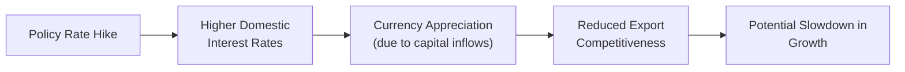

## Introduction and Overview

Sometimes, when we see a large CFA® item set swirling with currency quotes, GDP growth forecasts, and monetary policy signals all at once, our first reaction is: “Uh, wait—how do I even begin?” Trust me, I’ve been there. It’s tempting to skip around or latch onto the easiest part, but multi-topic vignettes demand a more methodical approach. These vignettes mimic the real world, where exchange rates, growth trends, and policy decisions rarely move in isolation. Instead, they feed into each other in a perpetual loop of cause and effect.

This section focuses on weaving together the big themes you’ve encountered throughout the earlier chapters—spot and forward currency quotes, interest rate parity conditions, macro growth, and policy shifts—into realistic, exam-style scenarios. Our main goal is to help you form a disciplined mindset for dissecting multi-layered economic data, swiftly connecting the dots in ways that uncover the story behind the numbers. 

## Why Multi-Topic Vignettes Matter

Multi-topic vignettes test your ability to:
• Read carefully and extract relevant details.  
• Apply multiple theories—like uncovered interest rate parity (UIP) and purchasing power parity (PPP)—in the same scenario.  
• Synthesize policy implications (like central bank rate hikes or fiscal expansions) with growth trends and currency forecasts.  
• Understand how partial equilibrium analysis (focusing on one market in isolation) links with a broader, general equilibrium perspective (recognizing interactions across multiple markets).  

They also check your capacity to manage exam time. Each paragraph in a vignette might hide crucial data—like an expected interest rate change or a mention of inflation creeping up. Overlooking these details under time pressure is probably the number one pitfall.

In my experience, a practical approach is to do a quick “pre-scan” for numeric data or references to key variables (inflation, interest rates, GDP components). Then, read a second time more slowly, highlight essential phrases (like “central bank signals a rates cut”), and connect them with standard economic relations.

## Building a Step-by-Step Methodology

A multi-topic vignette can feel like it’s bombarding you: exchange rate quotes here, then a sudden note about demographic trends, then a snippet about government spending. So how do we handle it?

1. Skim for Numbers and Qualitative Clues  
   Jot down or circle the interest rates, exchange rates, inflation figures, or projected GDP growth. Highlight any policy hints—like a reference to fiscal stimulus or a central bank statement about tightening or loosening monetary policy.

2. Link Data to Theoretical Tools  
   If you see interest rate differentials, think about applying uncovered interest rate parity (UIP). If you see mention of inflation rates in two countries, ask yourself whether PPP might come into play. If you spot forward prices, consider covered interest rate parity or forward premium and discount calculations.

3. Incorporate Business Cycle Stage  
   If the vignette says the economy is entering an expansion phase, figure out how that might affect currency flows, demand for imports and exports, or labor markets. If the economy is nearing a peak or entering a recession, that might shift the central bank’s policy stance.

4. Decide If a Partial or General Equilibrium Angle Is Needed  
   Sometimes a question focuses on how, say, a currency depreciation alone affects net exports (partial equilibrium). Other times, you must factor in the feedback loop where that same depreciation might raise inflation, which influences the central bank’s future interest rate decisions, ultimately revealing a general equilibrium chain of events.

5. Watch for Interactions and Conflicts in the Data  
   A currency depreciation might stimulate export-led growth, but it could also push up import prices and inflation, prompting the central bank to consider tighter policy—so you need to balance these crosscurrents in your answer.

6. Structure Your Calculations and Reasoning  
   Gather your formulas (e.g., PPP: S₁ = S₀ × (1 + inflation_domestic)/(1 + inflation_foreign)) or your scenario logic. Write out each step methodically. If the question references an expected interest rate differential for the next period, see if that links to expected exchange rate changes under UIP.

## Practical Example: Bridging Currency, Growth, and Policy

Let’s walk through an illustrative scenario (partially simplified) that might appear in an item set:

“Country A’s central bank recently released guidance signaling a 0.50% rate hike in the coming quarter due to moderate—but rising—inflation pressures. Meanwhile, Country B expects a decline in interest rates later this year as it attempts to stimulate sluggish GDP growth. Currency markets currently quote the A/B spot rate at 1.2000. Market analysts forecast that Country A’s real GDP growth will accelerate from 2.0% to 2.8% next year, partly driven by increased export demand. In contrast, Country B, grappling with high unemployment, anticipates only a slight uptick in growth from 0.5% to 1.0%. Over the past year, inflation in Country A averaged 3%, while Country B’s inflation stood at 2%. The forward rate on A/B maturing in one year is 1.2150.”

When you read this:
• Spot the mention of interest rate changes in both countries.  
• Note the inflation differentials.  
• Recognize potential growth divergences.  
• Notice they gave a forward rate (1.2150) and a current spot rate (1.2000).  

These data points set the stage for a variety of potential questions:  
• Has the currency A appreciated or depreciated in forward terms relative to B?  
• Does the forward premium/discount line up with interest rate parity theories?  
• How does a stronger currency in Country A affect net exports (and thus GDP growth)?  
• Could rising interest rates in Country A dampen future growth despite the immediate positive export scenario?  

A typical solution approach might be:
1. Compare the forward (1.2150) to the spot (1.2000) → Forward premium or discount.  
2. Check if the interest rate differential implied by that forward aligns with the changes mentioned by the central bank.  
3. Examine the real GDP growth differences and consider how currency shifts might reinforce or counteract those differences.  
4. Factor in how higher inflation in Country A couples with that currency movement. If inflation is rising faster, PPP might eventually cause the currency to weaken in real terms—unless interest rate policies offset that effect.  
5. Conclude how an exam question might ask you, for instance, to identify which currency is likely to appreciate based on uncovered interest rate parity or which economy might see more robust export growth given the exchange rate path.

## Visualizing a Multi-Step Interaction

Below is a simple flowchart that illustrates how a policy rate hike can ripple into currency and growth prospects. Exam vignettes often present this chain in bits and pieces, so being able to see the entire storyline helps:

In reality, there can be further nuances: a credible policy announcement might affect expectations and cause exchange rate changes long before the official rate move occurs. The economy’s stage—expansion or contraction—could amplify (or dampen) these effects.

## Policy Statements and Macroeconomic Data

Policy statements, like central bank minutes or government declarations of fiscal stimulus, offer huge signals to the market. If a central bank hints at tightening monetary policy, forward markets typically react almost immediately by adjusting rates or currency values. Meanwhile, a big expansion in government spending might spur growth at first but could also lead to concerns about fiscal imbalances, raising country risk and potentially weakening the currency over time.

Examine each policy statement in the vignette to see how it might influence:
• Domestic interest rates.  
• Capital inflows or outflows (affecting currency demand).  
• Aggregate demand and potential inflation.  
• Future policy responses (like offsetting measures from the central bank).

## Common Pitfalls and How to Avoid Them

• Ignoring One Variable: Maybe the vignette mentions a slight inflation uptick, but you get so focused on forward currency quotes that you miss how that inflation clue should factor into your final answer.  
• Failing to Connect Growth and Currency: A question might indirectly ask about net exports by referencing a currency depreciation. If you don’t attach that to export-led GDP growth, you could miss the correct conclusion.  
• Overlooking the Business Cycle Angle: The same policy change has different outcomes if the economy is nearing a recession versus if it’s blazing through an expansion.  
• Time Mismanagement: Spending too long on one detail can sink you. Try a quick data pass, then a deeper logical pass.  

One personal trick: I sometimes draw a mini “mind map” on the scratch paper. For example, “Interest Rate → Exchange Rate → Net Exports → Growth → Central Bank Reaction.” That visual can ensure I don’t skip a link in the chain.

## Glossary of Key Terms

Multi-Topic Vignette  
A case scenario integrating multiple Economics themes—like currency quotes, GDP growth analysis, and policy changes—into a single item set.

Partial Equilibrium Analysis  
Focuses on one market or sector (like the currency market or the export sector) in isolation, generally holding everything else constant.

General Equilibrium Analysis  
Looks at multiple markets simultaneously, considering feedback loops (like how a currency shift affects inflation, which then influences monetary policy, which in turn feeds back into currency and growth).

Uncovered Interest Rate Parity (UIP)  
Suggests that any expected appreciation or depreciation of a currency balances out the interest rate differential between two countries.

Purchasing Power Parity (PPP)  
Argues that exchange rates will eventually adjust so that a basket of goods costs the same across countries, emphasizing the role of inflation differentials in currency movements.

Policy Statement  
Official communications from central banks or government bodies that indicate the trajectory of monetary or fiscal policy, shaping currency valuations, growth prospects, and investment sentiment.

Item Set  
A structured collection of multiple-choice questions linked to a single vignette, requiring you to interpret text, data tables, and sometimes exhibits to answer integrated questions.

GDP Components  
Consumption, investment, government spending, and net exports—each playing a role in overall economic growth and potentially influenced by exchange rate movements or policy changes.

## From Data to Logic: A Practice Flow

An effective approach to multi-step logic might look like this:

• From new data (e.g., we see interest rates in country X rising).  
• To effect on interest rate differentials (country X’s nominal rates vs. country Y’s).  
• To effect on capital flows (hot money flowing into X?).  
• To effect on currency demand/supply (stronger demand for X’s currency?).  
• To possible outcomes for domestic producers (are they more or less competitive? Is inflation likely to spike?).  

Exam questions often revolve around these linkages. The item set might give you partial data or conflicting signals, so your job is to chart a consistent path and interpret the net effect.

## Time Management Tips

• Spend 15–20 seconds skimming each paragraph for big data points: interest rates, exchange rates, inflation, policy hints, or references to the business cycle.  
• On your second pass, methodically connect the data. If the question references a forward rate, have your formula for forward premium/discount handy.  
• If a question seems to hinge on more than one piece of data—a likely scenario—don’t jump to an answer after reading only one part of the vignette.  

Multi-topic vignettes can be time-consuming, but by practicing a consistent process, you’ll minimize the risk of missing important details.

## Conclusion

When it comes down to it, multi-topic vignettes in CFA Level II Economics are all about integration. They force you to look at currency markets not just as an isolated puzzle of forward premiums but as part of an interconnected system that includes growth forecasts, unemployment rates, inflation, and central bank policy. If you can train yourself to see how each detail ripples across various markets—while keeping an eye on the exam clock—you’ll walk into exam day ready to handle anything they throw at you.

Below, you’ll find a set of practice questions to lock in these insights and put you in a real exam frame of mind. Remember to allocate your time wisely and check each question’s data references carefully. Good luck!

## Exam-Style Vignette Exercises: Currency, Growth, and Policy



### Country A and Country B: Forward Rate Puzzle
- [ ] The expected spot rate of Currency A in one year must be higher than today’s spot rate if Country A’s interest rate is lower than Country B’s.  
- [x] The expected spot rate of Currency A could appreciate or depreciate depending on how inflation expectations align with interest rate projections.  
- [ ] The forward rate is always equal to the spot rate if inflation in both countries is identical.  
- [ ] Country A cannot maintain UIP unless its inflation rate equals Country B’s.  

> **Explanation:** UIP links expected exchange rate changes to the interest rate differential but also interacts with inflation expectations and market perceptions. A higher interest rate in Country A may not guarantee an appreciated currency if inflation erodes real returns.

### Central Bank Hints at Policy Tightening
- [ ] A policy tightening always leads to an immediate depreciation of the domestic currency.  
- [x] Market participants may bid up the domestic currency if they anticipate higher rates and capital inflows.  
- [ ] A policy tightening’s effects on the business cycle are uniformly expansionary.  
- [ ] Tighter policy has no impact on inflation rates in the near term.  

> **Explanation:** A rate hike typically attracts capital, driving up currency demand. Over time, such tightening may slow growth and curb inflation.

### Linking PPP to Growth
- [x] If Country X experiences 4% inflation while Country Y experiences 2%, PPP suggests that Country X’s currency may eventually depreciate.  
- [ ] PPP implies that the real exchange rate remains constant in the short run.  
- [ ] A country with higher inflation always grows faster.  
- [ ] The country with lower inflation must have a weaker currency.  

> **Explanation:** PPP states that the exchange rate should adjust to offset inflation differentials, often resulting in currency depreciation for the higher-inflation economy over time.

### Business Cycle Phase Considerations
- [ ] During a recession, a currency necessarily appreciates because imports fall.  
- [ ] In an expansion phase, central banks always raise interest rates.  
- [x] Knowing whether an economy is in expansion or recession can help predict how policy decisions affect currency flows.  
- [ ] The business cycle phase has no effect on the forward currency market.  

> **Explanation:** The business cycle context indicates how policy measures (e.g., raising rates in an expansion) might influence currency and, in turn, capital flows and growth.

### Partial vs. General Equilibrium
- [x] Partial equilibrium looks at a single market in isolation, while general equilibrium accounts for interdependencies across markets.  
- [ ] Only general equilibrium analysis is relevant for currency forecasting.  
- [x] Policy decisions can be better understood using both partial and general equilibrium approaches.  
- [ ] Exchange rates in partial equilibrium never change.  

> **Explanation:** Vignettes often involve multiple markets (currency, credit, goods) simultaneously. Understanding both partial and general equilibrium perspectives is key to capturing knock-on effects.

### Uncovered Interest Rate Parity Conundrum
- [x] The currency of a country with higher interest rates may appreciate initially but can expect to depreciate over time, offsetting the interest advantage.  
- [ ] The currency of a country with lower interest rates will always appreciate.  
- [ ] UIP cannot hold if there is a forward premium in favor of one currency.  
- [ ] There is no relationship between expected spot rates and interest rates.  

> **Explanation:** Under UIP, the expected future spot rate adjusts to neutralize any persistent profit from interest rate differentials, reflecting the interplay of risk premiums and market expectations.

### Fiscal Stimulus Impact
- [x] A government’s fiscal expansion can boost domestic demand, potentially widening trade deficits if imports rise.  
- [ ] Fiscal expansion always strengthens a currency.  
- [x] Higher government spending can spark inflation pressures, influencing the central bank’s subsequent moves.  
- [ ] Country risk is unaffected by rising government debt.  

> **Explanation:** Fiscal stimulus can improve short-term growth but may also increase imports, create inflation, and prompt higher interest rates if deficits become large, thus affecting currency valuation and sovereign risk perceptions.

### Currency Moves and Export Competitiveness
- [x] A depreciated currency generally makes domestic exports cheaper abroad.  
- [ ] A depreciated currency reduces imported inflation pressures.  
- [ ] An appreciating local currency always boosts trade balances.  
- [ ] Exchange rate moves do not affect the GDP components.  

> **Explanation:** A weaker currency tends to encourage exports while making imports more expensive, potentially improving net exports but also raising domestic inflation.

### Policy Communication and Expectations
- [x] Market participants adjust exchange rates based on anticipated future policy actions, not just current actions.  
- [ ] Only actual policy changes matter for currency markets.  
- [ ] The business cycle is irrelevant to forming exchange rate expectations.  
- [ ] Investors ignore forward guidance in central bank statements.  

> **Explanation:** Forward guidance shapes market expectations, often causing immediate changes in exchange and interest rates—even before policy actions are finalized.

### True or False: Identical Interest Rates, Identical Spot and Forward
- [x] True  
- [ ] False  

> **Explanation:** Under a simplified covered interest rate parity scenario, if two countries have exactly the same interest rates and no transaction costs or risk differentials, the forward rate may equal the spot rate. However, real-world factors like risk premia, transaction costs, and capital controls can alter this relationship.



## References and Further Reading

• CFA Institute Level II Curriculum — Economics Readings on currency markets, economic growth, and policy impacts.  
• Bank for International Settlements (2026). “The Interplay Between Monetary Policy and Exchange Rates” (Working Paper 586). https://www.bis.org/publ/work586.pdf  
• Uribe, M. and Schmitt-Grohé, S. (2017). Open Economy Macroeconomics. Princeton University Press.  

Evaluate how each concept fits together by revisiting prior chapters on currency mechanics, parity conditions, and macrogrowth. Practice bridging partial and general equilibrium perspectives in your item set analysis. With enough repetition, you’ll develop the habit of scanning for key data and forging the logical links that multi-topic vignettes demand—ensuring no crucial detail slips through the cracks. Good luck on your continued study!
