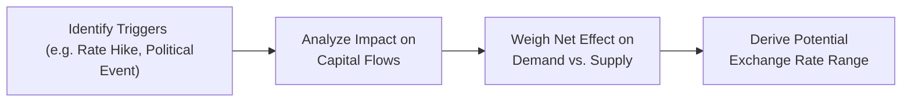

## Big Picture: The Purpose of Scenario Analysis

So, I remember this one time, I was sitting at my desk and analyzing a potential meltdown in an emerging market’s currency due to both political unrest and unexpected interest rate cuts. Suddenly, I realized how much scenario analysis helps us piece together multiple moving parts—inflation data, capital flows, trade balances, you name it—and see where the currency might be heading. Essentially, scenario analysis is your chance to play detective with financial variables.

In the world of CFA® Level II, scenario analysis shines when we need to forecast exchange rates in complex or uncertain conditions. Sure, we can memorize formulas for uncovered interest parity or rely on forward quotes, but (ah!) real markets combine so many different triggers—interest rate changes, political tremors, trade deficits, shifts in investor sentiment—that we can’t just rely on one approach. That’s where scenario analysis steps in, letting us isolate key data points, hypothesize the net outcome, and propose a plausible range for future currency levels.

## Revisiting Key Drivers for Exchange Rate Movements

Before diving into examples, let’s recap some fundamental drivers of currency value. You likely saw these in prior chapters, but here’s a quick refresher:

• Interest Rate Differentials: Under uncovered interest rate parity (UIP), currencies in higher interest rate regions often attract capital inflows (seeking better yields), which can push up the currency’s value. However, if inflation is also high, it can erode that yield advantage.

• Inflation Projections: Higher inflation generally weakens a currency, other things equal, because it deteriorates purchasing power and can prompt capital to flow elsewhere.

• Trade Balance (Current Account): A widening trade deficit implies more outflows of currency to pay for imports, which, all else being equal, can depreciate the currency—unless offset by strong incoming capital flows.

• Capital Flows: Money might enter or leave a country for many reasons—portfolio investments, direct investments, or speculative flows. Each factor can shift the balance of demand and supply for the currency.

• Market Sentiment and Political Stability: Sometimes, it doesn’t matter if the fundamentals are strong; if a political event spooks investors, they might exit en masse, sinking the currency. That’s why we keep our eyes on government stability, regulatory changes, or elections.

We’ll see how these fundamental drivers get woven into scenario analysis by systematically identifying triggers, estimating direction/magnitude of effects, and matching them to an expected currency path.

## Laying Out the Steps of Scenario Analysis

Unlike single-point forecasts, scenario analysis acknowledges that no single variable acts in isolation. A typical approach might look like this:

1) Identify Scenario Triggers  
   Are we considering a sudden interest rate hike, a newly negotiated trade deal, an unexpected rise in inflation, or a political shock? List these factors explicitly.

2) Deduce Impact on Capital Flows  
   Based on historical patterns, how might each trigger affect capital flows? For instance, higher interest rates often increase short-term inflows, but if there’s also political risk, that could negate the rate advantage.

3) Gauge Net Effect on Exchange Rates  
   Combine the forces—some strengthening, some weakening—to see which direction is dominant. Possibly, capital inflows from higher rates outpace the negative effect of a looming trade deficit.

4) Finalize a Plausible Exchange Rate Range  
   Provide not just a single number but a high/low range, sometimes known as sensitivity analysis. This range captures the inherent uncertainty.

Below is a simple Mermaid diagram illustrating this process:

This flow is especially useful in exam vignettes, where you’ll be presented with a swirl of economic data, central bank rumors, and policy statements. You’ll have to piece together the puzzle systematically.  

## Example Vignette: Rising Rates Amid Trade Imbalances

Let’s walk through a straightforward scenario, the sort of item set you might find in a practice exam:

• Country A’s central bank unexpectedly raises interest rates by 1.5%.  
• Simultaneously, data shows Country A’s trade deficit is widening faster than anticipated.  
• Inflation remains moderate but could tick up if wage pressures intensify.  
• Political climate is stable, so no immediate flight risk from investors.  

### Step-by-Step Analysis

Scenario Trigger: The rate hike is your main event. But don’t forget the trade imbalance.

1) Capital Flow Effects  
   • Rate Hike: Investors might flock to Country A’s bonds and deposits, anticipating better returns. This should boost short-term capital inflows and push the currency up.  
   • Trade Deficit: A bigger deficit means net outflows to pay for imports. On its own, this weakness would weigh on the currency.  

2) Offsetting vs. Reinforcing Factors  
   In this example, the rate hike is a strengthening factor, while the deficit is a weakening one. The question is: which effect is likely to dominate?  

3) Expected Net Impact  
   With stable politics and moderate inflation, you might guess that capital inflows from the interest rate differential overshadow the negative pressure from the deficit—at least in the short run. So, the currency might appreciate, but not as strongly as if the deficit weren’t worsening.  

4) Finalize a Range  
   Suppose the spot rate is currently 1.20 (domestic currency per USD). You might estimate an appreciation to 1.15 if capital inflows dominate. But if markets focus more on the expanding deficit, you might see only a slight move to 1.18.  

### Quick Check

Let’s float a short practice question:  

Imagine you’re analyzing the net effect on the domestic currency. How would an ongoing increase in foreign direct investment (FDI) flows to Country A’s manufacturing sector affect the currency bias when combined with the widening trade deficit?  

• The correct reasoning might be that new FDI flows help offset the deficit. Even if the timing is uncertain, stable FDI is a medium- to long-term capital inflow that supports currency demand.  

## Dealing with Multiple Conflicting Signals

In real markets, we rarely have just one or two easy-to-track signals. Often, we see multiple conflicting data points at once:

• Interest Rates: Up 2%  
• Political Instability: Moderately rising  
• Inflation: Creeping higher  
• Reserves: Falling  
• GDP Growth: Surging  

So, how do we weigh them? A good approach is to systematically rank each factor based on its likely magnitude and immediacy. For instance:

• A steep interest rate increase might have a strong immediate effect, bringing in hot money flows.  
• Political instability might have a slow-burn effect, gradually convincing investors to pull out.  
• Inflation can be a medium-term story, but if it spikes, it can quickly overshadow the interest rate advantage.  
• Falling reserves might signal trouble if the central bank tried to defend a currency peg.  
• Surging GDP growth is typically supportive, but it could also fuel higher imports, continuing a cycle of deficits.  

We might assign each factor a “strength rating.” For instance, interest rate changes might get a 7/10 for immediate speculative flows, while political risk gets, say, a 5/10 for a slower but more systematic withdrawal of capital. If we do this for all factors, we at least have a structured, if imperfect, numerical approach for scenario planning.

## Scenario Analysis and Currency Crises

Sometimes, scenario analysis reveals trouble on the horizon. You might see a pegged exchange rate that’s becoming unsustainable because of large capital outflows or diminishing foreign currency reserves. As you plug in your triggers—like a sudden cut in foreign aid, a downgrade by a major rating agency, or an external shock in global commodity prices—you realize that the peg is at risk. That’s typically the early warning sign of a potential currency crisis. If enough triggers align, your scenario analysis might suggest that a sharp or abrupt devaluation is quite probable.

Keep in mind, though, that scenario analysis doesn’t guarantee a precise date and time. Instead, it clarifies the underlying vulnerabilities and possible catalysts. To capture a currency crisis scenario, highlight:

• Declining Reserves: The central bank cannot maintain the peg.  
• Political Pressure or Banking Sector Fragility: Investors lose confidence.  
• Negative Real Interest Rates: Makes domestic assets unappealing.  
• Capital Flight: Lack of trust in institutions accelerates outflows.

Then, we simply examine how those factors might feed on each other to precipitate a rapid decline in currency value.  

## Uncovered Interest Rate Parity and Forward-Spots in Scenarios

A key piece of intuition from uncovered interest rate parity (UIP) is that if you see a domestic interest rate above the foreign rate, the spot exchange rate may be expected to depreciate over time (to offset the yield advantage). However, in the short run—especially in real markets—this might not happen consistently, or it might happen in a delayed manner.

When you’re building your scenario analysis, it’s still crucial to reference UIP or forward-spot differentials:  
• If forward quotes show a domestic currency discount in the forward market, it suggests expectations of currency depreciation.  
• If your scenario triggers (like a big interest rate hike) run counter to the forward pricing, you need to gauge whether the market is underreacting or if your scenario is improbable.  

In an exam environment, keep it methodical: check the forward rate to see if it implies appreciation/depreciation. Then incorporate your scenario triggers to see if the market’s implied forecast is likely to shift.

## Practice Vignette: Potential Trade War and Monetary Tightening

Let’s create a hypothetical scenario and break down how to systematically approach it:

**Scenario Overview**  
• Country G is embroiled in trade tensions with its largest trading partner, possibly impacting future exports.  
• Country G’s central bank just signaled a steeper-than-expected monetary tightening due to inflation concerns.  
• A large share of Country G’s debt is held by foreign investors.  
• Official currency reserves are healthy.

### Trigger Analysis

1) Trade War Rumors. Exports might fall, hurting trade balances. Also, foreign demand for the currency could weaken if overseas buyers reduce dealings.  
2) Tight Monetary Policy. Heightened interest rates could attract short-term capital flows seeking yield, at least initially.  
3) Reliance on Foreign-Owned Debt. If a trade conflict escalates and foreign investors fear defaults or growth slowdowns, they might reduce exposure—even in the face of higher rates.  
4) Strong Currency Reserves. This might give the central bank ammunition to counter currency volatility, at least for a while.

### Weighing the Effects

• Positive Factor: Rate hike boosts the currency in the near term.  
• Negative Factors: Potential export decline, possible decline in investor confidence if tensions intensify.  
• Stabilizing Factor: Central bank’s large reserve stash can dampen short-term panic.  

After a thorough balancing act, you might estimate that the currency initially rallies because of the rate hike. However, if the trade war triggers a bigger slowdown, investors might shift focus from interest rates to economic contraction risk, pushing the currency lower. Scenario analysis would thus yield a short-term bullish view with a medium-term correction downward.

### Scenario Conclusion

Examine potential ranges: from a modest appreciation if the trade war fizzles out quickly, to a significant depreciation if the conflict escalates and foreign investors start selling bonds.  

**Short Practice Question**  
If Country G’s central bank intervenes by selling foreign reserves to defend the currency, how might that alter the scenario’s short-term exchange rate path?  
> Intervention with reserves can temporarily support the currency, but if fundamental drivers remain negative, it may only delay depreciation rather than prevent it.

## Glossary in Context

• Scenario Analysis: Systematic approach to see how multiple assumptions—like interest rates, inflation, or trade relations—alter currency forecasts.  
• Interest Rate Differential: Key driver when applying uncovered interest rate parity. Higher yields can attract capital, strengthening the currency, though inflation and risk factors may offset.  
• Exchange Rate Forecasting: Involves weaving theory (like PPP, UIP) with real-world data (trade flows, sentiment) to predict currency moves.  
• Capital Flows: In or out; massive flows can overshadow trade balances in the short run.  
• Curriculum Approach: The official Level II text recommends identifying each variable’s direction and weighting them by significance to form a balanced outlook.

## Common Pitfalls in Scenario Analysis

• Oversimplification: Sometimes, you might think a higher interest rate always drives appreciation. Real life is more complex.  
• Ignoring Political Risk: It’s easy to focus purely on numbers (interest rates, inflation) and forget that a government scandal can overshadow everything.  
• Underestimating Timelines: Short-term flows, like speculative “hot money,” can abruptly reverse. Economic fundamentals can take months or years to materially affect exchange rates.  
• Double Counting: Make sure you’re not counting the same fundamental factor (e.g., inflation) in two different ways if it’s already reflected in interest rates.

## Putting It All Together: Exam Tips

• Read the Vignette Carefully: Under time constraints, highlight key triggers (e.g., rate changes, inflation trends, trade data).  
• Organize Factors: Jot down a quick list of positive vs. negative forces.  
• Use Parity Theories: Cite uncovered interest parity or forward-spot relationships to frame your argument.  
• Provide a Range: Examiners often expect you to acknowledge uncertainty.  
• Remain Methodical: Recognize that multiple factors can offset or reinforce each other. Justify your final stance logically.

## References for Further Study

• CFA Institute Level II Reading: “Currency Exchange Rates: Understanding Equilibrium Value.”  
• Journal of Portfolio Management: “Interest Rate Models, Asset Allocation, and Scenario Analysis.”  
• IMF “World Economic Outlook” (https://www.imf.org/en/Publications/WEO) for real-world scenario data.  

---

## Scenario Analysis Practice: Exchange Rate Forecasting Quiz



### Which key driver often interacts with interest rate differentials to create conflicting exchange rate signals in a scenario?

- [x] Trade balance changes
- [ ] Government bond maturity structure
- [ ] Currency substitution policies
- [ ] Seasonal weather patterns

> **Explanation:** A widening trade deficit can offset the positive effect of higher interest rates, potentially weakening the currency even when interest differentials point to appreciation.

### If a central bank intervenes by purchasing domestic currency reserves in the foreign exchange market, what is the immediate effect on the domestic currency?

- [x] The domestic currency is supported (appreciates).
- [ ] The domestic currency is devalued (depreciates).
- [ ] No effect on the exchange rate.
- [ ] Triggers the central bank to lower interest rates.

> **Explanation:** Buying domestic currency means selling foreign currency, which tends to prop up the domestic currency’s value by reducing its supply in the market.

### In scenario analysis, which factor is most likely to override a positive interest rate differential advantage?

- [ ] A minor shift in money supply
- [ ] A short-term commodity price increase
- [x] A major political crisis
- [ ] A stable inflation rate

> **Explanation:** A serious political crisis can cause a large outflow of capital, easily overshadowing the currency gains that result from higher interest rates.

### In the context of uncovered interest rate parity (UIP), a domestic currency with higher interest rates is expected to:

- [ ] Remain stable if political conditions are calm.
- [ ] Appreciate in the long run, matching the interest rate advantage.
- [x] Depreciate in the long run to offset the yield advantage.
- [ ] Immediately appreciate to reflect the interest differential.

> **Explanation:** UIP suggests if a currency offers a higher interest rate, its forward or expected future spot rate is forecasted to depreciate so that total returns are equalized across countries.

### The process of combining various triggers and their effects on capital flows to arrive at a likely exchange rate path is described as:

- [ ] Capital budgeting
- [x] Scenario analysis
- [ ] Fundamental indexing
- [ ] Synthetic replication

> **Explanation:** Scenario analysis is precisely the process of taking multiple triggers or variables and systematically determining their net impact on the exchange rate.

### When performing scenario analysis, which factor below would be considered a stabilizing force if the currency came under speculative attack?

- [ ] Weak external demand for exports
- [x] Large official foreign exchange reserves
- [ ] Rising bond yields without inflation
- [ ] Tax hikes on consumer goods

> **Explanation:** With large foreign exchange reserves, a central bank can intervene to purchase its own currency, thereby stabilizing it in the face of speculation.

### In an exam vignette describing rising interest rates and soaring inflation, which approach is most suitable when forecasting the domestic currency’s direction?

- [ ] Focus solely on inflation as the primary driver.
- [ ] Ignore capital account since goods trade matters more.
- [x] Blend multiple theories, including UIP and relative inflation data.
- [ ] Assume rising rates uniformly strengthen the currency.

> **Explanation:** High inflation can overshadow the benefit of rising interest rates because it erodes real returns. Thus, combining uncovered interest parity with inflation data is critical.

### A scenario analysis identifies that Country M’s currency peg might soon collapse due to unsustainable reserve losses. What is the best next step in that scenario?

- [ ] Set a single guaranteed rate for the future.
- [ ] Conclude that the exchange rate will not change.
- [ ] Ignore the reserves data as lacking significance.
- [x] Establish a range of possible depreciation outcomes and likely timing.

> **Explanation:** Currency pegs often break. Instead of a single prediction, scenario analysis calls for a range of plausible outcomes, acknowledging uncertainty in timing and extent.

### Which outcome best describes how FDI might partially offset a widening trade deficit?

- [x] FDI inflows provide steady demand for domestic currency.
- [ ] FDI inflows increase the trade deficit one-for-one.
- [ ] FDI inflows are irrelevant to trade flows.
- [ ] FDI flows generally weaken the currency.

> **Explanation:** Foreign direct investment channels stable capital into the country, helping support or strengthen the currency despite a widening deficit for goods and services.

### Scenario analysis often yields multiple possible exchange rate paths. Which statement is true?

- [x] There is often no single “correct” answer, but a set of plausible outcomes.
- [ ] The correct rate is always the market forward rate.
- [ ] Only the inflation rate matters for forecasting.
- [ ] It is a purely quantitative approach without subjective judgment.

> **Explanation:** Scenario analysis is inherently about exploring outcomes under different assumptions. It seldom reduces to a single “correct” forecast.


