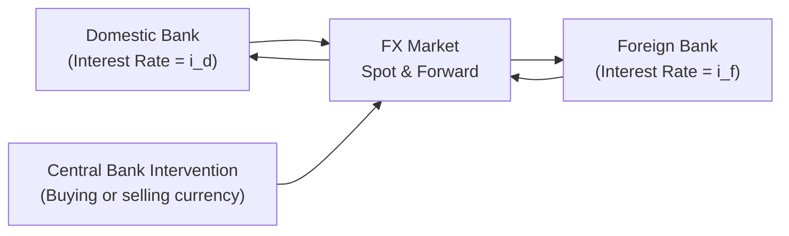
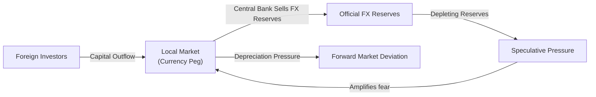

## Linking Parity Conditions, Policy Actions, and Stress Events

When central banks step in to influence their currencies—whether to defend a peg, stabilize a volatile market, or target export competitiveness—they often disrupt well-known parity conditions. Imagine reading through a vignette describing a pressured currency peg. You see that forward rates and the local interest rates no longer align with, say, covered interest rate parity (CIP). You might be thinking, “Is this an arbitrage opportunity?” or “Are we about to watch a forced devaluation?” These are precisely the sorts of real-world events that show up in the exam, and they can be tested in a single wide-ranging item set, weaving CIP, uncovered interest rate parity (UIP), and even purchasing power parity (PPP) into one scenario.

Below, we explore how this analysis might come together in a more integrated or “synthesis” approach, which is essential for advanced item sets. We look at how pegged exchange rates can unravel, how foreign reserves play a pivotal role, and how past crises—like the 1997 Asian financial crisis—offer invaluable lessons. Then, we guide you through a hands-on example so you can see how the math and the theory align under exam-style pressures.

## Recap of Key Parity Conditions

Before diving into complex scenarios, let’s revisit the big three:

Covered Interest Rate Parity (CIP)  
CIP states that any interest rate differential between two currencies should be offset by the forward exchange rate premium or discount. Algebraically:

F₍d/f₎ = S₍d/f₎ × (1 + i_d) / (1 + i_f)

where:  
• F₍d/f₎ is the forward exchange rate (domestic per foreign).  
• S₍d/f₎ is the spot exchange rate (domestic per foreign).  
• i_d is the domestic interest rate.  
• i_f is the foreign interest rate.

When CIP holds, you (the investor) can’t make a riskless profit by simultaneously borrowing in one currency and lending in another, then covering your exchange rate risk with a forward contract. However, if CIP is violated—perhaps due to capital controls or central bank policies—arbitrage opportunities arise.

Uncovered Interest Rate Parity (UIP)  
UIP posits that any interest rate differential should be offset by the expected future exchange rate movement. Formally:

E(S₍d/f₎₍t+1₎) / S₍d/f₎₍t₎ = (1 + i_d) / (1 + i_f)

In words, if you have a higher domestic interest rate, your currency is expected to depreciate over time so that, on average, no “free lunch” is available from simply investing in the high-yield currency. Of course, in real markets, UIP rarely holds perfectly because of risk premiums, market sentiments, and the unpredictability of future exchange rates.

Purchasing Power Parity (PPP)  
PPP is about goods prices balancing out across countries. If a basket of goods costs more in one country than another, exchange rates should theoretically adjust over time so that the basket is equally priced in both currencies. Empirically, PPP tends to hold best in the very long run but may deviate significantly in shorter timeframes, especially when central banks intervene or impose capital controls.

## When Central Banks Step In

Currency interventions occur when a monetary authority buys or sells its own currency to influence its value. This might be to defend a peg (fixing a currency to another currency or basket) or to moderate extreme volatility. In small doses, or for short durations, interventions might not cause big distortions. But when a central bank has to keep selling foreign reserves to maintain a peg, investors start to pay attention. They watch for signals:

• Rapid depletion of foreign reserves.  
• Growing current account or fiscal deficits.  
• Rising domestic interest rates to defend the peg (which ironically can deepen the local recession if used excessively).  
• Speculative activity—like large volumes of forward sales of the local currency.

The dreaded outcome is the forced abandonment of the peg, often accompanied by a full-blown currency crisis, in which the local currency rapidly depreciates.

## Case Study: Pegged Currency under Pressure

Let’s consider a hypothetical country, “EmergiLand,” which has pegged its currency (the EMB) to the US dollar (USD) at EMB 5.0 per USD. We examine data from EmergiLand’s central bank and see:

• Local deposit rates (annualized): 7%  
• US deposit rates (annualized): 3%  
• Spot rate: EMB 5.00/USD  
• 6-month forward rate quoted in the market: EMB 5.15/USD  
• Official foreign reserves: USD 30 billion  
• Monthly drawdown of reserves: USD 2 billion (to defend the peg)  

Now, if covered interest rate parity held perfectly, the 6-month forward rate should be:

F₍EMB/USD₎ = S₍EMB/USD₎ × (1 + i_EMB × 0.5) / (1 + i_USD × 0.5)

Note that i_EMB = 7% and i_USD = 3%. For a 6-month horizon (which is half a year), these rates become 3.5% for EMB and 1.5% for USD. Then:

F₍EMB/USD₎ = 5.00 × (1 + 0.035) / (1 + 0.015)  
             = 5.00 × 1.035 / 1.015  
             ≈ 5.00 × 1.020  
             ≈ 5.10 EMB/USD

Yet, the actual forward rate in the market is 5.15 EMB/USD, which suggests the local currency is priced weaker than CIP would predict. We might interpret that as a sign of market fear: investors suspect EmergiLand’s peg might fail, leading to a bigger depreciation. Because the actual forward is higher (meaning more EMB per USD), it implies the EMB is likely to weaken.

### Visualizing the Discrepancy

Below is a simple Mermaid diagram illustrating how CIP ideally balances currency flows and how an ongoing intervention might shift these relationships.

In a perfect CIP world, the link between domestic and foreign banks (through the FX market) leaves no arbitrage margins. But once the central bank injects or withdraws large amounts of capital, we see distortions in forward quotes relative to CIP’s “fair value.”

## Likelihood of Peg Survival

EmergiLand is losing USD reserves at USD 2 billion per month. With only USD 30 billion in reserves, you might worry that in 15 months they’ll be out of reserves, or even sooner if speculation ramps up. The next step is to check if higher interest rates could help. If EmergiLand raises rates from 7% to, say, 10%, that might bolster the currency (as foreigners or local residents keep more deposits in EMB). But it can also strain local businesses and hamper economic growth.

It’s like a feedback loop: the more the central bank tries to hold the peg, the more it might sap confidence if the reserves drain too quickly. Potential triggers for a devaluation might be:

• Further decline in exports or rise in imports (worsening the current account).  
• An external shock (like higher US interest rates or a global slowdown).  
• Escalating capital flight as investors sense imminent devaluation.

Once the market collectively decides the peg is unsustainable, you get a speculative attack: People short the EMB if they can, or move their money offshore, accelerating the reserve drain.

## Integrating Parities in a Single Case

Now, how might an exam item set present all of this? You might see:

1. Spot and forward quotes for the EMB/USD pair.  
2. Domestic and foreign interest rate data for 6-month or 12-month instruments.  
3. Official announcements about foreign reserves or capital controls.  
4. Macroeconomic data like inflation rates (testing your PPP knowledge), trade deficits (challenges to UIP), and official statements about pegging.

They’ll ask questions like:

• Based on CIP, is there an arbitrage opportunity? Show the steps.  
• Under UIP, what does the forward rate imply about next year’s expected spot rate?  
• Given the monthly reserve loss, how likely is it that the peg remains for another 6 or 12 months?  
• If inflation in EmergiLand is 10% and in the US it’s 3%, should PPP indicate further depreciation of the EMB eventually?  
• If the central bank imposes capital controls, how does that affect your CIP or UIP analysis?

Exam tip: Keep track of each separate parity condition and see how the scenario might break each one. Also, watch carefully for different timeframes (monthly, quarterly, annual) and convert interest rates accordingly.

## Historical Lens: The 1997 Asian Financial Crisis

Perhaps the most famous modern example of multiple pegged currencies under stress was the 1997 Asian financial crisis. Countries like Thailand, Indonesia, and South Korea found themselves with heavy foreign-denominated debt and pegged or semi-pegged exchange rates. When capital flows reversed, official reserves started depleting rapidly. To defend their currencies, the central banks raised rates, but the huge external debt burdens escalated default risks. Eventually, many had to abandon their pegs and allow massive devaluations. For instance, Thailand’s baht pegged to the US dollar came undone violently in mid-1997, heralding the crisis. The lesson? Large short-term foreign debts, plus an overvalued peg, can lead to unsustainable interventions.

## Step-by-Step Synthesis Example

Below is a short example that incorporates CIP, UIP, and a central bank intervention scenario.  

• Spot rate: 2.00 Domestic per Foreign.  
• 1-year domestic interest rate: 6%.  
• 1-year foreign interest rate: 2%.  
• 1-year forward quoted in the market at: 2.10 Domestic per Foreign.  
• Official statement: Central bank has a “soft peg” to keep the exchange rate at or near 2.00.  
• Reserves: Depleting at a rate of 15% per quarter because of FX interventions.  

### Part 1: Check CIP

CIP’s no-arbitrage forward for a 1-year horizon is:

F = 2.00 × (1 + 0.06) / (1 + 0.02)  
  = 2.00 × (1.06 / 1.02)  
  ≈ 2.00 × 1.0392  
  ≈ 2.0784

But the market forward is 2.10, which is higher (the domestic currency is expected to depreciate more). So the difference is 2.10 – 2.0784 = 0.0216, or about 1%  above the CIP “fair value.” That signals a potential partial mispricing or at least a risk premium. An exam question might ask: “Is there an arbitrage gain if you borrow in X currency and invest in Y currency?” You’d calculate whether the forward cover yields a riskless profit.

### Part 2: Check UIP

UIP suggests the expected spot in one year is:

E(S₍d/f₎₍t+1₎) = 2.00 × (1 + 0.06) / (1 + 0.02) = 2.0784

But the forward quote, which often reflects market expectations, is 2.10. That implies the market sees a slightly greater depreciation than UIP’s baseline. If you see an item-set question about the “expected” future rate, you might note that the forward often includes a risk premium or a speculation premium, especially if the currency might break the peg.

### Part 3: Evaluate Reserves and Peg Sustainability

If the central bank is losing 15% of its reserves each quarter, you can try to project how many quarters until reserves are fully drained. If the country can’t afford to keep raising interest rates or implementing stricter capital controls, that might trigger a crisis. You might get a question along the lines of: “Given that official reserves are US$40 billion, how many quarters until reserves are effectively depleted?” Or “How does the additional drain from capital flight accelerate the timeline?”

### Part 4: Combine Information

Finally, the candidate might be asked: “Which parity conditions are jeopardized, and how does the potential for forced devaluation present an arbitrage opportunity?” You’d tie in all the pieces: CIP is showing forward mispricing; UIP suggests more depreciation than domestic policymakers might want; PPP might reveal the currency is overvalued if inflation in the country runs hot.

## Stress Testing and Crisis Triggers

When the exam’s item set asks for a 12-month forecast, you should do a stress test. Suppose external interest rates rise, making it more expensive for your hypothetical EmergiLand or the country in the example above to borrow. Or maybe domestic inflation surges. Will the central bank have enough foreign currency to maintain the peg? Part of the answer is a numeric approach: track official reserves, net out expected capital flight, and see how far you can go. The other part is more subjective but equally important: whether the central bank’s credibility holds up and whether markets believe the intervention is sustainable.

## Temporary vs. Sustained Intervention

A short burst of intervention to calm a spiking currency might not break CIP or UIP in any big way. Markets could view it as a bridging mechanism until calmer times. But a prolonged or large-scale intervention—especially if a currency is fundamentally misaligned—will produce:

• Larger divergences from CIP in forward markets, because risk premiums or speculation intensify.  
• Potential breakdown of UIP if local deposit rates deviate from fundamentals (because the central bank is artificially propping them up to defend the currency).  
• Distortions in inflation data, which hamper PPP-based analysis, especially if the government tries to suppress inflation or uses administrative price controls.

## Practical Takeaways for Exam Scenarios

The root of currency crises often starts with an overextension of one or more parity conditions. If you notice systematically high interest rates that do not fully compensate forward discount or rising inflation well beyond the pegged currency’s “official” rate, you may suspect a looming crisis. On the exam, read carefully for official statements (like “We will defend the peg at all costs” or “Our reserves remain strong, though we’re providing special foreign exchange lines to major banks”); that might indicate the central bank is already in the thick of heavy intervention. You can’t take statements at face value; cynically, they might be attempts to calm a jittery market.

1. Break out your CIP and UIP formulas and see if the forward and spot rates line up with the given interest rates. A big mismatch suggests potential mispricing or intervention.  
2. Talk through PPP if inflation data is provided and see if you’re dealing with a currency that is overvalued or undervalued.  
3. Check any policy statements about capital controls or changes in interest rates. These measures can break standard parity relationships.  
4. Look for signals of a reserves crunch or a big current account deficit. Then, tie this back to your CIP or UIP results—when heavy interventions occur, the forward markets often reveal the tension.  

## Diagrams and Data Flows

Sometimes, it helps to visualize the flow of capital when analyzing potential arbitrage or crisis stages. The diagram below presents a stylized portrayal of capital inflows and outflows in a pegged environment, with each arrow signifying where money might move as crisis pressures mount.

## Common Pitfalls and Misconceptions

• Mixing up CIP and UIP Timelines. CIP deals with forward contracts and is effectively a no-arbitrage condition for simultaneous borrowing/lending hedged by forward trades. UIP is an expectation-based relationship about the (unhedged) future spot rate.  
• Ignoring Real-World Frictions. Exam sets sometimes incorporate transaction costs, bid-offer spreads, or capital controls. These can tip CIP or UIP off by slight margins and aren’t necessarily an “arbitrage” unless large enough to overcome transaction complexities.  
• Overvaluing PPP in the Short Run. PPP can be overshadowed by capital flows, speculation, or policy interventions. Don’t assume PPP means immediate reversion of exchange rates to a specific level.  
• Failing to Adjust Interest Rates for the Time Period in the Forward. If rates are annualized, but the forward covers a 3-month horizon, you must apply the fraction (3/12 = 0.25) to interest rates.

## Conclusion and Exam Tips

Synthesis questions that combine CIP, UIP, PPP, and central bank interventions are designed to test your holistic understanding. You’ll need to pivot from reading interest rate data to interpreting policy announcements and analyzing capital flows. All the while, you must keep your eye on how forward markets actually trade. If you see a big mismatch from CIP or UIP, it’s a clue. The next step is deciding whether that mismatch signals an actual arbitrage (rare in real markets unless capital controls hamper free flow) or a potential crisis environment.

When you walk into the Level II exam, be prepared to see item sets that lay out a country heading for trouble. The best approach is to systematically check each parity condition and keep your ear to the ground for textual hints that the central bank is intervening in a big way. Combine that with any signals that inflation is out of control or that reserves are vanishing. That’s your recipe for a possible forced devaluation—and a likely wave of crisis-driven exam questions.

Remember, the tested concepts aren’t purely theoretical. They reflect real-world phenomena observed in major crises (like the 1997 Asian meltdown or various pegged regimes that collapsed since). So, if you find yourself rummaging through a vignette that feels reminiscent of those historical episodes, that’s intentional: the CFA curriculum wants you to see how CIP, UIP, and PPP check the box for theoretical scenarios but can break down in spectacular fashion when policy meets market sentiment under stress.

## References and Further Reading

• CFA Institute Level II Curriculum, Readings on currency crisis warning signs.  
• “The East Asian Crisis: Causes and Solutions.” Various authors—helps illustrate the interplay between external debt, pegged currencies, and IMF interventions.  
• “Central Bank Interventions in Foreign Exchange Markets” (NBER Working Paper 3326). Explores empirical evidence of how interventions influence exchange rates and may disrupt parity conditions.

## Test Your Knowledge: Parity, Intervention, and FX Crises



### Which of the following is the primary distinction between CIP and UIP?
- [x] CIP involves hedged no-arbitrage conditions using forwards, while UIP deals with expected spot rates in unhedged scenarios.
- [ ] CIP describes how inflation differentials relate to exchange rates, while UIP covers solutions for foreign debt.
- [ ] CIP is only valid in emerging markets, whereas UIP is universal.
- [ ] CIP focuses on capital controls, while UIP focuses exclusively on currency pegs.

> **Explanation:** CIP (Covered Interest Rate Parity) refers to a no-arbitrage relationship using forward contracts. UIP (Uncovered Interest Rate Parity) uses expectations about the future spot rate without hedging.

### An observed forward exchange rate that is significantly weaker than the CIP-implied forward rate most likely indicates:
- [ ] Lower risk premiums for that currency.
- [ ] Perfect alignment of spot and forward markets.
- [x] A potential currency devaluation risk priced into the forward rate.
- [ ] Zero possibility of arbitrage in the current market.

> **Explanation:** If the market forward is weaker (i.e., higher in domestic currency per unit of foreign currency) than the CIP-implied rate, markets are pricing a higher depreciation risk into the forward.

### A central bank defends a currency peg with continuous reserve sales. Which situation is most indicative of looming devaluation?
- [x] Rapidly declining foreign reserves alongside growing capital outflows.
- [ ] Slight fluctuations in money supply without any reserve use.
- [ ] Stable forward rates with no interest rate differentials.
- [ ] Excessive trade surpluses reported monthly.

> **Explanation:** Rapid reserve depletion is a major red flag. Once reserves are low, the bank can’t credibly defend the peg, increasing the likelihood of devaluation.

### Under UIP, if the domestic interest rate is 8% and the foreign interest rate is 4%, the domestic currency is expected to:
- [x] Depreciate to offset the higher return in domestic currency.
- [ ] Appreciate to maintain capital inflows.
- [ ] Remain unchanged if the current spot rate is stable.
- [ ] Strengthen by exactly 4% annually.

> **Explanation:** UIP indicates that if domestic rates are higher, the domestic currency is expected to depreciate over time so that no riskless profit remains.

### Suppose you see a scenario where CIP holds but PPP shows a 10% deviation from fair value. Which statement is most accurate?
- [x] CIP can hold even when PPP is violated, especially in the short run due to policy actions or market frictions.
- [ ] PPP always supersedes CIP; thus CIP must be broken if PPP is deviating.
- [ ] CIP and PPP measure the exact same relationship.
- [ ] CIP never holds in practice, so the scenario is logically impossible.

> **Explanation:** CIP is about forward/spot no-arbitrage. PPP is about goods price equilibrium over the long run. A short-run violation of PPP can coexist with CIP.

### If a country’s inflation rate is persistently higher than its main trading partner, PPP suggests its currency should:
- [x] Depreciate over time until trading prices converge.
- [ ] Appreciate sharply due to increased domestic product costs.
- [ ] Remain unaffected because inflation has no impact on exchange rates.
- [ ] Strengthen in the short run but weaken in the long run.

> **Explanation:** Persistently higher inflation erodes purchasing power, leading to currency depreciation in PPP theory.

### A hypothetical currency “ZCO” is pegged to the USD. If the local ZCO interest rate is far above the US rate, but the forward market suggests little depreciation, which scenario is likely?
- [x] The central bank is successfully intervening and maintaining confidence in the peg, at least for now.
- [ ] The peg has already broken.
- [ ] A strong appreciation in ZCO is imminent.
- [ ] CIP is fully absent in such markets.

> **Explanation:** If the central bank can effectively defend the peg, forward markets may remain stable, even if local rates are much higher to attract capital and maintain the currency level.

### A scenario in which investors sell off the domestic currency in anticipation of a peg break is referred to as:
- [x] A speculative attack.
- [ ] A moral hazard event.
- [ ] A Ponzi scheme.
- [ ] A forward contract alignment.

> **Explanation:** A speculative attack happens when market participants collectively expect a peg to fail and thus sell or short the currency.

### If a country imposes strict capital controls, which effect on CIP might you see?
- [x] CIP can break down because capital flows are restricted, causing deviations in forward pricing.
- [ ] CIP must hold perfectly with capital controls.
- [ ] CIP remains unaffected but UIP breaks.
- [ ] CIP was never valid in regulated markets.

> **Explanation:** Capital controls can prevent the free flow of arbitrage capital, letting CIP deviate more than it would in an open market environment.

### Under the scenario of a pegged currency with heavy official intervention, the statement “All parity conditions remain perfectly intact” is:
- [x] False
- [ ] True

> **Explanation:** Intensive official interventions typically distort forward markets, interest rate relationships, or inflation expectations, so parity conditions are often disrupted.


