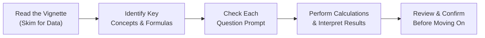

## Overview and Purpose

If you’ve ever taken a timed practice test and felt those sweaty palms when the clock is ticking… well, you’re not alone! This section is all about tackling mock item sets—each with a single vignette followed by multiple questions—mimicking the actual CFA Level II exam environment. The plan? Help you build skills to read, interpret, and solve these question sets quickly and accurately.

By this point in your studies, you’ve probably encountered currency forecasting, PPP-based price differentials, interest rate parity, trade balances, and more. But trust me, seeing them all wrapped together in a timed exam environment can feel overwhelming. The item sets in this section are meant to give you realistic “dress rehearsals,” so you’re more confident when test day arrives.

We’ll walk step-by-step through:
• A strategy to manage your limited time.  
• Different item set complexities (from single-step computations to multi-factor scenarios).  
• Pitfalls that often fuel silly mistakes.  
• In-depth rationales for each question.

Yes, we’re definitely going to get into the weeds—but it’s worth it. Let’s go!

## The Role of Full-Length Mock Item Sets

Mock item sets do more than test your knowledge. They teach you to:
• Parse a vignette: Spot relevant data, skip distracting fluff.  
• Prioritize which formula or concept to apply: Not every ratio or equilibrium model is relevant if the question’s angle doesn’t need it.  
• Solve quickly: The standard time recommendation is around three minutes per question (roughly 18 minutes per 6-question item set).  

When you first start, your times might be nowhere near the suggested targets. That’s okay. The goal is progress, not perfection.

## Time-Management Tips

Some folks read the entire vignette first, underlining key figures. Others jump to the questions immediately, then skim for data. Whatever your style, consistency matters. If you keep switching approaches, you’ll lose valuable seconds.  

Try to keep 20–30 seconds at the end to re-check calculations. Especially watch out for decimal movements or annual vs. semiannual interest rates. It sounds small, but I once lost a chunk of points by messing up a monthly interest rate input—talk about a facepalm moment.

Below is a small flowchart that illustrates a logical (though not mandatory) approach to item sets:

This is just one example. If you prefer the “Questions First” method, that’s also perfectly valid. The main thing is to have a consistent process.

## Building Realistic Vignettes

A well-crafted item set should test multiple topics:
• Currency Forecasting (forward/spot relationships, triangular arbitrage, market expectations).  
• Policy Analysis (central bank, fiscal expansions, and the resulting macro impacts).  
• Economic Growth Models (applying growth theories in advanced vs. emerging markets).  
• Parity Conditions (uncovered interest rate parity, PPP insights, the Fisher Effect).  

Below, we’ll walk through an illustrative item set to show how the data is typically presented.

### Example Item Set: Growth Fundamentals Meet Currency Speculation

Picture this: You’re given a vignette about Country A, a developed economy, with moderate GDP growth over the past three years. Meanwhile, Country B, an emerging market, has introduced new monetary policies to curb inflation.

The vignette might include:

• Growth rates for both countries (nominal and real).  
• Interest rates for each country’s currency.  
• Spot exchange rates and forward quotes.  
• Central bank statements hinting at future policy changes.  
• Additional data about trade balances or investment inflows.

Then you’d see 6–8 questions covering:

1) Basic forward exchange rate calculations.  
2) Effects of monetary policy changes on the currency’s expected path.  
3) Impact of inflation differentials on PPP-based forecasts.  
4) Interpretation of official statements regarding capital controls.  
5) Changes in trade balances after a policy shift.  
6) Possibly a switch to an unexpected side topic—like carry trade logic or a quick mention of growth models.

Half the challenge is scouring the vignette for the numbers you need. The other half is deciding which concept is relevant for that question.

## Calculations and Formulas at a Glance

Here are some of the typical formulas you’ll likely use during your mock item sets:

• Forward Rate under Interest Rate Parity (Domestic/Foreign):
  
  $$
  F_{d/f} = S_{d/f} \times \frac{(1 + i_d)}{(1 + i_f)}
  $$

  where \\( i_d \\) = domestic interest rate, \\( i_f \\) = foreign interest rate, \\( S_{d/f} \\) = spot exchange rate in “domestic/foreign” terms.

• Uncovered Interest Rate Parity:  
  $$
  E(S_{d/f}) = S_{d/f} \times \frac{(1 + i_d)}{(1 + i_f)}
  $$
  (The expected future spot is the same fraction as above, but crucially, it’s an expectation since it’s not contractually locked.)

• Covered Interest Rate Parity Relationship:  
  This is the same formula as above, but it’s pinned down by the forward market, so you’d see fewer deviations from it in equilibrium—absent transaction costs or capital controls.

• Purchasing Power Parity (PPP):
  
  $$
  \frac{S_{d/f}}{S_{d/f}\,(base)} = \frac{P_d}{P_f}
  $$
  
  or in simpler words, currency changes offset inflation differences in the long-run. Questions might involve adjusting current spot rates based on differences in inflation.

• Economic Growth Rates:
  
  Usually, you’ll see references to the Solow model or an endogenous growth perspective. If the puzzle references capital deepening or technology improvements, you might have to estimate future GDP growth based on the data provided.

## Tips for Quick Reference

• Keep track of annual vs. periodic rates.  
• Watch out for currency quoted in direct vs. indirect terms (e.g., USD/EUR or EUR/USD).  
• Don’t forget nominal vs. real GDP. If the question says 2% inflation, but real growth is 3%, the nominal growth will be around 5% (simplified, ignoring compounding).  

## Using Timed Conditions

Try setting a timer for 18 minutes per 6-question mock item set. If you finish early, great—review the questions. If not, note where you got stuck. Often, the slowdown happens in reading or re-reading data. With practice, you’ll zoom in on the relevant info.

## Common Pitfalls

• Getting lost in extraneous details: Some vignettes might throw in “noise”—like unrelated data about a country’s demographic shifts if the question focuses on interest rate parity. Don’t fall for the trap.  
• Arithmetic slips: Double-check that you’re not mixing decimals and percentages.  
• Overcomplicating the conceptual approach: Maybe you see PPP but the question is actually about how interest rate changes shift forward points. Keep a direct line between question and relevant formula.

## Mock Item Set Example Walk-Through

Let’s illustrate an abbreviated scenario below. (In practice, you’d see more narrative and data, but this snippet will do.)

**Vignette Example**  
Country Z is experiencing moderate inflation of 2% annually, while Country Y faces 5% annual inflation. The spot exchange rate is quoted as Z$0.80/Y$. The 1-year interest rate in Country Z is 3%, and in Country Y it is 6%. Analysts expect inflation rates to persist for the next year, based on official statements from both central banks indicating no major policy shifts.

1) Calculate the 1-year forward rate \\( F_{Z/Y} \\) under covered interest rate parity.  
2) Using PPP, estimate how the spot exchange rate might adjust over the next year if prices adjust fully to inflation differences.  
3) Determine the interest rate differential’s effect on a potential carry trade.  

**Walk-Through**:

1) **Forward Rate**:  
   
   F_{Z/Y} = 0.80 \times \frac{(1 + 0.03)}{(1 + 0.06)} = 0.80 \times \frac{1.03}{1.06} \approx 0.778
   
   So you might expect a forward quote of about Z$0.778 per Y$.

2) **PPP-based Expectation**:  
   Spot rate moves to offset inflation difference of (5% - 2%) = 3% in relative prices.  
   In one year, everything else constant:  
   
   S_{Z/Y} (\text{PPP-based}) \approx 0.80 \times \left(\frac{1 + 0.02}{1 + 0.05}\right)
   
   or we could interpret it as the ratio of inflation rates. The point is we expect the Y$ to lose more purchasing power, so you might see a different ratio that moves in Z$’s favor.

3) **Carry Trade**:
   If you borrow at 3% in Z, convert to Y, invest at 6% in Y, your net interest margin is about 3%. But you have exchange rate risk unless you hedge in the forward market (which might eat up that interest margin when you factor in the forward discount or premium).

This is how a typical item set might look. You still have to read carefully to see which formula is relevant to each question.

## Putting It All Together

• Expect multi-layered data: from policy angles, inflation rates, FX quotes, to statements from ministers or central bankers.  
• Avoid fixating on tangential data (like a random growth statistic) if the question is purely about currency forward positions.  
• Always interpret the question carefully. Some require single-step calculations; others require multi-step reasoning (e.g., interest rate parity plus an inflation expectation alignment).  

## Suggestions for Further Exploration

• Official CFA Institute Mock Exams: The gold standard for seeing precisely how vignettes are structured.  
• AnalystForum discussion threads: Peer reviews and solution swaps can highlight sneaky pitfalls.  
• “Economics for Investment Decision Makers” (CFA Institute Investment Series): A deeper look, especially on the interplay of policy and currency markets.

## Final Thoughts

I still remember how my first timed mock item set was a minor disaster. But each attempt made me more comfortable with the structure, and the real exam felt more familiar as a result. So dive in. Embrace the mistakes now, and you’ll be grateful on exam day.

On the next pages you’ll find practice material to test your mastery of these item sets. Keep an eye on the clock, stay calm, and keep refining your approach each time you practice.

## Test Your Skills: Comprehensive Mock Questions for Level II Economics



### Question 1
Which of the following best describes a key benefit of using timed mock item sets for CFA Level II preparation?

- [ ] They reduce the total amount of study time needed.
- [ ] They provide simpler, more direct data than the real exam does.
- [x] They help candidates practice identifying relevant data and formulas under realistic pressure.
- [ ] They focus primarily on memorizing theory rather than application.

> **Explanation:** Timed mock item sets mirror exam conditions, forcing you to efficiently interpret data and apply your knowledge. They do not necessarily reduce total study time nor are they simpler than real exam questions.

### Question 2
A one-year forward quote for USD/EUR under covered interest rate parity can be calculated using which of the following formulas if the current USD/EUR spot rate is S, and USD interest rates are i₍USD₎ while EUR interest rates are i₍EUR₎?

- [x] F₍USD/EUR₎ = S × (1 + i₍USD₎) / (1 + i₍EUR₎)
- [ ] F₍USD/EUR₎ = S × (1 + i₍EUR₎) / (1 + i₍USD₎)
- [ ] F₍USD/EUR₎ = S / (1 + i₍USD₎ - i₍EUR₎)
- [ ] F₍USD/EUR₎ = S × (1 – i₍EUR₎ + i₍USD₎)

> **Explanation:** Covered interest rate parity states that the forward rate should adjust to offset interest rate differentials between two currencies. Hence, F = S × (1 + i₍domestic₎)/(1 + i₍foreign₎).

### Question 3
When practicing a 6-question vignette under timed conditions, what is the recommended total time you should allocate?

- [ ] About 10 minutes.
- [ ] About 15 minutes.
- [x] About 18 minutes.
- [ ] About 24 minutes.

> **Explanation:** With an average of three minutes per question, a 6-question item set takes approximately 18 minutes in a timed scenario.

### Question 4
Suppose you observe the following annual interest rates: 4% domestic and 1% foreign. The current spot is quoted as 1.200 domestic per foreign. Using covered interest rate parity, what is the one-year forward exchange rate (domestic per foreign)?

- [ ] 1.235
- [ ] 1.200
- [x] 1.166  
- [ ] 1.196  

> **Explanation:** Using the formula F = 1.200 × (1 + 0.04)/(1 + 0.01) ≈ 1.166. Note the forward discount on the foreign currency due to the lower interest rate abroad.

### Question 5
Which of the following is a common pitfall when approaching a lengthy Economics vignette?

- [ ] Skipping question stems in favor of focusing on the data first.
- [ ] Calculating interest rates in decimals instead of percentage points.
- [x] Spending too much time on non-essential details unrelated to the actual questions. 
- [ ] Ignoring all data tables.

> **Explanation:** Over-reading or fixating on extraneous details can drain valuable time. You should focus on the data relevant to each specific question.

### Question 6
In a hypothetical item set, Country X’s inflation rate is 2%, while Country Y’s inflation rate is 5%. According to relative Purchasing Power Parity (PPP), how is the currency of Country Y expected to move over time relative to X?

- [x] The currency of Country Y should depreciate because it has a higher inflation rate.
- [ ] The currency of Country Y should appreciate because it has a higher inflation rate.
- [ ] The currency of Country X should depreciate due to stable inflation.
- [ ] Both currencies remain unchanged in relative terms.

> **Explanation:** Under PPP, higher inflation in Country Y erodes purchasing power, typically leading to expected depreciation of Y’s currency against X’s.

### Question 7
An economics vignette references the "carry trade" strategy. Which of the following best describes the underlying mechanism of a carry trade?

- [x] Borrow in a low-interest-rate currency and invest in a high-interest-rate currency, hoping to profit from the rate differential.
- [ ] Borrow in a fixed-rate bond market and invest in floating-rate notes.
- [x] Employ forward contracts to hedge away all currency risk.
- [ ] Speculate exclusively on the direction of commodity prices.

> **Explanation:** A classic carry trade involves borrowing where interest rates are low, converting the proceeds into a currency with a higher rate, and investing there. However, hedging currency risk via forward contracts often reduces or eliminates the advantage. The second “correct” answer is intentionally included to illustrate that some examinees might choose partial hedges or no hedges at all. This can be a tricky item set question if the vignette states that hedging is used or not used.

### Question 8
When a question focuses on interest rate parity but provides extraneous details on export patterns and demographic shifts, what is the most efficient approach?

- [x] Recognize that not all information is needed to answer the IRP-focused question.
- [ ] Integrate all data points into a single formula for completeness.
- [ ] Disregard interest rate differentials and focus on trade flows.
- [ ] Always use the highest growth number to adjust the currency quote.

> **Explanation:** The exam often includes distractors. If the question is isolated to IRP, you don’t need every piece of data the vignette supplies.

### Question 9
You’re practicing a mock item set under strict timed conditions and run out of time after answering only four of the six questions. Which of the following strategies best addresses this scenario for future practice?

- [x] Thoroughly review where you spent excess time, identify bottlenecks, and practice a similar item set again.
- [ ] Switch all answers to a single choice (like “B”) for a better chance of guessing them correctly.
- [ ] Skim the reading next time to avoid all details.
- [ ] Decrease the time for each subsequent question to 2 minutes so you have more leftover time at the end.

> **Explanation:** Understanding why you ran out of time (excessive reading, complicated calculations, second-guessing) is critical. Then, practice again and aim to refine your efficiency. Random guessing, ignoring details, or simply adjusting your time per question are less constructive.

### Question 10
True or False: Item sets are designed so that only one concept (like Purchasing Power Parity) is tested in each vignette.

- [ ] True
- [x] False

> **Explanation:** Level II item sets can cover multiple concepts (e.g., interest rate parity and inflation-based forecasting in the same vignette), testing your ability to integrate different elements of Economics.



## References

• Official CFA Institute Practice Exams and Mock Exams (Level II)  
• AnalystForum (analystforum.com) for peer discussion and solution-swaps  
• Economics for Investment Decision Makers (CFA Institute Investment Series)  

Keep practicing, embrace the timed pressure, and refine your approach. Over time, the puzzle pieces start falling into place, and you’ll feel that sweet moment of confidence in tackling the item sets. Nothing beats the feeling of turning the page on exam day knowing you’ve been there and done that—so keep it up!  
