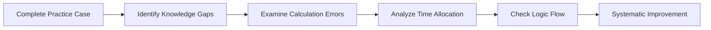

## Why Debriefing Matters

Have you ever wrapped up a practice exam, breathed a sigh of relief, and immediately flipped your notes closed to rush off to something else? Well, I used to do that all the time in my early study days—until I realized that I was missing out on some seriously valuable learning opportunities. Debriefing after every mock exam, practice case, or item set is crucial because it transforms mistakes into actionable insights. Essentially, if you can pinpoint weaknesses in topics such as Interest Rate Parity (IRP), Purchasing Power Parity (PPP), or Balance of Payments (BOP) analysis—and systematically track those weaknesses—you empower yourself to know exactly what to fix.

Below, we’ll walk through a structured approach to debriefing so you can optimize your time and energy for genuine improvement. While we’ll highlight currency and macro-themed examples, keep in mind that this approach can be applied across the entire CFA curriculum.

## The Structured Debrief Roadmap

A good debrief follows a sequence—kind of like a story arc that takes you from confusion to clarity. Contrasting some random “skimming over solutions” approach, a systematic process ensures nothing important slips through the cracks. Here’s a quick snapshot of a debrief flow:

We’ll break down each block next and sprinkle in best practices, personal anecdotes, and advanced tips. 

## Identifying Knowledge Gaps

When you review each sub-question or item set, ask yourself: “Was the confusion rooted in conceptual misunderstandings or in misreading data?” For instance, if the vignette is about the relationship between forward currency quotes and interest rate differentials, did you mix up which currency is domestic vs. foreign? Maybe your confusion came from not being 100% sure how to apply Covered Interest Rate Parity (CIP).

• Spot Recurring Topics. Notice whether your errors often involve currency valuation or, let’s say, applying purchasing power parity logic. This signals a deeper issue with either the underlying assumptive frameworks or the relevant formulas (like F = S × [(1 + i_dom) / (1 + i_for)]).

• Revisit Core Curriculum. If you see repeated confusion about, say, how to interpret a forward premium vs. discount, that’s a big sign to re-read the relevant sections from Chapter 2 (“Currency Market Mechanics”) or Chapter 3 (“International Parity Conditions in Action”).

• Use a Mistakes Journal. Jot down bullet points: your confusion, the step at which you got lost, and the official explanation. This is especially powerful for repeated problem types—like mixing up real vs. nominal exchange rates or forgetting to adjust interest rates for day count conventions.

## Examining Calculation Errors

Sometimes you’ve got the right formula in mind but input the wrong numbers, or you skip a variable in your hurry. It happens more than you’d think—especially in high-stress exam conditions.

• Double-Check the Formula. Did you remember to include 1 in the interest rate expression if the question uses annualized rates? And is that T in months or years?

• Align with the Vignette Data. Verify that you extracted the correct figure from the item set. These data sets can be sneaky—there might be multiple interest rates for different periods, or inflation rates might be annual while the question is monthly. Make sure your time periods match.

• Practice Calculator Skills. The CFA exam has certain rules about permitted calculators. Spend some time becoming a total pro at your TI BA II Plus (or whichever you use). If your calculation steps take too long or you’re second-guessing what you keyed in, you risk introducing silly errors.

## Analyzing Time Allocation

I remember one mock exam where I spent nearly half my allocated time on just two item-set questions—leaving me in a total panic for the rest. Afterward, I realized I should’ve cut my losses when I started spinning my wheels. 

• Track Your Timing. Use a stopwatch or any timer. Jot down approximate times per question, or at least note if something felt like it took forever. During your debrief, see where you got bogged down.

• Embrace the “Move On” Principle. If you’re stuck on a question, it might be more efficient to do a quick best guess (hopefully an educated one) and revisit it if time allows. This prevents a single question from derailing your entire exam performance.

• Recognize Red Flags. If complicated currency conversions or multiple-step forward calculations always slow you down, identify those patterns so you can practice that question type specifically.

## Checking Logic Flow

This is where you scrutinize your mental approach for each question. Did you interpret the question stem in the right context—like, are you sure the question wanted you to find the forward points, or was it the forward premium (which typically is quoted as an annualized percentage)?

• Theoretical Consistency. Let’s say you predicted a currency would appreciate based on your uncovered interest parity formula. Does that also make sense from a fundamental perspective—like that country has bullish capital flows and strong real growth? If your theoretical outcome contradicts basic economic signposts, that’s a red flag to revisit your steps.

• Linking Parts of the Vignette. Many item sets require multi-question logic. For instance, question 3 might build on the result of question 2. If you made a misstep early, the logic for subsequent parts will collapse. Reviewing your approach can reveal if you were consistent.

• Outline Your Theory in Short Notes. If it’s a capital flows problem, quickly scribble down: “High interest → capital inflow → currency appreciation?” so you have a cheat sheet for direction. That mental map can be a lifesaver.

## Systematic Improvement

Finally, you want to wrap everything together. It’s not enough just to “know” where you messed up—create an action plan.

• Create a Study Priority List. If you’re consistently messing up BOP-based currency predictions (like current account vs. capital account relationships), that topic goes straight to the top of your study list. 

• Practice Specifically on Weak Points. Let’s say you discovered misapplication of PPP formula. Carve out time in your study routine to do 5–10 more practice questions focusing solely on that concept.

• Cross-Verify With Common Sense. For example, if your final forward rate suggests the foreign currency trades at a discount but you know from interest rate differentials it should be at a premium—that’s a vital consistency check. Doing “sanity checks” can catch a host of mistakes before finalizing your answer.

## Best-Practice Note-Taking Methods

When you’re racing through a test, hastily scrawled or incomplete notes can sabotage your performance. Instead, try these approaches:

• Bullet Points for Key Data. Right when you open the vignette, quickly bullet:  
  - Spot exchange rate: S = 1.2000  
  - Domestic interest rate = 5%  
  - Foreign interest rate = 2%  
  - Time horizon = 6 months  

• Keep a Scratch Area for Formulas. Write essential formulas ahead of time—like forward premium/discount or PPP-based exchange rate. That way, you’re not rummaging through your memory mid-exam.

• Mark Potential “Pitfall” Data. If you see an unusual detail, like a monthly interest rate, circle it so you remember to annualize or handle carefully.

## Advanced Tips for Double-Checking

Once you arrive at a proposed solution, give it a final pass with these advanced pointers:

• Revalidate the Direction of Movement. Suppose you found a forecast that says the euro will strengthen against the dollar. Does that line up with your interest rate difference logic?

• Compare Alternative Approaches. For a currency forward question, you can sometimes do a direct approach (forward formula) or a cost-of-carry perspective. If both yield the same figure, it’s a great indication that you haven’t messed up.

• Federal Reserve or Central Bank Clues. Some vignettes mention central bank policies. If you see that the domestic central bank is hawkishly raising rates, does your resulting forward rate reflect a likely appreciation in the domestic currency?

## Reflecting on Mock Exams & Practice Sets

You might notice consistent weaknesses in certain sub-segments of Economics:

• Interest Rate Parity and PPP. Are you consistently mixing up covered vs. uncovered interest parity? 
• Currency Crisis Scenarios. Maybe you keep forgetting to apply the logic behind capital flight or the concept of foreign currency reserves in pegged regimes.
• BOP Analysis. Suppose you rarely incorporate capital flows properly or skip the detail that the trade deficit might widen when domestic currency appreciates.

If your official mocks confirm these shortcomings, consider diving deeper into relevant chapters for a thorough review—like Chapter 3 (International Parity Conditions) or Chapter 4 (Balance of Payments and Currency Valuation). Or, seek out dedicated question banks focusing on those tricky areas.

## Final Exam Tips

• Don’t Skip the Debrief. That short post-exam reflection can be more beneficial than an hour of mindlessly re-reading notes.  
• Keep a Calm Mindset. Stress is the number-one culprit in calculation mistakes. Practice staying calm under pressure—try timed drills or mental simulations.  
• Reward Progress. When you see improvement, celebrate! Gaining mastery over tricky concepts is a huge confidence booster.  
• Continuous Iteration. Each practice exam is a chance to refine your approach. Debrief, fix, practice again. Rinse and repeat until test day.

## References for Further Study

• CFA Institute Level II Exam Prep Materials—official end-of-chapter questions and mock exam guidelines.  
• “Study & Exam Strategies” by Peter Takac—practical insights for systematic debriefing and advanced test-taking methods.  
• Kaplan Schweser, Wiley, and Other Professional Providers—supplemental practice items and in-depth breakdowns of challenging topics.

## Test Your Knowledge: Debrief and Review Essentials Quiz



### Which of the following best describes the primary benefit of performing a structured debrief after a practice exam?

- [x] It identifies areas of misunderstanding, calculation errors, and time management issues for focused improvement.  
- [ ] It reveals what the final exam questions will be in advance.  
- [ ] It avoids the need to practice additional questions.  
- [ ] It guarantees a perfect score if followed properly.

> **Explanation:** A structured debrief is designed to help you spot your knowledge gaps, revisit calculations, and refine your exam strategy, but it doesn’t magically predict the actual exam content or ensure a perfect score.

### What is often the most effective way to handle recurring confusion about a specific concept (e.g., forward premium vs. discount) discovered during review?

- [x] A targeted practice session focusing solely on that concept until it’s mastered.  
- [ ] Skipping those concepts in the exam.  
- [ ] Memorizing the exact wording from your notes without further practice.  
- [ ] Avoiding the concept in future mock exams to save time.

> **Explanation:** If repeated confusion arises, intense and targeted practice on that concept is critical. Merely memorizing definitions is usually insufficient for long-term understanding under stress.

### How can creating a “mistakes journal” assist you in improving your mock exam performance?

- [x] It helps track patterns of errors and clarifies what needs practice and why.  
- [ ] It replaces reading the official curriculum.  
- [ ] It makes you memorize every formula without understanding.  
- [ ] It forces you to take fewer practice exams overall.

> **Explanation:** A mistakes journal identifies persistent trouble areas by logging the nature of each error, leading to targeted and efficient improvement.

### In a currency vignette scenario, you forecast that a currency will appreciate, but your calculations suggest the opposite. Which approach should you take next?

- [x] Revisit your calculations and check for consistency with fundamental interest rate or capital flow logic.  
- [ ] Immediately change the final answer to align with standard theory.  
- [ ] Assume the question is incorrect.  
- [ ] Skip the question, as the contradiction implies it's too complex.

> **Explanation:** Logical consistency checks are crucial. If there’s a discrepancy between theoretical direction and calculated results, investigate possible arithmetic or conceptual errors.

### During review, you notice that you spent most of your time on only one or two questions in an item set, hindering your overall completion. Which strategy is most suitable to prevent this?

- [x] Implementing strict pacing rules and knowing when to move on to the next question.  
- [ ] Focusing on the hardest question first, spending as much time as it takes.  
- [x] Using random guessing early.  
- [ ] Cleaning up your desk to reduce distractions.

> **Explanation:** Effective time management in a practice or real exam scenario involves having clear pacing strategies and knowing when to guess and move on to avoid time traps.

### What is a recommended note-taking method to avoid confusion in item sets with multiple data points (e.g., interest rates, inflation, exchange rates)?

- [x] Bullet-pointing crucial data in an organized manner for quick reference.  
- [ ] Relying on mental math alone to keep track of all relevant figures.  
- [ ] Writing everything on the question paper haphazardly.  
- [ ] Memorizing interest rates without writing them down.

> **Explanation:** Bulleted notes with clear labeling of key data (interest rates, inflation, forward rates) is a structured way to reduce confusion and speed up calculations under time pressure.

### Which factor would most likely be responsible for repeated incorrect usage of Covered Interest Rate Parity (CIP)?

- [x] Mixing up domestic vs. foreign interest rates in the formula.  
- [ ] Correctly labeling all currency pairs.  
- [x] Applying PPP instead of CIP.  
- [ ] Following the standard forward rate formula with precise annualization.

> **Explanation:** A common error is confusing domestic and foreign rates, or incorrectly flipping the ratio, which often leads to the wrong forward rate outcome.

### When performing a final consistency check on your exchange rate forecast, which of the following best indicates that your derived forward rate is reasonable?

- [x] It aligns with both the formula and the fundamental interest rate differential logic.  
- [ ] It is higher than the current spot rate, no matter the interest rates.  
- [ ] It exactly matches the prior year’s forward rate.  
- [ ] It is largest number you’ve calculated so far.

> **Explanation:** Your final forward rate makes sense if it is consistent with the CIP formula and simultaneously passes a logical review of interest rate differences and expected currency movements.

### Which action is the most critical after discovering a repetitive misunderstanding about the Marshall-Lerner condition while reviewing practice questions?

- [x] Revisit the condition’s theoretical foundation and work through multiple practice scenarios involving elasticity.  
- [ ] Ignore the misunderstanding since it’s not tested frequently.  
- [ ] Only read the summary bullet points from your notes.  
- [ ] Hope the topic doesn’t show up on the actual exam.

> **Explanation:** Deep-diving into the underlying theory and reinforcing with focused practice is the surest way to correct repeated misunderstandings about a nuanced concept like the Marshall-Lerner condition.

### True or False: A consistent review and debrief strategy can directly reduce exam-day stress by giving you confidence in your systematic approach.

- [x] True  
- [ ] False  

> **Explanation:** Having a reliable process for identifying and addressing errors helps you feel more prepared, ultimately lessening anxiety and preventing panic-induced mistakes on exam day.


