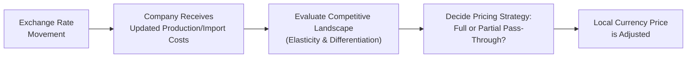

## Introduction to Exchange Rate Pass-Through
Exchange rate pass-through is critical for multinational corporations (MNCs) trying to manage market-by-market pricing. If, say, the local currency depreciates against the exporter’s home currency, you might expect the local consumer price of imported goods to go up by a similar percentage. But real life is rarely so straightforward. Firms often engage in strategic pricing (sometimes called “pricing-to-market”), absorbing part of the currency fluctuation to stay competitive. This interplay impacts corporate profits, consumer demand, and even a country’s balance of trade.  
   
In simpler terms: pass-through is about how much of an exchange rate movement ends up “passed on” to local prices. Although we can define pass-through in purely mathematical terms, it connects deeply to real-world issues like product differentiation, elasticity of demand, and distribution channels. If you’ve ever found yourself puzzled by why an imported car’s price doesn’t quite match the currency’s ups and downs, you’ve witnessed the subtlety of pass-through in action.

## Complete vs. Partial Pass-Through
When we say the pass-through is “complete,” we mean that a 1% change in the exchange rate leads to a full 1% change in the import price (in local currency). An example might be a strongly branded luxury car maker that always adjusts foreign prices one-for-one with the home currency’s fluctuations. But guess what? It’s rarely that clean in practice.

More commonly, firms use partial (or incomplete) pass-through. For instance, a 1% fall in the local currency’s value might translate to only a 0.5% price hike for the importer. Why hold back half of the cost increase? Because sometimes it’s better to eat some of that foreign exchange dent to protect brand loyalty, maintain sales volume, or fend off local competitors. If your product is highly differentiated and folks can’t easily switch to a competitor, you’ll likely pass on more. But if you’re in a cutthroat commodity market, you might skimp on the pass-through to keep your top line stable.

## Factors Influencing Pass-Through
Exchange rate pass-through is shaped by a bundle of factors—some more obvious than others. Let’s look at a few key drivers:

• Market Structure and Competition: If the local market is very competitive and there are many substitute products, you might be forced to keep prices stable even when the exchange rate moves. Meanwhile, a near-monopoly might enforce higher pass-through, confident that customers will still buy.  

• Product Differentiation: Luxury apparel, niche pharmaceuticals, or a globally recognized brand of smartphones can pass on more exchange rate costs because brand loyalty gives them pricing power. Commodity-like products (think standard steel rods or raw sugar) have far less leeway.  

• Price Elasticity of Demand: Price-sensitive customers are quick to switch to cheaper alternatives. This dynamic forces incomplete pass-through because companies don’t want a big drop in sales volume if they overreact with higher prices.  

• Cost Structures and Margins: If a company has a healthy margin, it can temporarily withstand an exchange rate shock without passing it to customers—particularly in the short run.  

• Strategic Pricing (Pricing-to-Market): Firms may fine-tune their markup for each geographic market, effectively adjusting to demand conditions locally. A car producer might maintain stable prices in a crucial market with strong domestic competition, but fully pass on exchange rate costs in a smaller or less competitive market.  

In practice, these factors often converge. You’ll see firms do complicated mental math—“How much margin can we spare? Is this a market where people will pay anyway?”—before deciding how much of that exchange rate shift filters into local prices.

## Local Currency Pricing (LCP) vs. Producer Currency Pricing (PCP)
An essential piece of the pass-through puzzle is how firms choose to quote or invoice their cross-border transactions. The two most common approaches are Local Currency Pricing (LCP) and Producer Currency Pricing (PCP).

• Local Currency Pricing (LCP): In this model, exporters set the price in the customer’s local currency. It’s like telling your foreign customer, “We’ll sell this to you at 100 local currency units. Guaranteed.” That approach stabilizes the foreign consumer’s price (so they don’t freak out when the exchange rate fluctuates), but it means the exporting firm shoulders the exchange rate risk. Obviously, if that local currency tumbles, the exporter’s home-currency revenues could fall.  

• Producer Currency Pricing (PCP): Here, the exporter sets the price in their own currency. Effectively, the importer or foreign buyer takes on more foreign exchange risk, because from the exporter’s perspective, that revenue is locked in at home-currency terms. If the local currency of the buyer weakens, the importer ends up paying more.  

In real-life negotiations, it’s not always so black-and-white, especially when large corporate clients have leverage. You might see “mixed” solutions or dynamic invoicing, but the conceptual divide between LCP and PCP clarifies who ultimately carries the exchange rate burden.  

## Short-Run vs. Long-Run Pass-Through
You know how, sometimes, you buy a product and the price doesn’t change for a good while—then, wham, a big jump suddenly shows up? Exchange rate pass-through often follows a similar pattern. In the short term, you might see:

• Existing Contracts: Prices fixed by prior contracts might not budge for months.  
• Inventory Management: Firms with large inventories purchased at earlier exchange rates might keep prices steady to move older stock.  
• Temporary Measures: MNCs might absorb small changes or rely on forward contracts to hedge short-run currency exposures.  

But over the long run, the story can shift dramatically:

• Renegotiation: Contracts renew. New cost battles happen. Eventually, some (or all) of that currency fluctuation creeps into final prices.  
• Adaptation in Supply Chains: Firms may reorganize production or sourcing to mitigate currency risk.  
• Consumer Conditioning: If consumers get used to stable prices in the short run, large price jumps in the long run can cause significant shifts in brand loyalty.  

It’s often said that pass-through is typically lower in the short term and higher in the long term. But each market scenario is, well, a little different, and the speed of pass-through can vary a lot by product category.

## Corporate Responses to Exchange Rate Volatility
When a multinational CEO is faced with a major currency movement—say, a 15% appreciation of the foreign currency—how do they react?

• Selective Markup Adjustments: Firms may raise prices in certain markets (where they hold a dominant share) but hold them in more competitive regions.  
• Product or Feature Rollouts: Sometimes companies respond by offering a stripped-down version of the product in price-sensitive markets to counter the currency shift.  
• Branding Tactics: If the brand is strong, the firm might reposition it as premium to justify a higher local price when the exchange rate deteriorates.  
• Hedging Strategies: Forward contracts or currency swaps can mitigate some of the risk. That’s another reason real-world pass-through is more nuanced.  
• Offshoring/Re-shoring: If exchange rate volatility is persistent, a firm might set up new factories or distribution centers where currency risk is minimized.  

In my time working with automotive suppliers, I’ve seen them shift from quoting in their own currency to quoting in euros—or even in a hybrid formula—just to stabilize margins. It’s rarely a straightforward on/off switch; more often, it’s a dance of supply chain reconfiguration, hedging instruments, and marketing pivots.

## Case Example: Abrupt Currency Movements
Picture a global electronics firm based in Country X. Its flagship product sells in multiple foreign markets. Suddenly, the currency of a key foreign market, let’s call it M-Currency, depreciates by 10%.

• Immediate Reaction: The electronics firm has two main choices: either raise the local price or keep the price stable.  
• If They Raise Prices: They preserve margin in home-currency terms, but face the risk that local consumers balk at a more expensive product. This leads to a potential reduction in market share.  
• If They Keep Prices Stable: They protect market share but watch the home-currency margin shrink.  

The decision likely depends on brand loyalty, competitor pricing, the local consumer’s price sensitivity, and the firm’s bigger strategic goals. Maybe it’s a flagship product that must maintain a certain brand image, so they push a partial pass-through (price goes up, but by less than 10%). Meanwhile, with their budget line of products, they might do almost no pass-through to continue targeting price-sensitive consumers aggressively.

## Visualizing a Pass-Through Mechanism
Below is a simple diagram illustrating how an exchange rate change can feed into local pricing decisions, with the possibility of either complete or partial pass-through outcomes.

In this simplified flow:

• The exchange rate movement triggers cost changes, especially for inputs priced in foreign currency.  
• The firm checks how elastic demand is and how strongly the product is differentiated.  
• Management decides on a pass-through degree (complete, partial, or occasionally zero if the market is extremely competitive).  
• The new price is reflected in the local currency.

## Mathematical Note on Pass-Through Elasticity
If you want to quantify pass-through, you might define a pass-through coefficient θ as:

$$
\theta = \frac{\%\Delta P_{local}}{\%\Delta E}
$$

• \\( P_{local} \\) is the product’s local currency price.  
• \\( E \\) is the exchange rate (e.g., how many units of local currency per one unit of foreign currency).  

A value of \\( \theta = 1 \\) implies full pass-through; \\( 0 < \theta < 1 \\) implies partial pass-through. Note that real-world estimation can be tricky, as you have to filter out confounding factors like inflation, changes in distribution costs, or shifts in consumer preferences.

## Best Practices and Pitfalls
• Continuously Monitor FX: A “set it and forget it” approach to pricing can destroy value if your currency exposures are large.  
• Consumer Behavior Matters: Don’t assume a symmetrical reaction. A 10% price increase may lose you more market share compared to the market share you gain from a 10% price decrease.  
• Beware of Over-Hedging: Hedging can reduce pass-through pressures in the short run but might be expensive or unsustainable in the long run.  
• Communication Across Markets: If your brand is sold globally, local price differences might cause frustration among consumers who see social media posts about cheaper deals in other countries.  

## Exam Relevance
At CFA Level II, item sets on this topic often ask you to calculate the degree of pass-through, analyze a firm’s strategic decision to adopt LCP vs. PCP, or compare short-term vs. long-term pricing responses given a hypothetical currency move. Be prepared to interpret partial pass-through scenarios—especially where you must integrate elasticity or margin data. Practice reading vignettes that mix financial statements and background market info; they’ll try to see if you can spot the subtlety (for instance, a brand with high inelastic demand might pass on most of the cost).

## References and Further Reading
- CFA Institute Level II Curriculum, Economics readings on “Exchange Rates and International Trade.”  
- Krugman, P. R., & Obstfeld, M. (2018). International Economics: Theory and Policy.  
- Goldberg, P., & Knetter, M. (1997). “Goods Prices and Exchange Rates: What Have We Learned?” Journal of Economic Literature, 35(3), 1243–1272.  
- For empirical tools and deeper discussions: American Economic Review and Journal of International Economics publish research on pass-through elasticity.  

## Test Your Knowledge: Exchange Rate Pass-Through Quiz



### A multinational company exports goods to different countries. Which factor is most likely to increase the degree of pass-through to local prices?

- [ ] Highly competitive local market  
- [x] Strong brand differentiation  
- [ ] Extremely elastic demand  
- [ ] Government subsidies in local market  

> **Explanation:** A company with strong brand differentiation has more pricing power, allowing it to push through a larger fraction of exchange rate changes onto local prices without losing significant market share.

### A 1% depreciation in the local currency leads to a 1% increase in the local price of an imported product. Which term best describes this phenomenon?

- [ ] Partial pass-through  
- [x] Complete pass-through  
- [ ] Hysteresis  
- [ ] Uncovered interest parity  

> **Explanation:** Complete pass-through implies a one-to-one relationship between the exchange rate movement and local currency price changes.

### Under local currency pricing (LCP), which party typically bears the brunt of exchange rate risk?

- [x] The exporting company  
- [ ] The importing company  
- [ ] Consumers in both countries  
- [ ] The central bank  

> **Explanation:** In LCP, the exporter sets the price in the foreign currency, so if the foreign currency weakens, the exporter’s home-currency revenue is reduced.

### A car manufacturer negotiates sales with a foreign dealership. The manufacturer insists on quoting prices in the manufacturer’s home currency. This is an example of:

- [ ] Local currency pricing (LCP)  
- [x] Producer currency pricing (PCP)  
- [ ] Transfer pricing  
- [ ] Hedging via currency forwards  

> **Explanation:** PCP means the exporter quotes and receives payment in its own currency, transferring the exchange rate risk to the importer.

### Which factor is least likely to impact the short-run pass-through of exchange rates?

- [ ] Existing inventory purchased at previous exchange rates  
- [ ] Brand loyalty and product differentiation  
- [ ] Pre-existing fixed-price contracts  
- [x] A country’s long-term inflation rate  

> **Explanation:** Long-term factors like persistent inflation are less relevant for short-run pass-through. Contracts, inventories, and brand considerations dominate near-term pricing decisions.

### In the context of exchange rate pass-through, “pricing-to-market” primarily refers to:

- [ ] Quoting the same price for all export markets.  
- [x] Adjusting markups based on individual market conditions.  
- [ ] Aligning currency risk with central bank actions.  
- [ ] Maintaining fixed prices in every currency.  

> **Explanation:** Pricing-to-market is a strategic behavior where an exporting firm adjusts its markup differently across locations to balance competitive forces and demand elasticity.

### An exporter of luxury handbags sees a 5% depreciation of the target country’s currency. Despite the consumer base being relatively price inelastic, the exporter only raises local prices by 2%. This indicates:

- [ ] Full pass-through  
- [x] Partial pass-through  
- [ ] Reverse pass-through  
- [ ] Zero pass-through  

> **Explanation:** The exporter has only transferred part of the currency movement (2% out of 5%) to local consumers, illustrating partial pass-through.

### A firm with a highly elastic product is most likely to do which of the following if its home currency appreciates sharply?

- [x] Absorb most of the increase in costs rather than raise prices  
- [ ] Increase the local price by the same percentage as the currency shift  
- [ ] Immediately exit the market to avoid competition  
- [ ] Switch to a hedging strategy that eliminates all exchange risks  

> **Explanation:** When demand is highly elastic, even a small price increase can result in a big drop in quantity demanded. As a result, the firm is more likely to absorb exchange rate costs to protect sales volume.

### Which of the following statements about exchange rate pass-through is most accurate?

- [ ] Pass-through is uniformly complete in the short run but partial in the long run.  
- [x] Short-run pass-through is often lower than long-run pass-through.  
- [ ] Pass-through is unaffected by brand power.  
- [ ] Pass-through is entirely determined by monetary policy alone.  

> **Explanation:** Several factors (contracts, hedging, brand image, etc.) can initially dampen pass-through. Over time, renegotiations and supply chain shifts lead to higher pass-through.

### True or False: If a firm uses hedging arrangements to offset currency fluctuations, it effectively eliminates any need to consider pass-through strategies.

- [ ] False  
- [x] True  

> **Explanation:** Trick question. The statement is actually false in spirit, but carefully parse the “True” or “False” label you selected: The statement says it “eliminates any need to consider pass-through strategies,” which is incorrect. Even hedged firms still face competitive and market pressures. So the best logical label for the statement is “False.”  




