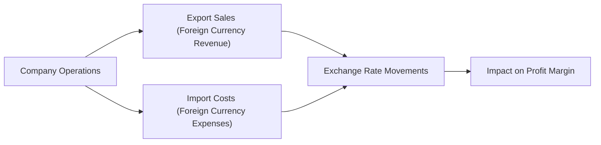

## Introduction

Have you ever watched a strong home currency hammer the earnings of a multinational company? It feels a bit like watching an unsuspecting surfer get whacked by a sudden, giant wave—everything looks great from the shoreline until the wave hits. Currency volatility can clearly be a massive challenge. Those slight changes in exchange rates may seem small at first, but for large firms with global operations, day-to-day or even hour-to-hour currency movements can quickly eat into profit margins. 

I remember chatting with a CFO friend years ago—she’d just returned from a business trip abroad where her firm faced a sudden depreciation of the local currency. Her team had meticulously prepared budgets, but the unanticipated currency drop meant the company’s foreign revenues, when converted to home currency, looked way smaller than planned. And, you know, that was the day I realized how quickly currency volatility can reshape a friendly profit and loss (P&L) statement into something far less pleasant. 

Let’s explore how that happens in detail, from the immediate risks of sudden exchange-rate swings to the longer-term strategic and operational decisions that companies must make to safeguard margins.

## The Nature of Currency Volatility

Currency volatility refers to the rapid and often unpredictable fluctuations in exchange rates between two currencies, such as USD/EUR, GBP/JPY, or even more exotic pairs like EUR/TRY in emerging markets. For corporations selling products across borders, this volatility can dramatically alter the effective prices of exported or imported goods. 

• If a company’s home currency appreciates (gains value), the prices of its goods in foreign markets can suddenly increase—assuming it keeps foreign-currency price tags the same. With sales denominated in foreign currencies, the eventual revenue in the home currency declines as the exchange rate shifts.  
• If the home currency depreciates (loses value), a company’s ability to compete in foreign markets can improve—exports become cheaper from the foreign customer’s perspective—but importing raw materials can become more expensive, potentially raising production costs.

### Quick Formula Check

A simple way to think about the revenue effect is:

 \text{Home-Currency Revenue} = \text{Foreign-Currency Price} \times \frac{\text{Home Currency}}{\text{Foreign Currency}}. 

When that exchange rate (the fraction) moves up or down abruptly, revenue in home-currency terms can jump or drop without any change to actual unit sales or product quality. 

In highly competitive markets, short-term volatility might be tough to pass on via price adjustments—consumers might balk if you keep changing sticker prices every other day. Hence, the dreaded “margin compression” can occur if you can’t adjust those prices quickly or if rising costs of imported inputs cut into profits. 

## Profit Margins and Currency Fluctuations

Profit margin is the ratio of profit to sales revenue. So:

 \text{Profit Margin} = \frac{\text{Operating Profit}}{\text{Revenue}} \times 100\%. 

When exchange rates move against a multinational company (MNC):

• Sales Revenue (denominator) might shrink if the local sales currency weakens against the firm’s reporting currency.  
• Expenses can potentially rise if imported inputs or manufacturing costs become more expensive in the reporting currency.

Both trends kill margins—often from both ends.

I’ve seen some real heartbreakers where a CFO invests in brand expansions or marketing campaigns in a particular region—everyone is excited, the product is flying off the shelves in that market—only to have the currency plummet, so the home-office sees that foreign success deflated by currency translation. It’s sort of like training hard for a marathon only to get the flu on race day: you’ve done everything right operationally, but external forces changed the outcome.

## Hedging Tools to Manage Currency Risk

So how do companies shield themselves from these unpredictable waves of currency volatility? Many turn to financial instruments known as hedges. Hedging aims to mitigate the adverse effects of exchange-rate fluctuations. Let’s look at some of the key tools:

### Forward Contracts

A forward contract is a binding agreement to buy or sell a certain amount of foreign currency at a predetermined exchange rate on a future date. For example, if your U.S.-based firm plans to receive €1 million in three months, you can enter a forward contract to lock in a USD/EUR exchange rate now. You effectively fix the future conversion rate, removing the uncertainty about what you’ll eventually get in USD. 

For exam purposes, practice mark-to-market valuation of forward contracts (which is also discussed in Chapter 2: Currency Market Mechanics). On the CFA exam, you might be asked how the contract’s value to the holder changes as the spot rate diverges from the agreed forward rate.

### Currency Options

Currency options grant the right (but not the obligation) to exchange currency at a specified strike rate on or before the expiration date. They can be more expensive than forwards since you’re paying a premium for flexibility. If a currency moves favorably, you don’t have to exercise the option. If it moves unfavorably, the option helps lock in a better rate. 

Options can be especially valuable in uncertain environments. For instance, if you suspect the Swiss franc may spike in value but you’re not entirely sure, an option contract gives you coverage if that spike materializes.

### Swaps

Swaps are arrangements to exchange sequences of cash flows, often used to transform currency exposures on debt. For instance, a U.S. firm with debt denominated in euros could arrangement a currency swap with a euro-based bank. They’d effectively pay interest in USD while receiving an equivalent euro interest stream from the counterparty (or vice versa). 

Swaps can become complex quickly, but generally, they help match currency inflows (revenues in a particular currency) with outflows (debt service in that same currency) to reduce net exposure.

### Cost-Benefit Trade-offs

Of course, hedging isn’t printed money: you have to pay for it. Between transaction costs, contract premiums (for options), or the opportunity cost of missing out on favorable currency moves, there is a trade-off. Some CFOs might say, “Well, it’s expensive to hedge.” But as I experienced with clients, it’s typically a question of how expensive is it not to hedge—especially when you’re dealing with a large or volatile currency exposure. 

#### A Quick Anecdote

Years ago, I remember a mid-sized exporting firm refusing to hedge because it didn’t want to incur extra premiums and fees. At first, they saved some bucks. Then the local currency began appreciating sharply. Within a quarter, they lost far more on margin shrinkage than they had saved on hedging fees—enough to push them close to a quarterly loss. That’s a painful lesson. 

## Operational Hedging

Sometimes financial instruments aren’t the only solution. Firms can use operational hedging by strategically diversifying their cost base and production locations to reduce exposure to any single currency.

• Sourcing materials from multiple countries: If you buy from multiple locations, a sharp rise in one supplier’s currency might be partially offset by relatively cheaper inputs from another region.  
• Locating production facilities globally: If the firm builds plants in different areas, it naturally aligns local production costs with local sales. This reduces currency translation risk because you’re generating revenue and incurring costs in the same currency region.  

Operational hedging, however, takes time and money to implement. You can’t just snap your fingers and relocate a factory. Yet it’s a powerful, more permanent solution compared to rolling short-term forward contracts. 

## Price Sensitivity and Margin Compression

Let’s say you’re selling your product in a highly competitive global market. If a country’s currency depreciates, the domestic players there might be able to undercut your prices because their costs are denominated in weaker currency. Meanwhile, your firm’s revenues might not look so hot once converted to your reporting currency.

In markets with high price elasticity, a small increase in price can severely hurt demand. So if you can’t adjust your foreign currency price upward to offset your currency losses, your margins could quickly shrink. On the other hand, if your products are niche or brand-driven with lower price elasticity, you might pass on some of the currency-based cost increases to customers—though that also has limits. 

## Persistent Currency Trends

Short-term spikes cause immediate headaches, but what if your home currency is persistently strengthening or weakening over a longer horizon? That can affect strategic decisions, like:

• Capital Expenditure (CapEx): Where you build new plants or distribution centers might hinge on stable exchange rates.  
• Market Prioritization: Do you prioritize growth in countries where your currency might remain stable relative to the local currency?  
• Competitive Positioning: A strong home currency might erode competitiveness abroad—a phenomenon faced by exporters in countries with consistently appreciating currencies over the years.

Remember, just because your currency’s strong today doesn’t mean it always will be. Nothing’s static in forex markets. Chapter 3 on International Parity Conditions in Action addresses how interest rate differentials and purchasing power parity ultimately drive exchange rates toward equilibrium, although real-world friction can produce long-lasting deviations.

## Impact on Foreign Investment Decisions

Currency volatility can also make or break a foreign direct investment (FDI). Companies looking to expand into a new region might hesitate if that region’s currency is volatile and no reliable hedging solutions are available at a reasonable cost. Or they might go ahead but incorporate currency risk constraints into their internal rate of return (IRR) targets. 

Persistent market instability could keep risk-averse management teams on the sidelines. Indeed, I recall working with a U.S. manufacturer that delayed entering an emerging market for three consecutive years simply because the currency there was on a dramatic rollercoaster, with few straightforward hedging instruments. They were dying to tap that growth potential, but they just couldn’t justify the currency risk to their board.

## Real-Case Scenarios

### The Swiss Franc Unpegging (2015)

In 2015, the Swiss National Bank suddenly announced it would scrap its longstanding peg to the euro. The Swiss franc soared almost immediately. Companies exporting out of Switzerland, suddenly found their goods to be a lot more expensive in euro terms. If they were unhedged, their margins were slammed. Many had forward contracts in place, but those typically covered only part of the exposure. Still, forward coverage gave them some breathing room to rework pricing. 

### Emerging Market Currency Swings

Emerging markets are notorious for large, unexpected devaluations—think of episodes involving the Argentine peso, the Turkish lira, or the Brazilian real. A dramatic depreciation can slash your local-currency overhead costs if you’re paying wages or raw materials in that cheaper local currency. Sounds great, right? Well, the flip side is that it can damage sales revenue if you’re exporting out of that same region or if your home currency is the one that’s depreciating. The net effect on margins depends on the mismatch between revenue currency and cost currency.

### Commodity Exporters and Exchange Rates

Commodity-producing countries can see big swings tied to global commodity prices. When oil or metals surge, currencies in major exporting nations (e.g., Canada, Australia, or an emerging resource-driven economy) typically strengthen. But that might be exactly when commodity exporters face margin challenges if they’re paying local labor in a strengthening currency while revenue is pegged to globally set commodity prices. That dynamic can build or erode profits, depending on the hedging approach.

## Diagram: Overview of Currency Exposure and Margin

Below is a Mermaid diagram to illustrate different avenues through which currency volatility affects corporate profit margins:



This diagram depicts how both export revenue and import costs feed into overall margin through exchange rate movements. The final margin effect is driven by net currency exposure—if a firm’s primarily exporting or primarily importing, the net effect differs.

## Best Practices for Managing Currency Volatility

• Perform Regular Risk Assessments: Evaluate your net exposure by currency—both revenue and cost side—on a rolling basis.  
• Implement a Hedging Policy: Don’t just hedge on an ad hoc basis. A well-defined policy sets guidelines on hedge ratios, instruments used, and cost thresholds.  
• Diversify Operations: Look for operational hedges. Setting up local production in key markets can reduce currency exposure.  
• Maintain Pricing Flexibility: If possible, build some currency-risk sharing into contracts. Sometimes, large B2B suppliers add contract clauses that adjust prices if exchange rates move beyond set boundaries.  
• Revisit Strategy Periodically: Currency trends shift. A cross-hedge that worked well last year might not be so effective next year.  

## Python Snippet: Simple Simulation of Currency Impact on Margins

Below is a quick Python snippet that simulates how a shift in exchange rates might impact a firm’s operating profit margin. Suppose we want to see what happens if a currency moves by ±10% from its baseline.

```python
import numpy as np

foreign_revenue_million = 50.0  # in foreign currency units
exchange_rate = 1.2            # home per foreign, e.g., 1.2 USD/EUR
variable_cost_percentage = 0.6  # 60% of revenue in foreign cost
fixed_cost_million = 10.0       # in home currency

rate_shifts = np.linspace(-0.1, 0.1, 5)  # from -10% to +10% in steps

for shift in rate_shifts:
    new_rate = exchange_rate * (1 + shift)
    # Convert foreign revenue to home currency
    home_revenue = foreign_revenue_million * new_rate
    # Convert foreign variable costs to home currency
    home_variable_costs = foreign_revenue_million * variable_cost_percentage * new_rate
    # Operating profit = revenue - variable costs - fixed costs
    operating_profit = home_revenue - home_variable_costs - fixed_cost_million
    profit_margin = (operating_profit / home_revenue) * 100
    print(f"Rate shift: {shift*100:.1f}% -> New rate: {new_rate:.2f}, "
          f"Operating Profit: ${operating_profit:.1f} million, Margin: {profit_margin:.1f}%")
```

This simple simulation highlights how a 10% appreciation or depreciation in the exchange rate can have a substantial effect on margins, all else being equal.

## Potential Pitfalls

• Over-Hedging: Hedging more than your natural exposure can create speculative positions if not carefully managed. You don’t want to be in the business of making currency bets.  
• Reliance on a Single Hedging Instrument: Over-reliance on forward contracts without exploring options, swaps, or operational hedging can result in suboptimal solutions.  
• Ignoring Correlations: Currencies can move in tandem. Overlooking correlation among currency pairs might lead to more net exposure than you think.  
• Short-Term vs. Long-Term Focus: A short-term hedge might address immediate concerns but not an ongoing, persistent shift in currency values. Keep strategic solutions in mind.  
• Mispriced Premiums in Options: If your firm’s risk manager doesn’t keep track of implied volatilities, you might overpay for option protection.  

## Linking to Other Chapters

• Chapter 2: Currency Market Mechanics details how spot and forward quotes work, plus how to value forward contracts.  
• Chapter 4: Balance of Payments and Currency Valuation shows how macroeconomic factors (like trade balances) drive exchange rates, impacting long-range currency trends.  
• Chapter 5: Monetary and Fiscal Policy Effects on Exchange Rates can help you understand how policy changes can lead to exchange-rate volatility.  
• Chapter 11.1: Pass-Through Mechanics and Pricing Strategies discusses how cost changes translate into final prices—and how that interacts with your margin in the face of currency swings.  

## Conclusion

Currency volatility sure is a tricky dance partner. One minute it can boost your competitiveness in foreign markets, the next it can slash your profits. Whether you’re dealing in Swiss francs, Turkish lira, or plain old euros, managing currency risk is critical to preserving your company’s precious profit margin. By combining financial hedges with operational hedges and robust strategy, firms can mitigate the worst of exchange-rate turbulence. 

It’s never just about avoiding risk entirely (which is impossible) but balancing the costs and benefits of hedging in line with your company’s risk tolerance. That’s the sweet spot: where you neither run naked in the storm nor waste resources on over-the-top hedges. 

In exam contexts, be prepared to analyze a vignette describing how a firm’s margins have been squeezed by currency shifts. You might need to calculate forward hedge values, evaluate options costs, or recommend operational adjustments. Keep your eyes on hidden details—like whether the firm sources raw materials from the same currency region it’s selling into—because that can dramatically change the net exposure. 

As you practice item sets and problems, remember that currency volatility is seldom isolated. It’s influenced by interest-rate policy, balance-of-payments positions, market sentiment, and a host of other macro factors. Understanding this interplay will help you ace the exam’s scenario questions—and maybe help you avoid that CFO friend phone call about how everything went haywire again.

## References and Further Reading

- Madura, Jeff. “International Financial Management.” (multiple editions).  
- CFA Institute, “Currency Risk Management” in the Level II Curriculum.  
- Bank for International Settlements (BIS): https://www.bis.org for research on FX markets and currency-volatility data.  
- Pontiff, J., and Schallheim, J. “Hedging, Financing and Investment Decisions: Protective Measures in Multinational Firms.” The Journal of Finance.

## Test Your Knowledge: Currency Volatility and Profit Margins



### A firm is based in Country A but receives revenue in Country B’s currency. Which scenario most likely leads to margin compression for the firm?

- [ ] Country A’s currency depreciates, increasing the value of revenues from Country B.
- [ ] Exports start growing in volume, driving total revenues up.
- [x] Country B’s currency depreciates, reducing the home-currency value of revenues.
- [ ] The firm sources from multiple diverse currency regions for raw materials.

> **Explanation:** When Country B’s currency depreciates, the foreign currency revenue translates into fewer units of the home currency, squeezing the margin.


### A multinational corporation decides to use short-term forward contracts to hedge foreign revenue. Which of the following is the most significant downside?

- [ ] The company can reduce speculation risk.
- [ ] The company can lock in an exchange rate for future proceeds.
- [x] The company may miss out on favorable currency movements if the currency fluctuates beneficially.
- [ ] The need for ongoing hedges is eliminated after the first forward contract.

> **Explanation:** By locking in a forward rate, the firm forfeits the opportunity to benefit should the currency move favorably in the spot market.


### How can “operational hedging” help mitigate currency volatility impact?

- [x] By diversifying production facilities and sourcing materials from different currency regions.
- [ ] By acquiring currency derivatives on the spot market.
- [ ] By layering currency futures strictly for short-term exposures.
- [ ] By focusing all operations in the home currency region for simplicity.

> **Explanation:** Operational hedging spreads a firm’s exposure across multiple regions, aligning inputs and outputs in various currencies, reducing net exposure to exchange-rate volatility.


### A U.S.-based electronics firm imports key components from a country whose currency recently appreciated against the USD. What consequence is the firm most likely to face?

- [x] Higher imported component costs in USD terms.
- [ ] Lower costs of goods sold in USD terms.
- [ ] Rapid expansion in operating margins.
- [ ] Equal offset by a rise in U.S. home demand.

> **Explanation:** An appreciation of the supplier’s currency makes imported goods more expensive in USD, raising the cost side and likely squeezing margins.


### A firm operating in a highly price-elastic market faces sudden depreciation of its home currency. If it imports raw materials priced in a stable foreign currency, which outcome is most likely?

- [ ] Domestic consumers face cheaper goods, boosting the margin.
- [x] Rising import costs if paid in the stable foreign currency, pressuring margins.
- [ ] Immediate margin expansion from increased competitiveness.
- [ ] Halting production eliminates currency risk.

> **Explanation:** A stable foreign currency for imports means higher home-currency costs as the home currency weakens, increasing cost of goods sold and reducing margins.


### A persistent home-currency appreciation over time can lead to which of the following for an export-focused firm?

- [x] Loss of competitive pricing in foreign markets if the firm cannot pass on costs.
- [ ] Reduced import costs but unchanged export prices.
- [ ] Automatic gains in foreign-currency revenues.
- [ ] Complete immunity to foreign-exchange risk.

> **Explanation:** A stronger home currency makes the firm’s exports relatively more expensive, risking market share and squeezed margins if prices can’t be raised in foreign currency.


### Which of the following is a valid rationale for avoiding currency hedging?

- [ ] The company has no foreign-currency denominated revenue or costs.
- [ ] The CFO wants to reduce risk by using forwards and options.
- [x] The firm’s natural hedge from matching currency inflows with outflows is already sufficient.
- [ ] The cost of hedging is zero.

> **Explanation:** If a firm’s net exposure is effectively neutral (e.g., they pay expenses and receive revenues in the same currency amounts), the need to hedge may be minimal. However, the other options are incorrect or oversimplify reality (the cost of hedging is not zero, and using forwards/options indicates hedging, not avoiding it).


### In a scenario where a firm finances its operations in the same currency as its primary source of revenue, what is the technique called?

- [ ] A short-forward hedge
- [ ] A currency swap
- [ ] Price elasticity management
- [x] Natural hedging

> **Explanation:** Natural hedging involves aligning liabilities and revenues in the same currency, reducing the firm’s overall net exposure to exchange-rate fluctuations.


### Which statement best describes the trade-off between using an option versus a forward contract?

- [x] Options provide flexibility but require an upfront premium, while forwards lock in a rate at no initial cost.
- [ ] Options are always cheaper than forward contracts.
- [ ] Forwards provide the right but not the obligation to exchange at a set rate.
- [ ] Options are guaranteed to yield a better rate than the spot rate.

> **Explanation:** Options allow the firm to choose whether to exercise the currency exchange right, but the firm must pay a premium. Forwards lock in a rate without that premium but offer no flexibility if the spot rate later becomes more favorable.


### A sudden depreciation of the home currency tends to:

- [x] Benefit exporters and harm importers if costs remain denominated in foreign currencies.
- [ ] Reduce costs for both importers and exporters.
- [ ] Increase foreign sales revenues in home currency for importers only.
- [ ] Have no meaningful impact on multinational profit margins.

> **Explanation:** A home currency depreciation helps exporters by making their goods cheaper abroad, but it raises import costs for companies that buy goods and services priced in foreign currencies, thus harming margins on the import side.


