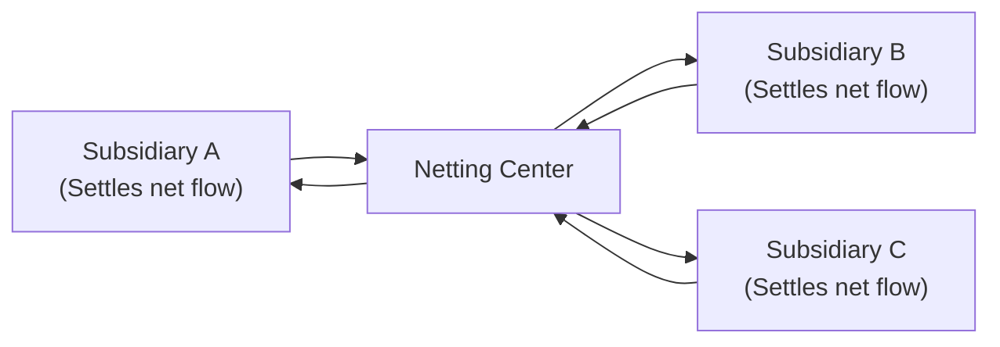
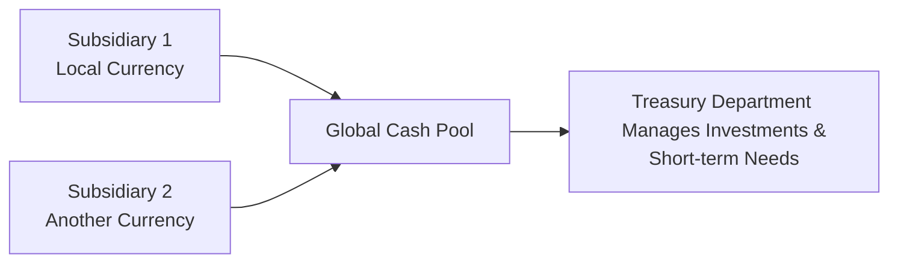

## Overview  
Working capital management might not always make headlines, but—believe me—when currency rates swing wildly, companies definitely notice. One day you’re comfortably sourcing raw materials at stable prices, and the next day your budget might be in disarray because your home currency suddenly took a nosedive against the supplier’s currency. Managing payables, receivables, and inventory effectively across multiple currencies is something like playing a financial puzzle in real time. The aim is to keep your operations smooth, predictable, and—most importantly—profitable.

This section dives into how currency fluctuations influence everyday operational activities, including short-term financing, pricing strategies, and inventory decisions. You’ll also see how big multinational corporations (MNCs) often rely on techniques like netting and pooling to reduce transaction costs and currency exposures. We’ll look at treasury best practices—like real-time monitoring of exchange rates, placing currency clauses in contracts, and rolling hedges—and explore how these align with higher-level strategic decisions on sourcing and capital investment.

## Currency Fluctuations and Day-to-Day Operations  
It’s one thing to know that the local currency of your home market rose or fell by 2% overnight, but it’s another to realize how that 2% might affect your daily operations. Currency fluctuations directly affect:

- Accounts Receivable (A/R): When a customer in a foreign market pays you in their own currency, you’re subject to exchange rate risk from the invoice date to the date you receive payment.  
- Accounts Payable (A/P): If you buy components from overseas suppliers, a strengthened foreign currency means your costs go up (in your home currency). Conversely, a weakening supplier currency might create a short-term discount.  
- Short-Term Financing: Companies that take on short-term loans or credit lines in foreign currencies can benefit or suffer from exchange rate movements that alter the effective cost of borrowing.

### Example: Currency Swing in Practice  
Let’s say a European-based automotive parts manufacturer sells to a US automaker. Payment terms require payment in EUR, but let’s face it—sometimes the US automaker negotiates to pay in USD. If the contract is in USD, the European supplier is exposed if the EUR appreciates against the USD while they wait to collect. Receivables, if not hedged, effectively shrink (when converted back to EUR) as the USD weakens. This exposure can surprise you if you haven’t locked in forward rates or used any hedge transactions.  

## Exchange Rate Risk and Inventory Management  
For many firms, inventory is a big portion of working capital. Currency risk can creep in here too:

- If you’re in a country where your currency is appreciating, importing inventory can become cheaper. You may be tempted to hold more inventory because you expect future prices to rise if your currency ever weakens again (or if the foreign supplier’s currency strengthens).  
- If your currency is depreciating, you might want to accelerate paying off your suppliers so you can lock in relatively favorable exchange rates—basically covering your payables while your currency still buys you more of the supplier’s currency.  

Balancing these moves is tricky. You don’t want to tie up too much cash in inventory and risk obsolescence or storage costs. On the other hand, you don’t want to be caught short if currency movement makes future imported parts more expensive—or simply harder to obtain.  

## Netting and Multilateral Netting  
In large multinational corporations, you often have subsidiaries around the globe sending funds back and forth. Let’s say Subsidiary A in Japan owes Subsidiary B in the UK GBP 500,000, and Subsidiary B owes Subsidiary C in the US USD 300,000, while Subsidiary C owes Subsidiary A some JPY amount. It can all get messy—and expensive in terms of transaction fees and exchange risk.

### Simple Netting  
If there are just two subsidiaries transacting with each other (A owes B, B owes A), they can net the amounts owed and only the net difference changes hands.

### Multilateral Netting  
With multiple subsidiaries and cross-currency transactions, an MNC might centralize netting through a “netting center”—often the corporate treasury. Each subsidiary’s receivables and payables are offset internally first, with only the net flows settled. This drastically cuts down on the number of actual cross-border payments, saving on bank fees, reducing currency exposures, and improving visibility into the company’s overall currency risk.

Below is a diagram illustrating a simplified multilateral netting scenario:

Within this netting center, each subsidiary reports what it owes and is owed, and the treasury calculates a net position for each. Only the net amounts end up being transacted.  

## Corporate Treasury and Cash Balance Management  
Treasury’s job extends beyond netting. They also look at where cash is held, in what currency, and how to optimize short-term financing. Moreover, they may choose to repatriate or “sweep” excess cash up into a central account. A treasury function might use:

- Short-Term FX Swaps: Rolling currency swaps for near-term needs.  
- Money Market Instruments: Deploying excess cash in short-dated, risk-free or relatively safe instruments denominated in various currencies.  
- Cash Pooling: Often, a single physical or notional account is established to gather all cash from different subsidiaries. This central approach can reduce idle balances globally and potentially reduce borrowing costs.

### Cash Pooling Illustration  
Let’s briefly capture a visual sense of how different subsidiaries pool their funds to a central treasury:

In this approach, each subsidiary’s surplus (or deficit) is managed collectively, often allowing better interest rates, improved liquidity, and a centralized view of currency exposures.

## Payment Terms and Contractual Clauses  
Currency risk can be mitigated or at least shifted by clarifying who’s in charge of paying for shipping, insurance, and customs duties. If you’re exporting, do you specify that your customer pays these costs in your invoice currency? If so, the currency exposure might pass on to them. If you’re importing, do you pay your supplier in their currency, or do you set the contract in your own?

### Currency Adjustment Clauses  
A popular contractual tool is the currency adjustment clause, which is basically an agreement: “Hey, if the exchange rate fluctuates beyond X percent from the date of this contract, we agree to adjust the price parity.” This approach can head off unpleasant surprises while you’re waiting for the final settlement. Maybe you’ve seen large construction or engineering contracts that can last years; these almost always have some mechanism to deal with big moves in currency or commodity prices.

## Monitoring and Forecasting Short-Term Currency Exposures  
If your currency exposures are continuously shifting—because of changes in supplier contracts, upcoming payables, or new markets for your products—how do you keep track?  
- Real-Time Tracking: Many treasuries use specialized FX software or real-time dashboards to monitor exchange rates and watch for major disruptions.  
- Rolling Hedges: Instead of setting a single hedge for the entire year, you might place smaller hedges that expire sequentially. As each hedge matures, you “roll” it into a new contract. This lowers the risk that you locked in an extreme rate at the wrong time, but also keeps you covered against unexpected swings.  
- Forecast Inputs: Incorporate predictions about interest rates, potential central bank interventions (see discussion in Chapter 5 for how policy shifts can affect currency markets), and your own operational pipeline data (like upcoming large orders or seasonal cycles).

## Combining Treasury Functions with Strategic Decisions  
One of the best ways to reduce currency risk is to align treasury decisions with broader corporate strategies:

- Sourcing Decisions: If your currency is persistently strong, maybe it’s more cost-effective to outsource production. Conversely, a weaker currency might tilt the balance toward local manufacturing.  
- Pricing Strategies: Companies might adjust product prices in foreign markets if the local currency has appreciated or depreciated significantly.  
- Capital Investment: A strong home currency might open the door to invest in overseas capacity. A treasury that sees the trend early can advise on timing, financing structure, and hedge coverage.

Everything is connected. For instance, a treasury manager might coordinate with the procurement division to decide whether to pay suppliers early if the buyer’s currency is forecasted to weaken in the coming weeks. Or a CFO might consult treasury to find the best currency in which to source short-term financing. If these lines of communication are open, all areas of the company stand to benefit from lower costs and better risk management.

## Potential Pitfalls and Best Practices  
While MNCs are typically good at coordinating these activities, it’s surprisingly easy to drop the ball:

- Lack of Communication: Think about a scenario where the sales department signs a contract dominated in a foreign currency that’s notoriously volatile. If treasury doesn’t have a heads-up, they can’t hedge effectively or plan netting.  
- Overhedging or Underhedging: It’s possible to lock in a forward contract for too much or too little, tying up working capital needlessly or missing the chance to protect yourself fully.  
- Ignoring Operational Delays: Payment and shipping lags can extend exposure windows. If an invoice is due on day 30 but often is paid on day 60, that’s a full extra month of unhedged risk if you only planned for 30 days.  

### Best Practices  
1. Centralized Visibility: Ensure that all subsidiaries report payables, receivables, and cash positions using consistent metrics.  
2. Frequent Forecast Reviews: Don’t rely on an annual or semiannual forecast. Currency markets can move fast, so internal forecasts and hedge positions should be updated regularly.  
3. Policy Guidance: Have a well-documented FX risk management policy. This ensures that local teams know their authorized hedging limits and strategies.  
4. Technology & Tools: Use treasury management systems that integrate with ERP solutions so that each invoice or purchase order automatically updates the rolling exposure forecast.

## Glossary  
- **Working Capital**: Current assets minus current liabilities; the amount of capital necessary for day-to-day operations.  
- **Accounts Receivable (A/R)**: Money owed to a business by customers for sales on credit.  
- **Accounts Payable (A/P)**: Money a business owes to suppliers for purchases on credit.  
- **Netting**: Offsetting mutual receivables and payables among subsidiaries to settle only the net amount owed.  
- **Cash Pooling**: Grouping multiple subsidiaries’ cash balances into a central account (or notional structure) to optimize liquidity.  
- **Rolling Hedge**: Strategy of consecutively renewing short-term hedges to maintain ongoing coverage against volatility.  
- **Currency Adjustment Clauses**: Contract provisions allowing price changes if exchange rates exceed a set threshold.

## References, Further Reading, and External Resources  
- Brigham, E. F., & Daves, P. R. (Relevant Chapters in “Intermediate Financial Management”) for insights on corporate treasury operations.  
- Deloitte, Ernst & Young, PwC, and KPMG white papers on “Global Treasury Management” and “Netting & Pooling Best Practices.”  
- CFA Institute Level II Curriculum readings covering short-term currency risk, forward markets, and working capital optimization.

--------------------------------------------------------------------------------

## Test Your Knowledge: Working Capital Management Across Currencies



### A company exporting goods to a foreign market in the foreign currency is facing exchange rate risk primarily because:
- [ ] They invoice all customers in their own (domestic) currency.  
- [x] The foreign currency may weaken, reducing the firm’s receipts in domestic terms.  
- [ ] The company only sells in local markets.  
- [ ] They hedge their exposures with forward contracts.  

> **Explanation:** If the exporter is invoicing in the foreign currency, a weakening of that currency will reduce the home-currency value of the receivables.

### In an environment where the home currency is depreciating, a common strategy to manage payables might be:
- [x] Accelerate the payment schedule of foreign currency invoices.  
- [ ] Delay payments as long as possible.  
- [ ] Change the invoice currency to local currency to avoid exposure.  
- [ ] Suspend all foreign transactions.  

> **Explanation:** If the home currency is falling, paying foreign-currency obligations sooner locks in a more favorable rate, as the home currency’s purchasing power is still relatively stronger.

### Multilateral netting primarily helps MNCs to:
- [x] Reduce the number of cross-currency transfers and overall transaction costs.  
- [ ] Eliminate the need for currency hedges.  
- [ ] Permanently avoid currency translation.  
- [ ] Raise long-term capital for expansion.  

> **Explanation:** Multilateral netting consolidates the amounts owed among various subsidiaries, settling only the net differences. This can reduce the volume of transfers and associated costs.

### Cash pooling structures are used by multinational firms to:
- [ ] Increase the complexity of their treasury operations.  
- [x] Consolidate surplus cash globally, thus improving liquidity management.  
- [ ] Avoid all currency exposure.  
- [ ] Fund solely long-term projects.  

> **Explanation:** Cash pooling aims to centralize and optimize liquidity by gathering cash surpluses from subsidiaries, minimizing idle balances, and strengthening the global treasury’s position.

### Which of the following is an advantage of using currency adjustment clauses in supply contracts?
- [x] It helps manage exchange rate fluctuations beyond a specified threshold.  
- [ ] It ensures that the supplier always bears the currency risk.  
- [ ] It prevents central bank interventions from affecting prices.  
- [ ] It guarantees profits, regardless of currency swings.  

> **Explanation:** Currency adjustment clauses allow contract parties to adjust prices if the actual exchange rate moves outside a set band, distributing risk more fairly.

### A rolling hedge position might be considered more flexible than a single, long-dated hedge because:
- [x] It can be adjusted incrementally as exposures evolve.  
- [ ] It locks in one exchange rate for the entire year.  
- [ ] It is cheaper than negotiating spot transactions.  
- [ ] It eliminates the need to track real-time currency quotes.  

> **Explanation:** A rolling hedge is renewed periodically, allowing adjustments based on updated exposure estimates and market conditions.

### A best practice in managing currency exposures for day-to-day operations would be:
- [ ] Maintaining only a single forecast for the entire fiscal year.  
- [ ] Prohibiting any local autonomy in hedging.  
- [ ] Avoiding the use of advanced treasury systems.  
- [x] Integrating real-time exchange rate updates into a centralized treasury platform.  

> **Explanation:** Having real-time data and a cohesive view of exposures is essential for immediate decisions and periodic hedge adjustments.

### From a working capital perspective, if an importer’s local currency has been on a strong appreciation trend, they might:
- [x] Choose to increase imports or place larger orders before a potential reversal.  
- [ ] Stop importing goods altogether.  
- [ ] Pay suppliers with a weaker local currency.  
- [ ] Eliminate safety stock.  

> **Explanation:** A stronger currency means imports effectively cost less in local terms. Companies can take advantage of this to stock up, provided they manage inventory risks.

### The treasury function’s role in shaping corporate strategy often includes:
- [ ] Setting sales commissions for the entire company.  
- [x] Advising on the timing for major foreign currency expenditures.  
- [ ] Ignoring operational factors like shipping or insurance risk.  
- [ ] Determining the product features for international markets.  

> **Explanation:** Treasury is best positioned to advise on foreign currency exposures and financing structures, which can influence the timing and scale of cross-border investments or large Payables.

### Exchange rate risk impacts working capital because movements in currency values:
- [x] Change the home-currency value of foreign-denominated receivables and payables.  
- [ ] Never affect the cash conversion cycle.  
- [ ] Eliminate the need for short-term financing.  
- [ ] Are neutralized automatically by interest rate parity.  

> **Explanation:** Exchange rate fluctuations alter the local currency equivalent of foreign-currency obligations and assets, affecting the firm’s day-to-day liquidity and financial position.


