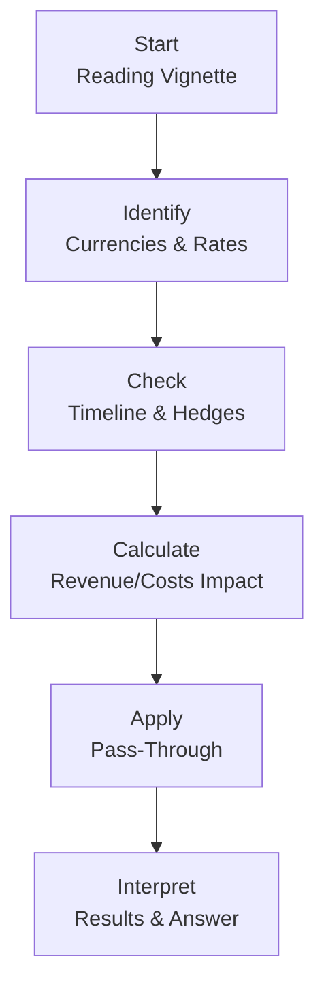
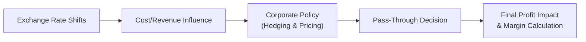

## Overview and Context

Let’s be honest: foreign exchange (FX) shifts sometimes feel like they come out of nowhere. One day, the euro is strong against the dollar, and you’re celebrating better margins on your European exports. The next day, a sudden shift in macro sentiment triggers currency volatility that’s, well, anything but fun. And that’s when CFOs and corporate treasury folks start losing sleep. Because reconciling these FX shifts with corporate strategy, pricing, and cost structures can get complicated really fast.

Welcome to one of the trickiest areas in CFA Level II: item set questions that involve multiple currencies, changing exchange rates, and corporate decisions that rely on properly interpreting both quantitative formulas and strategic trade-offs. In this section, we’ll dissect how to approach such scenarios systematically. If you’ve ever panicked during a currency crisis in your practice vignettes (believe me, I have!), here’s the game plan for how to tackle them calmly on exam day.

## Understanding the Vignette Structure

Most CFA Level II item sets present a short narrative, sometimes from the perspective of a financial analyst within a multinational firm. You’ll see:

• Multiple currency denominations (e.g., USD, EUR, JPY).  
• Transaction details: sales denominated in one currency, costs in another, hedges on a forward contract that expires on a certain date (and maybe not quite the date you expected!).  
• A discussion about strategic decisions like product pricing, marketing budgets, or operational expansions.  
• Possibly some ambiguous or extraneous data. (Yes, the dreaded “red herring” is real.)  

Your first step? Stay calm. Read the entire vignette carefully and outline the critical data points: currency pairs (spot vs. forward), the timeline of when contracts settle, the strategic goals (are they trying to maintain market share? Increase margins?), and any mention of whether pass-through of exchange rate changes is partial or full.

### Common Pitfalls

It’s super easy to miss a detail like the forward rate expiration date or to flip inflows and outflows. Trust me, I’ve done it. Another classic error is ignoring that part of the scenario text that clarifies “Only 60% of the cost increase can be passed along to the consumer.” That’s a partial pass-through scenario, and it changes your bottom-line calculation drastically.

In short:  
• Don’t forget forward contracts might be locked at a specific rate.  
• Keep track of which side of the transaction is in foreign currency (are you receiving foreign currency or paying in it?).  
• Check if there’s any partial pass-through in pricing adjustments, and to what extent.  
• Always confirm the timeline. If the hedge expires in three months, does the new spot or forward rate apply after that?

## Systematic Dissection Approach

When you see a corporate item set about exchange rates, I think of it like a puzzle:

1. Identify the Relevant Currencies: Write them down. You might have USD, EUR, or maybe three or four at once.  
2. Note the Spot and Forward Rates: For exam calculations, carefully label them, e.g., S(USD/EUR) = 1.20, F(USD/EUR, 3-month) = 1.22, etc.  
3. Verify the Timeline: When do the transactions occur? Is the forward contract locked in for the date of the sale? In real life, yes, but the exam might slip in a detail about partial coverage or a mismatch in timing.  
4. Calculate Potential Changes to Revenue or Costs: If your revenue is in a foreign currency, a stronger home currency might reduce your repatriated revenue. If your costs are in a foreign currency but that currency depreciates, your costs might go down.  
5. Check for Hedging or Transfer Pricing Implications: Are they using forward contracts or internal transfer prices that fix an intercompany exchange rate, thereby mitigating some or all of the FX fluctuations?  
6. Look for Pass-Through: If the firm can’t fully pass on costs to consumers, you must note the partial portion that can be translated into higher prices.  
7. Eliminate Red Herrings: If there’s data that doesn’t tie directly to the final question, you can disregard it. For instance, a random commentary about the Swiss franc might not be relevant if the scenario only deals with euro exposures.  

### Example Flow Diagram

Below is a simple Mermaid diagram illustrating a quick mental process for analyzing an FX shift item set:

It’s a rough sketch, but that’s roughly how your thought process might flow on exam day.

## Step-by-Step Guidance for Currency Impact Calculations

### 1. Label All Currency Units Clearly
Say you have JPY-based production costs and USD-based sales. I know it’s a bit of a mouthful, but keep them separate in your notes. One strategy is to set up a mini-table:

| Item           | Currency  | Value    | Rate Applied  |
| -------------- | --------- | -------- | ------------- |
| Production Cost| JPY       | 80,000   | Spot or Fwd?  |
| Sales Price    | USD       | 1,000    | Spot or Fwd?  |
| Hedge Rate     |           |         | 110 JPY/USD (3-month forward) |

### 2. Verify Timing and Hedge Expiration
If your contract to buy raw materials in JPY is locked in at a forward rate of 110 JPY/USD, but your forward contract only covers half the purchase because you anticipated partial exposure, be sure to break the cost into two portions:

• Costs hedged at the forward rate.  
• Costs subject to the new spot rate if the currency moves.  

### 3. Pass-Through of Currency Changes
Here’s the real trick. Let’s say your production cost in JPY rose by 10% because the USD is weaker. If you can only pass through 50% of that cost increase to your U.S. customers, the other 50% hits your profit margin. So your new price might be:

(Original Price) + (50% of the Cost Increase in USD Terms)

So if your cost in USD terms rose by, say, $100, you only add $50 to your final sale price. This partial pass-through can drastically affect margin calculations.

### 4. Transfer Pricing Considerations
Now, if you’re dealing with an internal subsidiary, the “price” at which the subsidiary sells goods to the parent might be fixed by internal policy or adjusted monthly. That’s known as transfer pricing. If your item set mentions a fixed internal transfer rate (e.g., costs are set at a corporate standard of 105 JPY/USD regardless of what’s happening in the market), that changes the scenario entirely— your operational or reported profits might differ from what an unhedged approach would yield.

### 5. Apply the Correct Exchange Rate
Let’s do a super streamlined numeric example:  

• Original spot rate: 100 JPY/USD.  
• New spot rate: 110 JPY/USD (meaning 1 USD buys 110 JPY now, so the USD has appreciated if we see it from the JPY perspective, or the JPY has depreciated).  
• Hedge: 105 JPY/USD for half the cost.  

Assume you import raw materials costing 10,000 JPY total. The cost breakdown might be:

- Half hedged: 5,000 JPY locked at 105 → (5,000 / 105) = ~47.62 USD  
- Half unhedged: 5,000 JPY at 110 → (5,000 / 110) = ~45.45 USD  
- Total cost in USD = 47.62 + 45.45 = 93.07 USD  

If you had no hedge and the entire cost is now at 110 JPY/USD, you’d pay (10,000 / 110) = ~90.91 USD, which is actually a bit cheaper than 93.07 USD because of how we locked in part of the cost at a less favorable 105 JPY/USD.  
Oops, maybe that forward contract cost you a bit extra. Lesson: always check your arithmetic carefully, because sometimes a hedge can help or hurt depending on rate movements.

## Tying It All to Corporate Strategies

Take a step back and think about how these currency shifts might feed into corporate strategy:

- A firm might raise prices in foreign markets if the local currency has depreciated, partially or fully passing on the cost.  
- Sometimes, a brand’s positioning might not allow for easy price hikes— especially if the brand is known for being cost-competitive.  
- Overhead costs in a foreign currency might be relevant if the corporate HQ is paying staff in a different region.  

On the Level II exam, you’ll see these aspects combined in one sweet (or maybe not-so-sweet) scenario. The item set might question you on both the numeric outcome and the strategic rationale behind partial vs. full pass-through. They might toss in a reference to a competitor’s pricing or mention a new brand strategy. You’ll need to parse out what matters from what doesn’t.

## Identifying and Avoiding Red Herrings

Nothing is more frustrating than finishing your calculations, feeling confident, and then realizing you used some data that wasn’t relevant. That’s a classic red herring. For example, the vignette might mention labor costs in Canadian dollars, but if all sales and production in question revolve around USD and JPY, that CAD detail might just be fluff. Don’t let it throw you off.  

The best approach is to systematically ask: “Does this piece of information affect my revenue or cost formula or the exchange rate I apply?” If not, ignore it.

## Putting It All Together: A Mini-Case

Let’s imagine a brief scenario:

Apples & Beyond Inc. is a U.S.-based multinational that manufactures orchard equipment in the U.S. but sells heavily in Europe. The item set states:

- 60% of sales revenue is invoiced in EUR.  
- The remaining 40% is domestic (USD).  
- Production costs are 70% in USD and 30% in imported steel from Japan, invoiced in JPY.  
- They have a 3-month forward contract covering only 60% of their expected JPY purchases, at a locked rate of 108 JPY/USD.  
- The brand wants to maintain its price in Europe to expand market share (so minimal pass-through).  

Then the scenario says the EUR recently weakened from 1.20 USD/EUR to 1.15 USD/EUR. Meanwhile, JPY moved from 105 JPY/USD to 110 JPY/USD. The item set might ask you to calculate the net impact on the firm’s budgeted profit margin, considering partial coverage from the forward contract, the final pass-through approach (which might be zero pass-through to preserve market share in Europe), and whether overhead labor costs in the U.S. are unaffected by exchange rates.

### Potential Pitfalls

- You might forget the forward coverage ratio for JPY and apply 108 JPY/USD to all your JPY purchases.  
- Or you might misread the item set and treat the weakening EUR as if it’s strengthening.  
- Maybe 1.20 USD/EUR to 1.15 USD/EUR confuses you because it’s always tricky to keep track of which currency is strengthening or weakening relative to the other.  

When in doubt, ask yourself: how many USD per EUR? If that number decreases from 1.20 to 1.15, the EUR purchases fewer USD, indicating EUR is weaker.  

## Best Practices and Exam Tips

• Keep a consistent base currency perspective when analyzing the exchange rate for each transaction. If your home currency is USD, express everything in USD for final consistency.  
• Mark each question carefully to see if they want the answer in foreign currency or home currency.  
• Double-check the timeline for each hedge or forward: do they mention partial coverage or part of the time horizon unhedged?  
• For partial pass-through, read the text: Are you passing along 30%, 50%, or maybe 100% of the increased cost?  
• Watch for tricky references: a mention of a competitor’s price advantage might give you a clue that you cannot fully pass along the cost.  

### A Quick Mermaid Diagram: Reconciling FX Shifts with Policies

## Additional Tools and Considerations

- Average Rates: Sometimes, item sets use an average rate for the financial statements if the question references consolidated income statements. If you see that, be sure to apply it where relevant.  
- Transfer Pricing Nuances: Some vignettes examine whether an internal sales transfer price is fixed or adjusted regularly. This can drastically change reported segment profitability.  
- Weighted Exchange Rates: If your item set mentions various forward contracts at different rates or different settlement dates, you might need to do a weighted average to reflect total exposure.  
- Qualitative Factors: The brand’s market positioning might be a deciding factor in how much pass-through is feasible. Even if the numeric result suggests a big cost inflation, the brand might prefer stable pricing to maintain customer relationships. The exam might ask a conceptual question like, “Which corporate strategy best aligns with the partial pass-through approach to preserve brand loyalty?”

## Practical Example with Partial Pass-Through

Let me share a snippet of a scenario I once saw. A friend joked that it was “just a random corporate cameo,” but to me it was prime exam practice:

You have a U.S. firm selling consumer electronics in Europe at EUR 500 each, with production costs of USD 450 per unit. Suddenly, the euro weakens from 1.22 USD/EUR to 1.15 USD/EUR. The product margin is about:

- Original revenue in USD: 500 EUR × 1.22 = 610 USD  
- Original margin: $610 – $450 = $160 per unit  

New revenue in USD (if no price change in EUR): 500 EUR × 1.15 = 575 USD. Now margin is $125 per unit. Ouch. If the company tries partial pass-through by raising the product’s euro price to offset half the margin loss, they might set the new price at EUR 515. Then revenue is EUR 515 × 1.15 = ~592.25 USD. The margin is $142.25. It’s a partial fix but they still lose some margin to remain competitive.

## References and Further Reading

• CFA Institute Topic Tests in Currency Risk Management for real item set practice.  
• Official CFA Institute Mock Exams often feature multi-currency corporate item sets.  
• Kaplan Schweser and Wiley online question banks have examples that mirror these complexities.  
• Chapters 2–3 in this volume for deeper currency market mechanics and forward rate calculations.

## Final Exam Tips

1. Time Management: Skim the vignette once, note the key data. Then handle any calculations line by line.  
2. Keep Currencies Straight: Label everything. Avoid the dreaded “I forgot which currency is the base.”  
3. Watch for Partial Coverage: Many exam scenarios require you to split hedged vs. unhedged portions.  
4. Re-read the Question: Are they asking the final margin or how much margin changed relative to the original forecast? Don’t answer the wrong question.  
5. Cross-check Reasonability: If the currency appreciates, is your cost or revenue going up or down? Does that make sense logically?

Below is a short concluding table summarizing major DOs and DON’Ts for item set calculations:

| **DOs**                                            | **DON’Ts**                                     |
| -------------------------------------------------- | ---------------------------------------------- |
| Carefully read each detail on forward contracts.   | Confuse base currency vs. price currency.      |
| Label inflows and outflows clearly.                | Assume 100% pass-through without confirmation. |
| Apply the correct rate for hedged vs. unhedged.    | Neglect the time when hedges expire.           |
| Factor in partial pass-through if stated.          | Use all data blindly; some might be red herrings.  |
| Interpret strategic implications after calculations.| Forget to re-check the question’s requirements.|

---

## Test Your Knowledge: FX Shifts, Policies, and Item Sets



### Sample Question 1

A multinational reports foreign sales in GBP while incurring most costs in USD. The spot exchange rate is 1.25 USD/GBP. If GBP weakens to 1.20 USD/GBP, which of the following best describes the effect on reported USD revenue (assuming no change in GBP sales price)?

- [ ] USD revenue remains unchanged.  
- [ ] USD revenue increases because you can exchange GBP for more USD.  
- [x] USD revenue decreases because GBP buys fewer USD now.  
- [ ] There is no direct relationship between GBP/USD and the company’s revenue.  

> **Explanation:** If the GBP weakens against the USD, each pound is worth fewer dollars, so reported revenue in USD terms decreases.

### Sample Question 2

A German exporter has 80% of costs in EUR and sells predominantly to U.S. customers in USD with prices fixed in USD. It can only pass through 40% of any increase in costs. If the euro strengthens (assume no hedges), what happens to margins?

- [x] Margins likely narrow since the firm’s base currency costs rise and only 40% of them can be passed to prices.  
- [ ] Margins likely expand because the firm can fully recover the cost increase.  
- [ ] Margins remain unchanged because pass-through doesn’t matter.  
- [ ] Margins unpredictably shift due to red herrings.  

> **Explanation:** Strengthening EUR means higher cost in EUR, which cannot be fully offset in USD pricing.

### Sample Question 3

A U.S.-based manufacturing firm covers 50% of its raw material costs using a forward contract at 105 JPY/USD, while the rest is subject to the spot rate. If the new spot rate for JPY/USD is 110, and the raw materials are denominated in JPY, which statement is most accurate?

- [ ] The total cost in USD is now lower than if the entire amount was hedged at 105.  
- [x] Part of the costs will be fixed at 105, and the remainder will convert at 110, potentially resulting in a blended rate.  
- [ ] The hedge automatically adjusts to the new spot rate.  
- [ ] The cost to buy raw materials is unaffected by exchange rates.  

> **Explanation:** Only 50% is hedged at 105. The other half is at 110, creating a blended effective rate.

### Sample Question 4

An item set indicates the company’s forward contract expires in 3 months, while the invoice payment is due in 4 months. Spot and forward rates are provided. What is a common pitfall?

- [ ] Mixing gross and net revenue.  
- [ ] Converting inflows mistakenly as outflows.  
- [x] Automatically assuming the forward covers the entire invoice without considering the timing mismatch.  
- [ ] Treating the local currency as the base.  

> **Explanation:** A typical error is forgetting that if the invoice is due after the forward contract maturity, the firm may be exposed to the new spot rate for the remaining period.

### Sample Question 5

Which of the following is a “red herring” in a typical FX scenario?

- [ ] A secondary currency not involved in the transaction.  
- [x] Random references to a currency not relevant to the firm’s main exposures.  
- [ ] Mention of partial pass-through in the question.  
- [ ] Forward rate data for the currency in question.  

> **Explanation:** Extra detail about a currency not used in the final transaction is a classic red herring.

### Sample Question 6

If a vignette mentions a competitor’s strong market share and brand loyalty, how might that affect an FX pass-through analysis?

- [ ] Irrelevant. Competitor strategies rarely affect pass-through.  
- [x] The company may be less able to pass on cost increases without losing market share.  
- [ ] It means the firm will definitely fully hedge its currency exposures.  
- [ ] It means the competitor sets prices in the firm’s home currency.  

> **Explanation:** Strong competition can limit a firm’s ability to adjust pricing, implying partial or nil pass-through.

### Sample Question 7

An item set states that 70% of the firm’s raw materials are hedged “at cost,” meaning the internal corporate rate for that portion is effectively fixed. Which statement is correct?

- [x] Only the unhedged 30% will be exposed to spot rate fluctuations.  
- [ ] All raw materials become free from currency risk at the corporate level.  
- [ ] Hedging “at cost” means the entire cost basis is set to zero.  
- [ ] The firm must recalculate the entire cost base using the new spot.  

> **Explanation:** If 70% is hedged, then 30% remains subject to changes in the spot rate.

### Sample Question 8

If the spot rate changes from 1.30 USD/EUR to 1.25 USD/EUR, what can we say about the direction of the currency movement?

- [ ] The USD has weakened against the EUR.  
- [ ] The EUR has strengthened against the USD.  
- [x] The EUR has weakened against the USD (each euro buys fewer USD).  
- [ ] The EUR is unaffected by the spot market changes.  

> **Explanation:** A lower USD/EUR quote means fewer dollars per euro, so the euro is weaker relative to the dollar.

### Sample Question 9

Which of the following best represents partial pass-through in a question scenario?

- [ ] The entire cost increase is charged to customers.  
- [ ] No cost increase is passed on.  
- [x] A percentage (e.g., 50%) of the higher costs is priced into the final good.  
- [ ] Margins remain identical regardless of exchange rate movements.  

> **Explanation:** Partial pass-through means only some fraction of the cost change is reflected in the final price.

### Sample Question 10

True or False: When analyzing item set data about corporate policies and FX shifts, verifying the timeline for hedges is unnecessary because forward contracts always match the operational cycle.

- [ ] True  
- [x] False  

> **Explanation:** You must always verify whether the hedge matches the operational timeline. If the hedge expires earlier or later than the payment date, a mismatch arises.



---

**References**  
• CFA Institute: Official Curriculum and Topic Tests.  
• CFA Institute: Mock Exams for Level II – Currency Risk Application.  
• Kaplan Schweser & Wiley: Practice Question Banks with Multi-Currency Corporate Vignettes.  
• “Forward Contracts in Corporate Finance,” Journal of International Economics, for real-world insights on partial hedging strategies.  

Good luck dissecting your next item set—remember to breathe, label every currency, and watch for those partial pass-through details. Sometimes, the smallest detail can make all the difference in your final solution. Have fun, and keep boosting that confidence for exam day!
