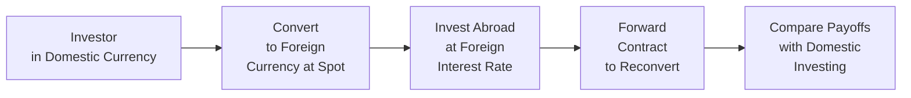

## Introduction

Well, if you've been following along since our earlier discussions of Covered and Uncovered Interest Rate Parity (CIRP and UIRP, respectively), you might be thinking, “So, interest rate differentials and exchange rate movements line up nicely, right?” In an idealized world—where there are no transaction costs, no capital controls, and no cross-border risk premium—yes, they do. But let’s be honest: The real world loves to throw wrenches into the simplest of economic relationships. In the context of interest rate parity, those wrenches come in the form of bid–ask spreads, capital controls, country risk premiums, and more. Understanding these added complexities makes you, as a CFA® Level II candidate, far better at analyzing currency markets, identifying arbitrage (or near-arbitrage) opportunities, and managing global portfolios.

Below, we’ll revisit the standard interest rate parity setups, then expand those frameworks to account for real-world frictions that cause observed exchange rates to deviate (sometimes persistently) from their theoretical values. We’ll also check out Forward Rate Parity (FRP), illustrating how it links with UIRP under certain assumptions and how it can fail if those assumptions aren’t met.

## Revisiting Covered and Uncovered IRP

Before looking at all these added wrinkles, let's do a quick recap of CIRP and UIRP from earlier chapters (see Chapter 3: “International Parity Conditions in Action” for a deeper foundation).

Covered Interest Rate Parity (CIRP) suggests:


F_{DC/FC} = S_{DC/FC} \times \frac{1 + i_{DC}}{1 + i_{FC}}


where:  
• \\(F_{DC/FC}\\) = forward exchange rate (domestic currency per foreign currency)  
• \\(S_{DC/FC}\\) = spot exchange rate (domestic currency per foreign currency)  
• \\(i_{DC}\\) = domestic interest rate  
• \\(i_{FC}\\) = foreign interest rate  

CIRP implies a “covered” strategy where you convert domestic currency to foreign currency, invest at the foreign interest rate, and simultaneously lock in a forward rate to convert the proceeds back to domestic currency upon maturity. In frictionless markets, the returns on investing domestically (at the domestic interest rate) and this covered foreign-currency strategy should be equal. If not, there would be an arbitrage opportunity.

Uncovered Interest Rate Parity (UIRP) says that the expected change in the spot exchange rate should match the interest rate differential:


E[S_{t+1}] = S_t \times \frac{1 + i_{DC}}{1 + i_{FC}}.


Unlike CIRP, this one’s “uncovered” because you don’t use a forward contract to lock in the exchange rate. Instead, you rely on expectations about future spot rates. In theory, UIRP also closes off arbitrage in an efficient world, but it’s more prone to violations because expectations aren’t always correct, and risk aversion can lead to persistent, systematic risk premiums.

## Real-World Frictions: Transaction Costs, Capital Controls, and Risk Premiums

In the real world, you know, it’s never quite so clean. Small frictions can blow the ideal equations out of the water. Let’s delve into three main distortions:

### Transaction Costs

Bid–ask spreads, brokerage fees, and bank commissions can significantly shrink or eliminate arbitrage profits. You might find in practice that the forward rate implied by CIRP differs from the actually quoted forward rate, simply because you pay a cost to complete the trades required for covered interest arbitrage.

• Even a 0.1% difference can matter. If you’re measuring returns on a large notional amount (say, $10 million), that tiny cost might wipe out your theoretical arbitrage gain.  
• Over time, as technology improves and currency markets become more liquid, some of these transaction costs decrease. But in less-traded currency pairs, or in times of market stress, those costs can soar, causing big deviations from the neat formula in covered interest parity.

### Capital Controls

Some governments restrict the amount of capital entering or leaving their borders. Common forms of capital controls include:  
• Direct limits on currency exchange.  
• Required approvals for foreign investors.  
• Ceiling or floor constraints on interest rates for non-residents.  

These controls introduce what effectively becomes a separate “price” for foreign capital. In other words, if you can’t move money freely, you might have to pay an extra premium to get around those controls, or you might be forced to invest in certain local instruments that yield less or more than the market rate. This distortion can generate persistent deviations from both CIRP and UIRP.

### Country Risk Premiums

Even if there are no official capital controls, differences in political stability, economic fundamentals, and default risk lead to what we call a country risk premium. You might recall a scenario where two countries have almost identical nominal interest rates, but the one with a shakier political environment will end up with a higher required yield to attract global investors.

That extra “markup” is called the risk premium. If you look at some emergent markets with good growth prospects but uncertain political climates, you often see large deviations from interest rate parity, partly attributable to the extra compensation required by foreign investors.

## Forward Rate Parity (FRP) and Theoretical Conditions

Forward Rate Parity (FRP) is closely intertwined with UIRP. The big idea? If forward contracts are priced without arbitrage and investors are risk-neutral, the forward rate should be the unbiased predictor of the future spot rate. Formally:


F_{t, t+1} = E[S_{t+1}].


But does the forward rate truly predict the future spot? Well, not always. Behavioral factors, risk aversion, and the presence of risk premiums mean that forward exchange rates contain not just “pure” expectations of future spot rates, but also any additional yield required to bear currency exposure. If you read some academic research on the forward premium puzzle, you’ll find that forward rates can systematically deviate from realized future spot rates, which some interpret as evidence that risk premiums are non-trivial.

In a frictionless market with no risk aversion, it’s easy to connect FRP and UIRP:


S_{t+1} \approx F_{t, t+1} = S_t \times \frac{(1 + i_{DC})}{(1 + i_{FC})}.


But real financial markets do not always show that perfect predictive accuracy, especially for short horizons or during crisis periods when participants become extremely risk-averse.

## Extended IRP Formulas: Adding Risk Premiums and Frictions

Now, let’s get a bit more technical. Suppose there’s a risk premium, \\(\phi\\), required for investing in foreign currency assets. This could reflect default risk, political hazard, or any factor that might spook investors away from a “simple” uncovered currency investment. You might see an adjusted relation:


F_{DC/FC} = S_{DC/FC} \times \frac{1 + i_{DC}}{1 + i_{FC}} \times (1 + \phi).


In a more continuous setting, you might see exponential forms \\(\exp(\phi)\\) in place of \\((1 + \phi)\\), depending on how the risk factor is modeled. The point is that the presence of \\(\phi\\) can widen or narrow the difference between forward and spot rates well beyond what the base interest rate differentials would suggest.

Similarly, if there’s a cost \\(c\\) associated with capital movements, we can reflect that in an IRP formula as another multiplicative factor. Whether \\(c\\) is a tax, a repatriation restriction, or a required deposit with the central bank, it effectively raises the cost of completing the round-trip arbitrage. That might look like:


F_{DC/FC} = S_{DC/FC}
\times \frac{1 + i_{DC} - c_{DC}}{1 + i_{FC} - c_{FC}}.


Here, \\(c_{DC}\\) and \\(c_{FC}\\) represent frictional costs in each respective market. These adjustments help show you how far the real-world forward rate can deviate from the simple formula without necessarily creating a true arbitrage window.

## Visual Overview

Below is a simple diagram that illustrates how an investor might approach covered interest arbitrage, incorporating frictional factors:



In a frictionless scenario, the net returns in E should match the domestic equilibrium. However, transaction costs, capital controls, and risk premiums effectively shape each arrow in the diagram, changing the final payoff in E.

## Step-by-Step Example: Adjusting for Country Risk

Consider two countries, Home (H) and Foreign (F). We observe the following data:

• Spot rate \\(S_{H/F} = 1.5000\\) H per 1 F  
• Home annual interest rate \\(i_H = 5\%\\)  
• Foreign annual interest rate \\(i_F = 2\%\\)  
• Unadjusted forward rate from CIRP = \\(1.5000 \times \frac{1.05}{1.02} \approx 1.5441\\) H per F  
• Additional country risk premium \\(\phi = 1\%\\) (i.e., 0.01) for investing in the foreign currency  
• Time to maturity = 1 year  

If the foreign country requires an extra 1% yield to compensate for risk, the extended forward rate might be:


F_{H/F} = 1.5441 \times (1 + 0.01) = 1.5441 \times 1.01 \approx 1.5595.


In item-set format, you might see a table with data points on interest rates, expected inflation, or political risk factors. The question might ask you to compute the forward rate with risk premium and see how it compares with a no-risk scenario. If the market-quoted forward rate is more or less than 1.5595, that might suggest an opportunity—though not necessarily a straightforward one if the risk premium is uncertain or if other costs exist.

## Practical Vignette Guidance

In Chapter 10, you’ll see full-length vignettes where multiple aspects of IRP interplay: partial coverage of currency exposure, a suspiciously high bid–offer spread, or a capital-control environment that restricts the repatriation of profits. Here’s what to keep in mind:

• Carefully scan the data. Are there hidden transaction fees or deposit requirements?  
• Question whether the forward rate is truly “fair” or if it’s priced with an obvious risk premium.  
• If capital movement is restricted, watch out for illusions of arbitrage that vanish once you factor in the cost of compliance or cross-border taxes.  

A typical exam item might give you two or three potential forward rates. One might align with the standard CIRP formula, another might factor in a stated risk premium, and a third might incorporate frictional costs. You’ll have to figure out which forward rate would be the “equilibrium” and assess whether there’s any net gain from a covered or uncovered position.

## A Brief Python Illustration

If you’d like a quick way to calculate a forward rate with interest rate differentials, here’s a small code block you could run for practice:

```python
def forward_rate(spot, i_domestic, i_foreign, t=1.0, risk_premium=0.0):
    """
    Compute forward rate based on standard IRP with an optional risk premium.
    t is the time in years, i_domestic and i_foreign are decimal rates.
    risk_premium is also in decimal form, representing incremental yield above the interest differential.
    """
    # Basic CIP-based forward
    cip_forward = spot * ((1 + i_domestic)**t / (1 + i_foreign)**t)
    
    # Incorporate risk premium
    # For simplicity, assume a linear factor: (1 + risk_premium)
    fr_adjusted = cip_forward * (1 + risk_premium)
    return fr_adjusted

spot_rate = 1.50
i_dc = 0.05    # 5%
i_fc = 0.02    # 2%
rp = 0.01      # 1%
fwd = forward_rate(spot_rate, i_dc, i_fc, 1, rp)
print(f"Calculated forward rate with risk premium is: {fwd:.4f}")
```

If you run this snippet, you’ll see how easy it is to tweak interest rates, add in a risk premium, and observe the effect on the implied forward rate.

## Conclusion and Exam Tips

Anyway, in practice, you’ll rarely encounter a “pure” IRP scenario. Transaction costs, capital controls, and country risk are critical real-world considerations that can significantly distort the textbook relationships you learned in earlier studies. For the exam:

• Expect questions where you must adjust the simple CIRP or UIRP formula for frictional elements.  
• Pay attention to the details—especially how transaction fees or taxes might reduce the net payoff.  
• Don’t assume that the quoted forward rate is always the “no-arbitrage” rate; look for clues about risk premiums.  
• If you see capital controls in the vignette, watch out for partial or incomplete arbitrage. The question may hinge on whether you can fully repatriate profits or not.  

As you work through the next chapters and the item sets, remember: The instincts you developed solving standard interest rate parity problems still apply, but you need that extra watchfulness for real-world constraints.

## References

• Levich, R. M. (2011). “Chapter 5: Interest Rate Parity.” In International Financial Markets: Prices and Policies.  
• Obstfeld, M., & Rogoff, K. (1996). Foundations of International Macroeconomics. MIT Press.  
• Research articles on SSRN discussing recent empirical tests of CIRP: [http://www.ssrn.com/](http://www.ssrn.com/)  

## Test Your Knowledge: Extended Interest Rate Parity Concepts



### A currency investor notices that the forward rate implied by Covered Interest Rate Parity (CIRP) is significantly different from the market-quoted forward rate. Which of the following factors is LEAST likely to explain this discrepancy?

- [ ] Transaction costs imposed by brokers.  
- [ ] Sovereign risk differing between the two countries.  
- [x] Frequent spot and forward price quotes from multiple dealers.  
- [ ] Capital controls restricting currency conversions.  

> **Explanation:** Multiple dealers quoting spot and forward prices more frequently generally reduces discrepancies due to increased market efficiency. Transaction costs, sovereign risk, and capital controls are all factors that can increase deviations from the theoretical forward rate.

### A country imposes a regulation requiring foreign investors to hold a minimum reserve in local currency, generating a fixed expense. How does this requirement most likely affect the forward rate predicted by CIRP?

- [ ] Reduces the domestic interest rate in the formula.  
- [ ] Eliminates any arbitrage opportunities entirely.  
- [x] Introduces a frictional cost that could cause persistent deviations from the no-arbitrage forward.  
- [ ] Enhances the accuracy of traditional CIRP.  

> **Explanation:** A required reserve for foreign investors acts as a frictional cost, making the theoretical no-arbitrage forward differ from the actual market forward. It does not necessarily eliminate arbitrage altogether, but it makes it more difficult to pursue.

### When adding a country risk premium to a standard uncovered interest rate parity formula, which of the following modifications is most appropriate?

- [ ] Subtract the premium from the domestic interest rate.  
- [ ] Increase the foreign interest rate by the premium.  
- [x] Multiply the interest rate differential by (1 + risk premium).  
- [ ] Add the premium to the forward rate only if capital flows are unrestricted.  

> **Explanation:** The idea is that a risk premium increases the required yield for foreign investments, so a common approach is to scale the interest rate differential by a factor of (1 + risk premium).

### In an exam vignette, you see that the quoted forward rate is exactly equal to the spot rate multiplied by (1 + i_domestic)/(1 + i_foreign). However, there is an explicit mention of a 0.5% transaction cost for cross-border trades. Which is the best interpretation?

- [ ] The market is perfectly efficient.  
- [ ] Investors ignorantly fail to cover their currency exposure.  
- [ ] The transaction cost will increase volatility but won’t affect parity.  
- [x] An apparent arbitrage gain might vanish once the 0.5% cost is factored in.  

> **Explanation:** The presence of transaction costs means that even if the forward rate looks equal to the theoretical CIRP rate, any attempt to implement covered interest arbitrage would incur a 0.5% cost, likely eliminating the profit opportunity.

### A forward contract is quoted at a rate higher than that predicted by CIRP for the domestic currency. Which scenario would be MOST consistent with this observation?

- [ ] Demand for the domestic currency is lower than the foreign currency.  
- [ ] The domestic interest rate is lower than originally stated.  
- [x] There's an added risk premium for investors holding the domestic currency.  
- [ ] Domestic authorities lifted capital controls.  

> **Explanation:** When the forward contract is higher than the CIRP-implied rate, it suggests there’s something elevating the “cost” of obtaining the domestic currency in the future, such as a risk premium that benefits or protects foreign investors.

### One key difference between CIRP and UIRP is that:

- [ ] UIRP involves buying forward contracts to hedge exchange rate risk.  
- [x] CIRP uses forward contracts, while UIRP relies on expected spot rates.  
- [ ] CIRP can only hold if investors are risk-neutral.  
- [ ] UIRP is guaranteed to hold in all market conditions.  

> **Explanation:** CIRP is “covered” by a forward contract. UIRP is “uncovered,” meaning no forward hedge is used, and the investor bears exchange rate risk.

### According to Forward Rate Parity (FRP), under risk-neutral conditions:

- [ ] The forward rate is always higher than the spot rate.  
- [ ] The future spot rate must equal the currency risk premium.  
- [x] The forward rate is the unbiased expectation of the future spot rate.  
- [ ] The covered and uncovered interest rate parity no longer applies.  

> **Explanation:** FRP states that the forward rate is an unbiased predictor of the future spot rate in a risk-neutral world, tying it closely to uncovered interest parity concepts.

### A domestic investor tries to exploit a forward market mispricing but finds that brokerage fees on currency trades are unexpectedly high. What is the most likely outcome?

- [ ] The arbitrage remains profitable because currency markets are highly liquid.  
- [ ] The investor finds an even greater profit margin.  
- [ ] The broker waives transaction costs for large traders.  
- [x] The investor’s potential gain is reduced or eliminated due to costs.  

> **Explanation:** High brokerage fees reduce or negate the arbitrage opportunity by eating into the spread between domestic and foreign returns.

### Which of the following would most likely create a scenario where capital controls induce a different local interest rate for foreign investors compared to domestic investors?

- [ ] A floating exchange rate regime with no policy interference.  
- [ ] A pegged exchange rate system that the central bank perfectly defends.  
- [ ] Complete free flow of capital in and out of the country.  
- [x] Regulations preventing foreigners from converting local currency freely.  

> **Explanation:** Restricting foreign investors’ ability to convert currency or repatriate capital often necessitates offering them a rate that compensates for illiquidity or higher risk. Thus, foreign investors might face a higher or lower effective interest rate than domestic investors.

### True or False: Forward Rate Parity always holds in practice because forward contracts fully incorporate all known information about future spot rates.

- [x] True  
- [ ] False  

> **Explanation:** From a strict theoretical standpoint and under risk-neutral conditions, FRP states that the forward rate is the best unbiased forecast of the future spot rate. However, in real markets, risk premiums and behavioral aspects often cause persistent deviations from FRP.


