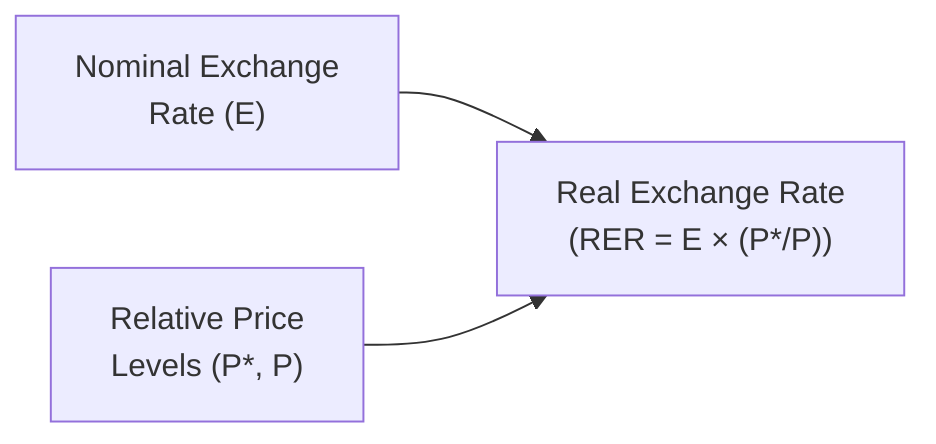

## Introduction

So, let me tell you a quick story. I was traveling abroad for the first time—let’s call it a few years back, fresh out of college. I was thrilled to see that my home currency exchanged for quite a lot of the local currency. “Wow,” I thought, “everything is going to be so cheap!” But then came the embarrassing moment: after buying some stuff at the local market, I realized that prices for basic items like groceries were actually not as cheap as the raw “exchange rate” made me think. Why was that? Well, I learned the hard way that what I was looking at was the nominal exchange rate—an incomplete picture because it doesn’t factor in how prices (inflation levels) differ across countries. The real story, as many budding economists quickly discover, hinges on the real exchange rate.

Below, we’ll dig deeper into how we measure real exchange rates, why they matter for a country’s trade competitiveness, and how different economic factors can push them around over the long haul. We’ll also explore some typical challenges in building real exchange rate indices and provide application-based vignettes that reflect typical exam and real-world scenarios. If you occasionally pause to say, “Um, so how does that concept apply to real-world trade deals?”—that is totally normal. The real exchange rate is a cornerstone concept for interpreting a country’s external competitiveness over time.

## Nominal vs. Real Exchange Rates

### Nominal Exchange Rate

The nominal exchange rate is simply the quoted market price—how many units of one currency you need to buy one unit of another. For instance, if you see that one US dollar (USD) trades for 1.35 Canadian dollars (CAD), that’s your nominal USD/CAD exchange rate, or 1.35 CAD per 1 USD. It’s what you see posted on financial websites or currency exchange kiosks. But this nominal rate doesn’t look under the hood at what’s happening with relative inflation or price levels.

### Real Exchange Rate

The real exchange rate, on the other hand, tries to capture how many units of a foreign basket of goods and services you can buy for one domestic basket, factoring in inflation or price-level changes in each country. Mathematically, you might say:


\text{Real Exchange Rate} = E \times \frac{P^*}{P},


where  
• \\( E \\) is the nominal exchange rate (often expressed in units of local currency per 1 unit of foreign currency),  
• \\( P^* \\) is the price level abroad, and  
• \\( P \\) is the price level at home.

If the real exchange rate is rising, it implies that foreign goods and services are becoming relatively cheaper for domestic residents—or that the domestic currency’s purchasing power is going up relative to foreign goods. Conversely, if it’s falling, foreign goods become relatively more expensive. So, from an economic competitiveness perspective, an appreciating real exchange rate can indicate that exports could start losing an edge, while a depreciating real exchange rate might boost export competitiveness (but can weigh on your ability to import cheaply).

Here’s a quick visual representation of how the real exchange rate factors in nominal rates and relative price levels:



## Why the Real Exchange Rate Matters

From the perspective of a CFA® Level II candidate (and, frankly, any economist, policy maker, or multinational CFO), the real exchange rate can be a powerful gauge. It helps answer questions like: Are we losing competitiveness in global markets? Are our exports pricing themselves out of demand? Are foreign products suddenly too attractive, causing domestic businesses to struggle?

• Investment Decisions: Multinationals watch real exchange rates to decide where to build factories or source inputs.  
• Portfolio Management: Currency-hedged returns often depend on real exchange rate shifts.  
• Policy Analysis: Central banks and finance ministries monitor real exchange rates when they decide on interest rates, interventions, or capital controls.

So, while the nominal exchange rate might grab headlines, the real exchange rate is the subtle “truth teller” for cross-border competitiveness over the medium to long run.

## Key Determinants of the Real Exchange Rate

### Productivity Differentials (Balassa-Samuelson Effect)

Economists Balassa and Samuelson popularized the notion that countries with higher productivity growth, especially in the tradable goods sector, will see their real exchange rates appreciate over time. The logic is:

• Rapid productivity gains typically mean rising wages in the tradable sector without an equivalent rise in costs.  
• Higher wages seep into the non-tradable sector too (people spend their higher income on domestic services).  
• The overall price level for goods and services at home can increase faster than abroad.  
• Hence, you get an appreciation of the real exchange rate.

This might initially sound contradictory if you think that higher productivity should mean cheaper exports. But the key is that wages across the board move up, lifting prices in sectors that are not export-competing. Over the long run, the real exchange rate ends up appreciating.

### Terms of Trade Dynamics

Terms of trade (ToT) measure the price of a country’s exports relative to its imports. Formally,  

\text{ToT} = \frac{\text{Export Price Index}}{\text{Import Price Index}}.


If a country experiences a favorable shift in its terms of trade—say, a rise in the price of its major export commodities relative to its imports—it gains purchasing power internationally. This can manifest as an appreciation of the real exchange rate because the country can afford more imports for every unit of export it sells. Conversely, a decline in terms of trade can pressure the real exchange rate downward.

You might see this dynamic in resource-rich countries: when commodity prices surge, their currencies often strengthen in real terms. However, if the commodity busts, the real exchange rate may tumble as export revenues fall.

### Trade Barriers

Tariffs, quotas, and other frictions can artificially affect the real exchange rate. If a country erects high tariffs, for instance, it might temporarily protect domestic producers from import competition, potentially boosting domestic prices relative to world prices. That could lead to an overvalued real exchange rate. However, the long-run effects can be complicated: a sustained mismatch between the nominal exchange rate and the underlying competitive fundamentals can ultimately correct through inflation or changes in the nominal rate.

### Non-Tradeable Goods Prices

Another sneaky factor: non-tradable goods (like haircuts, local transportation, many domestic services). Because they’re predominantly consumed within the country and aren’t typically subject to global competition, their prices can be out of sync with global prices. Changes in wages or input costs in non-traded sectors can cause the domestic price level to shift. If the non-traded sector’s prices balloon relative to those abroad, the real exchange rate can appreciate—making it more expensive in real terms for foreigners to buy domestic goods and services overall.

## Measurement Challenges

### Choice of Price Index

One pressing question when constructing a real exchange rate index is: which price measure do we use? Common candidates include:

• Consumer Price Index (CPI),  
• Producer Price Index (PPI),  
• GDP deflator,  
• Unit labor costs.

Each has pros and cons. CPI covers a broad basket of consumer goods, but might include more non-traded items than is ideal. PPI focuses on prices at the factory gate, which can better reflect external competitiveness but excludes many consumer services. The GDP deflator is more comprehensive, but it’s usually released less frequently. Meanwhile, unit labor costs capture labor-related productivity changes but may omit other cost components. The choice depends on your analytical objective—there’s no universal “best” measure.

### Data Frequency and Consistency

It’s possible that country A reports inflation data monthly while country B does so quarterly. Or each country’s inflation measure has definitional quirks. Factor in occasional major revisions to inflation data, and you realize that building a consistent real exchange rate index across multiple countries can be quite the homework assignment. For exam purposes, understanding the trade-offs and sources of data inconsistency is vital.

### Statistical Filters and Seasonality

Even when you gather consistent data, you may want to apply filters (like the Hodrick-Prescott filter) or seasonal adjustments to isolate longer-term trends. But each filter or smoothing technique might create new artifacts in the data. In advanced settings, economists build sophisticated time-series models to track underlying real exchange rate trends. On the exam, though, you’re more likely asked about the conceptual pitfalls or how changes in the underlying data might distort standard measures.

## Real-World Vignettes

Let’s bridge the concept to practice with two short scenarios that highlight the interplay between nominal and real exchange rates.

### Vignette 1: The Surprising Productivity Boost

Imagine Country X sees a major leap in manufacturing productivity thanks to adopting cutting-edge robotics. In theory, you’d expect goods from Country X to become cheaper in global markets—so maybe you expect the nominal exchange rate to adjust downward as foreign investors pile into the country’s newly competitive manufacturing sector. But at the same time, wages for these high-skilled robotics engineers surge, pulling up wages across the board as everything from local restaurants to real estate sees higher demand. Domestic prices, especially for services, increase. Despite the nominal exchange rate drifting slightly lower, the real exchange rate can remain stable or even appreciate because the higher domestic price level (fueled by wage growth) offsets any nominal exchange rate movements.

### Vignette 2: Commodity Boom in Resource-Rich Nation

Country Y is a big oil exporter. Global crude prices skyrocket. Almost overnight, Country Y sees more money flow in from exports, improving its terms of trade. Foreign and local investors push up demand for Country Y’s currency, appreciating its nominal exchange rate. At the same time, local retailers might raise prices on imported goods since domestic demand is booming. The result? A strong appreciation in the real exchange rate. That can later hamper industries outside of the resource sector because their goods become more expensive relative to global competitors—a phenomenon sometimes referred to as “Dutch Disease.”

## Small Demonstration Using Python

Below is a simple snippet showing how you might calculate and compare real exchange rates given different inflation (price) data, purely to give a sense of how you’d implement a quick model in practice. (In an exam context, obviously, you won’t bust out Python, but understanding logic behind the calculations is key.) 

```python
# plus monthly CPI data for both domestic and foreign countries.

import pandas as pd

data = {
    'Nominal_Exchange_Rate': [1.30, 1.32, 1.29, 1.31],
    'CPI_Domestic': [100.0, 102.0, 102.5, 103.0],
    'CPI_Foreign': [98.0, 98.2, 98.0, 97.5]
}

df = pd.DataFrame(data)

# RER = E * (Price_foreign / Price_domestic)

df['Real_Exchange_Rate'] = df['Nominal_Exchange_Rate'] * (df['CPI_Foreign'] / df['CPI_Domestic'])

print(df)
```

You’d then be able to see how changes in nominal rates and price levels shape the real exchange rate over time.

## Best Practices and Pitfalls

• Always check if an exchange rate quote is direct or indirect (i.e., domestic currency per foreign currency vs. foreign currency per domestic currency). Mislabeling can throw off your entire real exchange calculation.  
• When analyzing the impact of real exchange rate changes on trade, watch for time lags. Real trade flows don’t adjust overnight; they respond to persistent changes.  
• Avoid oversimplifying. Changes in real exchange rates stem from multiple drivers—productivity, global commodity swings, monetary policy, you name it.  
• Watch out for policy distortions. Large-scale government interventions (such as pegged exchange rates or capital controls) can cause short-term divergences between measured real exchange rates and fundamental competitiveness.

## Glossary

• Nominal Exchange Rate: The observed exchange rate quoted in the market, not adjusted for inflation differentials.  
• Real Exchange Rate: The nominal rate adjusted for relative price levels; a measure of a currency’s purchasing power to buy foreign goods relative to domestic goods.  
• Balassa-Samuelson Effect: The principle that higher productivity growth, especially in tradable sectors, leads to real exchange rate appreciation over time.  
• Terms of Trade: The ratio of export prices to import prices, indicating how many imports a country can afford per unit of exports.  
• Non-Tradeable Goods: Goods and services not typically exchanged internationally (due to transport costs, cultural factors, or regulations).  
• Purchasing Power: The quantity or value of goods/services that a currency can buy.

## References and Further Reading

• Krugman, P., & Obstfeld, M. (2021). International Economics: Theory and Policy (12th ed.). Pearson.  
• Rogoff, K. (1996). “The Purchasing Power Parity Puzzle,” Journal of Economic Literature, 34(2), pp. 647–668.

---

## Exam Tips

• Clarify the currency quote format: On exams, item sets often provide the nominal exchange rate in either “domestic currency per foreign unit” or “foreign currency per domestic unit.” Make sure you’re consistent when applying the real exchange rate formula.  
• Use the appropriate price index: If the vignette references CPI or PPI, align your formula accordingly.  
• Watch time frames: Sometimes short-term data can be noisy or misrepresent the trend in real exchange rates.  
• Link it to parity conditions: Real exchange rate analysis often intersects with purchasing power parity (PPP). Show how deviations from PPP can persist for extended periods.  
• Manage your time: Real exchange rate questions can be loaded with data. Practice reading quickly but accurately, focusing on the key variables (nominal exchange rate, domestic price index, foreign price index).  

Remember that you may have to integrate monetary policy, inflation forecasts, or trade policy changes into your interpretation of real exchange rates—this broader perspective is what Level II demands in the item set format.

## Test Your Knowledge: Real Exchange Rate Challenges



### Which statement best describes the real exchange rate?

- [ ] It is solely determined by the nominal exchange rate.  
- [ ] It is determined by the nominal exchange rate but excludes relative price levels.  
- [x] It is the nominal exchange rate adjusted by the ratio of foreign to domestic prices.  
- [ ] It only measures how currency values shift in the short run.

> **Explanation:** The real exchange rate explicitly factors in relative prices, reflecting how many units of foreign goods (adjusted for foreign inflation) can be exchanged for one unit of domestic goods (adjusted for domestic inflation).


### A country that experiences a significant productivity boom in its tradable sector is likely to see which effect over time, according to the Balassa-Samuelson hypothesis?

- [ ] A long-term depreciation of its real exchange rate  
- [x] A long-term appreciation of its real exchange rate  
- [ ] A neutral effect on its real exchange rate  
- [ ] A short-term depreciation followed by a neutral trend

> **Explanation:** The Balassa-Samuelson effect indicates that higher productivity in tradable sectors raises overall domestic wages, pushing up the price level and appreciating the real exchange rate in the long run.


### A country with rising commodity export prices relative to its import prices experiences:

- [ ] A decline in its terms of trade and a likely real depreciation  
- [ ] A decline in its terms of trade and a likely real appreciation  
- [x] An improvement in its terms of trade and a likely real appreciation  
- [ ] No effect on either the terms of trade or the real exchange rate

> **Explanation:** When export prices rise faster than import prices, a country's terms of trade improve, often strengthening (appreciating) its real exchange rate.


### Which index is least likely to be directly used for calculating an overall real exchange rate?

- [ ] Consumer Price Index (CPI)  
- [ ] Producer Price Index (PPI)  
- [ ] GDP deflator  
- [x] Unemployment rate

> **Explanation:** The real exchange rate is adjusted by price levels, not measures of labor market conditions. CPI, PPI, or the GDP deflator are all viable price indices.


### If a government imposes a high tariff on imports, it might:

- [x] Distort the real exchange rate by raising domestic prices of certain goods  
- [ ] Reduce the real exchange rate volatility by lowering trade flows  
- [ ] Eliminate any possibility of real exchange rate appreciation  
- [ ] Have no impact because real exchange rates are determined only by market forces

> **Explanation:** Tariffs can drive up domestic prices of imported goods, potentially causing an overvaluation or distortion of the real exchange rate.


### The “Dutch Disease” phenomenon is sometimes associated with:

- [ ] A decline in local currency demand when commodity prices rise  
- [x] A real exchange rate appreciation that hurts non-resource export sectors  
- [ ] A forced real exchange rate depreciation in response to productivity  
- [ ] Rising trade barriers and falling foreign direct investment

> **Explanation:** “Dutch Disease” arises when a booming resource sector inflates the real exchange rate, making other exports less competitive internationally.


### When building a real exchange rate index, a key challenge is:

- [x] Choosing which price index (CPI, PPI, deflator) to use  
- [ ] Not having enough nominal exchange rate data  
- [ ] Lack of any recognized formulas or methodology in the literature  
- [ ] Global synchronization of inflation data on a weekly basis

> **Explanation:** One major difficulty is deciding which price measure best reflects the relative cost structure for competitive analysis.


### Which of the following best characterizes non-tradable goods in explaining real exchange rate movements?

- [x] Price movements in non-tradable goods can drive the domestic price level, leading to real exchange rate shifts  
- [ ] Non-tradable goods do not affect the real exchange rate in any way  
- [ ] Non-tradable goods are always priced at global market levels  
- [ ] Non-tradable goods’ prices adjust to inflation abroad primarily

> **Explanation:** Since non-tradable goods are consumed domestically, their prices are not directly exposed to international competition, which can affect the overall price level and thus the real exchange rate.


### A real exchange rate appreciation generally implies:

- [ ] A fall in domestic prices relative to foreign prices  
- [ ] Fewer units of foreign goods per one unit of domestic goods  
- [ ] Higher affordability of the domestic basket for foreign consumers  
- [x] Domestic goods become more expensive compared to foreign goods

> **Explanation:** An appreciation in the real exchange rate makes the home country’s goods relatively more expensive compared to foreign goods, often reducing export competitiveness.


### True or False: The nominal exchange rate between two currencies can move in the opposite direction from their real exchange rate if inflation differentials are significant.

- [x] True  
- [ ] False  

> **Explanation:** Differences in inflation rates can mean that even if the nominal exchange rate moves in one direction, the real exchange rate can move in another, reflecting changes in the price level differentials between the two countries.


