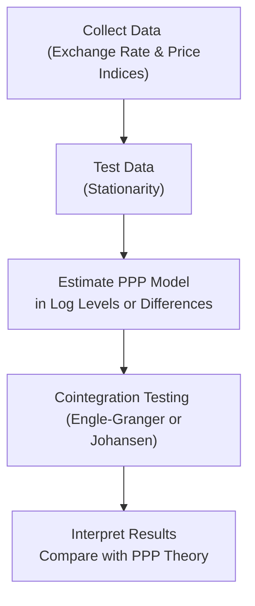

Introduction  
Purchasing Power Parity (PPP) is one of those concepts that can sound pretty straightforward—until you try proving it with real data. I remember the first time I tried to test PPP myself. I gathered exchange rates for a couple of countries, pulled inflation data, did some quick regressions, and expected a neat one-to-one relationship. Yep, things didn’t look so neat. The lines on my chart seemed to have a mind of their own, ignoring the idea that relative prices should eventually, maybe, converge. If you’ve had a similar experience, don’t sweat it—empirical testing of PPP is famously tricky.

In any case, this section is here to help. We’ll begin by recapping the theory—Absolute PPP and Relative PPP—and then dig into the reasons you might not see perfect PPP in real data. Next, we’ll look at some of the main regression and cointegration approaches used to test this relationship, like Engle-Granger and Johansen. We’ll also talk about unit root tests (like ADF) that can detect whether exchange rates or price differentials actually revert to a theoretical mean. Along the way, we’ll highlight best practices, common pitfalls, and show you examples that are relevant for the CFA® Level II exam. So, let’s jump in and see how we can put PPP to the test in real-world scenarios.

Recap of Purchasing Power Parity  
Purchasing Power Parity is the idea that the same basket of goods costs the same across countries once you account for exchange rates (Absolute PPP) or that exchange-rate movements over time should offset inflation differences (Relative PPP). From a conceptual standpoint:

• Absolute PPP: If a loaf of bread costs USD 2 in the U.S. and EUR 2 in the Eurozone, then under absolute PPP, the USD/EUR exchange rate should be 1:1 to equalize bread prices across borders.  
• Relative PPP: Exchange-rate changes should reflect differences in inflation. If Country A experiences 5% inflation while Country B experiences 2% inflation, the exchange rate between them should adjust by approximately 3% in favor of Country B’s currency (the lower inflation country).

In theory, Relative PPP is more commonly used in practical (and exam) settings because it’s about proportionate changes, not absolute price levels. But that doesn’t mean it’s easy to verify—especially once we incorporate real-life complications like transportation costs, tariffs, non-tradable components, or sticky prices.

Empirical Challenges in Testing PPP  
While PPP might make sense in a textbook, it faces serious hurdles in the real world. Here are some big ones:

• Short-Run Deviations: Let’s say there’s a surge in oil prices in one country. Even if you expect the exchange rate to adjust, it often doesn’t happen overnight. In the short run, transportation costs, tariffs, perishable goods, or brand loyalties can keep prices from converging exactly.  
• Non-Stationarity of Exchange Rates: Many exchange-rate series contain “unit roots,” meaning they wander randomly (or near-randomly) without a stable long-run mean. Traditional regression methods generally assume stationarity, so ignoring this can create confusing or misleading results.  
• Structural Breaks: Policy changes (e.g., a peg, capital controls), regime shifts, or major economic crises can produce sudden changes in how exchange rates behave. If you test a 30-year span of data without accounting for a big event—like a central bank intervention or the adoption of a currency union—you risk spurious findings.  

These challenges add complexity to any analysis testing whether exchange rates truly revert to levels implied by inflation differentials.

Methodologies for Empirical PPP Testing  
Researchers and practitioners typically use a few key methods to see if PPP holds:

• Engle-Granger Cointegration Approach: A two-step method where you (1) regress the dependent variable—often the nominal exchange rate—on the relative price ratio, and (2) test the residual for stationarity (e.g., using an Augmented Dickey-Fuller test). If the residual is stationary, there’s evidence of a stable long-run relationship consistent with PPP.  
• Johansen Cointegration Technique: A multivariate method that can simultaneously test for cointegration among multiple variables (e.g., exchange rate, domestic price index, foreign price index). This approach often yields richer insights because it estimates how many cointegrating relationships exist (in case you’re dealing with multiple countries or multiple price indices).  
• Panel Data Approaches: Instead of focusing on just one currency pair, you pool data across numerous countries over time. This can increase statistical power, helping you detect if there’s a general PPP pattern or if certain regions systematically deviate.  
• Unit Root and Stationarity Tests (ADF, Phillips-Perron, and KPSS): These tests identify whether the real exchange rate (or the nominal rate and price differentials) has a stable long-run path. For PPP to hold, the real exchange rate should be mean-reverting over the long term—implying stationarity when properly modeled.

Step-by-Step Guide to a Typical PPP Regression  
While there’s no single “one-size-fits-all” approach, a typical testing process might look something like this:

1. Collect Data  
   You need time series for:  
   – Nominal Exchange Rate (Spot) between two countries  
   – Price Indices (often CPI) for each country  
   Aim for a sufficiently long sample to capture multiple business cycles and potential mean reversion.

2. Test for Stationarity  
   Check if your variables—especially the real exchange rate or the log difference of exchange rates—are stationary or not. If a variable has a unit root, you should difference it or consider cointegration analysis if it’s non-stationary but potentially linked to other non-stationary variables.  
   A typical test is the Augmented Dickey-Fuller (ADF). The null hypothesis is usually “variable has a unit root.” If you reject the null, the series is stationary (i.e., no unit root).

3. Model Specification  
   – You might set up a regression of the form:  
     ln(E_t) = α + β × [ln(P_dom) – ln(P_for)] + ε_t  
     where E_t is the spot exchange rate, P_dom is the domestic price level, and P_for is the foreign price level.  
   – Under strict PPP, you might expect β = 1.  

4. Interpret Coefficients  
   If β = 1, that’s supportive of PPP. But in practice, you might see estimates of 0.7 or 1.2, or something else. Interpret any significant deviations carefully. Even estimate signs might differ in the short run.  

5. Evaluate Cointegration  
   If ln(E_t) and ln(P_dom) – ln(P_for) are both non-stationary, but their linear combination is stationary, it suggests a meaningful long-run relationship. A classic test would be Engle-Granger in a two-variable scenario. If your data is more complex, Johansen’s approach might be better.  

Here’s a simple flowchart highlighting this empirical process:



Real Data Examples and Case Studies  
Let’s say you’ve got data from 2010 to 2025 on the USD/EUR exchange rate plus the U.S. and Eurozone consumer price indices. You decide to see if a 1% price difference systematically shows up as a 1% exchange rate shift. After running your regression, you might find that the coefficient is around 0.9, with a p-value that suggests significance. That’s fairly close to 1, so you could read it as moderate support of PPP—but maybe not perfectly. Then you notice that when you split the sample at year 2015 (coinciding with some major QE programs in the Eurozone), the coefficient before 2015 might be closer to 1, and after 2015 it’s 0.6. This is a classic sign of a structural break.

In emerging markets, or in places with high transaction costs and capital controls, results can be even further off from PPP. Sometimes, you’ll see persistent deviations that last for years before they (maybe) slowly, or partially, correct.

Python Example for a Simple ADF Test  
Below is a tiny snippet showing how you might test for stationarity in Python using the Augmented Dickey-Fuller test. Don’t worry if you’re not a Python user—this is just a demonstration of how these tests get implemented in practice. But hey, if you can code, it’s handy for fast data checking.

```python
import pandas as pd
import numpy as np
from statsmodels.tsa.stattools import adfuller

# and 'real_exchange_rate' is created as exchange_rate * (cpi_foreign / cpi_domestic)

df['real_exchange_rate'] = df['exchange_rate'] * (df['cpi_foreign'] / df['cpi_domestic'])

df.dropna(inplace=True)

adf_result = adfuller(np.log(df['real_exchange_rate']))
print("ADF Statistic: %f" % adf_result[0])
print("p-value: %f" % adf_result[1])
```

You’d interpret the p-value. If it’s low (e.g., below 0.05), you can reject the null hypothesis of a unit root, implying stationarity of your (log) real exchange rate. And if it’s stationary, that’s a big hint that PPP might hold in some form or there could be other mean-reverting dynamics at play.

Best Practices and Common Pitfalls  
• Include Sufficient Data: PPP is a long-run concept. Try to gather plenty of data points spanning multiple economic cycles.  
• Check for Regime Shifts: If a country moves from a fixed to a floating exchange rate or experiences major policy shifts, break your sample to see if the relationship changes.  
• Don’t Overfit: A big temptation is to load up your model with extra variables to “improve” the regression. Evaluate whether those additions make sense theoretically.  
• Look Out for Simultaneity: Price levels and exchange rates can influence each other. Sometimes, methods like Vector Error Correction Models (VECM) can handle these feedback loops better than single-equation ordinary least squares (OLS).  
• Avoid Confirmation Bias: If you “believe” strongly in PPP, you might interpret borderline regression outcomes as supportive. A statistical or out-of-sample forecast approach is more objective.

Practical Exam Tips  
• Understanding Stationarity: The exam can easily throw you a small item set with partial test results from an ADF or Johansen test. Be sure you know how to interpret these results for PPP.  
• Identifying PPP vs. Non-PPP: Watch for key numeric clues, such as the inflation differential or regression coefficients near 1.0. If they show a big departure (like 2.5), it often signals the question wants you to highlight short-run frictions or a structural break.  
• Incorporate Real World Observations: Don’t forget that PPP typically doesn’t hold perfectly in the short run anywhere. The exam might test your understanding of how to explain or rationalize short-run deviations.  
• Time Management: It’s easy to get bogged down in some complicated math. On the Level II exam, focus on the conceptual framework: Are we testing cointegration? Are we controlling for inflation differentials? Which test indicates stationarity or unit roots?

Glossary  
• Absolute PPP: Same basket of goods should cost the same internationally when measured in a single currency.  
• Relative PPP: Exchange-rate movements offset inflation differentials.  
• Cointegration: Long-run equilibrium relationship among variables that are individually non-stationary.  
• Engle-Granger Test: A two-step procedure for detecting cointegration between non-stationary series in a single-equation framework.  
• Johansen Technique: A multivariate approach for testing cointegration among multiple series.  
• Stationarity/Unit Root: Stationary series fluctuate around a constant mean, while a unit-root process can wander over time without mean reversion.  
• ADF Test (Augmented Dickey-Fuller): Checks for the presence of a unit root in a time series.  
• Panel Data: Combining cross-sectional data (e.g., multiple countries) with time-series data.

References and Further Reading  
• Frankel, J., & Rose, A. (1996). “A Panel Project on Purchasing Power Parity: Mean Reversion Within and Between Countries,” Journal of International Economics.  
• Taylor, A. M., & Taylor, M. P. (2004). “The Purchasing Power Parity Debate,” Journal of Economic Perspectives.

Below is a quick set of sample exam questions to help solidify your understanding of PPP testing. Give them a try, watch out for typical pitfalls, and remember that real exchange rates can be as unpredictable as your friend’s behavior on the weekend.

## Test Your Knowledge: Empirical PPP Analysis



### Which of the following best defines Relative PPP?
- [x] The idea that the rate of change in the exchange rate should equal the inflation differential.
- [ ] The idea that the exchange rate remains constant if trade barriers are removed.
- [ ] The idea that a finite basket of goods always costs more in the country with the lower money supply.
- [ ] The idea that absolute price levels never converge without governmental intervention.

> **Explanation:** Relative PPP states that the exchange rate movement is driven by the difference in inflation between two economies.

### One common reason short-run PPP may fail is:
- [x] Product markets can be sticky due to transportation costs or trade barriers.
- [ ] The commodity basket is always homogeneous across countries.
- [ ] Central banks never intervene in the currency market.
- [ ] There are no transaction costs in foreign exchange markets.

> **Explanation:** Product market frictions such as transportation costs, tariffs, and other barriers can lead to short-run deviations from PPP.

### When running a standard OLS regression to test PPP, how do we deal with a potential unit root?
- [x] Perform stationarity checks (e.g., ADF tests) on time series and possibly use cointegration methods.
- [ ] Ignore it because a unit root is unlikely to appear in exchange rate data.
- [ ] Use correlation coefficients alone to establish stationarity.
- [ ] Convert the series to a single log level and proceed without any tests.

> **Explanation:** Detecting unit roots is crucial. If the data is non-stationary, cointegration methods like Engle-Granger or Johansen are commonly employed.

### Which statement about Engle-Granger cointegration testing is correct?
- [x] It involves estimating a long-run relationship, then testing the residual for stationarity.
- [ ] It is used only for stationary variables.
- [ ] It replaces regression with large-scale simulations.
- [ ] It cannot be used for long-run relationships.

> **Explanation:** Engle-Granger is a two-step procedure: regress non-stationary variables, then apply a stationarity test (often an ADF) on the residual.

### A Johansen test is particularly useful when:
- [x] Examining multiple potentially cointegrated relationships among non-stationary variables.
- [ ] The data is already stationary and you only have two variables.
- [ ] You only need a unidirectional test of stationarity.
- [ ] You want to use correlation-based tests with fewer than three variables.

> **Explanation:** The Johansen technique is a multivariate approach and can handle more complex systems than Engle-Granger’s two-step procedure.

### What does a statistically significant β ≈ 1 in a PPP regression generally suggest?
- [x] Over the long run, exchange-rate changes align closely with inflation differentials.
- [ ] There is no relationship between exchange rates and inflation.
- [ ] The real exchange rate is permanently fixed.
- [ ] PPP always holds perfectly in the short run.

> **Explanation:** If β is around 1, that’s consistent with PPP’s proposition that exchange-rate changes mirror inflation differentials over time.

### In emerging markets with capital controls, you would often see:
- [x] Larger and more persistent deviations from PPP.
- [ ] No deviations from PPP due to strict government regulations.
- [ ] Perfect market efficiency and instant exchange-rate adjustments.
- [ ] Zero correlation between inflation and exchange rates.

> **Explanation:** Capital controls and market frictions tend to reduce market efficiency, leading to more persistent PPP deviations.

### A real exchange rate series that is mean-reverting is more indicative of:
- [x] Long-run PPP might hold.
- [ ] There is no cointegration.
- [ ] The nominal exchange rate must be constant.
- [ ] Short-term fluctuations will never occur.

> **Explanation:** If the real exchange rate reverts to a constant mean, that suggests that any deviation from PPP eventually corrects.

### Why are structural breaks important when testing PPP?
- [x] Significant policy changes or crises can alter the underlying relationships, creating distinct regimes.
- [ ] They typically have no impact on regression outcomes.
- [ ] They guarantee that PPP results hold better.
- [ ] They make the data automatically stationary without transformations.

> **Explanation:** Major shifts in monetary or trade policy, economic crises, or regime changes can drastically affect how exchange rates and prices interact, changing the fundamental relationship that underpins PPP.

### True or False: “A panel-data approach can help address limited degrees of freedom when testing PPP among multiple countries.”
- [x] True
- [ ] False

> **Explanation:** Panel-data methods combine cross-sectional and time-series data, increasing the sample size and potentially revealing common patterns across different countries.


