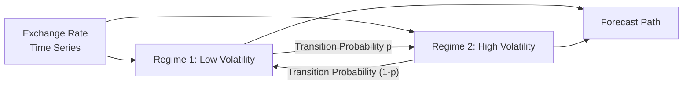

## Introduction
Sometimes, exchange rates can feel like that friend who seems predictable at a glance—only to surprise you with sudden mood swings you never saw coming. If it were purely linear, we’d assume changes follow stable trends or revert gently to fair values. But real currency markets can do dramatic pivots, often due to policy shifts, political upheavals, or threshold triggers. And so, we enter the realm of non-linear models—which, in my humble opinion, are among the most exciting (and challenging) ways to forecast exchange rates.

Non-linear approaches to exchange rate determination recognize that markets can remain calm within a certain band and then abruptly break out when deviations cross a critical threshold or when some exogenous shock shakes investor confidence. This reading explores the common non-linear frameworks—Threshold Autoregressive (TAR), Markov Switching, and Smooth Transition Autoregressive (STAR) models—and how to incorporate them into your exchange rate forecasts. We’ll also look at how these models translate into real-world item sets, plus a few personal suggestions to help you avoid pitfalls like overfitting. Let’s jump in.

## Rationale for Non-Linear Exchange Rate Approaches
A linear model—like a simple autoregressive process—often assumes a uniform relationship throughout the entire sample period. But real currency dynamics can behave more like “on-off” processes, triggered by, say, large PPP misalignments or big announcements from central banks.

• Threshold Effects: Think of it this way—modest deviations from purchasing power parity (PPP) might not spark movement, so the exchange rate meanders near equilibrium. But once that deviation crosses a certain threshold (maybe due to a surprise interest rate hike or a major shift in trade policy), arbitrage or speculation ignites rapid reversion.  
• Switching Models: Monetary policy changes, crises, or capital flow reversals might create abrupt shifts in exchange rate fundamentals. Under these circumstances, the underlying data-generating process can literally switch from one “regime” (e.g., low volatility) to another (e.g., high volatility).  

## Types of Non-Linear Models for Exchange Rate Analysis
Below are some popular non-linear models you’ll see in academic research and, occasionally, in practice. They each tackle regime switching or threshold-based behavior in different ways.

### Threshold Autoregressive (TAR) Models
• What It Is: A TAR model changes its dynamics once the dependent variable crosses a threshold. In exchange rate contexts, the threshold might be an upper or lower band around PPP.  
• How It Works: If the currency’s deviation from PPP is small, the exchange rate might drift slowly. But if it crosses that threshold, reversion accelerates.  
• Why Use It: TAR models can capture situations where the exchange rate remains in a “neutral zone” until a big enough imbalance forces realignment.  

### Markov Switching Models
• What It Is: Markov Switching models assume the process can randomly switch between distinct regimes, such as a “low-volatility regime” and a “high-volatility regime.”  
• How It Works: Each regime has its own parameters (mean, variance, or even different relationships to explanatory variables). The transition from one regime to another follows a Markov chain, wherein transition probabilities depend on the current state.  
• Why Use It: Great for capturing those times when a central bank changes its policy stance or a sudden crisis flips the currency from stable to highly volatile.

A possible illustration of Markov switching is shown below:



### Smooth Transition Autoregressive (STAR) Models
• What It Is: A STAR model features a smooth transition between regimes rather than an instantaneous switch.  
• How It Works: The speed of transition depends on how far the exchange rate has deviated from some threshold. Think of it like a dimmer switch.  
• Why Use It: By allowing partial membership in two regimes, STAR models can capture the idea that currency adjustments might become gradually more intense (rather than all-or-nothing) as misalignment grows.

## Forecasting Challenges
Forecasting exchange rates is tough even with standard linear models. Non-linear models, while often more realistic, can be trickier.

• Managing Regime Changes: It’s oh-so-frustrating when a huge monetary policy announcement, an unexpected election result, or a major trade dispute suddenly shifts everything. You can build the best model in the world, but if you don’t handle these regime shifts, your forecast may be outdated overnight.  
• Data Requirements: Non-linear models can demand large datasets to calibrate thresholds, transition probabilities, and other parameters reliably. Low data availability (common in emerging markets) can weaken model precision.  
• Overfitting: With so many potential parameters—thresholds, transition functions, or regime probabilities—you might be tempted to keep adding complexity to perfectly fit historical data. Don’t forget to do robust out-of-sample testing to ensure the model generalizes and doesn’t just memorize the past.

## Step-by-Step Approach to Building a Non-Linear Forecasting Model
Below is a structured process that might help you implement these ideas more systematically.

### Step 1: Identify Potential Structural Breaks or Regime Changes
Examine your historical exchange rate time series (and relevant macro data) for big, abrupt shifts—say a new central bank governor, a capital flow lockdown, or a major currency peg change. Techniques like the Quandt-Andrews or Bai-Perron tests can help detect breakpoints.

### Step 2: Choose a Non-Linear Specification
Decide if a TAR, Markov Switching, or STAR model suits your data. For instance, if you suspect that the exchange rate’s reversion to equilibrium is only “activated” when deviations exceed a band, TAR might be your friend. If you suspect multiple states with abrupt jumps, consider Markov Switching. If changes are more gradual, maybe STAR does the job.

### Step 3: Estimate the Model
You can use maximum likelihood estimation (MLE), or sometimes generalized method of moments (GMM), if your model’s structure calls for it. In Markov Switching, you’ll estimate the probability of being in each regime at each point in time, along with the transition probabilities between regimes.

Below is a (very) short and simplified Python snippet showing a conceptual approach to Markov Switching (using a mock library—this is just an illustration, not a fully working code block you can run as-is):

```python
import numpy as np
from statsmodels.tsa.regime_switching.markov_switching import MarkovSwitching

model = MarkovSwitching(endog=exchange_rate, k_regimes=2, switching_variance=True)
results = model.fit()
print(results.summary())

print("Estimated Transition Probabilities:")
print(results.transition_matrix)
```

### Step 4: Validate Forecasts with Out-of-Sample Testing
After fitting, create out-of-sample forecasts—slides of data your model didn’t train on—and compare predictions to actual outcomes. Check if your model’s fancy threshold or regime-switching features really add value compared to a simpler (linear) competitor.

### Step 5: Compare with Simpler Benchmarks
Does the non-linear model significantly outperform a standard AR(1) or random walk? If the complexity isn’t giving you meaningful gains in forecast accuracy, it might not be worth the extra model risk and data overhead.

## Real-World Illustrations for Item Sets
In an exam setting, you might encounter a vignette describing how a currency hovered around a stable value for months until a scandal triggered a legislative threat to the central bank’s independence. Next thing you know, the currency sold off dramatically.

An item set might then show historical observations (e.g., stable returns for the first half, followed by big swings) and ask you to determine whether it suggests a Markov Switching dynamic or a threshold-based reversion. You might have to do calculations on estimated transition probabilities or identify a threshold that was crossed.

• Look Out for Data Patterns: Spot the period of stable alignment, followed by abrupt changes.  
• Assess Probability of a Regime Shift: The item set might provide partial maximum likelihood estimations or transition matrices—be ready to interpret them.  
• Evaluate Forecast Plausibility: They might quiz you on how realistic it is that the currency remains in the new regime vs. reverts quickly, given certain macro triggers.

## Best Practices and Pitfalls
• Don’t Overcomplicate: Non-linear modeling is fun but can easily lead to overfitting. Each new parameter can over-tailor the model to historical noise.  
• Keep an Eye on Economic Logic: If your fancy threshold is at ±0.01% from PPP but you know transaction costs are larger, that’s suspicious. The threshold should make economic sense.  
• Use Proper Diagnostics: Residual plots, out-of-sample R-squared, and forecast accuracy metrics help confirm whether your model is capturing real dynamics or just chasing random patterns.  
• Stay on Top of Data Revisions and Outliers: Non-linear techniques are especially sensitive to big outliers. Make sure your data is consistent.

## Conclusion and Exam Tips
Non-linear modeling can elevate your exchange rate analysis by capturing major shifts that linear models might miss. But you need the right triggers (threshold or regime identification), robust estimation, and a reality check to avoid modeling illusions.

From an exam standpoint:
• If you see a stable exchange rate in a vignette suddenly break loose because of a fundamental shock, suspect a regime switch or threshold effect.  
• Look for data that might illustrate abrupt transitions (Markov Switching) or a “band” around which the currency meanders (TAR).  
• Compare to linear benchmarks. The question may want you to assert if the incremental complexity of STAR/TAR/Markov is justified.  

Ace these tasks, and you’ll be well on your way to crafting better answers (and real-life currency bets).

## Glossary
• Threshold Autoregressive Model (TAR): Model that changes behavior when a series crosses a specific threshold.  
• Markov Switching Model: Allows the underlying process to “switch” between multiple regimes using a Markov chain.  
• Smooth Transition Autoregressive (STAR) Model: Gradual transition between different regimes, governed by a smooth function.  
• Structural Break: A sudden, lasting change in the data-generating process—often from policy shifts or economic shocks.  
• Regime Switching: Periodic changes in model parameters that define different states of behavior in a time series.  
• Overfitting: Overly tailoring a model to historical quirks, harming performance in future predictions.

## References & Further Reading
• Sarno, L., & Taylor, M. (2002). The Economics of Exchange Rates. Cambridge University Press.  
• Hamilton, J. D. (1994). Time Series Analysis. Princeton University Press.  
• For threshold tests: Bai, J., & Perron, P. (1998). Estimating and Testing Linear Models with Multiple Structural Changes. Econometrica.  
• For additional reading on multi-regime approaches and practical examples, see advanced time series lectures from the CFA Institute or specialized finance courses online.

---

## Test Your Knowledge: Non-Linear Exchange Rate Forecasting



### Which of the following best describes the rationale for using a non-linear model in exchange rate analysis?

- [ ] Non-linear models are always more accurate than linear ones in all market conditions.
- [ ] Non-linear models require fewer data points, making them preferable for emerging markets.
- [x] Non-linear models capture sudden shifts or threshold effects that linear models may overlook.
- [ ] Non-linear models eliminate the need for structural break analysis.

> **Explanation:** The main advantage of non-linear models (TAR, Markov Switching, or STAR) is their ability to handle threshold and regime changes more effectively than linear frameworks.

### When does a Threshold Autoregressive (TAR) model typically adjust its behavior?

- [x] Once deviations from equilibrium pass a specified boundary.
- [ ] Whenever inflation data is updated.
- [ ] Only if the central bank changes its policy rate.
- [ ] Only after multiple years of no market volatility.

> **Explanation:** A TAR model triggers different dynamics when a variable (like the exchange rate) crosses a threshold.

### How does a Markov Switching model handle exchange rate regimes?

- [ ] By using a deterministic function to switch between regimes at regular intervals.
- [x] By using transition probabilities that depend on the current regime.
- [ ] By ignoring historical regimes and focusing solely on forward-looking statements.
- [ ] By requiring the user to manually define when to switch.

> **Explanation:** Markov Switching models employ a Markov chain, assigning probabilities to switching between different regimes (e.g., low volatility or high volatility).

### What is the primary warning sign of overfitting in non-linear exchange rate models?

- [x] Perfect in-sample fit but significantly worse out-of-sample performance.
- [ ] Unusual cointegration relationships with interest rates.
- [ ] Consistent improvement against every benchmark model.
- [ ] Negative standard errors in the regression outputs.

> **Explanation:** Overfitting is often flagged by near-perfect historical fit coupled with poor predictive accuracy on new data.

### Which of the following is true about STAR (Smooth Transition Autoregressive) models?

- [ ] They feature abrupt switching between two regimes without overlap.
- [x] They allow for a gradual transition between regimes based on a smooth function.
- [x] They incorporate a transition variable that changes model behavior progressively.
- [ ] They can only be estimated using OLS on single-regime data.

> **Explanation:** STAR models shift between regimes gradually, reflecting partial membership in more than one state, typically governed by a logistic or exponential transition function.

### Which step is essential after estimating a non-linear exchange rate model?

- [x] Conducting out-of-sample validation to compare forecast performance.
- [ ] Immediately deploying it into live currency trading without testing.
- [ ] Ignoring any mention of regime probabilities.
- [ ] Eliminating the possibility of a simpler linear competitor.

> **Explanation:** Robust out-of-sample testing is crucial to confirm that non-linear complexity adds value.

### Which of the following might indicate a structural break in exchange rate data?

- [x] A sudden, lasting change in the slope or variance related to a policy shift.
- [ ] A small blip that was corrected the next day.
- [x] The introduction of capital controls that alter market structure.
- [ ] Consistent linear trends observed over decades.

> **Explanation:** Structural breaks often coincide with major events (policy changes, crises) that alter the data’s underlying process in a meaningful, lasting way.

### What is a critical prerequisite for successful non-linear modeling?

- [x] Having enough historical data to reliably estimate thresholds and regime probabilities.
- [ ] Access to proprietary high-frequency crypto market data.
- [ ] Guarantee that the exchange rate is stable under all conditions.
- [ ] Knowing the final result of a future central bank meeting.

> **Explanation:** Non-linear methods are more parameter-heavy. Sufficient, relevant historical data is essential to produce reliable estimates.

### In an exam vignette describing a stable exchange rate until a policy crisis triggers abrupt swings, which model might be most relevant?

- [x] A Markov Switching model capturing shifts between low- and high-volatility regimes.
- [ ] A linear AR(1) model ignoring big exogenous shocks.
- [ ] An OLS regression with time-invariant parameters.
- [ ] A purely deterministic function requiring no randomness.

> **Explanation:** Abrupt transitions from stability to high volatility are classic signals for Markov Switching or other regime-based models.

### For a CFA candidate, is it true that using a non-linear model always guarantees better forecasts than a linear model?

- [x] True
- [ ] False

> **Explanation:** This is a trick question! The statement as phrased is false. Non-linear models can be powerful, but they do not automatically guarantee superior performance. They can be prone to overfitting, require more data, and may only outperform linear counterparts when exchange rate processes genuinely exhibit threshold or regime-switching behavior.


