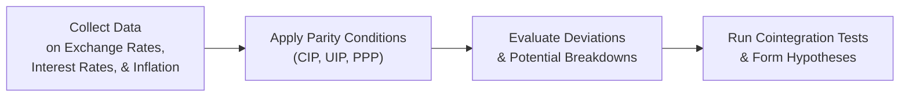

## Introduction and Context

I remember the first time I actually tried to apply uncovered interest rate parity (UIP) on real-world data. I was diving into historical interest rates from the Bank of England and matching them to spot and forward exchange rates from an emerging market that, well, let's just say had a slightly “rocky” monetary history. Honestly, I was pretty nervous—would the data even come close to matching the theory? Turns out, surprise, it didn’t. But that’s the whole point, right? Checking parity in the real world can highlight structural breaks (like capital controls), anomalies (like heavy central bank intervention), and those times when the data simply do not behave as the textbooks suggest.

In this section, we’ll walk through several item-set style exercises designed to test your understanding of advanced parity conditions, including covered and uncovered interest rate parity, purchasing power parity (PPP), real exchange rates, and even fun stuff like real exchange rate cointegration. We’ll also explore potential curveballs such as partial capital controls, dual exchange rate systems, or seasonal tourism patterns that can throw parity conditions for a loop.

## Core Concepts Refresh

Let’s refresh a few concepts you’ll need to keep front and center while analyzing these exercises:

Covered Interest Rate Parity (CIP):  
CIP states that the forward exchange rate should offset interest rate differentials between two currencies, so there is no arbitrage in the forward market. Symbolically, we can write:

F_{A/B} = S_{A/B} \times \frac{(1 + i_A)}{(1 + i_B)},

where S is the spot rate (price of currency A in terms of currency B), F is the forward rate, and \\(i_A\\) and \\(i_B\\) are risk-free interest rates of countries A and B over the same maturity. If CIP holds perfectly, you cannot earn a riskless profit from interest rate differentials and forward contracts.

Uncovered Interest Rate Parity (UIP):  
UIP posits that the expected change in the spot exchange rate over an investment horizon should equal the interest rate differential. Unlike CIP, there is no forward cover, so there is an exchange rate risk. Symbolically:

E[S_{A/B}(t+1) ] = S_{A/B}(t) \times \frac{(1 + i_A)}{(1 + i_B)}.

Real-World data often show substantial deviations from UIP, but the concept remains important in analyzing expected exchange rate movements.

Purchasing Power Parity (PPP):  
Under absolute PPP, the price of a homogeneous good should be the same across countries, once converted to a common currency. Relative PPP focuses on inflation differentials driving exchange rate changes. Numerically:

\frac{\text{Exchange Rate at } t+1}{\text{Exchange Rate at } t} \approx \frac{1 + \text{Inflation}_A}{1 + \text{Inflation}_B}.

In practice, we typically look at how much a currency is over- or undervalued relative to its fair value implied by PPP.

Real Exchange Rate and Cointegration:  
The real exchange rate adjusts the nominal rate for price level differences between countries. If the real exchange rate is stationary or exhibits mean reversion, it might come back to a certain equilibrium. A simple measure is:

\text{Real Exchange Rate}_{A/B} = \frac{S_{A/B} \times P_B}{P_A},

where \\(P_A\\) and \\(P_B\\) are price indices (like consumer price indexes) in each country. Testing this over time with cointegration analysis can help evaluate whether, say, inflation differentials and nominal exchange rates move in tandem.

## Diagram: Data Flow and Testing Process

Below is a schematic showing the flow of testing parity conditions on real-world data. This might look a little busy, but it’s actually pretty straightforward. We collect data, apply the conditions, check for anomalies, and refine our explanations.

## Vignette Exercise 1: Post-Crisis Currency with Heavy Intervention

Imagine you’re handed a multi-part item set describing Montoria, a fictional economy that just emerged from a financial crisis. The government pegged its currency to the US dollar for five years. Recently, the peg was lifted, and the Montorian central bank introduced a “dirty float” (read: frequent interventions). The vignette provides:

• Five-year monthly interest rates for the US and Montoria.  
• Monthly spot exchange rates: Montorian pesos (MOP) per USD, from the time the peg was lifted to present.  
• A forward rate table for MOP/USD for maturities from 1 to 6 months.  
• Montoria’s published inflation rate, which shot up right after the currency was floated.  

You are asked:

- Part A: Check if CIP holds. If not, estimate the magnitude of deviation and discuss possible arbitrage strategies.  
- Part B: Evaluate uncovered parity by comparing actual spot movements to the Montoria-US interest rate differential.  
- Part C: Use the inflation figures to compute a PPP-implied exchange rate, and assess whether the MOP is over- or undervalued.  
- Part D: The real exchange rate is computed for each month. You attempt a cointegration test with inflation data. Based on partial results (given in the vignette), do you believe the Montorian currency is “finding” a fair value?

### Possible Answers and Solutions

• CIP might fail if the Montorian central bank is manipulating forward rates or if there is credit risk in Montoria. CIP is typically a “no-arbitrage” condition, so large deviations might indicate capital controls or intervention.  
• UIP might show significant deviations because local market participants expect the central bank to intervene, thus heavily influencing short-term exchange rate movements.  
• PPP-based Overvaluation/Undervaluation: Often, in post-crisis periods, the currency might be significantly undervalued if the economy just faced a devaluation shock. Alternatively, if inflation is out of control, the nominal exchange rate might not catch up in time, leading to an apparent undervaluation that later corrects.  
• For the real exchange rate path, if everything eventually stabilizes (and if Montoria’s inflation comes down), you might see evidence of cointegration. If the data says no, well, maybe the new regime hasn’t had enough time to settle.

## Vignette Exercise 2: Emerging Market with Dual Exchange Rate System

Now let’s zip over to a second exercise in Brelvia, an emerging market that has both an official exchange rate for “important” imports (like medicine, energy) and a market-based rate for everything else. Suppose you have:

• A table listing Brelvia’s official rate and the parallel market rate.  
• Annual interest rates for Brelvia’s local currency (BRV) and US Treasury notes.  
• A monthly or quarterly time series of exchange rates showing frequent moves in the parallel market, occasionally aligned with the official rate.  
• Brelvia’s consumer price index (CPI) data plus a note that “certain goods are heavily subsidized.”

The questions might ask you to:

– Identify whether covered interest rate parity is meaningful when faced with two exchange rates. Should we use the official rate or the parallel rate for forward quotes?  
– Calculate uncovered parity using the parallel market rate, given that official forward markets might be non-existent or strictly regulated.  
– Evaluate PPP using Brelvia’s inflation for the last two years. But watch out—subsidies might distort published CPI.  
– Perform a real exchange rate analysis. Notice that the real exchange rate, using the official rate, might appear stable, but the parallel rate might reveal significant misalignment.

### Guidance and Hints

• Two exchange rates often mean the CIP formula gets tricky. If the official market doesn’t allow free forward or if there is a large black-market premium, CIP may fail (and so might your arbitrage strategy, if it’s illegal or restricted).  
• Be sure to read the details about how the inflation data is compiled. Government-subsidized goods can make the CPI artificially low.  
• If the parallel rate is what the market “really” uses, you’ll want to base PPP calculations on that. Expect big differences between official and parallel valuations.  
• In the item set, watch for distractors. The exam might insert references to short-run tourism booms or heavy overseas remittances that skew the currency for a season.

## Vignette Exercise 3: Seasonal Tourism and Exchange Rate Fluctuations

Picture a small island economy, Letoria, that relies on tourism in the December–February peak season. The government’s published interest rates remain stable throughout the year, but the Letorian currency (LTN) appreciates in late November and depreciates by late March. The item set includes:

• Quarterly interest rates for Letoria (LTN) and a major trading partner, typically the eurozone.  
• The number of incoming tourists each month.  
• Survey-based inflation indices that spike during tourism season due to higher demand, then moderate.  
• Forward exchange quotes that show a persistent forward discount on the LTN in the off-season, flipping to a small premium during peak months.

Your tasks:

– Decide if the CIP or UIP relationships are consistently violated or if the seasonal pattern is simply baked into forward prices.  
– See if a PPP-based approach suggests that the LTN is systematically undervalued or if the “high-season effect” might distort short-term data.  
– Evaluate if a cointegration approach would skip over or correct for these seasonal artifacts, or if you need a special dummy variable approach to control for tourist season in your econometric analysis.

### Analysis Notes

• Sometimes parity holds on average, but short-term seasonal cycles mislead you. If the question references “annualized” interest rates or forward points, you might have to break them down by the relevant months in the season.  
• In the real world, you may need to supplement the straightforward parity formulas with a seasonal adjustment factor or time-series model.  
• Keep an eye on potential capital flow volatility. High-season tourism means big inflows of foreign currency, which can temporarily push the value of LTN up. Once the season ends, that inflow disappears, reversing the effect.

## Step-by-Step Approach in the Exam Setting

When you spot a question about parity conditions:

– First, isolate the relevant data: interest rates (domestic and foreign), spot rates, forward rates, inflation indices, etc.  
– Confirm the time horizon over which they’re measured. Are you dealing with monthly, quarterly, or annual rates? If so, do you need to convert or annualize them?  
– Carefully apply the formulas. Covered interest parity (CIP) is usually straightforward with the given forward quotes. Uncovered interest parity (UIP) relies on expected future spot rates—so watch for distractors in the vignette about future economic or political events.  
– For PPP, see if they give you any price indices or inflation rates. Possibly you might see a “big Mac” style example. Or you might have to compute implied exchange rates from partial references to price levels.  
– For real exchange rates, check how they define the price indices. Is it CPI, producer price index (PPI), or a GDP deflator? The type can matter.  
– In your calculations, watch out for compounding conventions. If interest rates are quoted per annum but you only have a six-month forward, you’ll need to scale appropriately.  
– If you see major deviations from parity, think about capital controls, default risk, transaction costs, central bank interventions, or some seasonal factor. The exam might test whether you can interpret those specifics.

## Common Pitfalls

• Mixing up spot and forward quotes. If the question says “Indirect quote,” you might need to invert the rate for the formula.  
• Confusing covered with uncovered parity. The presence (or absence) of a forward contract is crucial.  
• Failing to note the annualization mismatch. You see a 3-month interest rate differential but a 12-month forward—uh-oh. You need to unify them.  
• Overlooking structural or seasonal effects that distort what look like big “arbitrage” opportunities but are actually not exploitable, or are explained by higher transaction costs or government regulations.

## Mini Example with Data Rescaling

Let’s do a quick numeric snippet. Suppose:

- Monthly interest rate in Country A is 0.5% (roughly 6% annualized), while in Country B it is 0.3% (3.6% annualized).  
- The spot exchange rate is 100 A-currency per B-currency.  
- The 1-month forward is 99.50 A-currency per B-currency.  

Check CIP:

CIP would require:

F_{A/B} = 100 \times \frac{(1 + 0.005)}{(1 + 0.003)} = 100 \times \frac{1.005}{1.003} = 100.20 \text{ (approximately)}.

But the actual forward is 99.50. The difference (100.20 – 99.50 = 0.70) is well over half a currency unit. Annualized, that might be a big potential arbitrage—unless there’s a reason, like capital controls or default risk, that prevents CIP from holding.

## Tying It All Together

Testing parity in real-world data can feel messy, especially when you see multiple interest rates, partial capital controls, pegged or managed floats, or big seasonal booms. But that’s precisely why you need to keep the core parity logic at the forefront: check CIP first if you have forward quotes, then see if UIP lines up with actual exchange rate moves, and finally gauge PPP or real exchange rates to see if the currency is meaningfully over- or undervalued in the long run.

The item-set format requires you to parse the story, pick the right formulas, and interpret all disclaimers or side notes carefully. Stay calm, take everything step-by-step, and you’ll do great.

## References and Further Reading

• CFA Institute Level II Curriculum, Economics Readings for Parity Conditions in Exchange Rates  
• Academic articles on real exchange rate misalignment in developing markets, available on:  
  https://ideas.repec.org/  

Below you’ll find 10 sample exam-style questions to help you sharpen your skills and apply these concepts under exam-like conditions.

## Test Your Knowledge: Parity Condition Exercises Quiz



### In a post-crisis scenario with heavy central bank intervention, which condition is most likely to show the earliest sign of violation?

- [ ] Purchasing power parity (PPP)  
- [ ] Uncovered interest rate parity (UIP)  
- [x] Covered interest rate parity (CIP)  
- [ ] Real exchange rate stationarity  

> **Explanation:** If the central bank is intervening in the forward market or manipulating interest rates, CIP is typically the first to appear violated because it relies on a forward rate consistent with no-arbitrage.  

### If a currency is pegged and has an artificially low forward rate, what might a candidate conclude regarding CIP-based arbitrage?

- [ ] Arbitrage gains are guaranteed and riskless.  
- [ ] CIP cannot be computed under a peg.  
- [x] Potential arbitrage might exist, but capital controls or credit risk could block it.  
- [ ] The forward rate always equals the spot rate for a pegged currency.  

> **Explanation:** Under a peg, the forward rate might not reflect free-market forces. Even if CIP calculations show a deviation, transaction constraints or legal restrictions frequently keep traders from capitalizing on that deviation.  

### Which factor best explains persistent deviations from PPP in an emerging market with dual exchange rates?

- [ ] Seasonal interest rate changes  
- [ ] Accuracy of official inflation data  
- [x] Government subsidies that distort price indices  
- [ ] A single global clearinghouse for currency transactions  

> **Explanation:** Government subsidies can make official price indices unreliable, resulting in wide PPP deviations. Dual exchange rates create additional complexities.  

### In analyzing uncovered interest rate parity (UIP) across monthly data, which timescale issue can commonly lead to misinterpretation?

- [x] Annualizing short-term interest rates without adjusting the expected future spot rate timeline  
- [ ] Using daily instead of weekly data for spot rates  
- [ ] Relying on forward rates with a matching maturity  
- [ ] Applying inflation data measured on a yearly basis  

> **Explanation:** Often, you see a mismatch in how interest rates are quoted versus how expected exchange rate changes are measured. Annualizing monthly data incorrectly can produce inaccurate UIP conclusions.  

### If the official exchange rate is used to calculate the real exchange rate, but the black market (parallel) rate is substantially higher, what is the likely outcome of the real exchange rate calculation?

- [x] It will show a lower level, implying an artificially strong currency  
- [ ] It will match or exceed the black-market rate  
- [ ] It will incorporate CIP deviations directly  
- [ ] It will inflate the currency’s price level artificially  

> **Explanation:** Official rates can camouflage a currency’s true weakness, thus making the real exchange rate appear stable or even undervalued, whereas parallel rates might reveal a different story.  

### Which macroeconomic factor would most likely explain a classic “tourism effect” that temporarily boosts a currency’s value seasonally?

- [ ] Divergent interest rate policies  
- [ ] Regulatory tightening and strict corporate taxes  
- [ ] Government funding of other countries’ deficits  
- [x] Seasonal inflows of foreign currency from tourists  

> **Explanation:** High tourist seasons bring in foreign currency, creating temporary demand for the local currency that can cause short-term appreciation.  

### During a multi-year sample of exchange rate and inflation data, a cointegration test finds no stable long-run link between the real exchange rate and inflation differentials. What could be a plausible explanation?

- [x] Continuous structural changes, such as frequent policy shifts, that break long-run relationships  
- [ ] The real exchange rate is mean reverting, so cointegration must exist  
- [ ] High interest rates guarantee cointegration  
- [ ] The data are too consistent with PPP to draw conclusions  

> **Explanation:** If a country undergoes multiple structural shifts (pegged to free-floating back to pegged, heavy interventions, capital control changes), standard cointegration tests may fail to find a stable long-run relationship.  

### Under which scenario might uncovered interest rate parity actually perform well empirically?

- [x] When capital is freely mobile, and investors have homogeneous inflation expectations  
- [ ] When there is a dual exchange rate system  
- [ ] When strong capital controls limit cross-border flows  
- [ ] When forward contracts are actively manipulated by the central bank  

> **Explanation:** UIP is more likely to hold if investors can seamlessly move money across borders, and inflation expectations are relatively unified across markets.  

### If data show a persistent 2% differential favoring Country A’s interest rate over Country B’s, yet the spot exchange rate for A’s currency does not depreciate accordingly over multiple periods, which parity view is challenged?

- [ ] Covered interest rate parity  
- [x] Uncovered interest rate parity  
- [ ] Purchasing power parity  
- [ ] The real exchange rate  

> **Explanation:** UIP suggests that the higher-interest-rate currency should depreciate by the approximate interest rate differential. If it fails to do so for an extended period, UIP is being contradicted.  

### True or False: A seasonal effect that systematically deviates from UIP for three consecutive months implies a clear arbitrage opportunity.

- [x] True  
- [ ] False  

> **Explanation:** While a seasonal deviation can appear to offer an arbitrage opportunity, actual exploitability depends on transaction costs, capital controls, or risk. The statement might be “true” from an exam perspective if they ask about theoretical mispricings, but real-life feasibility is another matter.


