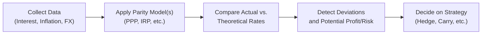

## The Gap Between Theory and Reality

Advanced parity models, ranging from covered and uncovered interest rate parity (IRP) to purchasing power parity (PPP) and the international Fisher effect, possess an almost elegant simplicity in textbooks. Yet—let’s be honest—they seldom map cleanly onto our messy, complicated world. I remember a moment (slightly embarrassing, but let’s share) early in my career: I tried to apply a neat PPP formula for a client’s currency forecast, only to discover that local transaction costs and subtle capital controls were throwing things off. The client said, “Sure, we have the theory, but we also have red tape, politics, and plain old investor sentiment to deal with.”

That’s precisely how real markets behave. Persistent deviations from theoretical parity models can and do happen for extended lengths of time. Why? You might see differences in political stability, complicated capital flow restrictions, transaction costs that nobody accounted for, or behavioral biases among market participants. Indeed, bridging the gap between theoretical elegance and pragmatic utility is what advanced students of economics—and especially Level II CFA candidates—must learn to do.

Below we’ll dig into where the biggest discrepancies arise and how we try to handle them through empirical methodologies, data-driven modeling tools, and real-world strategies. We’ll also highlight why it matters for portfolio managers, risk professionals, and, ultimately, your exam readiness.

### Common Factors Driving Deviations

• Political Risk: Government interventions, capital controls, or the sudden imposition of tariffs can upend a parity-based forecast. Low political stability often leads to persistent mispricing of an exchange rate if capital markets are uncertain or fearful.  
• Transaction Costs and Market Microstructure: While the IRP concept might say that forward currency prices should reflect interest differentials, real traders incur bid–ask spreads, clearing fees, and other frictional costs. These can lead to consistent but small misalignments from theoretical fair values.  
• Investor Behavior and Herding: Sometimes, the crowd piles into a particular carry trade, ignoring unfolding macro data and pushing currencies away from fair value. Momentum can carry this process for ages until a correction happens—often abruptly.  
• Official Intervention: Central banks may manage or “lean against the wind” when currencies move too far from official targets. These interventions can create persistent divergences between the market rate and the theoretical PPP.  

## Tools and Data for Empirical Testing

Ok, we know from the disclaimers above that we need real data to verify or modify these elegantly crafted parity models. Let’s walk through how we gather and test that data.

### Software and Statistical Packages

Modern empirical techniques rely on software capable of advanced econometric analyses:

• EViews: Popular for time-series analysis, especially for testing cointegration and running single-equation or multi-equation forecasting models.  
• Stata: Offers a robust suite of commands for panel data, cointegration, and GMM estimations. Its do-file structure also helps in replicating results quickly.  
• R: A free, open-source environment with numerous packages (e.g., “vars,” “urca,” “tsDyn”) that are particularly strong in time-series, cointegration, and non-linear modeling.  
• Python: With libraries like statsmodels, pandas, and scikit-learn, Python is a versatile choice for data wrangling and advanced analytics.

Whether you prefer the commercial route (EViews, Stata) or open-source solutions (R, Python), you can run sophisticated tests, including:

• Unit Root and Stationarity Tests (Dickey-Fuller, Phillips-Perron).  
• Cointegration Tests (Johansen, Engle-Granger).  
• Non-Linear Models (Threshold models, Markov-switching models).  

When you suspect that market participants behave differently depending on certain thresholds—say, letting the exchange rate drift unless it breaches a certain band—non-linear methods help identify regime shifts or “sticky” price zones.

### Data Sources

Reliable data is key. For currency forecasting and parity testing, consider:

• International Monetary Fund (IMF): The International Financial Statistics (IFS) database offers exchange rates, interest rates, and key macroeconomic indicators.  
• Bank for International Settlements (BIS): Great for global liquidity measures, cross-border banking statistics, and official exchange rate data.  
• World Bank: Often a go-to for long historical series on economic growth, inflation, and financial development.  
• Central Bank Portals: Many central banks publish daily and monthly data on rates, reserves, and foreign-exchange market interventions.

Collecting data might seem tedious, but it’s a crucial step. You’ll want consistent definitions of variables (e.g., exact short-term interest rates used, or official inflation measures) and align them to a common frequency (daily, monthly, quarterly). Incomplete or messy data can ruin a good model, which is why real-world practitioners spend a substantial portion of their time cleaning and reconciling data sets.

### Balancing Theoretical Elegance with Pragmatic Models

When you test a parity concept—like relative PPP, which states that the rate of currency depreciation should match the inflation differential between two countries—you may start with a simple linear regression. Something like:


\text{Exchange Rate Change} = \alpha + \beta \times (\text{Inflation Differential}) + \varepsilon


But in reality, you’ll quickly find that \\(\beta\\) might not be 1, or it might take time for changes in inflation to filter through. Some versions of PPP might hold only in the very long run, while over shorter windows, the data can do all kinds of wiggly stuff. That’s where cointegration approaches become useful—testing whether, over the long haul, the variables share a stable relationship. 

Below is a tiny snippet in Python to illustrate how you might run a cointegration test, just to show what it looks like in practice:

```python
import statsmodels.tsa.stattools as ts

coint_test_result = ts.coint(log_exchange_rate, inflation_diff)
print('Test Statistic:', coint_test_result[0])
print('P-value:', coint_test_result[1])
print('Critical Values:', coint_test_result[2])
```

Of course, this snippet only scratches the surface, but it shows you how straightforward these tests can be once you have the data prepared. 

## Tying Parity Conditions to Investment Strategies

Now let’s consider how these advanced modeling techniques translate into actual portfolio decisions. After all, the entire point of Level II study is to move beyond definitions and into application and analysis.

### Carry Trades and Risk Management

Carry trade strategies essentially borrow in a low-yielding (low-interest) currency and invest in a higher-yielding currency, hoping to profit from the interest rate differential. The rub is that uncovered interest rate parity (UIRP) says any such advantage should vanish if the higher currency is expected to depreciate. But we often see extended periods where the high-yielding currency does not depreciate adequately—leading to profitable carry trades.

So practitioners incorporate real-time data analysis:

• They watch for a rising risk of sharp depreciation in the currency (e.g., triggered by political unrest or central bank policy U-turn).  
• They also measure volatility using implied vol data from currency options.  
• And, crucially, they check how well or how poorly the parity relationships have held historically—if a country is known to “defy” UIRP over many cycles, that might be a sign of structural differences (or, perhaps, looming correction risk).

### Currency Hedging Decisions

When you manage a global equity or fixed-income portfolio, you might hedge currency exposure if your models—like expected real exchange rates from PPP or interest rate parity signals—forecast a depreciation. But in real life, you can’t ignore the cost of hedging. Forward points, bid–ask spreads, and daily rollovers matter. Some managers partially hedge only a portion of their currency risk, especially if analysis suggests only moderate risk of misalignment from theoretical parity values. 

### Equities and Global Allocation

Deviations from PPP can also present interesting opportunities in equity selection. For instance, if your analysis shows that the Brazilian real is undervalued relative to its PPP-based fair value, you might see potential upside for Brazilian exporters (due to strong external demand) or you might foresee the real eventually reverting to a stronger level, boosting the local equity returns once translated back into your home currency. 

## Practical Tips for CFA Exam Readiness

Allow me to shift gears from stories of real-world fiascos to the practicalities of your upcoming exam vignettes. Often, you’ll find multi-country item sets that present an array of economic data: spot exchange rates, interest rates, inflation measures, and some textual hints about growth or political risk. You might be asked:

1. To detect whether PPP or IRP holds.  
2. To calculate a forward rate or expected spot rate.  
3. To estimate potential misalignments and draw conclusions about future currency movements.

### Key Reminders

• Know your Formulas, but Don’t Overapply Them: Especially in item sets, watch out for nuance. Sometimes the data set only partially supports a model—like PPP might be relevant if inflation data is the primary driver, whereas IRP might apply if interest rates are the focus.  
• Embrace the “Partial Credit” Mindset: In real markets, incomplete data is par for the course. For exam item sets, if relevant info is missing or contradictory, carefully weigh assumptions or disclaimers.  
• Time Management: Don’t get bogged down in overly granular calculations. The exam typically requires prompt identification of the right model, a quick formula application, and selection of the correct interpretation—rather than a 10-step empirical test.  
• Common Pitfalls: Confusing covered vs. uncovered interest rate parity, ignoring transaction costs (if they’re stated in the vignette), or mixing nominal vs. real interest rates.

## Visualizing the Process

Below is a simple flowchart to illustrate how an investor might approach an exchange rate decision based on parity models and real data:



This kind of diagram can help keep your process organized. Start with data, pick the relevant parity model, compare the results, and then weigh potential deviations and associated risks.

## Summary Points for Exam Success

• Parity Models vs. Reality: Expect differences due to market frictions and policy interventions.  
• Empirical Tools: Familiarize yourself with regression, cointegration, and possibly non-linear methods. You might not do them in detail on the exam, but the conceptual knowledge helps you interpret item set vignettes better.  
• Integration into Investment: Carry trades, partial hedging strategies, or sector allocations often hinge on whether or not parity is holding.  
• Be Nimble with Data: You might be required to use partial sets of data (like five countries’ inflation rates, interest rates, or forward quotes) to arrive at an intuitive answer.  
• Mistakes Happen: If you see a big mismatch, it might be a signal of potential profit or an upcoming correction—especially relevant for risk management.  

## Glossary

• Empirical Implementation: The practical steps of applying theoretical models––from data gathering and cleaning, to running regressions and interpreting model diagnostics.  
• Statistical Package: Software created for econometric or statistical analysis (e.g., R, Python, Stata, EViews). Deciding which tool to use is often a matter of preference and budget.  
• International Financial Statistics (IFS): An IMF database with exchange rates, interest rates, national accounts, and balance of payments data widely used in parity testing.  
• Carry Trade: A strategy of borrowing in low-interest-rate currencies and investing in higher-yielding ones. Potentially handsome returns but can unravel quickly if uncovered interest rate parity reasserts itself in a flash.  
• Risk Management: The identification, assessment, and mitigation of uncertain outcomes—critical when exploiting deviations from parity.  
• Partial Equilibrium: A modeling approach that zeroes in on one market without factoring in the entire economic system.  

## References & Further Reading

• Bank for International Settlements – BIS Statistics: [https://www.bis.org/statistics/](https://www.bis.org/statistics/)  
• International Monetary Fund – Data and Statistics: [https://www.imf.org/en/Data](https://www.imf.org/en/Data)  
• Guidance from leading investment banks on practical currency forecasting techniques (e.g., proprietary research notes).  
• World Bank Open Data: [https://data.worldbank.org/](https://data.worldbank.org/)  

Feel free to explore these resources to see how real-world analysts gather data, run tests, and discover whether exchange rates behave anything like we expect from parity models. That real-world complexity is what makes finance both exhilarating and, occasionally, a bit maddening.

---

## Test Your Knowledge: Advanced Parity Applications Quiz



### 1. Which of the following is most likely to create persistent deviations from purchasing power parity (PPP)?

- [ ] Perfect capital mobility and zero transaction costs
- [x] Capital controls and differing degrees of political risk
- [ ] Consistent application of relative inflation differentials
- [ ] Identical preferences and consumption patterns across borders

> **Explanation:** PPP assumes no severe barriers to capital or goods flows. When countries impose capital controls or exhibit high political risk, exchange rates can stray from the theoretical PPP values for long periods.

### 2. A Level II candidate is evaluating the uncovered interest rate parity (UIRP) between the British pound (GBP) and the euro (EUR). She notices that, despite the UK's higher interest rates, the GBP has appreciated. Which factor might best explain this discrepancy?

- [ ] Lower CIP threshold
- [ ] Higher UK inflation
- [ ] Stabilized forward premium
- [x] Speculative momentum and investor sentiment

> **Explanation:** UIRP suggests that a currency with a higher interest rate should depreciate. In reality, momentum, speculative pressures, and risk-on market sentiment can lead to an appreciation despite the theoretical model.

### 3. Which of the following software tools is often used for time-series econometric testing, including cointegration analysis?

- [ ] Microsoft Excel
- [ ] PowerPoint
- [x] EViews
- [ ] QuickBooks

> **Explanation:** EViews is specifically designed for econometric analysis, including time-series modeling and cointegration tests. Excel, PowerPoint, and QuickBooks can serve other business or presentation functions but are not specialized econometrics packages.

### 4. An emerging market imposes strict currency transaction taxes. This will most likely:

- [ ] Lead to immediate and full convergence to PPP.
- [ ] Have no effect on IRP relationships.
- [x] Increase the cost of implementing arbitrage strategies, causing persistent deviations.
- [ ] Completely eliminate interest rate differentials.

> **Explanation:** Transaction taxes and other frictions make it more expensive to exploit small mispricings, thereby creating the possibility for sustained deviations from parity.

### 5. A researcher uses a threshold cointegration model to detect a relationship between inflation differentials and the spot exchange rate. Why might threshold modeling be more appropriate than a simple linear regression?

- [x] Because the exchange rate adjustment may only occur once a certain level of misalignment is reached.
- [ ] Because linear regression can only handle nominal variables.
- [x] Because markets might switch regimes below or above certain inflation gaps.
- [ ] Because threshold models are faster to compute in R.

> **Explanation:** Threshold models allow for different behaviors (regimes) depending on a specific threshold. Exchange rates might be sticky until a certain misalignment from PPP is reached, after which they rapidly adjust.

### 6. Which data source is most famously associated with providing comprehensive balance of payments and national income data essential for parity analyses?

- [ ] CRS (Congressional Research Service)
- [ ] Federal Reserve Economic Data (FRED)
- [x] International Financial Statistics (IFS) from the IMF
- [ ] SEC EDGAR

> **Explanation:** The IMF’s International Financial Statistics (IFS) remains a prime database for exchange rate, interest rate, and macroeconomic data across many countries, which is crucial for parity testing.

### 7. When performing a carry trade based on uncovered interest rate parity:

- [x] Investors borrow in a low-interest currency and invest in a high-interest currency.
- [ ] Investors always borrow in the currency expected to appreciate.
- [x] The main risk is that the high-interest currency abruptly depreciates.
- [ ] The main benefit is guaranteed profit with no currency risk.

> **Explanation:** A carry trade profits from interest rate differentials but faces the risk of abrupt currency moves that can wipe out interest gains if a depreciation occurs in the target currency.

### 8. A partial equilibrium approach to currency valuation:

- [ ] Analyzes every market in the global economy simultaneously.
- [x] Focuses on one market, assuming other markets hold constant.
- [ ] Requires a dynamic general equilibrium model.
- [ ] Eliminates all possibility of forecasting errors.

> **Explanation:** Partial equilibrium analysis zeroes in on a single market (e.g., the foreign exchange market) in isolation without considering feedback effects from the entire economy.

### 9. In a CFA exam scenario, a multi-country vignette presents interest rates, inflation forecasts, and quoted spot exchange rates. Which factor is crucial for deciding if interest rate parity is “covered” or “uncovered”?

- [ ] Availability of nominal bond yields
- [x] Presence or absence of a forward contract explicitly locking in the exchange rate
- [ ] Correlation between inflation and GDP
- [ ] The frequency of data updates

> **Explanation:** Covered interest rate parity involves using forward contracts to lock in future exchange rates, whereas uncovered parity leaves the future exchange rate unhedged.

### 10. Empirical evidence suggests that, over short horizons, deviations from parity can persist. Is this statement true or false?

- [x] True
- [ ] False

> **Explanation:** Indeed, short-term forces, such as speculative flows, market frictions, and corporate hedging flows, can cause exchange rates to deviate from theoretical parity relationships for extended periods.


