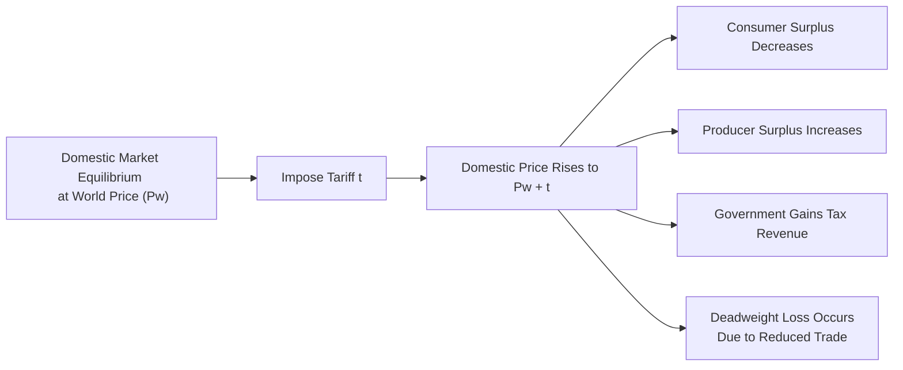
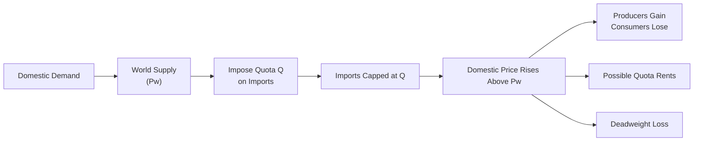

## Introduction

I remember the first time I traveled abroad and casually noticed how the price of a simple product—like a piece of fruit—could vary dramatically from one country to the next. Sure, there were lots of reasons behind those price differences—transportation costs, currency exchange rates, all that good stuff. But one of the biggest eye-openers was realizing how government trade policies like tariffs, quotas, and subsidies can make or break how goods move across borders and at what price.

In this section, we’ll explore tariffs, quotas, and subsidies in a slightly conversational manner, but we’ll stay close to the rigors of Level II Economics content. We’ll examine how these policies shape market equilibria (both conceptually and in real life), why governments impose them, and how to handle them in exam-style questions. We’ll also cover welfare changes (consumer surplus, producer surplus, government revenue), highlight potential pitfalls, and walk through some mini-examples. By the end, you’ll be able to evaluate the impact of common trade policy tools and apply that knowledge in complex item set scenarios.

## Key Concepts and Policy Tools

### Tariffs at a Glance

A tariff is basically a tax on imports. When a country places a tariff on a good, that tax raises the cost of importing it, which usually pushes up the market price for domestic buyers. If you’re a local producer, you might initially think, “Yay, less competition for me!”—but consumers end up paying a higher price. Meanwhile, the government collects tariff revenue, which can become substantial if import volumes are large.

There are two main kinds of tariffs:
- Ad Valorem Tariff: Calculated as a percentage of the value of each imported unit (e.g., a 10% tax on the import’s price).
- Specific Tariff: Levied as a fixed amount per unit (e.g., $2 per imported widget).

Although both forms can protect domestic producers, they can have distinct impacts depending on price levels and product type.

### Quotas in Plain Terms

Quotas set a hard ceiling on the quantity of goods that can be imported. Picture a scenario where the government says, “Only 100,000 imported cars can enter the country this year.” Once that cap is reached, no more of those cars can be imported, no matter the demand. This approach can also raise domestic prices because consumers who still want more of the imported good might end up offering a higher price to get it (assuming the product is scarce and highly demanded).

Quotas don’t generate tax revenue directly for the government (unlike tariffs), although the quota licenses might be sold, creating some revenue. Or they might be given free of charge, in which case the lucky holders of these licenses (often foreign exporters) can earn “quota rents” (that extra profit from selling at a higher price).

### Subsidies in a Nutshell

Subsidies go at it from another angle: instead of taxing foreigners, the government pays domestic producers to help them grow more cheaply or sell items at more competitive prices abroad. For instance, a government might step in and say: “We’ll pay local farmers $1 for each bushel of wheat they produce,” effectively lowering their production cost. This can boost exports or reduce local prices—but guess who pays the bill? Taxpayers. Over the long run, subsidies can distort resource allocation, keeping uncompetitive industries alive or encouraging overproduction of certain goods.

## Real-World vs. Theoretical Models

When we introduce policies like tariffs, quotas, or subsidies in a stylized supply-demand model, that’s typically partial equilibrium—looking at one market, ignoring potential ripple effects across the entire economy. In real life (a general equilibrium context), these policies can affect multiple industries, factor markets, currency values, and so on. For instance, a subsidy to steel producers might help them export more steel, but it could also raise taxes or divert money from education budgets. Always be ready to see how these micro-level changes interact with macro-level considerations.

## Tariffs: Detailed Mechanics and Welfare Analysis

Tariffs can be described in step-by-step terms:

1. Pre-Tariff Equilibrium: 
   - Domestic supply meets domestic demand, but part of demand might be met by imports at the world price P₍w₎, which is lower than the domestic equilibrium price.
2. Tariff Imposition:
   - A tariff (t) is added. If it’s ad valorem, the domestic price is P₍w₎ × (1 + t). If it’s specific, the new price is P₍w₎ + t per unit.
3. Post-Tariff Equilibrium:
   - The effective cost of imported goods rises, so fewer units are imported. Domestic suppliers may produce more because the total price in the domestic market increased. Consumers face a higher price, and some reduce consumption.

### Calculating Tariff Effects

Suppose the world price for a specialized widget is $10. The government imposes a specific tariff of $2 per unit. The new domestic price of imports is $12. If local producers previously matched the price at $10, they can charge up to $12 now. 

• Consumer Surplus: It shrinks because the price jumped from $10 to $12.   
• Producer Surplus: Increases because producers can sell at a higher price or produce more if their cost of production is below $12.  
• Government Revenue: Equal to (Tariff per unit) × (Imported units). If 1 million widgets are imported, the government gets $2 × 1,000,000 = $2,000,000.  
• Deadweight Loss: There’s inefficiency introduced because fewer units are traded and consumed overall.

### Diagramming It

Below is a simple supply-and-demand flow chart in Mermaid that highlights how the introduction of a tariff shifts the domestic price upward and reduces quantity demanded:

In a partial equilibrium setting, we see how each stakeholder’s surplus changes. On the exam, you might be asked to calculate these surplus changes quantitatively or identify them conceptually from a graph.

## Quotas: Caps on Imports

With quotas, the big difference is that the government sets a strict limit on import quantity, rather than simply taxing each imported unit. Prices in the domestic market might rise above the world price if the quota is binding (i.e., the desired imports exceed the quota limit).

### Quota Rents

One subtlety is that someone reaps the additional revenue that comes from the higher domestic price. If the quota licenses are auctioned by the government, that revenue flows to the treasury. If foreign exporters hold the import licenses, they can charge higher prices and earn “quota rents”—the difference between the domestic price and the world price on each unit sold.

### Welfare Effects of Quotas

Similar to tariffs, consumer surplus declines because domestic prices rise. Producer surplus increases for domestic firms now shielded from import competition. The total welfare effect also typically shows a deadweight loss, as fewer units are bought and sold in total.

## Subsidies: Government Support for Producers

Subsidies shift or effectively lower the domestic producer’s cost curve. Instead of artificially raising importers’ costs (tariffs) or restricting volume (quotas), subsidies give local producers a leg-up in competition, especially on the export side. 

If the government subsidizes each unit of production, producers become more competitive in world markets. Consumer surplus might remain largely unchanged if the production is exported, although sometimes domestic prices can also drop. The big question is: “Who pays for the subsidy?” The answer: taxpayers, or the overall government budget. 

### Sector Examples

• Agriculture: Many countries heavily subsidize their farming sector to maintain domestic food security and rural incomes.    
• Renewable Energy: Some governments subsidize solar panel production or electric vehicle manufacturing to encourage green industry growth.  
• Strategic Industries: High-tech or defense-related industries sometimes receive R&D grants or direct production subsidies for national security reasons.  

## Welfare Analysis Recap

At the CFA Level II level, you might face an item set that shows supply and demand schedules, import volumes, or even summary data like “domestic demand is 20 million units, domestic supply is 8 million units, imports fill the rest.” You could be asked:

• How does imposing a 15% ad valorem tariff change the equilibrium?  
• Who gains or loses in terms of surplus?  
• How do you compute the new consumer surplus, producer surplus, or government revenue?

Always recall that the presence of any of these barriers (tariffs, quotas, or subsidies) usually introduces some form of deadweight loss to society as a whole—even if certain stakeholders benefit.

## Practical Vignette Applications

The CFA exam typically presents these concepts intertwined with exchange rate moves, capital flows, or broader macro policies. For instance, you could see a scenario in which a government imposes a quota on car imports while simultaneously dealing with a capital flight. You may need to:

1. Compute the new domestic price for cars given the quota.  
2. Calculate the consumer surplus changes.  
3. Discuss how the currency devaluation might offset or amplify the impact of that quota.  

Keep an eye out for “trick” details, such as non-biding quotas or large exchange rate changes that overshadow the effect of a tariff. Additionally, watch for capacity constraints among domestic producers; if domestic firms can’t step up output, the policy may have limited protective effects beyond raising prices.

## Best Practices, Common Pitfalls, and Strategies

• Double-Check the Policy Type: Don’t mix up tariffs (which generate government revenue) with quotas (which don’t necessarily generate a direct revenue unless licenses are sold).  
• Identify Quota Rents: Confirm who benefits from the higher domestic price when a quota is binding.  
• Watch for Shifts vs. Movements: Subsidies shift the supply curve, while tariffs/quotas effectively raise import prices or limit import quantities.  
• Don’t Overlook Deadweight Loss: Even if producers gain and the government might earn revenue, total welfare can go down.  
• Cross-Reference Macroeconomics: Tariffs or subsidies might also trigger retaliation, affect exchange rates, or influence capital flows.  

## Additional Diagrams: Welfare Representation

Below is a simplified supply-demand visualization for a quota in partial equilibrium. Notice the separate “quota limit” node showing how it restricts quantity:

## Conclusion and Exam Tips

Tariffs, quotas, and subsidies are classic tools in the trade policy kit. For the CFA exam, remember to:
• Precisely define each policy’s effect on prices, quantities, and welfare.  
• Use the right formulas to compute ad valorem vs. specific tariffs.  
• Identify the distribution of benefits and costs among consumers, producers, and government (or foreign exporters in quota scenarios).  
• Pay attention to combined scenarios involving parity conditions, exchange rates, and even business cycle phases.  

You’ll often see item sets that blend these trade policies with broader macroeconomic or currency issues. Practice reading carefully, organizing relevant pieces of data—like tariff rates and demand-supply schedules—and performing quick surplus or cost-benefit calculations. The better you get at these quick and clean computations, the more time you’ll have for the rest of the exam’s challenging questions.

----

## References, Further Reading & Tools

- WTO (World Trade Organization):  
  https://www.wto.org  
  (Official resources on tariffs, trade disputes, and global trade statistics.)

- IMF Working Papers on Trade Policy:  
  https://www.imf.org/en/Publications/search?series=WorkingPapers  
  (Empirical research and relevant case studies.)

- “International Economics” by Paul Krugman & Maurice Obstfeld  
  (Huge emphasis on theoretical foundations of tariffs, quotas, and subsidies.)

- Market and supply-demand data from government repositories  
  (Handy for real examples of how these instruments shape prices.)

----

## Practice Questions on Tariffs, Quotas, and Subsidies



### A multinational read a news report of a 20% ad valorem tariff on imported steel. Which impact will they most likely observe in the domestic steel market?

- [ ] Lower domestic prices for steel
- [x] Higher domestic prices and reduced imports
- [ ] Lower producer surplus for domestic firms
- [ ] No effect on consumer surplus

> **Explanation:** A tariff generally raises the cost of imports, pushing up domestic prices, reducing imports, and benefiting domestic producers at the expense of consumers.

### The government imposes a quota on imported textiles of Q units. If the demand for textiles exceeds Q and the domestic supply cannot fully meet demand, which outcome is most likely?

- [ ] The domestic price will remain unchanged.
- [x] The domestic price will increase until demand is rationed to Q.
- [ ] Consumer surplus increases while producer surplus declines.
- [ ] Government revenue will necessarily increase.

> **Explanation:** When a binding quota is imposed, domestic prices typically rise so that total consumption (domestic supply plus imports) matches the quota limit. Government revenue may not increase unless it sells import licenses.

### Under an import quota, quota rents refer to:

- [x] The extra profit earned by foreign exporters or license holders due to the increased domestic price.
- [ ] The fees government pays to domestic producers to encourage production.
- [ ] The difference between ad valorem and specific tariffs.
- [ ] The depreciation expense on imported capital equipment.

> **Explanation:** Quota rent is the profit advantage gained by whoever holds the quota license, as they can sell at an artificially high price induced by the import limit.

### Consider a country where the world price of wheat is $5 per bushel, and the domestic price without trade barriers is $6. The domestic market imposes a $2 specific tariff on wheat imports. Which statement is correct?

- [ ] The new domestic price for imported wheat is $9.
- [x] The new domestic price for imported wheat becomes $7.
- [ ] The government's tariff receipts are not affected by import quantities.
- [ ] Domestic wheat producers experience a drop in producer surplus.

> **Explanation:** Adding a $2 specific tariff to the $5 world price yields a new domestic import price of $7. Domestic producers benefit from the higher price, and the government earns $2 on each imported bushel.

### A production subsidy primarily differs from a tariff because:

- [x] It doesn’t raise consumer prices by directly taxing imports.
- [ ] It reduces domestic output.
- [x] It is financed by taxpayers rather than foreign importers.
- [ ] It does not influence producer surplus.

> **Explanation:** Subsidies lower producers’ costs, potentially boosting domestic output. Government funds them, so taxpayers ultimately bear the cost. Consumer prices may or may not change drastically depending on market conditions, but the key difference is the absence of a direct tax on imports.

### Which of the following is a likely direct effect of export subsidies in a country?

- [x] An increase in production for export markets
- [ ] A drop in government expenditure
- [ ] A decline in domestic producer surplus
- [ ] Reduced international competitiveness

> **Explanation:** Export subsidies make exporting more attractive by offsetting part of producers’ costs, generally leading to heightened production for overseas markets, although at a fiscal cost to the subsidy-granting country.

### The imposition of an import quota by a large country (one that influences world prices) might lead to:

- [x] A decrease in the world price of the good, benefiting other importers.
- [ ] No effect on foreign producers.
- [x] Higher domestic prices if the quota binds.
- [ ] No deadweight loss at all.

> **Explanation:** A large country’s restriction on imports can lower global demand enough to push down the world price. Domestic prices often increase if the quota is binding, creating a deadweight loss.

### If an exam vignette shows a binding import quota and mentions that quota licenses are given free to foreign exporters, which group is most likely to receive quota rents?

- [x] Foreign exporters
- [ ] Domestic consumers
- [ ] The government
- [ ] Domestic producers

> **Explanation:** Foreign exporters with free quota licenses can sell at the higher domestic price, capturing the quota rents themselves, rather than the government or domestic producers.

### When governments provide subsidies for particular energy technologies (e.g., solar), what is the primary resource allocation distortion that could occur?

- [x] Capital and labor shift into the subsidized sector even if not the most efficient use.
- [ ] Lower consumption of the subsidized product.
- [ ] Reduced domestic output of the subsidized product.
- [ ] The complete elimination of trade deficits.

> **Explanation:** Subsidies encourage expansion of the subsidized industry, drawing resources that might otherwise have gone to more productive sectors. This can be beneficial for policy goals (like green energy) but can also be inefficient from a strictly market-driven standpoint.

### True or False: Quotas generally create government revenues in the same way tariffs do.

- [x] True
- [ ] False

> **Explanation:** This is a tricky statement. While quotas can create revenues if the government auctions the licenses, they do not automatically generate revenue in the standard sense of a tariff. Often, those rents go to whoever holds the licenses. If the question states that quotas “generally” create revenue “in the same way,” it’s misleading—tariffs automatically yield tax revenue, whereas quotas do not necessarily do so without specific license fees or auctions.


