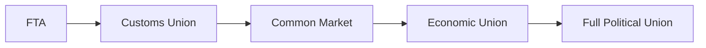

## Introduction and Background

It’s funny: when I was first learning about economic integration—I think I was flipping through the news about a new trade agreement somewhere—I got stuck on all these acronyms. FTA, CU, CM... oh my! But gradually, I realized that each acronym actually represents a significant step in how countries connect their economies. They don’t just reduce tariffs on a whim; they build frameworks that can reshape the global marketplace and impact our investment decisions in meaningful ways.

What follows is a slightly deeper journey into this topic—enough detail to satisfy your CFA Level II exam needs, but also with real-world color so you can (hopefully) remember these concepts more easily. Let’s dig right in.

## Levels of Economic Integration

Economic integration comes in distinct levels, each with a unique degree of cooperation among member countries. The simplest is a Free Trade Area (FTA), while the deepest is a full-blown Political Union. The steps along the way matter greatly to investors, policymakers, and businesses. Understanding them can help you gauge the potential for new trade flows, shifts in competitiveness, and changes in market entry strategies.

Below is a quick, high-level diagram illustrating the progression of economic integration:

### Free Trade Area (FTA)

In an FTA, member countries agree to eliminate tariffs and quotas on goods traded among themselves; however, each member retains its own external trade policy for non-members. That means:  
• No internal tariffs among members.  
• Each country sets its own external tariff on imports from outside the region.

Classic examples include:  
• The old NAFTA (North American Free Trade Agreement) linking the U.S., Canada, and Mexico, now updated to USMCA.  
• ASEAN Free Trade Area (AFTA), which aims at reducing tariffs among Southeast Asian nations.

### Customs Union

A Customs Union goes a step further by requiring member nations to share a common external tariff (CET) on imports from outside the union. While internal tariffs are gone—just like in an FTA—members no longer have freedom to set their own external policies independently. Instead, everyone in the union agrees on one “on-ramp” for outside goods. MERCOSUR (in South America) is a notable example of a customs union.

### Common Market

A Common Market takes the Customs Union framework and adds free movement of factors of production (labor and capital). This is arguably more challenging because it involves labor mobility and potentially the harmonization of some laws related to employment and business regulation. The EU started as a common market known as the “European Common Market” before deepening into further stages of integration.

### Economic Union

An Economic Union includes all the features of a common market but also shares certain economic policies—fiscal, monetary, or otherwise. The European Union, in many respects, is an Economic Union (though it’s a bit complicated because not all EU members have adopted the euro, and that plays into just how cohesive the union is in practice).

### Full Political Union

This is the “ultimate” end of integration: member states effectively become subnational entities of a larger, singular political structure. You see this in federal countries where provinces or states still hold some local powers, but the main authority (federal government) sets overarching rules on trade, taxation, and monetary policy.

## Trade Creation vs. Trade Diversion

Now, let’s talk about two classic concepts that typically show up in both the real world and on exams: “Trade Creation” and “Trade Diversion.” Understanding these helps us assess whether a trade agreement is beneficial to the global economy or primarily protective to a specific region.

### Trade Creation

Trade creation occurs when an agreement leads to more efficient, lower-cost producers inside the bloc replacing higher-cost domestic suppliers. In other words, you have a shift from a less competitive producer to a more competitive one. This usually increases consumer surplus because consumers get cheaper or better-quality goods, and overall welfare in the member countries can go up. 

Key points to remember:  
• Trade creation often signals an overall welfare gain.  
• The efficiency gain arises because internal barriers drop, allowing the best producer within the bloc to supply the market.

### Trade Diversion

Trade diversion happens when lower-cost producers outside the bloc are effectively shut out because of new tariffs or regulatory barriers. As a result, a higher-cost producer within the bloc ends up serving the market. That might be great for those inside the bloc, but it’s not exactly great for global economic efficiency. In fact, trade diversion can reduce overall welfare if it displaces cheaper imports from the rest of the world.

A quick mental checklist to decide if you’re dealing with creation or diversion could be:  
1. Compare the pre-agreement cost of imports from outside vs. new cost from within.  
2. See if the new (internal) supplier is actually cheaper than the original external supplier after factoring in tariffs or other barriers.  
3. If the internal supplier is cheaper, that’s trade creation. If not, but is chosen anyway because external items are tariffed, that’s trade diversion.

## Customs Unions and Common Markets

It’s easy to mix these terms up under exam pressure! So let’s restate them in a simpler way:

• Customs Union: No internal tariffs among members + a common external tariff (CET).  
• Common Market: All the features of a Customs Union + unrestricted movement of labor and capital among members.

An example of a Customs Union is MERCOSUR, which aims for a shared external tariff on many goods. The EU used to be called the European Common Market, reflecting its deeper integration of labor and capital flows, though it has evolved significantly since those days.

In exam vignettes, you might see data like “Country A’s workers can move freely to Country B, but the two countries have different external tariffs.” That mismatch tells you it’s not a common market and not exactly a customs union, which can signal partial or incomplete integration. Alternatively, you might see an item set describing an upcoming tariff alignment across multiple countries—clear sign of a customs-union-type arrangement.

## Managed vs. Unmanaged Integration

Not all trade agreements are straightforward; some are heavily “managed.” That could mean quotas, rules of origin, local content requirements, or even complicated dispute resolution mechanisms. For instance, an FTA might say: “Okay, we’ll drop our tariffs for each other but only if 60% of a good’s value added is from members.” That’s a managed condition, aimed at preventing transshipment (where goods from a non-member are routed through a member state to dodge external tariffs).

### Managed Integration

• Often includes specific rules that detail how goods qualify for tariff exemptions (e.g., local content rules).  
• Typically relies on dispute resolution panels or courts to oversee compliance.  
• Can help smaller economies ensure they aren’t overshadowed by large partners.

### Unmanaged Integration

• Might simply remove most trade barriers without additional conditions regarding origin.  
• Fewer regulatory or legal frameworks controlling how goods move around.  
• Sometimes leads to broader sectoral competition, which can either be beneficial or disruptive, depending on your perspective.

## Potential Vignette Data

On a CFA exam, you might encounter an item set with a table showing pre- and post-integration prices, tariff rates, or volumes of exports and imports among member and non-member countries. Another classic data point is the “rules of origin” threshold: maybe 50% or 60% local content is required to qualify for zero tariffs. You might be asked to compute changes in supplier choice or overall trade flows. Or the question might revolve around measuring the net welfare effects: does the elimination of tariffs within the bloc produce net benefits or net losses once we factor in possible trade diversion?

Be on the lookout for:  
• Tariff changes for member vs. non-member.  
• Shifts in labor or capital flows (especially in a common market scenario).  
• “Before vs. after” tables where you see who’s now supplying the market.  
• Hypothetical or real examples referencing major trade blocs like the EU, USMCA, or ASEAN, accompanied by numeric data on production costs and shipping costs.

## Practical Examples and Case Studies

### North American FTA (USMCA/NAFTA)

NAFTA was considered a hallmark free-trade area upon conception. It promoted the elimination of most tariffs on goods between the U.S., Canada, and Mexico but allowed each country to set external tariffs differently. This led to significant trade creation in some sectors, such as automotive components, but critics argued it also included elements of trade diversion for certain agricultural products.

### MERCOSUR

MERCOSUR (Southern Common Market) features Argentina, Brazil, Paraguay, and Uruguay as core members (with Venezuela suspended at times). It’s a Customs Union: no internal tariffs plus a Common External Tariff. However, achieving deeper integration beyond that has been challenging, partly due to differing macroeconomic policies.

### European Union (EU)

The EU is often considered an example of an Economic Union, featuring not just free movement of goods, services, labor, and capital, but also a shared currency among many members (the Eurozone) and a variety of common regulations. While it’s a major success in some respects, ongoing issues—like member states having different fiscal policies—highlight the complexities of forging a truly unified economic framework.

### ASEAN

The Association of Southeast Asian Nations works under the ASEAN Free Trade Area (AFTA) for goods, while also progressively establishing closer integration on services and investment. Still, each member can set its own external tariffs, so compared to something like the EU, ASEAN is less “tight.” You might see partial or incremental integration that continues evolving over time.

## Pitfalls and Strategies for Analysis

• Confusing the levels: Avoid mixing up the definitions—especially “customs union” vs. “common market.”  
• Ignoring external tariffs: Just because two countries drop tariffs between themselves, it doesn’t mean they have the same policy for outside goods.  
• Overlooking factor mobility: Free movement of labor/capital is a hallmark of deeper integration.  
• Underestimating administrative complexities: Managed integration can complicate cost calculations with rules of origin or local content requirements.  
• Overemphasizing short-term gains: Some trade deals can yield short-term benefits while proving more complex or even detrimental in the long run.

## Conclusion and Exam Tips

From an exam perspective, integrating these concepts is vital because item sets frequently test your ability to differentiate between trade creation and trade diversion, or to interpret the effects of an FTA versus a customs union. Here’s what you can do:

• Read the vignette carefully. Identify whether it’s describing an FTA, a Customs Union, or a Common Market.  
• If you’re asked about welfare effects, quickly check if the scenario fosters lower-cost production inside the bloc (trade creation) or excludes cheaper external suppliers (trade diversion).  
• Watch out for details on factor mobility. If the vignette mentions free movement of labor or capital, you’re dealing with a common market (or deeper).  
• Keep an eye out for local content rules or common external tariffs—these hints guide you straight to the type of integration.  
• Practice short computations: If you see numbers on cost or tariffs, you might need to deduce whether the arrangement is pro-efficiency or simply protective.

If you nail the definitions and can interpret examples quickly, you’re well on your way to scoring high on those question sets. Remember, the exam is all about application, so expect to see a scenario with messy details, not just pure definitions.

## Glossary

• Free Trade Area (FTA): A group of countries that remove tariffs on each other’s goods but retain independent external policies.  
• Customs Union: An FTA with a common external tariff on imports from non-members.  
• Common Market: A customs union with free movement of labor and capital.  
• Economic Union: A common market with common economic policies (e.g., shared monetary/fiscal frameworks).  
• Trade Creation: An increase in trade resulting from reduced barriers, typically improving welfare if it displaces higher-cost domestic options.  
• Trade Diversion: A shift of trade from a low-cost external producer to a higher-cost member producer, potentially lowering global efficiency.

## References and Further Reading

• World Bank’s Regional Trade Agreements Database:  
  https://data.worldbank.org/topic/trade  
• WTO Regional Trade Agreements Gateway:  
  https://rtais.wto.org/  
• T.N. Srinivasan, “Regional Trade Blocs, Multilateralism, and the GATT.”  
• For additional CFA context, see official CFA Institute materials on international trade and policy frameworks.  

## Test Your Knowledge: Economic Integration and Trade Agreements



### Which feature distinguishes a Customs Union from a Free Trade Area (FTA)?

- [ ] The ability to move labor and capital freely among member countries
- [x] The imposition of a common external tariff against non-members
- [ ] The establishment of a single supranational government
- [ ] The use of a common currency

> **Explanation:** An FTA removes internal tariffs but typically allows each country to set its own external tariffs. In a Customs Union, members adopt a common external tariff.

### What typically defines a Common Market?

- [x] Free movement of goods, services, labor, and capital among members
- [ ] A single currency shared across all member countries
- [ ] High trade barriers on non-member nations
- [ ] No standardization of external tariffs

> **Explanation:** A Common Market extends a customs union by granting free movement of labor and capital among member states.

### Suppose a regional bloc forms, and previously cheaper imports from outside are locked out by tariffs, leading to a shift to a less efficient internal producer. This describes:

- [ ] Trade creation
- [ ] A common market
- [x] Trade diversion
- [ ] A Free Trade Area

> **Explanation:** It’s trade diversion when cheaper external suppliers are displaced by higher-cost internal producers due to new tariffs or regulations.

### Which of the following could be considered an Economic Union?

- [ ] NAFTA (USMCA)
- [ ] MERCOSUR
- [x] The European Union (EU)
- [ ] ASEAN Free Trade Area (AFTA)

> **Explanation:** The EU goes beyond merely reducing tariffs and allows for deeper harmonization of policies, making it closer to an Economic Union.

### What is a key hallmark of a Managed Integration approach?

- [ ] Universal elimination of all tariffs without conditions
- [x] Specific rules of origin and local content requirements
- [ ] Complete freedom for any goods to enter regardless of origin
- [ ] No dispute resolution mechanisms

> **Explanation:** Managed integration often includes detailed criteria (e.g., local content) to receive preferential treatment, alongside dispute resolution frameworks.

### In a Free Trade Area, how do participating countries generally handle imports from non-member nations?

- [x] Each country sets its own external tariffs and policies
- [ ] All countries collaborate on a single external tariff
- [ ] They must only allow labor movement but not goods
- [ ] They must adopt a common currency

> **Explanation:** Members of an FTA remove tariffs among themselves but still maintain independent external trade policies for non-members.

### Which of the following is NOT correct about the movement of factors of production?

- [ ] A Common Market permits free movement of labor and capital
- [ ] A Customs Union does not necessarily allow factor mobility
- [x] A Free Trade Area mandates free movement of labor
- [ ] An Economic Union integrates factor mobility more comprehensively

> **Explanation:** An FTA does not require free movement of labor or capital; that starts at the common market level.

### A country joins a trade bloc. Post-integration, it imports more from fellow members who produce goods more cheaply than its domestic industries. This scenario is:

- [x] Trade creation
- [ ] Trade diversion
- [ ] A customs union effect
- [ ] Local content requirement

> **Explanation:** When a cheaper intra-bloc producer displaces a higher-cost domestic producer, it results in beneficial trade creation.

### In which arrangement do members typically forgo the right to set individual external tariffs?

- [ ] Free Trade Area
- [ ] Local content pact
- [ ] Bilateral Investment Treaty
- [x] Customs Union

> **Explanation:** A Customs Union requires members to adopt a uniform external tariff; FTAs do not.

### True or False: The EU is a perfect example of a Full Political Union.

- [ ] True
- [x] False

> **Explanation:** While the EU exercises significant political, economic, and monetary coordination among member states, it is not a full political union; member states still retain sovereignty in many areas.


