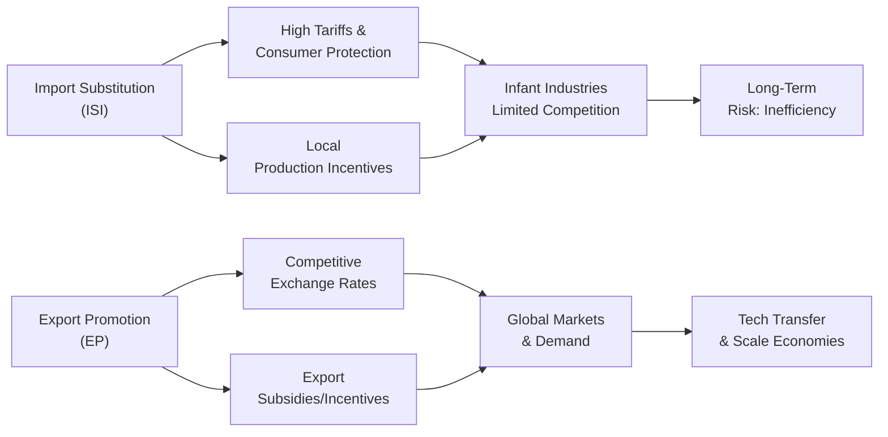

## Introduction
So, have you ever wondered why some countries put steep tariffs on imported electronics while others continuously push their local firms to export fancy gadgets abroad? That’s basically the crux of Import Substitution vs. Export Promotion strategies. At first glance, both sound like ways for a country to build domestic industries. But the details—and the actual results—can be super different. 

We’ll walk through what Import Substitution Industrialization (ISI) and Export Promotion (often called export-led growth) really mean for economies, how they’ve been applied in the real world, and what their achievements and pitfalls look like. We’ll also connect these ideas to the exam environment—particularly those tricky item sets that might describe a hypothetical emerging-market country grappling with trade policy decisions. Let’s get to it.

## Import Substitution Industrialization (ISI)

### Defining ISI
Import Substitution Industrialization is a development policy strategy that tries to reduce reliance on foreign goods by nurturing domestic production through protective measures. Countries that choose ISI figure: “Why spend precious foreign currency on imports when we can produce the same stuff locally—especially if we put up tariffs to protect our budding industries from stiff international competition?” 

I remember reading about countries in Latin America that wholeheartedly embraced ISI in the mid-20th century. The idea was straightforward: impose high tariffs on incoming manufactured goods (like cars, electronics, textiles), making them more expensive, so that local products become cheaper by comparison. Authorities might even directly subsidize local industries and give them lots of benefits like easy credit, cheap land, or guaranteed government purchases. It’s basically giving homegrown businesses a big hug and telling them, “You got this, we’ll keep those foreign sharks away for a while.”

### Policy Tools in ISI
Common policies to facilitate ISI include:

• High tariffs on consumer goods imports.  
• Quotas or outright bans on certain imports.  
• Direct subsidies or tax breaks for domestic manufacturers (sometimes in “infant” industries).  
• Exchange rate controls (e.g., overvalued currency to cheapen imports of machinery).  
• Protective regulation favoring local sourcing and content requirements.

These measures aim to create a supportive environment for local producers so they can develop scale economies and refine their production processes without immediately having to fight with foreign giants.

### Potential Short-Term Gains
In the short run, ISI can look pretty successful:

• Job Creation: Emerging industries often hire a lot of workers, especially if the sector is labor-intensive.  
• Infant Industry Support: Think of it like training wheels on a bike. The government’s helping new industries get going until they can sustain themselves.  
• Development of Local Supply Chains: Once production starts locally, smaller upstream and downstream businesses emerge to supply inputs or process outputs.  

There’s also a chance to build some national pride—“Made in Our Country” becomes a rallying cry. In some places, it worked wonders for morale in the immediate sense.

### Long-Term Pitfalls
But, you know, not everything about ISI is all roses. Over time, certain recurring problems pop up:

• Limited Global Competitiveness: Protected industries sometimes never become efficient enough to compete globally because they don’t face real foreign competition at home.  
• Lack of Scale and High Costs: If the local market isn’t huge, production stays small, pushing costs up. Not everyone has the scale (like the U.S. or China) to do heavy manufacturing cheaply.  
• Risk of Entrenched Inefficiencies: Without foreign competition breathing down their necks, some firms get complacent. They don’t invest in innovation or new technology.  
• Continuous Government Intervention: If local producers keep struggling, governments might keep tariffs or subsidies in place indefinitely, leading to fiscal burdens.

Many Latin American nations—for instance, Argentina or Brazil—spent decades struggling with inefficiencies that set in under ISI strategies. By the time they tried to pivot to a more outward-oriented approach, a lot of public resources had already been sunk into uncompetitive sectors.

## Export Promotion

### Defining Export Promotion
Export promotion (or export-led growth) is an alternative strategy that says, “Let’s focus on producing goods and services we can sell overseas.” Instead of hiking up tariffs on imports, these countries might do the opposite: they’ll create special economic zones, keep the currency at a competitive level, or channel innovation subsidies to industries that can crack global markets.

You’ll often see references to the East Asian “Tiger Economies”—like South Korea, Taiwan, Singapore, and later on China—who rocked the world by aggressively fostering manufacturing sectors that quickly conquered foreign markets. I recall how South Korea built a robust steel, electronics, and shipbuilding industry with major government direction in the 1970s and 1980s, and then used these industries as export engines.

### Tools for Export Promotion
Here are the tools typically associated with export-led strategies:

• Direct Export Incentives: Governments may offer tax rebates, subsidized loans, or special zones for exporters.  
• R&D and Technological Support: Funding research, encouraging patents, or providing training to upskill the workforce for manufacturing advanced goods.  
• Competitive Exchange Rates: Policies that ensure the national currency isn’t overvalued, so exports remain cheaper abroad.  
• Trade Agreements and Market Access: Negotiating free trade agreements or regional blocs to secure bigger markets for domestic producers.

### Gains from Export Promotion
Right away, the benefits can shine:

• Access to Larger Markets: Producers aren’t limited to domestic demand, so they can ramp up production and exploit scale economies.  
• Global Competitiveness: Firms that succeed in foreign markets typically sharpen their cost structures and product quality to keep up with—or beat—international rivals.  
• Faster Economic Growth: Many countries that vigorously promoted exports saw higher GDP growth. Demand from overseas can be more stable, especially if you diversify export partners.  
• Technology Transfer: Engaging internationally often encourages the inflow of advanced technologies, managerial know-how, and best practices.

### Potential Challenges
Still, no strategy is perfect:

• Vulnerability to Global Turmoil: If your main export markets tank during a recession (think 2008–2009), your local economy takes a major hit.  
• Reliance on External Demand: An export-led economy might not develop robust domestic consumption if everything’s geared for shipment abroad.  
• Race to the Bottom in Costs: Governments can feel pressure to keep wages low and labor conditions minimal to maintain cost competitiveness.  
• Possible Overcapacity: If everyone jumps on the export bandwagon, there’s a risk of global oversupply in certain industries, leading to price drops and fierce competition.

Countries like South Korea eventually faced calls for more domestic-led growth as household incomes rose and consumer demand became important. China, too, increasingly talks about “dual circulation,” balancing its export engine with internal consumption.

## Comparative Analysis: ISI vs. Export Promotion

Many economists (and exam vignettes) compare the historical experiences of ISI in Latin America vs. export promotion in East Asia. While Latin American states during much of the 1950s–1970s focused on shielding their local industries from foreign competition, several East Asian economies took a different tack, vigorously championing exports. The results?

• Long-Run Growth: Export-promoting countries generally recorded higher growth rates.  
• Industrial Upgrading: East Asian firms continually improved product quality and shifted up the value chain (from textiles to electronics, and then to advanced technology).  
• External Shocks: ISI-oriented economies still relied on commodity exports (agriculture, minerals) for foreign exchange, which made them vulnerable to price swings. Meanwhile, export-led nations diversified more into manufactured products.  
• Socioeconomic Impact: ISI countries sometimes had strong internal markets, but inefficiencies built up. Export promotion had challenges too—particularly labor exploitation and environmental concerns in some industries.

For the CFA exam, you might get a vignette describing a mid-size emerging-economy that’s wrestling with high tariffs and struggling local manufacturing. The question could ask: “Which policy shift might best strengthen this country’s competitive position?” Or you’ll see references to data points like rising or falling average industrial tariffs, manufacturing output growth, or changes in real exchange rates. The key is to pick out signals that show whether the country is going the ISI route (protecting local industries behind walls) or the export promotion route (seeking foreign market integration).

## Vignette Integration and Exam Tips
Exam item sets might present a scenario: Country X has introduced new legislation that increases tariffs on imported electronics from 15% to 30%. Accompanying data might show a rise in local production, a small boost in manufacturing employment, and a dip in FX reserves due to imported intermediate goods. The question might ask you to evaluate the potential short- and long-term impacts on the country’s industrial competitiveness.

• Look at the direction of trade flow changes: Are they restricting imports or promoting exports?  
• Identify whether there’s mention of currency misalignment (e.g., overvalued currency for cheap capital imports or undervalued currency to spur exports).  
• Assess how labor productivity and technology adoption might be affected under each approach.

Remember to connect the dots with other macroeconomic concepts—like how balance-of-payments constraints or external debt might hamper a heavily import-dependent economy. 

Below is a simple diagram showing the broad flows of ISI vs. Export Promotion:

## Best Practices and Pitfalls
• Best Practices: 
  1. Strive for balance between protecting certain critical industries (like strategic defense or essential food production) and fostering exposure to international markets.  
  2. Encourage ongoing productivity improvements, even in protected sectors.  
  3. Ensure that any incentives (for either ISI or export promotion) are time-bound and performance-based, so they don’t turn into permanent entitlements.

• Common Pitfalls:
  1. “Cocooning” of local industries, resulting in high prices and outdated products.  
  2. Overreliance on a narrow set of exports that can cause vulnerability to price swings or changes in global demand.  
  3. Policy lock-in: once built, big factories or entire industries might be politically difficult to reform or shut down.

## Glossary
• Infant Industry Argument: The idea that new or emerging sectors need temporary government protection (via tariffs, quotas, or subsidies) to grow until they are internationally competitive.  
• Export Promotion: A set of policies that encourage domestic producers to increase foreign market sales through incentives like subsidies, favorable exchange rates, etc.  
• Diversification: A risk management strategy of spreading production or investment across various markets or products.  
• Opportunity Cost: The “cost” of not doing something else—like forgoing the benefits of global competitiveness when focusing solely on local markets.  
• Scale Economies: When firms lower average costs by increasing output, often critical in export-led growth models.

## References, Further Reading & Tools
• Michael P. Todaro and Stephen C. Smith, “Economic Development”: An excellent primer on the nuances of development strategies, complete with case studies.  
• UNCTAD (United Nations Conference on Trade and Development) (https://unctad.org): Comprehensive reports on trade and development strategies, including analyses by region.  
• NBER (National Bureau of Economic Research) (https://www.nber.org/papers): A treasure trove of working papers on industrialization policies; search for terms like “import substitution” or “export promotion.”  

It’s always a good idea to read widely about actual success stories (and failures!). The real exam might not go super deep into historical details, but having a sense of real-world patterns helps you answer big picture questions under time pressure—and ensures you can interpret the numbers in vignettes correctly.

## Final Thoughts
In my opinion, both approaches—Import Substitution Industrialization and Export Promotion—have had their moments in economic history. ISI can give you that adrenaline boost in building local industries quickly. But if there’s no plan to push those firms toward global competitiveness eventually, you can end up with stagnation, inefficiency, and all kinds of distortions. Export-led growth, on the other hand, can deliver remarkable expansion if the external environment is favorable and if domestic policies are aligned with building education, infrastructure, and technology capacity.

On the exam, keep an eye on the data signals (tariffs, subsidies, exchange rate policies, or export performance). Vignettes often test your ability to see the trade-offs, so think about the short-term vs. long-term considerations, the role of competitiveness, and the inherent vulnerabilities. And watch out for any keywords like “infant industry,” “subsidy,” “tariff escalation,” or “competitive exchange rate.” That’s your cue to recall the fundamental differences between these two big strategies.

---

## Test Your Knowledge: Import Substitution vs. Export Promotion



### Which of the following is most characteristic of an Import Substitution Industrialization (ISI) policy?

- [x] Imposing high tariffs on consumer goods to foster local production.
- [ ] Actively negotiating free trade deals to enhance market access.
- [ ] Keeping the currency undervalued to encourage exports.
- [ ] Eliminating all forms of government subsidies.

> **Explanation:** ISI strategies hinge on protecting domestic industries, typically via high tariffs on consumer goods imports and supportive subsidies for local producers.  

### Under Export Promotion, governments commonly do which of the following?

- [x] Provide direct incentives (e.g., tax breaks or subsidies) to firms that export their goods.
- [ ] Ban foreign investment in the domestic manufacturing sector.
- [ ] Maintain a strongly overvalued currency for cheaper imports.
- [ ] Impose strict quotas on imported inputs.

> **Explanation:** Export Promotion focuses on helping domestic firms compete in international markets, often through incentives, tax breaks, or trade facilitation.  

### One short-term advantage of ISI policies might include:

- [x] Creation of manufacturing jobs in newly protected industries.
- [ ] High levels of technological innovation from intense global competition.
- [ ] Immediate diversification of the export base.
- [ ] Rapid improvement in export competitiveness.

> **Explanation:** In the short run, restricting imports in consumer goods can stimulate local output and create jobs. However, global competitiveness enhancements generally appear under export-led strategies.  

### What is a primary long-term concern for countries pursuing ISI?

- [ ] Overreliance on competitive international markets.
- [x] Entrenched inefficiencies due to a lack of foreign competition.
- [ ] Volatility in global demand for export products.
- [ ] Excessive inward foreign direct investment.

> **Explanation:** ISI can protect local producers so completely that they lose the incentive to innovate or reduce costs, leading to long-term inefficiencies.  

### A key feature of export-led growth models, as exemplified by some East Asian “Tiger Economies,” is:

- [ ] Strict restrictions on technology imports.  
- [ ] High import tariffs on manufactured goods.  
- [x] Government-led encouragement of global market penetration and competitiveness.
- [ ] Deliberate neglect of domestic markets to force reliance on exports.

> **Explanation:** Export promotion typically involves government initiatives like targeted subsidies, support for technology upgrades, and a competitive exchange rate, all aimed at growing global market presence.  

### In practice, a major risk of focusing too heavily on export promotion is:

- [x] Vulnerability to external demand shocks or global economic recessions.  
- [ ] Abundant influx of foreign exchange reserves.  
- [ ] A chronic shortage of trade partners.  
- [ ] Rapid de-industrialization in the domestic market.

> **Explanation:** Relying on external demand means an economic downturn in major destination markets can severely impact export-oriented industries and overall GDP growth.  

### If an exam vignette shows a country with consistently high tariffs, continuous subsidies for local producers, and stagnant export levels, it likely points to:

- [ ] A shift toward free trade agreements.  
- [x] Pursuit of an import substitution policy.  
- [ ] Balanced diversification strategy with minimal interventions.  
- [ ] Heavy dependence on foreign technology transfer.

> **Explanation:** These clues—high tariffs, local industry subsidies, low export growth—are classic signals of import substitution.  

### Which phrase best captures the potential short-term benefit and long-term risk associated with ISI?

- [ ] “Inflation control today; deflationary risk tomorrow.”  
- [x] “Rapid job growth initially; entrenched inefficiencies later.”  
- [ ] “Immediate global competitiveness; delayed production expansions.”  
- [ ] “Rising foreign investment inflows; reduced local capacity.”

> **Explanation:** ISI indeed can spur job creation early on but often leads to complacent domestic industries if protected too long.  

### An export promotion strategy is more likely than ISI to:

- [ ] Raise tariffs on final consumer goods.  
- [x] Encourage engagement in international markets and technology transfers.  
- [ ] Reduce reliance on external demand.  
- [ ] Offer no direct support or subsidies to local industries.

> **Explanation:** Export-led strategies benefit from integrating local firms into global markets, which often triggers technological improvements and fosters advanced manufacturing.  

### True or False: Under export promotion, countries are never susceptible to price swings in external markets.

- [ ] True
- [x] False

> **Explanation:** Export-oriented economies can be quite vulnerable to global economic cycles and price fluctuations. Demand swings in foreign markets can significantly impact export revenues.  


