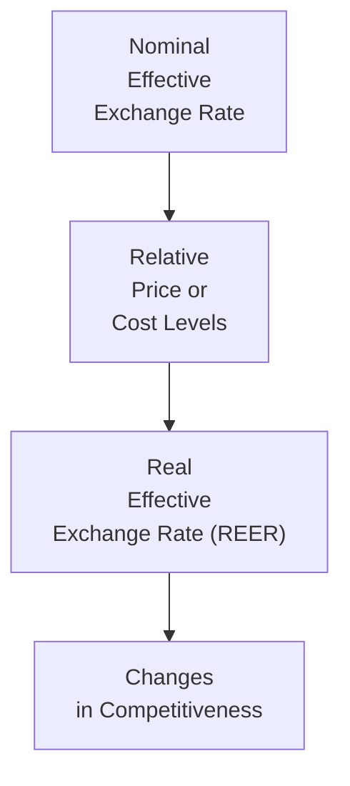
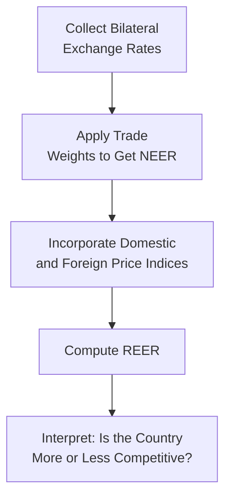

## Introduction

So, I remember the first time I realized exchange rates weren’t just about how much my dollar could buy me in some random café in another country. It dawned on me, quite abruptly, that currencies and relative prices affect whether your home country’s businesses can sell stuff abroad at competitive prices. That’s basically where this concept of the Real Effective Exchange Rate (REER) comes in. Getting a grip on REER is vital if you want to understand how countries measure their competitiveness in global trade—and how they respond with policy tweaks when things go out of whack. 

Below, we’ll explore the meaning of REER, walk through its calculation, and link it to real-life competitiveness. Hopefully, by the end, you’ll see how a rising REER can slowly chip away at export opportunities—or, in some cases, signal so-called “overvaluation.” Let’s dive in.

## Understanding the Real Effective Exchange Rate

A country’s Real Effective Exchange Rate (REER) is essentially its Nominal Effective Exchange Rate (NEER) adjusted for relative inflation or cost levels against a basket of trading partners. You might think of it as the “big picture” gauge of a currency’s overall strength or weakness in terms of purchasing power and competitiveness. 

If you imagine stacking all your country’s trading partners in a line and weighting them by how much trade you do with each one, you wind up with a weighted average of bilateral exchange rates (that’s the NEER). Then you factor in the price (or cost) differences to arrive at the REER. 

When the REER is too high, domestic producers find it tougher to price their goods competitively overseas. This might also spark a creeping current account deficit if they’re not careful. On the flip side, a lower REER can signal undervaluation—where your exports become cheaper abroad. It might help your export sector but can also tick off your trading partners if they think you’re deliberately keeping the currency cheap.

Below is a simple diagram illustrating the concept:

## Calculation and Interpretation

Well, the formula for REER can vary depending on how extended or detailed your basket of goods is, but at its core:

(1) NEER is typically computed as a trade-weighted geometric (or arithmetic) average of bilateral exchange rates. Formally, for a set of N trading partners:

(NEER) = Π ( Eᵢ )^(wᵢ)

where:  
• Eᵢ = nominal bilateral exchange rate with partner i (often expressed as home-currency-per-unit-of-partner’s-currency),  
• wᵢ = weight of partner i in total trade,  
• and Π represents the product across all i.

(2) REER is then the NEER multiplied by the ratio of domestic price index to a weighted measure of foreign price indices. A simplified version might look like:

REER = NEER × ( P_dom / [Π(P_i)^(wᵢ)] )

where:  
• P_dom = domestic price index (e.g., CPI or GDP deflator),  
• P_i = price index for country i,  
• wᵢ = trade weight for partner i.

If REER rises (appreciates) over time, your domestic goods get pricier in foreign markets, which can reduce export competitiveness. If REER falls (depreciates), domestic goods become relatively cheaper abroad, potentially boosting exports.

### Quick Example

Let’s say you have three main trading partners. You compute the trade weights, and you gather local inflation data. Suppose:

• Trade weights: 40% for Partner A, 35% for Partner B, and 25% for Partner C.  
• Nominal bilateral exchange rates: 0.80 (A), 0.90 (B), and 1.10 (C)—all expressed in “home currency per 1 partner currency.”  
• Price indices over a certain base: 105 (domestic), 100 (A), 102 (B), 98 (C).  

You might first compute the NEER as, for instance, a simple weighted product or sum (depending on the approach). Then you’d incorporate the ratio of domestic price to a weighted measure of partner price indices. An increase in your domestic price index relative to the weighted average of partners’ price indices would push the REER higher, indicating an appreciation in real terms.

## Competitiveness Indicators

Trade competitiveness isn’t just about the exchange rate. Inflation differentials matter—rising input costs and wages can quickly bump your price level. Productivity, labor costs, technological leadership, and the ability to innovate also weigh in heavily. If your firm invests in cutting-edge machinery that doubles output per hour, it can often offset the pinch of a stronger currency. 

Moreover, government policies—like infrastructure improvements or streamlined regulations—can reduce operating costs for your exporters. This helps keep the effective price of goods down even when the currency is relatively strong. On the other hand, policy missteps, let’s say high import tariffs on essential production inputs, might sabotage competitiveness over time.

### Internal vs. External Devaluation

We see these terms in policy debates: internal devaluation involves cutting domestic costs—like wages or production overhead—to restore external competitiveness. External devaluation means allowing (or engineering) a weaker nominal exchange rate. The latter can be simpler politically, but it might also invite inflationary pressures if critical imports become more expensive. Internal devaluation tends to be slow and painful (imagine asking an entire labor force to accept lower wages), but it can help align domestic costs with productivity in the long run.

## Policy Responses and Implications

When a country’s REER climbs too high, policymakers might consider:

• Intervening in currency markets by selling domestic currency and buying foreign currency.  
• Implementing contractionary (or expansionary) monetary policy to influence interest rates—and thus capital flows.  
• Encouraging structural reforms to enhance productivity (kind of a fancy way of saying, “Let’s fix our supply-side constraints so we can build things more cheaply.”).  

Conversely, a very low REER can help your exports but might prompt external pressures or accusations of “currency manipulation.” It is often a balancing act.

## Practical Vignette Analysis

On the Level II exam, you might see a vignette with a table that shows you how a country’s REER has changed over the last few years, plus some data about wage growth outpacing productivity growth. The question might ask you to deduce if the country is:
1. At risk of losing competitiveness in the near future.
2. Under pressure by trading partners to adjust its currency policy.
3. Potentially “overvalued” relative to fundamentals.

The correct approach usually involves:

• Checking if the REER has risen/higher than historical average or peers.  
• Noting that wage growth is bigger than productivity gains, meaning inflation could outpace that of trading partners.  
• Concluding that an “overvaluation” scenario might reduce export competitiveness.

## Common Pitfalls

• Ignoring the role of relative prices. Sometimes, candidates focus on nominal exchange rates alone, forgetting that if your inflation is much higher than your neighbor’s, you’re effectively losing competitiveness.  
• Missing the weighting scheme. REER is not just about bilateral exchange rates with your biggest trading partner. Other countries matter, and the weighting can drastically shift the final figure.  
• Oversimplifying. REER is a clue, but not the full story. Productivity growth, structural reforms, supply chain disruptions—these can overshadow the exchange rate effect.  
• Confusing “overvaluation” with a morally wrong scenario. A strong REER might hamper exports but can benefit importers or keep imported inflation low. Over- or undervaluation must be assessed in context.

## Example Diagram of REER Computation Flow

Below is a simplified flow diagram to illustrate how different elements feed into REER:

## Best Practices for the CFA Exam

• Read the vignette carefully. They often provide enough data points (inflation, wage growth, exchange rates) to calculate or estimate changes in REER.  
• Note “weights” in the table. If the data is there, it’s typically relevant to the question.  
• Watch out for small details—like a mention that a certain partner’s inflation soared. This might have a big impact on the weighted index.  
• Practice scenario-based questions. The exam loves to give you a scenario where multiple factors (policy shifts, new trade agreements, commodity price changes) interplay to affect REER and competitiveness.

## References, Further Reading & Tools

• BIS (Bank for International Settlements) REER database: https://www.bis.org/statistics/eer.htm  
• IMF World Economic Outlook: https://www.imf.org/en/Publications/WEO  
• Obstfeld, M. and Rogoff, K. “International Macroeconomics”  
• Keep an eye on official data sources for inflation and productivity metrics.

--------------------------------------------------------------------------------

## Test Your Knowledge: Real Effective Exchange Rate and Competitiveness



### Which statement best describes the Real Effective Exchange Rate (REER)?

- [ ] It is the nominal exchange rate between two currencies that ignores inflation.  
- [ ] It is an average of domestic wages relative to global wages.  
- [x] It is a trade-weighted nominal exchange rate adjusted by relative inflation.  
- [ ] It is an index that measures the domestic cost of labor only.  

> **Explanation:** The REER is the **nominal effective exchange rate** weighted by trade shares and then adjusted for relative inflation or cost levels among trading partners.

---

### An increase in a country’s REER most commonly implies:

- [x] The country’s goods are becoming relatively more expensive to foreign buyers.  
- [ ] The curry you eat on vacation is more affordable at home.  
- [ ] Its inflation rate is necessarily falling.  
- [ ] Its exports cannot exist in foreign markets at all.  

> **Explanation:** A higher REER typically indicates that domestic goods are more expensive to foreign consumers compared to before, which can weaken export competitiveness.

---

### When calculating the nominal effective exchange rate (NEER), trade weights typically:

- [ ] Reflect which currencies are pegged to gold.  
- [x] Reflect the proportion of total trade conducted with each partner.  
- [ ] Are purely random and assigned by the central bank.  
- [ ] Are uniform across all trading partners.  

> **Explanation:** NEER is a weighted average of bilateral exchange rates, where the weight is based on the trade share with each partner.

---

### If domestic inflation is higher than foreign inflation, holding the nominal exchange rate constant, the REER will likely:

- [x] Increase, making domestic goods less competitive.  
- [ ] Decrease, making domestic goods more competitive.  
- [ ] Remain unchanged because inflation is unrelated to exchange rates.  
- [ ] Show no impact unless the current account is in deficit.  

> **Explanation:** Higher domestic inflation, all else equal, means domestic prices rise faster than abroad, increasing the REER.

---

### Which factor is typically NOT considered in calculating a traditional REER index?

- [ ] Bilateral nominal exchange rates.  
- [x] Labor union membership rates.  
- [ ] Relative price indices.  
- [ ] Trade weights.  

> **Explanation:** A standard REER index uses bilateral exchange rates, relative price indices, and trade weights. Labor union membership is not part of the direct calculation (although it can influence wage costs indirectly).

---

### A “strong” REER reading relative to historical averages might suggest:

- [x] Potential overvaluation and reduced export competitiveness.  
- [ ] Immediate surge in domestic inflation.  
- [ ] Zero impact on a country’s current account.  
- [ ] Guaranteed default on sovereign debt.  

> **Explanation:** A strong or relatively high REER can imply overvaluation. This might hurt exports, as goods become pricier in world markets.

---

### An example of internal devaluation might be:

- [ ] Purposely devaluing the currency in foreign exchange markets.  
- [x] Lowering wages and production costs to enhance competitiveness.  
- [ ] Increasing money supply to weaken the currency.  
- [ ] Maintaining a fixed exchange rate at a lower nominal level.  

> **Explanation:** Internal devaluation involves reducing domestic costs (like wages) to improve competitiveness rather than adjusting the nominal exchange rate.

---

### Vignette data show that Country X’s REER has gone up steadily for eight quarters while its productivity remains flat. Which of the following is most likely?

- [x] Country X’s goods are increasingly expensive abroad, hinting at reduced competitiveness.  
- [ ] Country X has become more competitive by drastically cutting wages.  
- [ ] Country X is certain to default on its debt.  
- [ ] Inflation in Country X must be at 0%.  

> **Explanation:** If REER is rising while productivity is stagnant, domestic goods are likely becoming less cost-competitive in global markets.

---

### Which of the following is a key risk when policymakers attempt external devaluation?

- [ ] Lower prices for imported goods.  
- [x] Potentially higher inflation as import costs surge.  
- [ ] An instantaneous drop in supply chain disruptions.  
- [ ] Removal of trade weights from the REER calculation.  

> **Explanation:** Weakening the currency via external devaluation can push up import costs, fueling inflationary pressures.

---

### True or False: A higher REER always indicates a healthier economy.

- [x] True  
- [ ] False  

> **Explanation:** Actually, this is a trick question. The correct statement is likely “False.” A higher REER can signal overvaluation, which might harm exports and lead to current account deficits. But let’s interpret it carefully. In many analyses, a higher REER does not necessarily reflect economic “health.” It can mean the currency is overvalued and might negatively impact competitiveness.  


