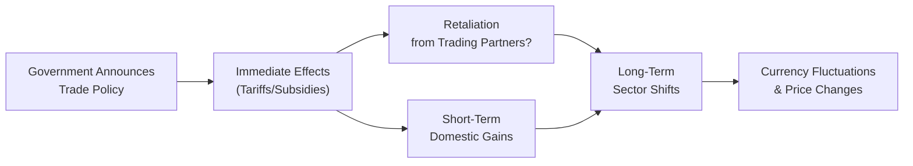

Integrating Multiple Trade Policies  
Sometimes, we’re so focused on a single measure—like a tariff on steel or a subsidy for exporters—that we forget economic policy is often a blend of tools. For instance, it’s not uncommon (though it can feel messy) to witness a government simultaneously raise import duties on agricultural goods, intervene in currency markets to weaken its exchange rate, and push forward a new regional trade agreement. And, well, that’s where scenario analysis comes in handy. We want to piece together how these combined policy shifts can affect entire sectors—maybe giving a boost to local electronics, but leaving automotive manufacturers reeling because their suppliers import pricey steel.  

Policy measures, after all, don’t exist in isolation. By the time they filter into real-world business decisions—like how much to produce or how many employees to hire—firms have to juggle potential cost increases, possible retaliatory actions from trading partners, and big question marks about currency volatility.  

Picture it: A government announces a new regional trade bloc, cutting tariffs on a broad range of imports from certain member countries while simultaneously raising tariffs to non-member nations. Meanwhile, it also provides targeted subsidies to domestic high-tech exporters. Firms must quickly decide whether to source components from abroad, shift operations to bloc member countries, or pass the cost on to consumers. That’s the complexity. And that’s what you’ll often find in item set vignettes at the CFA Level II exam.  

Step-by-Step Scenario Analysis  
One of the best ways to manage all this complexity is to methodically break down policy-related clues that might appear scattered throughout a vignette. A scenario analysis approach gives you a structured framework. Let’s outline the core steps:

Identify the Intended Policy  
The first step is straightforward: figure out what the government or key economic actor is doing. Are they imposing a tariff? Negotiating a trade bloc? Providing export incentives? Slapping on capital controls? Doing all of the above at once? If the vignette references “a 15% tariff on aluminum imports from non-bloc nations,” highlight that. Also note if there’s mention of new tax incentives for local producers of technology hardware.  

Forecast Short-Term vs. Long-Term Impacts  
Policies often have distinct short-term and long-term effects. For instance, a new tariff could raise domestic producer prices quickly, leading to an immediate uptick in revenues for local firms—at least for a few months. But that same tariff might spur retaliation from trading partners over time, potentially curtailing exports. So, in your analysis, try to differentiate the immediate patch from the deeper or more structural changes that come into play later.  

Assess Potential Retaliation  
Retaliatory tariffs and other forms of payback are common in trade disputes. If, say, Country A imposes steep tariffs on steel, Country B may respond by targeting Country A’s agricultural exports. This retaliation can shift the advantage that domestic firms might initially gain. Watch for references in the vignette to other governments threatening or considering a new measure—this is often a sign second-order effects might come into play.  

Evaluate Second-Order Consequences  
This is where you dig a bit deeper. Maybe a tariff on steel helps domestic steel mills, but auto manufacturers suffer from higher input costs, eventually leading to job cuts in auto-heavy regions. Or perhaps a subsidy on high-tech exports spurs currency appreciation over time (through stronger net exports), affecting the competitiveness of other tradable goods. Analyzing possible currency movements, changes to the balance of payments, or broader shifts in labor demand and supply are all critical here.  

Below is a simplified Mermaid.js diagram showing one way to visualize the scenario analysis process:



In a real CFA item set, you might see these arrows scattered throughout the vignette as separate paragraphs: one referencing a possible retaliatory tariff in the future, another hinting that local labor costs are rising, and yet another discussing a new bilateral trade agreement with a neighboring country.  

Sector Outcomes  
Different industries respond to policy changes in very different ways, depending on their reliance on imported inputs, export markets, capital intensities, or labor requirements. A few examples:

• Agriculture  
  If a country with a big domestic farming community places tariffs on competing agricultural imports, local farmers might enjoy higher prices and an expanded share in the home market. But if those same farmers rely heavily on imported seeds or fertilizers, new import tariffs on raw materials could bite into margins.  

• Manufacturing  
  Manufacturing is often a top user of imported raw materials (like steel, aluminum, or plastics). Tariffs on these inputs can significantly raise production costs. If policy simultaneously weakens the domestic currency, exporting might become more lucrative. However, a strong push for local content requirements might also alter supply chains.  

• Technology  
  Tech sectors that export software or cloud-based services might be less sensitive to physical trade barriers (tariffs on tangible goods). Instead, they could be more affected by policy moves related to data localization or cross-border data flows. If the government offers export incentives (like tax breaks for R&D), that’s net supportive for these companies.  

• Services (Tourism, Financial Services)  
  A weakening currency can be a boon for tourism—think of how many people flock to a place where their foreign currency suddenly pays for a whole lot more. But financial services might see uncertainty surge, or perhaps experience new regulation in the form of capital controls.  

Once again, it’s helpful to keep your eyes peeled for how each sector’s trade intensity and reliance on imports vs. exports appear in the vignette. Sectors that rely heavily on imported raw materials might actually lose from a policy that’s meant to protect them if the cost side escalates too much.  

Putting It All Together for the Item Set  
During the exam, you may get a mini “story” about a country that forms a new regional bloc—let’s call it the Global Tech Alliance—while also imposing a special tariff on essential metals from non-alliance members. As a candidate, your job is to pick up on the macro linkages:

• Are there potential inflationary pressures from the tariff raising input costs?  
• Will the currency appreciate or depreciate given a swing in net exports?  
• Does the new trade agreement with alliance partners significantly lower import costs for some industries?  
• Are producers anticipating a wave of retaliation from big global players not in the alliance?  

You might also see references to a rise in local interest rates, possibly due to inflation or central bank policy responding to new economic conditions. That in turn can weigh on growth projections or shift capital flows. The question you want to answer: what is the ultimate net effect on each sector, and how might that feed back into the broader macro environment?  

One quick tip: watch for “hidden details” in the text. A single line referencing “negative public sentiment toward foreign farmers” might imply there’s political pressure for further tariffs on agricultural imports down the road—a clue that the situation might escalate.  

Below is a basic Python snippet to illustrate how you might do a quick sensitivity calculation (in real life or in a practice environment) for how a tariff could influence total costs across several sectors:

```python

def final_price_with_tariff(base_price, tariff_rate, quantity):
    # For simplicity, total cost = (base_price + base_price * tariff_rate) * quantity
    tariff_amount = base_price * tariff_rate
    return (base_price + tariff_amount) * quantity

sectors = ["Agriculture", "Tech", "Manufacturing"]
base_prices = [100, 500, 250]
tariff_rate = 0.10  # 10% tariff
quantities = [10, 5, 20]

for sector, bp, q in zip(sectors, base_prices, quantities):
    total_cost = final_price_with_tariff(bp, tariff_rate, q)
    print(f"{sector} base price: {bp}, quantity: {q}, total cost after tariff: {total_cost}")
```

In a real test environment, you obviously won’t be writing Python code, but seeing the numbers spelled out can help you think systematically about the scale of cost impacts.  

When you’re dealing with item sets, these numbers might be buried inside the details, forcing you to do the math on the spot. But the principle remains the same: keep track of the direct effect of the tariff or subsidy, then factor in any potential indirect or second-order influences.  

A quick KaTeX expression for a simplified tariff effect might be:

 P_{\text{domestic}} = P_{\text{world}} + t 

where \\(t\\) is the per-unit tariff. If a firm was importing at \\( P_{\text{world}} \\), it now pays \\( P_{\text{domestic}} \\). Summed over large quantities, even a modest tariff can become significant.  

Glossary  
• Policy Shock: A sudden change in government policy that can significantly alter market conditions. This can be anything from an unexpected tariff announcement to a surprise currency devaluation.  
• Retaliatory Tariff: A tariff imposed by a foreign country in response to another country’s initial tariff measure—often a hallmark of escalating trade disputes or “trade wars.”  
• Supply Chain Disruption: A break or change in the production process due to shifts in trade policy, currency fluctuations, sanctions, or other external factors that hamper the steady flow of goods and services.  
• Second-Order Effects: Consequences that arise indirectly after the initial policy shift—like a jump in local wages, a shift in currency markets, or the reshuffling of investment flows.  

References, Further Reading & Tools  
• OECD Country Policy Studies (https://www.oecd.org/economy/): Offers plenty of detailed reports on how policy measures can impact economies, helpful for deepening your macro perspective.  
• “Trade Wars are Class Wars” by Matthew Klein and Michael Pettis: A fascinating read on how trade imbalances reflect domestic policies and socioeconomic structures.  
• International Trade Centre Reports (https://intracen.org): Ideal for digging into how small and large exporters alike cope with policy changes, trade barriers, and regional integration.

Conclusion and Exam Tips  
When facing a multi-pronged policy scenario on the CFA Level II exam, keep your mindset systematic. Identify each policy measure, note immediate winners and losers, then shift your attention to possible side effects and longer-term outcomes. Remember that item sets are often designed to see if you can weave together multiple bits of information—like a small mention of “anticipated retaliation” or a single line about “rising import costs in the consumer electronics sector.”  

Don’t forget time management: it’s easy to get bogged down in policy details, so focus on the exam question’s direction. Are they asking for the overall effect on the trade balance? A sector that might suffer from currency strength? Or what happens to inflation forecasts? Zero in on exactly what the question wants, and piece together clues from the vignette.  

Above all, try to keep in mind that real-world trade policies almost never act alone. They interact in dynamic, sometimes surprising ways with each other and with domestic economic conditions like labor markets, interest rates, or even consumer sentiment. Scenario analysis—done in a calm, methodical, and slightly curious way—will give you the best chance to address these complexities on exam day.

## Test Your Knowledge: Policy Shifts and Sector Outcomes



### Scenario Question on Tariff Application
- [ ] The new tariff only benefits exporting industries in every possible scenario.
- [x] The imposition of a tariff may help local producers in the short term but can increase input costs for downstream industries.
- [ ] The new tariff consistently reduces inflation in the domestic market.
- [ ] A tariff eliminates the possibility of retaliatory measures by trading partners.

> **Explanation:** Short-term gains in the protected industry are likely, but downstream users of the import may face higher costs. Additionally, retaliation is a real possibility when imposing unilateral tariffs.

### Multifaceted Policy Effects
- [x] Currency depreciation can benefit export-heavy firms while hurting import-dependent sectors.
- [x] Trade liberalization in a regional bloc can reduce import costs for certain producers.
- [ ] Currency depreciation exclusively benefits importers over exporters.
- [ ] Tariffs have no impact on inflation.

> **Explanation:** When the local currency depreciates, exporters may benefit from cheaper prices abroad, but import-dependent firms face rising costs. Also, liberalizing trade in a bloc can reduce import prices from member nations.

### Policy Shock Implications
- [ ] A policy shock always leads to reduced volatility in the affected market.
- [ ] Policy shocks only occur in emerging markets.
- [x] Policy shocks can lead to unexpected shifts in production locations or investment flows.
- [ ] Policy shocks completely eliminate second-order effects.

> **Explanation:** Sudden changes in policy can quickly alter how firms make decisions about production and investment. That can certainly raise volatility. Second-order effects also frequently appear.

### Retaliatory Tariffs
- [x] Retaliatory tariffs are imposed by a foreign country in response to another country’s initial tariff measure.
- [ ] Retaliatory tariffs are designed to reduce international trade frictions.
- [ ] Retaliatory tariffs never affect domestic consumers.
- [ ] Retaliatory tariffs prevent currency fluctuations.

> **Explanation:** Retaliatory tariffs are a response by trading partners; they can increase international trade tensions, affect prices for domestic consumers, and do not guarantee stable currency levels.

### Sector Analysis Approach
- [x] Understanding each sector’s reliance on imported components is crucial to foresee tariff impacts.
- [x] Export-intensive sectors may gain from currency devaluation but may also be hurt by foreign retaliation.
- [ ] All sectors benefit equally from a single trade policy.
- [ ] Agriculture is never affected by trade policies.

> **Explanation:** Different sectors have varying input structures and trade intensities, leading to varied policy outcomes. Agriculture is often highly affected by trade measures.

### Supply Chain Disruptions
- [x] Supply chain disruptions can stem from abrupt tariff changes and cause production delays.
- [ ] Supply chain disruptions never affect domestic companies.
- [ ] Currency stabilization policies guarantee no supply chain disruptions.
- [ ] Supply chain disruptions only occur in manufacturing and not in services.

> **Explanation:** Tariffs or currency-based interventions can create higher costs or shortages of key inputs, leading to slowdowns across various industries.

### Currency Intervention
- [x] A government might intervene in currency markets to offset adverse effects of tariffs, potentially altering the net trade balance.
- [ ] Central banks never combine interest rate policy with currency interventions.
- [x] Currency intervention can indirectly impact employment in export-driven industries.
- [ ] Currency interventions are prohibited for developed nations.

> **Explanation:** Governments may use currency interventions (e.g., selling the domestic currency) to counterbalance trade policy effects. Such actions can influence employment in exporting sectors, but they can be complex.

### Combining Tariffs and Trade Agreements
- [x] A country can impose tariffs on certain goods while simultaneously joining a regional trade bloc.
- [ ] Such contradictory policies simplify the economic environment for businesses.
- [ ] Once in a trade bloc, all external tariffs must be eliminated.
- [ ] A trade bloc membership typically increases the cost of inputs for local industries.

> **Explanation:** Countries often pursue multiple policies simultaneously. Regional bloc membership can lower trade barriers among members but doesn’t necessarily eliminate external tariffs or complexity.  

### Second-Order Effects
- [x] Second-order effects can include labor market shifts and currency realignments following new tariffs.
- [ ] Second-order effects only occur in the agriculture sector.
- [ ] Second-order effects happen within 24 hours of the new policy.
- [ ] They never involve consumer sentiment changes.

> **Explanation:** After the initial, direct change (e.g., a tariff), there can be indirect impacts on wages, prices in related industries, and even consumer psychology that feed back into the economy over time.

### True or False: Uniform Impacts
- [x] True
- [ ] False

> **Explanation:** True that trade policies rarely have uniform impacts across all sectors. Different industries, with different cost structures and market exposures, will experience distinct effects.


