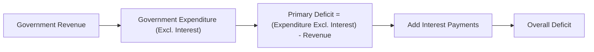

## Introduction

Sometimes I think about the last time I pored over a government’s budget statement—honestly, it felt like reading a really long dinner menu where everything was more expensive than I’d expected. After a while, I realized it wasn’t just about the fancy “fiscal deficit du jour,” but also the context: the economy’s growth potential, interest rates, and how each new pile of debt might or might not be sustainable. In this section, we’ll dig into the nitty-gritty of fiscal deficits, including ways to measure them, their long-term implications, and how rating agencies view countries that keep trying to order everything on the menu without worrying about the final tab.

Understanding fiscal deficits is essential for any investment professional looking to interpret macroeconomic conditions and sovereign risks. Whether you’re eyeing government bonds or just want to keep track of risk premia in your portfolio, a solid grasp of how deficits evolve—and how governments keep them in check—is crucial. We’ll also look at advanced angles such as commodity price fluctuations, public debt metrics, and credit rating assessments.

## Key Definitions and Measures

### Fiscal Deficit vs. Primary Deficit vs. Overall Deficit

• Fiscal Deficit: At its core, a fiscal deficit is the difference between what the government spends (expenditures) and what it takes in (revenues) over a certain period—often a year. We use this term interchangeably with “budget deficit.”  
• Primary Deficit: This measure excludes any interest payments on outstanding debt. Think of it like your household spending minus the interest on your mortgage. It lets you see if the government’s current spending and revenues (excluding legacy debt obligations) are aligned.  
• Overall Deficit: If you add those interest payments on top, you get the overall deficit. This is the actual shortfall the government must finance, usually through borrowing.

Here’s a quick snapshot of how these fit together:

### Structural vs. Cyclical Deficit

• Structural Deficit: The deficit that remains even when the economy is at full capacity (operating at or near potential GDP). It factors out the temporary effects of the business cycle.  
• Cyclical Deficit: This part of the deficit is due to economic downturns or expansions. During a recession, taxes fall and government spending (like unemployment benefits) rises, increasing the deficit. This portion tends to shrink when the economy recovers.

Sometimes, rating agencies prefer looking at a country’s structural deficit. Why? Because it shows whether a government would still be underwater even at full throttle, ignoring cyclical ups and downs.

## Debt Accumulation and Sustainability

When we talk about debt sustainability, we’re essentially asking: “Can the government keep paying off (or rolling over) its debt without an endless upward spiral?” If you see a government’s debt-to-GDP ratio on a steady climb with no sign of abating, that’s a red flag.

### The Interplay of Interest Rates and Growth

One of the classic frameworks used to analyze debt sustainability compares the long-term economic growth rate (g) with the average interest rate (i) on government debt. If nominal GDP growth exceeds the nominal interest rate on debt, the government might manage or even reduce its debt ratio, all else equal, because the economy grows fast enough to keep debt somewhat in check. But if i > g for too long, the debt burden can balloon—it’s like paying an interest rate higher than the rate your income is rising.

### Debt-to-GDP Evolution Formula

A common way to express how the public debt-to-GDP ratio evolves over time is via:


b_{t+1} = (1 + i - g) \times b_t + d_t


Where:  
• \\( b_{t} \\) = Debt-to-GDP ratio at time t  
• \\( i \\) = Nominal interest rate on government debt  
• \\( g \\) = Nominal GDP growth rate  
• \\( d_t \\) = Primary deficit as a % of GDP  

In plain language, the debt ratio next period depends on the current debt ratio multiplied by the factor \\((1 + i - g)\\), plus whatever new primary deficit is incurred. Notice how if \\((1 + i - g)\\) is greater than 1, debt accumulates more quickly relative to GDP (unless the primary deficit is negative, i.e., a surplus). 

### Temporary vs. Persistent Deficits

A one-time spike in the deficit during, say, a surprising global event or economic downturn might be sustainable if growth recovers strongly. Countries can run a deficit this year, but so long as the economy grows faster than the interest payments, you may see the debt ratio stabilize. Persistent deficits, however, cause the ratio to climb year after year, which may raise borrowing costs—higher yields demanded by bondholders—further accelerating the debt spiral.

#### A Quick Numerical Thought Experiment

Imagine a country with:  
• Current debt-to-GDP ratio (\\(b_0\\)) = 60%  
• Nominal interest rate (i) = 5%  
• Nominal GDP growth (g) = 6%  
• Primary deficit ratio (d) = 1%

After one period:  

b_{1} = (1 + 0.05 - 0.06) \times 0.60 + 0.01 = (0.99 \times 0.60) + 0.01 = 0.594 + 0.01 = 0.604


The deficit ratio edges up slightly (from 60% to about 60.4%). Over time, if that growth advantage continues (6% vs. 5%), the debt ratio might level off or even decline. But if growth slows to 3% while interest rates remain at 5%, the ratio expands more rapidly each period (because i - g = 2% in this new scenario, instead of -1%).

## Fiscal Rules and Their Effectiveness

Governments often adopt fiscal rules to keep debt in check. Some popular ones:

• Debt Brake Rules: A legal cap on structural deficits. For instance, the Swiss “debt brake” system aims to ensure deficits over the business cycle match a certain formula pegged to GDP.  
• Deficit Ceilings: The European Union’s Stability and Growth Pact tries to keep deficits below 3% of GDP.  
• Balanced Budget Rules: Some countries require their budgets to be balanced or in surplus by constitution or statute, though these may contain exceptions for emergencies.

These rules are designed to improve market confidence, forcing governments to maintain discipline instead of borrowing recklessly. But you know how it goes: sometimes governments bend the rules by using creative accounting or by reclassifying expenditures to meet short-term targets. Still, markets and credit rating agencies watch these rules closely, as they can be a valuable signal of commitment to sustainability.

## Credit Rating Agencies and Fiscal Analysis

Ever wonder how rating agencies look at a country’s fiscal stance? They dive into more than just deficits:

1. Budget Projections: They consider both official data and their own forecasts. If a government’s baseline is—let’s say—“overly optimistic,” rating agencies might discount it.  
2. Structural vs. Cyclical Deficits: If the deficit is mostly cyclical, agencies may be patient, hoping for a rebound with the business cycle. If it’s structural, that’s a warning sign.  
3. Revenue Assumptions: Overly high estimates of revenue growth, especially in commodity-exporting countries, can raise skepticism.  
4. Debt Maturity Profiles: A big chunk of short-term debt can invite rollover risk.  
5. Political Will for Reform: If a government regularly fails to implement promised fiscal consolidation, rating agencies may penalize them with higher default-risk assessments.

Credit downgrades usually lead to higher borrowing costs, worsening deficits, and potentially fueling a vicious feedback loop.

### Case Example: A Government on the Brink

Imagine a hypothetical country: “Emergistan.”  
• Emergistan’s official budget forecast expects a strong rebound in commodity prices, significantly boosting revenues from oil exports next year.  
• However, rating agencies project a more modest commodity price path, leaving a big gap in expected revenue.  
• Emergistan’s current debt service ratio (DSR) is already around 25% of total revenue, and if interest rates climb (due to a rating downgrade), that ratio could easily surpass 30% or 35%.  
• If the government cannot credibly reduce deficits, the rating is downgraded, causing yields to jump, which in turn inflates the cost of rolling over old debt—and the upward spiral continues.

## Public Debt Metrics in a Broader Macro Context

### Debt Servicing Ratio vs. Debt-to-GDP

• Debt-to-GDP Ratio: This is the general measure for comparing countries. But it’s not always a perfect yardstick if the government has large foreign currency reserves or stronger nominal GDP growth.  
• Debt Servicing Ratio (DSR): The share of government revenues allocated to interest + principal payments. If this ratio is high, it crowds out other vital public spending (like healthcare or education) and can be politically unpopular.

### Inflation, Exchange Rates, and Growth

High inflation can erode the real value of nominal debt, potentially helping governments reduce debt burdens—though it can also spook bondholders into demanding higher yields, raising borrowing costs. A currency depreciation, on the other hand, can help export growth but simultaneously magnify the local-currency cost of foreign-denominated debt.

## Special Situations: Commodity-Exporting Nations

For countries that rely on a narrow commodity base (oil, copper, etc.), deficits are often at the mercy of sharply swinging global prices. It’s one thing to run a deficit if you’re set for a major oil price rebound, but forecasting commodity prices is famously tricky. Debt sustainability analysis for these countries often includes scenarios with a range of possible commodity price paths. If prices plummet, revenues collapse, deficits spike, and the debt ratio can zoom up.

Here’s a simple flow diagram that captures how commodity prices affect debt analysis:

## Exam Tips and Best Practices

• Always Distinguish Between Primary and Overall Deficits: A primary surplus might be a strong positive sign even if the overall deficit looks worrisome.  
• Watch Growth vs. Interest Rates: If growth consistently lags behind the interest rate on debt, that’s a potential sustainability red flag.  
• Check Assumptions in Forecasts: Overly rosy revenue assumptions or ignoring cyclical downturns is a common pitfall.  
• Identify Structural vs. Cyclical Elements: This helps in evaluating which part of the deficit might go away on its own when the economy recovers.  
• Evaluate Fiscal Rules Critically: Are they actually enforced? Or are they mostly political statements with numerous escape clauses?  
• Understand the Country’s Economic Profile: Commodity exporters, emerging markets with volatile currencies, or advanced economies with large deficits each have unique dynamics.

## Final Thoughts

Debt sustainability isn’t just a chart on a spreadsheet—it’s an evolving story of growth, interest rates, politics, and external factors. As you delve deeper into vignettes and real-world scenarios, keep in mind the structural elements that shape a country’s long-term fiscal path. Perhaps the biggest takeaway is that a single snapshot doesn’t tell the whole story: you need to track a government’s trajectory over time and understand how they manage their buffers, revenue sources, and policy constraints.

Many investment decisions come down to how likely you think a government is to be able (and willing) to service its obligations. A rising debt ratio in isolation isn’t automatically a disaster, but ignoring one definitely could be. So keep an eye on primary deficits, watch out for creeping interest costs, and always remember that cyclical factors can mask the real signals beneath the data.

## Glossary

• Fiscal Deficit: The shortfall between government revenues and expenditures over a given period.  
• Primary Deficit: Government deficit excluding interest payments on outstanding debt.  
• Structural Deficit: The portion of a government’s deficit that remains when the economy is at its potential level of output, adjusted for cyclical factors.  
• Cyclical Deficit: The part of the deficit attributed to temporary economic downturns or expansions.  
• Debt Brake Rules: Constitutional or legal rules capping structural deficits to control debt accumulation.  
• Debt-to-GDP Ratio: Public debt divided by total economic output, a common measure of debt sustainability.  
• Debt Servicing Ratio (DSR): The ratio of debt service payments (interest + principal) to a country’s revenues or GDP.

## References and Further Reading

• International Monetary Fund (IMF) “Fiscal Monitor” reports:  
  https://www.imf.org/en/Publications/SPROLLs/fiscal-monitor  
• Gruber, J. “Public Finance and Public Policy.” A robust foundation for theoretical perspectives.  
• CFA Institute Level II Curriculum, Economics: Incorporates methods to interpret fiscal policy stance in investment analysis.

## Test Your Knowledge: Fiscal Deficit and Debt Sustainability Quiz



### A government’s primary deficit is best described as:

- [ ] The shortfall between total revenue and all expenditures, including interest payments.  
- [x] The shortfall between total revenue and expenditures, excluding interest payments.  
- [ ] The shortfall that remains after cyclical adjustments are applied to the budget.  
- [ ] The shortfall only seen during recessions.  

> **Explanation:** The primary deficit excludes interest payments on outstanding debt, isolating whether current revenues match expenditures before legacy debt costs.

### Which best characterizes a structural deficit?

- [ ] A deficit that only appears during economic recessions.  
- [ ] A deficit that disappears when the economy reaches potential GDP.  
- [x] A deficit that remains even when the economy is at full capacity.  
- [ ] A deficit that includes interest payments but excludes new borrowings.  

> **Explanation:** A structural deficit is the deficit that persists even after adjusting for cyclical factors (i.e., at potential GDP).

### If nominal interest rates on government debt exceed nominal GDP growth rates for an extended period, which outcome is most likely?

- [ ] Debt-to-GDP will stabilize around a constant level.  
- [x] Debt-to-GDP is likely to rise if deficits persist.  
- [ ] Debt-to-GDP will fall automatically as real GDP outpaces interest costs.  
- [ ] The government’s nominal interest costs will shrink in real terms.  

> **Explanation:** If i > g over time, and there is a persistent primary deficit, the debt burden as a share of GDP will tend to grow.

### Under which circumstance might a government’s rising overall deficit not pose an immediate threat to debt sustainability?

- [x] When the economy’s growth rate surpasses the government’s borrowing cost.  
- [ ] When the government runs a structural deficit even at potential GDP.  
- [ ] When inflation is so low that real interest rates become negative.  
- [ ] When the government issues all debt in foreign currency.  

> **Explanation:** If growth exceeds borrowing costs, the debt-to-GDP ratio may stabilize or even fall, offsetting concerns of a short-term rise in deficits.

### A country with a high reliance on oil exports is projecting a balanced budget based on continued high oil prices. Which aspect would rating agencies be most concerned about?

- [ ] Rising domestic inflation undermining the local bond market.  
- [ ] Growth and oil prices both declining at the same pace.  
- [x] The possibility that actual oil prices could be lower than the optimistic forecast.  
- [ ] The country’s reliance on short-term debt maturing in five years.  

> **Explanation:** Credit agencies worry most about revenue shortfalls if projected commodity prices do not materialize. Overly optimistic pricing assumptions raise default risk or downgrade potential.

### Which fiscal rule focuses primarily on the government’s structural budget balance rather than the cyclical component?

- [ ] A balanced budget rule that automatically balances each year’s budget.  
- [x] A debt brake rule designed to cap structural deficits.  
- [ ] A golden rule allowing borrowing only for capital expenditures.  
- [ ] A constitutional rule mandating no new debt issuance.  

> **Explanation:** Debt brake rules target structural balances, aiming to prevent excessive debt accumulation over the economic cycle.

### When analyzing default risk, which factor is most likely to concern credit rating agencies regarding a sovereign’s fiscal stance?

- [x] Short-term debt maturities clustered in a tight window.  
- [ ] Low correlation between domestic growth and global commodity prices.  
- [ ] Political stability and consistent elections.  
- [x] Overreliance on cyclical taxes, like capital gains taxes during a stock boom.  

> **Explanation:** Rating agencies focus on rollover risk from large short-term maturities and the reliability of revenue streams. Overreliance on volatile revenues raises default risk if markets turn.

### The debt servicing ratio (DSR) is:

- [ ] The cost of debt service (interest only) relative to government expenditure.  
- [x] The ratio of total debt service (principal + interest) to government revenue or GDP.  
- [ ] The growth of debt levels from one period to the next.  
- [ ] Another term for the debt-to-GDP ratio after cyclical adjustments.  

> **Explanation:** DSR measures how much of the government’s revenue or GDP is devoted to servicing debt obligations, both principal and interest.

### Which statement most accurately describes a cyclical deficit?

- [ ] It measures the deficit even when the economy is performing at full capacity.  
- [ ] It includes all components of government financing requirements.  
- [x] It is the part of the deficit attributable to fluctuations in the business cycle.  
- [ ] It automatically excludes interest payments on outstanding debt.  

> **Explanation:** A cyclical deficit arises from the lower tax revenues and higher safety-net expenditures that occur during an economic downturn.

### Debt sustainability is most directly threatened when:

- [x] The interest rate on government debt consistently exceeds the economy’s growth rate, and the government also runs primary deficits.  
- [ ] Nominal GDP rises above real GDP.  
- [ ] The government issues debt in the local currency at a fixed rate.  
- [ ] Private sector savings rates simultaneously increase.  

> **Explanation:** If nominal interest rates exceed growth for prolonged periods and the government continues to run deficits, the debt-to-GDP ratio can climb rapidly, threatening sustainability.


