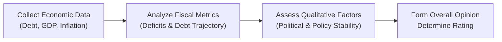

## Introduction

Sovereign credit ratings can feel a bit like a final exam grade for a country. You either pass with flying colors—earning a great rating that signals low default risk—or you’re saddled with a rating that makes lenders a bit nervous about your ability to pay. I remember being amazed the first time I saw how a simple ratings agency announcement could send bond yields skyrocketing from, say, 5% to 8% in a matter of days, all because investors suddenly worried the country might not meet its debt obligations. Here, we’ll delve deep into how these ratings work, why they matter, and how they tie into the broader macroeconomic puzzle you’ve been exploring throughout your CFA® Level II Economics studies.

## Role of Sovereign Credit Ratings in Global Fixed-Income Markets

Sovereign credit ratings—published primarily by Moody’s, Standard & Poor’s (S&P), and Fitch—are forward-looking opinions about a government’s (sovereign’s) relative likelihood of default on its debt obligations. In other words, if you buy bonds issued by Country XYZ, can you expect the government to pay you back, or is there a substantial risk it might default? These ratings inform investors of the relative credit risk and drive the interest rates (or yields) that governments must offer to attract capital.

From a global markets standpoint:

• Higher-rated sovereigns (e.g., AAA or Aaa) generally enjoy lower borrowing costs. Investors perceive these countries to be stable and capable of meeting debt obligations.  
• Lower-rated or “speculative-grade” sovereigns (e.g., BB, B, or even CCC) have to pay higher yields to compensate investors for additional default risk.  

This has a real-world impact: a downgrade can detonate a ripple effect on a country’s currency value (as foreign investors exit), domestic lending conditions (banks face higher funding costs), and overall market sentiment (both equity and debt markets can sour).

## Methodology of Sovereign Credit Ratings

Credit rating agencies look at both quantitative and qualitative factors when assigning or adjusting a sovereign’s rating. It’s almost like a job performance review for a country. They examine the data, conduct interviews, and weigh factors such as leadership, policy, and fiscal soundness. Let’s break down the major components:

### Quantitative Factors

1. Debt and Fiscal Metrics  
   • Government Debt-to-GDP Ratio: A higher ratio often signals heavier repayment burdens. Rating agencies watch this trend over time for signs of unsustainable debt trajectories.  
   • Fiscal Deficits: Persistent deficits may indicate reliance on external financing. Significant deficits without a plan for correction can raise default risk.  
   • External Balances: A country’s current account balance, foreign exchange reserves, and external debt all inform an agency’s view of external vulnerability. If external debt becomes too large compared to export potential or FX reserves, risk rises.  
   • Economic Growth and Stability: Consistent GDP growth is often a protective factor, implying that the government will have more resources to service liabilities.

2. Monetary Factors  
   • Inflation Rate: High or volatile inflation can undermine economic stability.  
   • Exchange Rate Regime: Pegged exchange rates can be precarious, particularly if the peg is overvalued. The risk of a forced devaluation or a broken peg can trigger a default if debt obligations are denominated in foreign currency.

### Qualitative Factors

1. Political Stability and Governance  
   Political upheaval, weak institutions, or corruption can erode the credibility of a government. Credit rating agencies assess things like the rule of law, security of property rights, and the likelihood of sudden policy changes.  

2. Policy Continuity and Effectiveness  
   Does a country’s government have a record of honorably repaying debts, or has it flirted with populist measures that undermine investor confidence? Are fiscal and monetary authorities able to respond effectively to shocks?  

3. Social Cohesion and Demographics  
   Tensions over resource allocation or demographic pressures (like an aging population) can shape a government’s fiscal needs and political priorities, potentially affecting budgetary stability over the medium term.

Below is a simple Mermaid.js diagram summarizing a generic rating agency process:

### Credible Monetary Policy and Default Risk Perceptions

An independent central bank committed to low inflation tends to reassure rating agencies and investors alike. If inflation is well-managed, the real value of debt repayment is somewhat predictable. Additionally, a central bank that can act as a lender of last resort (especially for domestic-currency debt) reduces the immediate liquidity risks that could spur default.

In contrast, a central bank subject to high political interference—perhaps forced to finance large budget deficits through money creation—often leads to inflation spikes or erodes confidence in the currency. This scenario typically raises default risk or at least the perception of it, prompting investors to demand higher yields.

## Investment-Grade vs. Speculative-Grade

Ratings reflect a continuum of default risk:

- Investment-Grade: Examples include S&P’s BBB– and above (Moody’s Baa3 and above). These carry relatively low default risk, albeit not zero.  
- Speculative-Grade (High Yield): Examples include BB+ or below (Ba1 or below for Moody’s). These are higher-risk bonds that need to offer higher yields to attract capital.

Investment-grade vs. speculative-grade plays a pivotal role in institutional investor mandates. Many pension funds, insurance companies, and mutual funds have guidelines restricting them to investment-grade instruments. A downgrade from investment-grade to speculative-grade can force significant selling, driving bond prices down swiftly and yields up—often by hundreds of basis points overnight.

### Case Example: The Infamous Downgrade

Consider the hypothetical example of Country Avoria, which had enjoyed a BBB rating for several years. Economic stagnation, rising inflation, and recurring political crises prompted a rating agency to cut it to BB+. In the matter of days following the announcement, Avoria’s 10-year bond yields spiked from 6% to nearly 9%. Why? A wave of institutional investors were forced to sell due to internal guidelines. Meanwhile, hedge funds and distressed investors demanded higher returns for absorbing the perceived default risk.

## Default Risk in Emerging vs. Developed Markets

Developed markets with established regulatory frameworks, robust capital markets, and generally stable governments are often seen as lower default risk—particularly for local-currency debt. Emerging markets, however, can be more vulnerable due to:

1. Foreign-Currency Debt  
   Many emerging-market economies issue debt in U.S. dollars or euros because local investors cannot absorb large issuances. If the domestic currency depreciates, debt repayments in foreign currency become more expensive, raising default risk.

2. Volatile Commodity Exports  
   Emerging markets often depend heavily on commodity exports. A steep drop in global commodity prices can strain government revenues enough to compromise debt servicing.

3. Political and Governance Risks  
   Sudden changes in leadership, populist policies, or corruption scandals often weigh heavier on sovereign ratings in emerging markets than in developed ones.

## Triggers and Early Warning Signals for Sovereign Default

Rating agencies (and prudent investors) look for certain red flags that might foreshadow a sovereign default:

• Unsustainable Currency Peg: If a government is trying to maintain a fixed exchange rate but is running out of foreign reserves, the peg might crumble, leading to a potential mass devaluation and de facto default on foreign debt.  
• Rapid Depletion of Reserves: When FX reserves are used to defend a currency or meet immediate external debt obligations without replenishment, the country may be heading toward default territory.  
• Large External Debt Rollovers: If a significant portion of debt matures all at once and the country must refinance at higher rates, the debt burden can become unmanageable.  
• Political Instability: Elections that could usher in radical policy changes (e.g., capital controls, radical currency reforms) can be a clear warning sign of potential trouble.

## Impact of Downgrades (or Upgrades)

A downgrade can spark dramatic changes in a sovereign’s bond market dynamics:

1. Bond Prices and Yields  
   A downgrade from AAA to AA, or from BBB– to BB+, almost always sends bond prices lower and yields higher. This re-pricing can happen in a matter of hours—particularly relevant information when you tackle time-sensitive vignettes on the CFA® exam.

2. Currency Value  
   Reduced foreign investor interest often leads to downward pressure on the sovereign’s currency, especially in emerging markets. We saw earlier chapters, such as Chapter 2 on Currency Market Mechanics, emphasize how currency changes can compound the effective yield for foreign investors.

3. Market Sentiment  
   A rating action can serve as a catalyst, influencing overall sentiment about a country’s economy. Equities may also drop in response to heightened uncertainty, and corporate borrowers in that country might face higher funding costs.

## Putting It All Together in Vignette-Style Analysis

In a typical CFA® Level II item set, you might see a short scenario describing a country’s rising debt, political tension, or controversies involving the central bank. You’d be provided with financial statements or yield data, possibly references to the country’s foreign exchange reserves. The question could ask you to:

• Identify why an upcoming election or a potential policy shift increases default risk.  
• Estimate the impact on bond yields if the country’s local-currency rating moves from BBB to BB.  
• Determine how a foreign-currency debt load plus a currency peg might exacerbate default risk.  

Always keep in mind the interplay of factors: debt metrics, governance, currency regime, and capital flows all interweave to shape rating opinions and the resulting yields demanded by the market. When tackling practice questions, do not forget to look out for “warning signals” buried deep in the text—like the mention of rapidly declining foreign reserves or significant external debt maturities in the coming quarter.

## Best Practices and Pitfalls

• Best Practice: Always consider both qualitative and quantitative aspects of the sovereign. A strong GDP growth rate alone might not save a country if its political scene is dangerously unstable.  
• Pitfall: Overlooking currency denomination. Governments generally have more control over local-currency debt, but foreign-currency debt can be a ticking time bomb if the exchange rate shifts sharply.  
• Best Practice: Gauge the structural improvements over one-off cyclical recoveries. Rating agencies favor countries that can sustain growth and stable finances through economic cycles.  
• Pitfall: Believing rating agencies offer perfect foresight. Ratings are opinions, not guarantees. Sudden macro changes can force abrupt rating adjustments.

## Exam Tips and Key Takeaways

1. Remember that a sovereign rating affects many aspects: not just bond yields, but also equity markets, currency values, and the broader perception of economic stability.  
2. In item sets, pay attention to any mention of central bank independence or pegged exchange rate regimes—they can significantly influence the sovereign risk profile.  
3. Keep an eye out for data on external debt, foreign reserves, and upcoming debt maturities. These are prime triggers for short-term modifications in ratings outlooks.  
4. Practice bridging the rating changes to yield differentials. If you see a rating cut from investment-grade to high-yield, expect a large jump. For minor changes within the investment-grade category, the yield shift may be smaller but still material.  
5. Carefully read the qualitative signals: election controversies, political instability, corruption scandals, or major policy shifts are all potential clues pointing to a rating downgrade.  

By dissecting these elements and keeping an eye on rating agency methodologies, you’ll not only nail down exam questions but also gain a deeper feel for how real-world sovereign debt markets behave.

## Glossary

• Sovereign Credit Rating: Third-party assessment of a government’s creditworthiness, indicating its likelihood of defaulting on its debt.  
• Investment-Grade Bonds: Bonds rated BBB– (S&P) or Baa3 (Moody’s) and above, denoting relatively lower default risk.  
• Speculative-Grade (High-Yield) Bonds: Bonds rated below BBB– or Baa3, with higher default risk.  
• Country Risk Premium: Extra yield demanded by investors to compensate for economic, political, and default risks inherent in different countries.  
• Political Risk: The risk that government policy changes, instability, or geopolitical events might infringe upon repayment capacity and overall financial stability.

## References and Further Reading

- Moody’s Sovereign Ratings Methodology, available at moodys.com  
- S&P Global Ratings, Sovereign Analytical Approach, spglobal.com  
- Fitch Ratings, Sovereign Methodology, fitchratings.com  
- IMF Working Papers on Sovereign Debt Restructuring, imf.org  
- CFA Institute Level II Curriculum — Economics Readings on Default Risk and Sovereign Ratings  

---

## Test Your Knowledge about Sovereign Credit Ratings and Default Risk



### Which of the following factors is considered a qualitative aspect in sovereign credit rating assessments?

- [ ] Debt-to-GDP ratio
- [x] Political governance stability
- [ ] Current account deficit
- [ ] Inflation rate

> **Explanation:** Qualitative factors include political stability, effectiveness of governance, and other non-numerical aspects of a country’s risk profile. Quantitative factors include debt ratios, deficits, and inflation rates.

### An upgrade from BBB– to BBB+ for a sovereign bond is most likely to:

- [x] Decrease the required yield, lowering the country’s cost of borrowing.
- [ ] Increase the required yield, reflecting higher default risk.
- [ ] Have no impact on institutional investor portfolios.
- [ ] Immediately trigger mandatory selling of the bonds by all major funds.

> **Explanation:** An upgrade signals reduced default risk. Investors generally demand lower yields, benefiting the sovereign’s cost of borrowing.

### A country forced to defend an overvalued currency peg with declining foreign exchange reserves is:

- [x] More likely to face default risk on its foreign currency debt.
- [ ] Less likely to face default risk across all forms of debt.
- [ ] Equally likely to face default risk on local and external debt.
- [ ] Completely protected from default by the central bank’s independence.

> **Explanation:** Depleted reserves and a stubborn peg can lead to a crisis that impairs the government’s ability to repay foreign currency obligations.

### When a sovereign rating is downgraded from investment-grade to speculative-grade, the most direct market reaction usually includes:

- [x] A jump in yields and a drop in bond prices.
- [ ] An increase in stock prices.
- [ ] No change in spreads for the downgraded bonds.
- [ ] An immediate improvement in the sovereign’s fiscal balance.

> **Explanation:** Moving into speculative-grade territory often forces investment-grade-only funds to sell, pushing bond prices down and yields up.

### Which of the following best explains why credible monetary policy can reduce default risk?

- [x] It stabilizes inflation and supports consistent economic growth.
- [ ] It leads to a permanently fixed exchange rate.
- [ ] It guarantees debt forgiveness by global lenders.
- [ ] It automatically eliminates external vulnerabilities.

> **Explanation:** A credible monetary authority keeps inflation and currency risks in check, making debt servicing more predictable and reducing default concerns.

### Which factor would typically not raise concerns about imminent sovereign default?

- [ ] Surging public debt levels
- [ ] Rapidly depleting foreign reserves
- [ ] Weak governance and political turmoil
- [x] A strong social security fund surplus

> **Explanation:** A large surplus in social security or similar funds generally indicates some fiscal room, whereas surging debt, depleted reserves, and weak governance are common warning signs.

### You observe that a country with a massive external debt load is also running out of foreign reserves. How might rating agencies respond?

- [x] By downgrading the country’s foreign-currency rating due to higher default risk.
- [ ] By upgrading the country’s rating because reserves are not necessary for stability.
- [ ] By maintaining the rating indefinitely to avoid market panic.
- [ ] By eliminating the notion of foreign-currency ratings as they become irrelevant.

> **Explanation:** A shortage of reserves combined with high external debt service is a clear warning sign of default risk, potentially prompting a downgrade.

### In a typical CFA® item set, what should you watch for when assessing if sovereign credit risk is about to rise?

- [x] Political events, currency pegs, and external debt maturity profiles.
- [ ] Micro-level data on a single corporate’s earnings.
- [ ] Individual investor preference shifts.
- [ ] Fluctuations in the housing market alone.

> **Explanation:** Political instability, currency pressures, and external debt metrics are commonly used signals that default risk may be increasing and often appear in exam scenarios.

### Why would an emerging market issuing debt in its own currency generally face lower default risk than if it issued in a foreign currency?

- [x] The government can influence monetary policy, printing local currency to service debt.
- [ ] Foreign currency debt is generally cheaper than local-currency debt.
- [ ] Investors always prefer foreign-currency bonds.
- [ ] Local-currency issues offer no flexibility in repayment.

> **Explanation:** Governments usually have more control over local-currency liabilities. By contrast, foreign-currency debt demands external sources of financing to meet obligations, heightening default risk when reserves are limited.

### Ratings agencies’ opinions on a sovereign’s default risk:

- [x] Are opinions that can change rapidly based on new information.
- [ ] Are binding legal verdicts guaranteeing default or no default.
- [ ] Never change once assigned.
- [ ] Are solely based on anecdotal evidence.

> **Explanation:** Sovereign ratings reflect the agencies’ best assessment at the time. They can be revised with changing economic or political conditions, but they are not legal guarantees.


