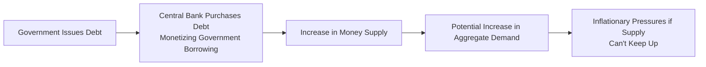

## Understanding Debt Monetization
Debt monetization sounds a bit intimidating, right? But let's break it down as if we’re chatting about it over coffee. Debt monetization occurs when a government issues debt—often in the form of bonds—and the central bank steps in to buy that debt on the open market or sometimes directly from the government. By doing so, the central bank is effectively injecting liquidity (new money) into the economy. This new money can temporarily relieve financing pressures on the government. 

Why might a government do this? Well, imagine your government faces big bills—maybe due to stimulus spending in a recession or infrastructure expansions—and tax revenues aren’t enough. The government can borrow, and if investors aren’t willing or able to buy all those bonds at low interest rates, the central bank might pick up the slack. This direct or indirect purchase of freshly minted government bonds effectively finances government expenditures with newly created money. It sounds convenient, but, as we’ll see, it comes with its own baggage of risks, particularly inflationary pressures.

## Distinguishing Debt Monetization from Quantitative Easing
You might’ve heard of “quantitative easing” (QE)—the strategy many central banks employed after the Global Financial Crisis of 2008. On the surface, QE looks a lot like debt monetization, because both involve the central bank purchasing assets (often government bonds) and injecting money into the economy. However, the two processes differ in motive and outcome:

- In debt monetization, the primary goal is to directly finance government spending. It’s a more explicit method of plugging budget gaps by creating money. 
- In QE, the primary objective is to stimulate overall economic activity by lowering interest rates and encouraging lending. QE typically includes purchases of a broader range of assets, not just new issues of government debt. By purchasing previously issued securities in the secondary market, the central bank’s intention is to maintain liquidity, spur lending, and target inflation levels—it's not (at least officially) about funding a government’s deficit.

That said, if QE happens to reduce the cost of borrowing for a government by keeping yields low, it can still indirectly support higher public spending. The line between QE and debt monetization can get blurry in practice, but in theory, QE is meant to support monetary policy objectives (like stable inflation and full employment), while debt monetization explicitly steps in to finance government deficits with newly circulated money.

## Transmission Mechanism to Inflation
The most significant worry people have about debt monetization is that it can spark runaway inflation. If the government’s spending follows the path of easy money with no serious plan to pay off the debt or balance the budget, you can guess what happens next. More money chasing the same (or fewer) goods leads to rising prices.

Here’s a simple look at the chain reaction:

1. Government sells bonds to cover expenditures.  
2. Central bank buys these bonds, creating new reserves in the banking system.  
3. Banks, flush with excess reserves, can increase lending.  
4. Rising lending can fuel higher consumption and investment, adding to aggregate demand.  
5. If the economy is near full capacity or producers can’t ramp up supply quickly, prices start to rise. 

### Role of Inflation Expectations
There’s a psychological factor too. If households, businesses, and investors believe that the government will keep printing money, they might start raising prices or wages in anticipation of inflation, effectively creating a self-fulfilling cycle. In finance speak, if inflation expectations become “unanchored,” you can see a dramatic spike in actual inflation because everyone starts behaving like inflation is a done deal.

## Historical Perspectives and Modern Echoes
Several real-world episodes give some flavor of how debt monetization can wreak havoc or sometimes bring short-term benefits.

### The Zimbabwe Hyperinflation
Personally, I still remember reading headlines about Zimbabwe’s staggering rates of inflation in the late 2000s—even trillion-dollar banknotes! The government repeatedly financed its spending by having the central bank print money. Each time, it brought quick relief, but prices soared. Eventually, inflation spiraled so far out of control that basic goods became unaffordable, and the Zimbabwean dollar effectively lost almost all its value.

### European Central Bank (ECB) Bond Purchases
In Europe, the ECB’s bond-buying programs—like Outright Monetary Transactions (OMT)—were aimed at preserving the euro and ensuring stable borrowing costs across the Eurozone, particularly during the sovereign debt crises. Critics argued it was simply a roundabout way of monetizing struggling governments’ debt (like Greece or Italy). Proponents of the program pointed out that it was meant to address “unwarranted” market fragmentation and keep the monetary union intact. Whether or not you call it “monetization,” it did help reduce borrowing costs and calm markets—but it also triggered debates about future inflation risks and moral hazard.

## Impact on Currency Value and Investor Confidence
When markets see a government central bank buying up debt in large chunks, alarm bells can sometimes ring. Why? 

• Weakened Currency: If investors suspect uncontrolled money printing, they might dump domestic assets, demanding foreign currency. This can drive down the domestic currency’s exchange rate.  
• Flight of Capital: Fearing declines in currency value, international investors might avoid local bond markets, pushing up yields and making borrowing even costlier for the government in the long run.  
• Widening Yield Spreads: If inflation expectations rise, nominal yields increase to compensate investors for anticipated losses in purchasing power. As a result, the yield curve can steepen dramatically if the market expects future inflation to remain stubbornly high.

For bond investors, the jump in yields means a drop in bond prices—especially on long-duration fixed-rate bonds. That scenario can feed into a vicious cycle: as yields rise, the cost of borrowing for the government goes up, fueling more reliance on central bank purchases, and so on. 

## Potential Pitfalls and Best Practices
There’s a difference between short-term liquidity boosts to manage crises and outright long-running monetization of deficits. Central bankers typically keep a close eye on:

- The output gap: If considerable slack exists in the economy, more money may not immediately translate into high inflation because there’s idle capacity to absorb extra demand. 
- Inflation targeting: Many central banks have a mandate, say to keep inflation near 2%. They can signal that these bond purchases are temporary and that they’ll “mop up” excess liquidity later (i.e., through open market operations or raising rates).  
- Communication strategies: Clear announcements and frameworks can help keep inflation expectations anchored, reducing the risk of a self-fulfilling prophecy. 

In practice, it’s a delicate dance. Communication missteps—or persistent bonds’ purchase to finance deficits—can lead to a rapid loss of confidence in the currency.

## Tying It into Exam-style Scenarios
Imagine an exam vignette describing a government under fiscal pressure due to a severe economic downturn. Tax revenues fell quickly, and the government’s forced to issue big chunks of debt to cover social programs. The central bank steps up bond-buying to stabilize markets. Suddenly, several data points in the vignette hint that the real economy is recovering faster than expected, while money supply growth remains uncurbed. You might be asked how this scenario affects yield curves, currency exchange rates, or corporate investment decisions. The correct analysis might be: yields rise due to inflation concerns, currency depreciates due to perceived policy risk, and corporations see their cost of capital changing accordingly.

Reflecting on your knowledge of debt monetization, you could piece together:

• Whether the central bank’s actions are indeed monetizing the debt or primarily targeting monetary policy objectives.  
• How inflation expectations might adjust in light of the new money entering circulation.  
• The subsequent effect on bond prices, yield spreads, and possibly the exchange rate. 

The key is to interpret the interplay among fiscal policy, central bank actions, inflation expectations, and investor sentiment—typical of the integrated analyses required in item-set style questions.

## A Brief Note on Seigniorage
A term often popping up in these contexts is “seigniorage,” which is the profit earned by the government when it issues currency. Suppose the government prints money worth \$100 but the cost of actually producing that currency (paper, minting, etc.) is \$1. The government effectively makes \$99 in profit. On a broader scale:

$$
\text{Seigniorage} = \frac{\Delta M}{P}
$$

where \\( \Delta M \\) is the increase in the money supply, and \\( P \\) is the price level. In periods of heavy monetization, seigniorage can become a notable revenue source for governments. But once again, too much reliance on seigniorage leads to inflation and an erosion of the currency’s value.

## Key Takeaways for the Exam
• Understand how central bank purchase of government bonds can shift short-term interest rates and long-term yield curves.  
• Identify signs of rising inflation expectations, especially in the presence of large-scale government bond financing.  
• Watch for exchange rate implications. Monetization can undermine currency strength if markets perceive indefinite printing.  
• Distinguish between straightforward debt monetization (direct deficit financing) and QE (broader asset purchase).  
• Practice scenario-based questions: typical item sets will present data points about key macro variables—interest rates, inflation, currency movements—and require tying them together logically.

## Glossary
Debt Monetization: Financing government spending by printing new money, typically through central bank purchases of government bonds.  
Quantitative Easing (QE): Central bank asset purchase programs aiming to lower interest rates and stimulate growth, not always explicitly to fund deficits.  
Inflation Expectations: The public’s forecast of future price level changes, which heavily influence interest rates and bond valuations.  
Seigniorage: The profit a government makes by issuing currency, intrinsically tied to money creation.

## References and Further Reading
• Walsh, Carl E. “Monetary Theory and Policy.” A comprehensive academic treatment of debt monetization, central banking, and policy trade-offs.  
• BIS (Bank for International Settlements) Papers on QE and sovereign bond market consequences, offering data-driven insights.  
• CFA Institute Level II Curriculum, particularly sections covering monetary policy constraints, bond market reactions, and macroeconomic stability.

## Test Your Knowledge: Debt Monetization and Inflation Pressures



### A central bank's direct purchase of newly issued government bonds to cover a budget deficit is generally referred to as:
- [x] Debt monetization.
- [ ] Open market operations aimed at controlling inflation.
- [ ] Sterilized intervention.
- [ ] Corporate bond purchase program.
> **Explanation:** Debt monetization explicitly indicates using newly created money to finance government spending through bond purchases.

### Which of the following most accurately distinguishes quantitative easing (QE) from debt monetization?
- [ ] QE is a private sector bailout; debt monetization involves currency interventions.
- [x] QE is generally designed to stimulate the economy by lowering interest rates, whereas debt monetization directly finances government deficits.
- [ ] QE always involves direct purchases of newly issued treasury bills, but debt monetization includes corporate bonds.
- [ ] QE is essentially inflation-neutral, while monetization is always deflationary.
> **Explanation:** QE is typically a broad-based effort to control interest rates and stimulate growth, while debt monetization explicitly covers the government’s fiscal needs with new money creation.

### In a scenario where the central bank monetizes government debt and no idle capacity remains in the economy, which outcome is most likely?
- [ ] Deflationary pressures on prices due to overstimulation.
- [ ] Strengthening of the domestic currency.
- [x] Increase in inflationary pressures.
- [ ] Lower bond yields across all maturities.
> **Explanation:** If there’s little slack in the economy, more money chasing a similar quantity of goods results in higher prices.

### From an investor’s perspective, which is a direct consequence of rising inflation expectations often associated with debt monetization?
- [ ] Immediate depreciation of bond prices and a surge in yields.
- [x] Lower real values of fixed-income payments.
- [ ] Positive real returns across short-duration bonds, if inflation stays below 1%.
- [ ] Strengthening real exchange rate.
> **Explanation:** When inflation expectations go up, the real purchasing power of fixed coupons decreases, reducing the real value investors receive.

### When inflation expectations become “unanchored” in a heavily monetized economy, market participants tend to:
- [ ] Lower nominal bond yields because of perceived central bank support.
- [ ] Shift entirely to short-term bonds to lock in higher yields.
- [x] Demand higher yields on long-term bonds to compensate for inflation risk.
- [ ] Immediately hoard fiat currency.
> **Explanation:** Unanchored inflation expectations typically lead investors to seek higher nominal yields as compensation for potential loss in purchasing power.

### Which condition most effectively reduces the inflationary impact of debt monetization?
- [x] A significant excess in production capacity (output gap).
- [ ] A strict policy of never purchasing government bonds.
- [ ] A fixed exchange rate regime.
- [ ] High foreign demand for domestic exports.
> **Explanation:** If there’s unused capacity, new money may help boost output without spurring excessive price increases.

### A country’s currency often depreciates when its central bank monetizes debt because:
- [ ] Higher money supply always leads to lower real GDP.
- [x] Investors fear inflation and reduced future purchasing power.
- [ ] Domestic assets become more attractive, encouraging capital inflows.
- [ ] Foreign reserves automatically surge.
> **Explanation:** Monetization can stoke concerns of rampant inflation, prompting investors to exit the currency, thereby weakening its value.

### Which of the following best describes the role of seigniorage in debt monetization?
- [x] It captures the profit from issuing currency, becoming a revenue source for the government.
- [ ] It forces the central bank to charge negative interest rates.
- [ ] It is never associated with new money creation, focusing only on older money in circulation.
- [ ] It leads to an immediate crowding out of private investment.
> **Explanation:** Seigniorage is the revenue the government earns by printing money, playing a significant role in a monetization environment.

### Suppose a developing country’s central bank is buying large amounts of new government debt. Which of the following signals would best confirm that the process is driving up inflation expectations?
- [ ] Stable yield curve but rising GDP.
- [ ] Appreciating currency combined with slower employment growth.
- [ ] Falling nominal bond yields while money supply remains static.
- [x] Rising nominal bond yields and a steepening yield curve.
> **Explanation:** A noticeable increase in yields, especially on longer maturities, often reflects higher anticipated inflation risk.

### A government can mitigate the inflationary impact of debt monetization if it:
- [x] Pairs its monetary expansion with credible commitments to rein in future money supply growth.
- [ ] Guarantees zero long-term interest rates.
- [ ] Encourages the private sector to increase net savings continuously.
- [ ] Pegs its exchange rate to a weaker currency.
> **Explanation:** Signaling a clear and believable plan to reverse liquidity injections helps keep inflation expectations stable.




