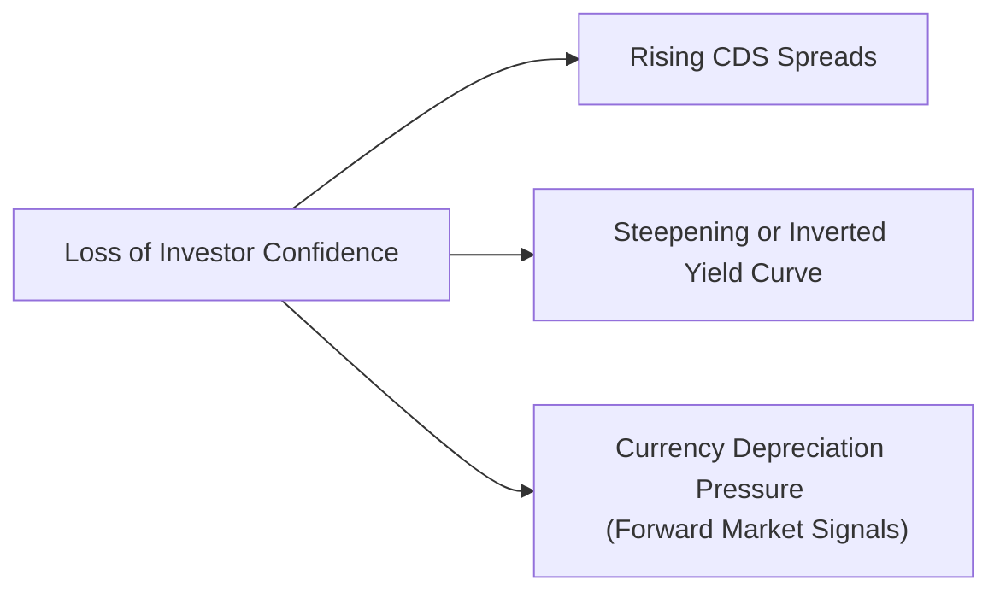

## Understanding Market Perceptions of Sovereign Risk

When I started analyzing emerging markets a few years back, I remember being amazed by how quickly investors shifted their outlook on a country’s debt—sometimes within hours. One moment, markets seemed optimistic about a sovereign’s reforms; the next, a small headline about political uncertainty caused bond prices to plummet, yields to skyrocket, and the currency to spiral downward. This abruptness captures the essence of how the market perceives sovereign risk: fast, data-driven, and heavily influenced by sentiment. Sovereign risk is essentially the probability (and potential severity) of a government failing to meet its debt obligations. Let’s walk through the major elements that shape this perception so you can see how item-set questions might link each component together in a real exam scenario.

## Core Mechanisms for Pricing Sovereign Risk

Market perceptions of sovereign risk emerge primarily in three interlinked markets: the sovereign bond market (via yield spreads), the credit default swap (CDS) market, and the currency market (including forward contracts and exchange rates). Although each market has its own dynamics, they’re all channels for investors to express their confidence—or lack thereof—in a government’s creditworthiness.

### The Role of Sovereign Yield Spreads

A sovereign yield spread is often summarized as:


\text{Sovereign Yield Spread} = Y_{\text{sovereign}} - Y_{\text{benchmark}}


This “benchmark” is usually a major developed market bond, like a U.S. Treasury or German Bund. If an emerging economy’s 10-year bond yields 8.0% and the 10-year U.S. Treasury yields 3.0%, the 5.0% difference is frequently described as the country’s risk premium. When investor sentiment sours—say, due to shaky leadership transitions or a deteriorating fiscal position—demand for that sovereign’s bonds tends to plummet. Prices drop, and yields shoot upward, widening the spread relative to the benchmark. 

In vignettes, keep an eye out for sudden changes in bond yields. A jump of 50 to 100 basis points (bps) in a short time can signal a strong deterioration in perceived creditworthiness, even if there hasn’t yet been an official downgrade by a rating agency.

### Credit Default Swaps (CDS)

A Credit Default Swap (CDS) is essentially insurance against the default of an issuer. Investors buy CDS contracts to protect themselves against the chance that the sovereign won’t pay back its debts. If concerns are minimal, CDS spreads (quoted in basis points of the notional amount) remain low. But if signs of stress emerge—for instance, a surprisingly large fiscal deficit or a spike in inflation that forces the central bank to choose between raising rates or printing more money—CDS spreads can surge rapidly. An increase in a country’s CDS spread from 100 bps to 500 bps is a glaring red flag for markets, often preceding downgrades or forced restructurings.

### Currency Forwards and Exchange Rate Signals

Another potent barometer of investor sentiment is the foreign exchange (FX) market. If investors worry that a sovereign may default, or that the local currency might weaken due to monetary expansion, they often short the currency or hedge by purchasing foreign assets. This selling pressure makes the currency depreciate. Elevated forward points on a currency, or a discount in the forward market, could imply that traders expect depreciation relative to major currencies.

Forward contracts can thus transmit near-term risk perceptions. On the exam, you might see a country’s forward currency rate pricing in a significant devaluation if the central bank is expected to monetize debt. Or question sets might show a risk premium creeping into the forward curve, thereby signaling that investors are anticipating a rough patch for that sovereign’s finances.

## The Influence of Liquidity, Global Risk Appetite, and Flight to Quality

If sovereign risk was purely a function of domestic policy, life might be simpler. But the global financial ecosystem loves to toss additional complexities into the mix. Two critical factors are market liquidity and overall risk appetite:

• Market Liquidity: In periods of calm, investors can buy and sell sovereign bonds without major price dislocations. During a crisis, though, liquidity can evaporate, magnifying price moves. Even a moderate volume of selling can result in disproportionately large yield spikes—partly because there aren’t enough buyers willing to step in at stable prices.

• Global Risk Appetite: In times of broad market optimism, investors tend to hunt for yield, purchasing higher-risk assets (including riskier sovereign and corporate bonds). But if risk appetite collapses—think of those moments when equity volatility soars and people say “We need to get safe now!”—there is a “flight to quality.” Funds swarm toward assets perceived as safer, such as U.S. Treasuries or high-grade corporates. Countries with weaker fundamentals or questionable policy credibility suffer disproportionately, causing their yields and CDS spreads to climb.

This dynamic can create a self-reinforcing spiral. A sudden flight to quality raises borrowing costs for the vulnerable sovereign, making default worries worse, which in turn drives yields and CDS even higher.

## Political and Institutional Factors

Markets don’t only look at numbers—they also track politics, governance, and institutional credibility. A stable country with predictable policies, strong property rights, and low corruption can still face cyclical downturns, but investors tend to believe the government will meet its obligations over the long run. On the other hand, countries with frequent leadership changes, contested elections, or unclear rule of law can see their risk premium balloon, sometimes very quickly. 

• Policy Credibility: If the finance minister or central bank governor is well respected, markets might be more forgiving of short-term fiscal slippages. But if there’s a shock resignation or an abrupt policy reversal, watch how quickly the bond and currency markets react.

• Institutional Strength: Independent judiciaries, central banks, and established parliamentary frameworks reduce the risk of policy volatility—thus lowering risk premiums. You’ll see item-set vignettes referencing legal disputes over debt payments or changes to central bank mandates. Always watch for cues in the text pointing to institutional standoffs, as those can undermine investor confidence.

## Step-by-Step Interpretation of Market Signals

Let’s map a practical sequence for analyzing sovereign risk across these markets. This method is helpful not only in real-world portfolio management but also in dissecting item-set data under exam conditions.

1. Watch the CDS Spread Trajectory  
   - If you notice from an exhibit that a country’s CDS spreads have risen 200 bps over a month, investigate potential triggers: was there a credit-rating warning, a commodity price shock, or rumors of political upheaval?

2. Check Forward Currency Quotes  
   - Next, examine the forward premium (or discount) for the sovereign’s currency. A deep forward discount often signals low confidence in future currency stability. At times, you’ll spot huge disparities between the official exchange rate and the forward-implied rate—hinting at capital controls or severe market fear.

3. Assess the Yield Curve’s Shape  
   - A yield curve can flatten or invert if short-term yields surge due to default fears. Alternatively, long-end yields might spike if the market anticipates runaway inflation or policy missteps. Pay attention to local bond yield movements across maturities.

4. Corroborate with External Data  
   - Check whether there’s a regional crisis or global flight to quality. Perhaps it’s not just one nation’s mismanagement but broader Emerging Market contagion. Or maybe key import/export figures or GDP forecasts are changed drastically. 

5. Evaluate Political Headlines  
   - If item-set vignettes mention “leadership elections next month with no clear front-runner,” you might anticipate further yield spread volatility. Keep your eyes peeled for references to policy announcements or power struggles in the text.

Below is a visual representation of how a loss in investor confidence can simultaneously affect multiple markets:

This diagram shows how a single trigger—say, a negative economic surprise—tends to ripple across CDS, local yields, and currency forwards at roughly the same time.

## Illustrative Scenario: Political Crisis and the CDS Spike

Picture a country called Levantia, historically stable but recently facing intense civil unrest. As protests escalate:

• Bond Yields: Levantia’s 10-year bond yields jump from 4.5% to 6.2% in less than a week.  
• CDS Spreads: Levantia’s 5-year sovereign CDS leaps from 75 bps to 450 bps.  
• Currency: Traders start pricing a 10% depreciation in Levantia’s currency over the next year, up from 2% a month earlier.

In an exam question, you might see data tables pointing to these changes. A typical question could ask you to explain which factor best accounts for the sudden rise (e.g., “a collapse in investor confidence due to civil unrest” vs. “a routine cyclical downturn”) or to calculate the implied probability of default from the jump in the CDS spread. You might also see a question about the effect of forward markets: “Given the exhibit showing Levantia’s spot and forward rates, how are market participants pricing the future exchange rate?”

## Capital Flight, Exchange Rate Volatility, and Portfolio Rebalancing

Once the wheels of fear are set in motion, capital often starts fleeing a troubled sovereign. Investors (both domestic and foreign) scramble to reduce their exposure: either selling local currency bonds, converting those proceeds into a stronger currency, or simply avoiding reinvestment when debt matures. This exodus weakens the local currency, which can in turn spark inflation if imports become more expensive, prompting the central bank to raise interest rates. Higher rates will further slow growth, fueling a negative feedback loop. 

Additionally, domestic investors might also maintain foreign-currency deposits out of fear their local currency accounts will lose value, leading to further depletion of foreign exchange reserves for the central bank. In severe cases, the government may impose capital controls, but those signals also raise red flags for external investors.

## Linking Market Perceptions with Exam-Style Item Sets

On the CFA exam, item sets often combine a narrative about fiscal deficits, changes to political leadership, or external shocks with data exhibits on yield curves, CDS quotes, and forward exchange rates. Candidates must connect the dots:

• Which metric best measures default insurance? (CDS)  
• How do changes in yield spreads reflect shifts in credit risk?  
• What does a forward exchange rate discount tell us about market sentiment?

Watch out for subtle question phrasing. If the text indicates a large official foreign reserve but highlights a sudden surge in political risk, the exam might want you to conclude that the short-term reaction is more about investor sentiment and liquidity (civil unrest overshadowing strong reserves).

## Best Practices, Pitfalls, and Strategies

• Stay Holistic: Don’t fixate on one market. In any real scenario (and likewise in exam item sets), look for consistent signals from the bond market, the CDS market, and the currency market.  
• Beware of Lagging vs. Leading Indicators: CDS can move ahead of rating agency actions, so rating agencies are often behind the curve in times of stress.  
• Don’t Ignore Policy Noise: A sudden policy pronouncement can have an outsized impact if the market perceives it as radical or fiscally irresponsible.  
• Examine Liquidity Conditions: A surge in yield might be partly due to illiquid markets rather than a fundamental default risk. The exam questions might hint at extremely thin trading volumes or large bid–ask spreads.  
• Use Data Exhibits Wisely: Often a table with forward points or yields can be used to directly calculate implied currency depreciation or yield spread changes. Always double-check computational steps to avoid easy mistakes in exam conditions.

## Conclusion and Exam Tips

Market perceptions of sovereign risk are driven by a dynamic set of factors—ranging from hard data like fiscal deficits and reserve levels to more intangible elements like politics and institutional strength. The key for a Level II candidate is to recognize how these concepts show up in item sets and be prepared for computational or conceptual questions linking yields, CDS, and forward rates. 

• Double-check your calculations: Make sure you interpret basis points correctly (e.g., 100 bps = 1%) and apply the right formula for yield spreads.  
• Read the scenario carefully: Often the question’s answer hinges on linking the political or institutional detail provided in the vignette to the specific market reactions shown in the data.  
• Practice scenario-based analysis: Use real-world crises (such as Greece in 2012 or other historical episodes) as mental mini-case studies to see how markets typically respond in sequences.

Continual practice with the typical “vignette + 6 questions” format is the best way to refine your ability to spot clues. As you do so, keep the interplay of yield spreads, CDS quotes, and currency forwards firmly in mind.

## References and Further Reading

- Bank for International Settlements (BIS) Quarterly Reviews:  
  https://www.bis.org/statistics/  
  (Excellent source for global sovereign bond spreads and liquidity data.)  
- Academic case studies of sovereign debt crises, notably Greece during the European debt crisis.  
- CFA Institute Readings on Credit Risk Management and Sovereign Debt Analysis, including coverage of factors driving CDS markets and bond yield spreads.

## Test Your Knowledge: Market Perceptions of Sovereign Risk



### Analyzing a Sudden Jump in CDS Spreads

- [ ] The government introduced a bond-buyback program at lower yields.
- [ ] The central bank announced a substantial interest rate cut in a high-inflation environment.
- [x] Investors fear default, prompting them to buy protection, thus driving CDS spreads higher.
- [ ] The rating agency upgraded the country's debt outlook.

> **Explanation:** Rising CDS spreads typically indicate higher perceived default risk. Investors purchase more protection, causing the CDS spread to move up.

### Interpreting Yield Spreads

- [ ] A sovereign yield spread narrowing from 500 bps to 300 bps indicates a rising default risk.
- [x] A sovereign yield spread narrowing from 500 bps to 300 bps suggests improved market perception of the sovereign’s credit quality.
- [ ] A sovereign yield spread is unaffected by global risk appetite.
- [ ] A 300 bps spread is considered “risk-free.”

> **Explanation:** If the yield spread decreases, it typically signals that investors perceive the sovereign as less risky, potentially due to positive developments or improved fundamentals.

### Flight-to-Quality Phenomenon

- [x] Often pushes yields on low-risk government bonds to lower levels during crisis periods.
- [ ] Results in increased demand for highly speculative assets.
- [ ] Neutralizes differences in global risk appetite.
- [ ] Tends to reduce U.S. Treasury demand in favor of emerging market bonds.

> **Explanation:** Flight to quality involves shifting capital into safer assets (like U.S. Treasuries), driving their yields down and effectively increasing funding costs for riskier issuers.

### Impact of Political Transitions

- [x] Political instability can weaken investor confidence and raise sovereign yields.
- [ ] Smooth electoral processes always lead to higher bond yields.
- [ ] Institutional credibility is irrelevant for CDS pricing.
- [ ] Market participants ignore leadership transitions.

> **Explanation:** Political and institutional factors weigh heavily on perceptions of creditworthiness, often causing yield spreads and CDS to react immediately.

### Monitoring Forward Currency Markets

- [ ] A large forward premium implies the market expects immediate appreciation of the currency.
- [x] A large forward discount can signal expected depreciation or higher perceived risk.
- [ ] Forward and spot markets typically move in opposite directions.
- [ ] Forward markets do not incorporate interest rate differentials.

> **Explanation:** A forward discount can highlight the market’s anticipation of future currency weakness, which might occur if the sovereign faces fiscal or political stress.

### Effect of Capital Flight

- [x] Can trigger a downward spiral where currency devaluation and inflation feed off each other.
- [ ] Provides immediate relief to a sovereign’s budgeting constraints.
- [ ] Automatically stabilizes CDS spreads.
- [ ] Reduces local bond yields.

> **Explanation:** Capital flight deprives a country of needed financing, weakens the exchange rate, and may fuel inflation, making debt service more challenging.

### Institutional Strength and Market Perception

- [x] Strong legal frameworks and credible policies can dampen yield spread volatility.
- [ ] Institutional stability has minimal impact on a sovereign’s credit risk.
- [x] Transparency of fiscal data can lower the perceived risk premium.
- [ ] Sudden leadership changes always lower sovereign yields.

> **Explanation:** Robust institutions and transparency reduce uncertainty, often resulting in narrower spreads and improved market sentiment. Sudden leadership changes, on the other hand, commonly increase risk.

### Yield Curve Inversions and Sovereign Risk

- [x] Inversions sometimes reflect specific near-term default concerns or tight monetary policy.
- [ ] Sovereign yield curves never invert.
- [ ] An inverted yield curve always indicates deflationary conditions.
- [ ] A flat yield curve implies permanent economic stagnation.

> **Explanation:** Yield curve inversions in sovereign markets can signal that short-term borrowing costs have risen sharply due to risk concerns or policy choices, which can be a warning sign for investors.

### Tactical vs. Strategic Flight to Quality

- [x] Short-term flight to quality can be a tactical response to immediate uncertainty.
- [ ] Long-term flight to quality is an irrelevant concept and rarely happens.
- [ ] Tactical and strategic actions by investors are identical in time horizon and purpose.
- [ ] Central banks do not influence flight-to-quality flows.

> **Explanation:** A short-term flight to quality is a tactical maneuver, often in response to crises or uncertainty. In contrast, strategic investors may retain some safe assets over longer horizons as part of overall risk management.

### True or False: Ratings Agencies React Faster Than Markets

- [ ] True
- [x] False

> **Explanation:** Ratings agencies often provide updates after market signals have already indicated a shift in perception. The CDS market, for instance, can move well ahead of official rating changes.


