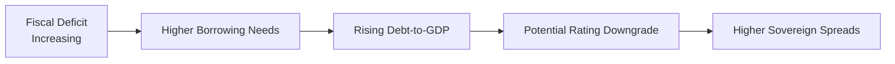

## Introduction and Objectives

In Level II Economics, analyzing public debt might feel a bit daunting. You’re juggling deficits, economic growth data, foreign exchange rates, and possibly a central bank’s tug-of-war with inflation. Occasionally, reading through a vignette crammed with half a dozen paragraphs of macro stats can feel like you’re deciphering a puzzle while the clock ticks away. The goal here is to demystify that process—showing how to systematically parse through item-set prompts and filter the essential signals from the noise.

In the sections that follow, we’ll look at some key themes and techniques for handling item sets that revolve around fiscal policy, sovereign debt, and the possible ramifications of rising deficits in a developing-market environment. We’ll also talk about red herrings (misleading or extraneous details) and how to spot them. By the end, you should be able to break down an item set more effortlessly and approach exam questions with a structured method.

## Why Public Debt Implications Matter

Public debt is not just about a balance sheet item for a government. It affects:
• Exchange rates (especially if the nation faces currency vulnerability).  
• Domestic interest rates and the yield curve.  
• Inflation prospects, especially if the central bank intervenes aggressively.  
• Sovereign credit ratings, which in turn influence corporate and private borrowing costs.  

A rising deficit in a developing country can signal everything from looming capital flight to the possibility of a central bank monetizing debt. If you’ve ever seen headlines about a currency crisis in an emerging market or the market’s reaction to IMF debt negotiations, you have a sense for how quickly these dynamics can shift investor sentiment.

## Vignette Analysis: A Hypothetical Developing Economy

Suppose you encounter a vignette describing “Country X,” a mid-sized developing economy with the following attributes:

• Fiscal deficit steadily increasing from 4% of GDP to 6% over two years, amid slowing global trade.  
• External debt levels rising due to infrastructure initiatives funded by foreign investors.  
• Inflation trends moving upward from 3% to 5% year-over-year, linked partly to currency depreciation.  
• The central bank introducing a bond-buying program “to support market liquidity.”  

You might see a short table referencing IMF forecasts that project further deficits, plus an exhibit showing a chart of the yield curve shifting upward as investor risk perception grows. The question might be: “Evaluate how debt-sustainability metrics could deteriorate given the IMF’s revised growth outlook.”

### Breaking Down the Data

Let’s outline a potential process (one that I personally relied on in my studies when I first saw these big table-heavy vignettes):

1. Identify the Key Debt Figures: Check the current debt-to-GDP ratio, and see how it has changed. Scan the exhibit for newly updated forecasts—sometimes, the updated data point is more critical than historical data.  
2. Track Central Bank Moves: In developing economies, central bank bond-buying programs might be actual debt monetization in disguise. Are they purchasing government debt directly on the primary market or intervening secondarily? The item set might hint at it.  
3. Watch for External Funding Pressures: If foreign investors own a chunk of the country’s total public debt, any negative news might spike yields or lead to capital outflows. That’s a potential trigger for rating downgrades.  
4. Link to Currency Movement and Inflation: Rising deficits often pair with currency pressures. If the currency is weakening, it can feed inflation, which in turn complicates the central bank’s ability to respond through interest rates.  
5. Single Out Red Herrings: The vignette may include details about unrelated political squabbles or sector-level data that, while interesting, might not influence sovereign debt sustainability. Make sure to see whether the text actually ties back to default risk or fiscal capacity.

## Monetization vs. Standard QE

An area that frequently confuses exam candidates is distinguishing between “debt monetization” and standard quantitative easing (QE). Both can involve central bank purchases of government bonds, but the motive and the economic context differ:

• **Debt Monetization** suggests the central bank is effectively printing money to finance government deficits. Typically, this can fuel inflation if overdone and undermines faith in the currency.  
• **QE** aims to lower interest rates and support liquidity, often in a disinflationary or deflationary environment. It’s usually unwound when conditions improve. If the central bank is not adopting an explicit expansionary fiscal stance but is instead trying to stimulate broad lending, you label it more as QE than pure monetization.

### How to Detect Which is Which in a Vignette

Look for wording like “funding ongoing fiscal obligations,” “direct financing arrangement,” or open-ended bond purchases in the primary market (i.e., direct from the treasury). That typically signals monetization. If, however, the central bank is buying across multiple maturities in secondary markets to influence broader monetary conditions, the scenario may be closer to standard QE.

## Potential Impact on Sovereign Spreads

When a country’s deficits rise quickly, especially if accompanied by slow growth, it’s common to see sovereign spreads widen. Yield spreads or Credit Default Swap (CDS) premiums capture the market’s default-risk perception. In your item set question, you might see a chart with the yield spread over U.S. Treasuries (for example) trending higher. Pay attention to any mention of capital outflows or political uncertainty—these often turbocharge the moves.

Below is a simplified flow diagram to illustrate how deficits can escalate into higher spreads:

If you see an exhibit with CDS spreads climbing from 200 bps to 350 bps after an IMF downward revision on growth, that’s a strong sign the market is re-pricing the risk of default or currency debasement.

## Evaluating IMF Forecasts for Deficit Levels

Many vignettes pull in an “IMF forecast for the next two years,” showing:
• Real GDP growth re-estimated downward (e.g., from 4% to 2%).  
• A shift in the primary fiscal deficit from 3% to 5% of GDP.  
• A possible external debt ratio breaching a key threshold (e.g., 50% of GDP).

When you see such numbers, do a quick mental calculation: if growth is slowing while deficits are expanding, the denominator (GDP) might not be keeping up. Debt service could quickly become unsustainable. Watch for narrative clues like, “Moody’s is reviewing the country’s credit rating,” or “Investors have started factoring in a higher likelihood of currency depreciation.” A well-structured response identifies these triggers and draws a conclusion about rising spread risk, rather than just quoting a single data point.

## Catalysts for Rating Downgrades or Upgrades

Within a question, you might encounter references to structural reforms or external liquidity improvements—both of which can shift the direction of a sovereign rating. For example, a new export commodity deal might significantly boost foreign exchange reserves, mitigating some default risk. Alternatively, political instability can accelerate outflows no matter what the official data reports. Overspending or failure to meet fiscal targets is almost always a negative rating catalyst.

### Common Catalysts

• **Downgrade Catalysts:** A spike in the deficit beyond prior guidance; risk of a central bank monetizing debt; sudden capital flight; or a shock to export revenues.  
• **Upgrade Catalysts:** Structural reforms that broaden the tax base; strong external trade agreements that bolster GDP growth; lower reliance on short-term external debt.

## Spotting and Dismissing Red Herrings

Exam vignettes sometimes present additional data that sounds significant but isn’t always relevant to the immediate question. For instance:

• Detailed agricultural production stats that do not tie into export revenue or GDP calculation.  
• A minor spat in parliament about environmental policy that probably won’t shift the wider market perception of sovereign credit.  
• Overly granular demographic data that doesn’t affect near-term debt sustainability.

Your job is to see if that detail intersects with the big picture of debt capability. If not, it could be a red herring. Some of us have wasted precious minutes in an exam analyzing data that had zero weighting on the ultimate question. Don’t let that happen.

## Sample Mini-Vignette: Higher Deficits and Bond Yields

Imagine a short passage:

“Country X’s deficit is projected to hit 7.2% of GDP this year, from 5.6% a year ago. The IMF’s updated forecast shows real GDP growth stabilizing at 3%, down slightly from the prior estimate of 3.2%. Inflation remains elevated at 5.5%, with wage pressures continuing. The central bank’s bond-purchase program, which some analysts label ‘systemic debt monetization,’ has doubled in size, reaching 10% of outstanding government bonds. Meanwhile, external investors hold roughly 40% of the total debt stock, up from 35% last year.”

From this snippet, you might glean the following:

1. Deficit is rising from 5.6% to 7.2%. That’s a decent jump—raise your mental index of sustainability concerns.  
2. Real GDP is still decent at 3%, but not high enough to offset the rising deficit easily.  
3. Inflation at 5.5% suggests the central bank can’t cut rates too drastically to help with debt costs.  
4. That “systemic debt monetization” label is big. Key question: is the central bank truly bridging the fiscal gap by purchasing newly issued debt? Or is it buying older bonds?  
5. External investors hold 40% of the debt. A shift in foreign sentiment could lead to flight and further currency depreciation, aggravating inflation and spread pressures.

## Tips for Chart and Data Exhibit Analysis

• **Yield Curves:** If you see a yield curve chart, check for an inversion or upward shift in yields, especially at shorter maturities. Steepening might imply rising short-term default or inflation risk.  
• **CDS Spreads**: Note any abrupt jump in basis points; a 100 bps surge often signals a significant shift in perceived credit risk.  
• **Debt Maturity Schedules**: If the vignette shows a maturity wall (lots of debt coming due next year), watch out for short-term refinancing struggles.

## Best Practices and Exam Strategy

• Start with a quick scan: Identify whether the question wants a numeric calculation (like a ratio) or a qualitative judgment (like whether debt monetization is happening).  
• Address each data point carefully: Don’t skip the footnotes or side commentary that might mention hedging or swap agreements—sometimes crucial for net debt.  
• Watch for changes in forecasts: If the IMF or a rating agency has “revised” data, incorporate that revision first—older data might be overshadowed now.  
• Tie back to the question: If the question is “What is the rating agency most likely to do next?” gather the relevant rating catalysts from the vignette and weigh them, ignoring details that don’t matter.  

## References and Further Reading

• Review past CFA Institute mock exams for item-set structures (particularly where fixed-income meets macroeconomics).  
• Consult “Fixed Income and Credit Analysis” resources for real-world examples of emerging-market debt issues.  
• The World Bank, IMF, and OECD websites publish both current and historical data on sovereign debt levels, growth rates, and deficits—helpful for seeing how actual crises/near-crises have played out.

## Test Your Knowledge: Public Debt Implications and Sovereign Risk



### A developing economy’s deficit has risen from 4% to 6% of GDP, while inflation picked up from 3% to 5%. Which of the following signals in the vignette best indicates potential debt monetization?

- [ ] The central bank has raised interest rates in the past two quarters.
- [x] The central bank buys a large portion of newly issued government bonds directly.
- [ ] The finance minister mentions expanding tourism revenues by 2%.
- [ ] The central bank has suspended open market operations in the foreign exchange market.

> **Explanation:** Directly purchasing newly issued government bonds suggests the central bank may be creating money to finance government spending.

### When capital outflows accelerate in a developing economy, which of the following is most likely to occur if investors lose confidence in local-assets?

- [ ] Sovereign yields decline due to increased local liquidity.
- [ ] Real GDP growth automatically surges as the currency depreciates.
- [ ] CDS spreads tighten rapidly.
- [x] Sovereign spreads widen, reflecting higher perceived risk.

> **Explanation:** Acceleration in capital outflows increases default and currency risk, which typically widens sovereign spreads.

### Which characteristic might distinguish standard QE from debt monetization within a vignette?

- [ ] The central bank’s operational independence.
- [ ] The involvement of foreign investors as primary buyers.
- [ ] The debt’s maturity structure.
- [x] The explicit aim to fund fiscal deficits through primary market purchase of government bonds.

> **Explanation:** QE typically occurs in secondary markets to adjust monetary conditions; buying newly issued bonds to pay for deficits is monetization.

### A developing country’s credit rating is on “negative watch.” Which of the following factors in the vignette would most strongly support a near-term downgrade?

- [x] The government’s fiscal deficit is projected to be 5 percentage points higher than originally forecast.
- [ ] The foreign reserves have increased moderately due to tourism growth.
- [ ] The private sector is showing strong investment inflows.
- [ ] Wages have stagnated, reducing inflationary pressures.

> **Explanation:** A significant worsening of the fiscal outlook signals higher default probability, a leading downgrade catalyst.

### If a vignette includes a statement about “new infrastructure spending financed by short-term Eurodollar loans,” which immediate concern should be highlighted?

- [x] The risk of refinancing difficulties if global credit conditions tighten.
- [ ] The likelihood of a currency appreciation from the infrastructure project.
- [x] The potential spike in external debt service costs if interest rates rise.
- [ ] The possibility that short-term borrowing will reduce the yield curve slope.

> **Explanation:** Short-term external loans can expose the economy to abrupt financing pressures, especially if global rates rise or capital outflows begin.  

### Suppose a yield curve exhibit shows a significant upward shift across all maturities, combined with a large CDS spread increase. What is this most likely to imply about market sentiment?

- [x] Market participants perceive a higher risk of default or credit event.
- [ ] Market participants expect a surge in the central bank’s gold reserves.
- [ ] A large-scale shift toward equity investment in the country.
- [ ] The currency will automatically appreciate in coming months.

> **Explanation:** A broad rise in yields and wider CDS spreads usually reflect increased risk aversion regarding the sovereign’s creditworthiness.

### Which of the following might qualify as a “red herring” in a vignette focusing on debt sustainability?

- [ ] A note that inflation has jumped 2% due to currency depreciation.
- [x] A lengthy discussion on local dietary trends unrelated to export or import dynamics.
- [x] A minor cabinet reshuffle that does not affect fiscal policy direction.
- [ ] A new tourism deal that significantly boosts foreign exchange inflow.

> **Explanation:** Dietary trends and irrelevant political events are classic red herrings unless they tie back to economic or fiscal themes.

### According to the reading, which factor best indicates that a developing country’s bond-buying program is standard QE rather than direct monetization?

- [ ] The program focuses on short-term bills in primary markets.
- [x] The program is conducted mainly in secondary markets to manage yield levels and liquidity.
- [ ] The program is explicitly designed to finance higher public wages.
- [ ] The program targets direct purchases of newly issued government debt.

> **Explanation:** Standard QE typically involves secondary-market operations to influence broader liquidity conditions.

### Which of the following statements about rating agency behavior is accurate, based on typical exam vignettes?

- [x] Rating agencies often place a country on “negative watch” if fiscal deficits exceed established thresholds with no credible correction plan.
- [ ] Rating agencies do not consider a nation’s external debt composition when making decisions.
- [ ] Rating agencies prefer to wait a full year after a deficit spike before issuing a rating action.
- [ ] Rating agencies rely solely on inflation data to determine outlook.

> **Explanation:** Exceeding certain fiscal thresholds without a credible plan is a major red flag for rating agencies.

### True or False: A central bank purchasing government bonds in the secondary market solely to manage liquidity conditions is typically classified as direct debt monetization.

- [x] True
- [ ] False

> **Explanation:** This statement is actually false in principle; standard QE is typically not classified as debt monetization if the purchases occur in secondary markets to manage monetary policy rather than finance deficits. Therefore, the correct answer is “False.”  



---

**Note:** Always ensure you read the actual question at the end of each vignette carefully. Many times, the question is narrower than you’d expect, zeroing in on just one or two variables. By practicing with real or mock item sets, you’ll develop a steady approach that combines thorough reading, quick numerical checks, and a sense of how to filter out red herrings. Good luck, and remember that mastering the systematic dissection of these details can help you handle anything that might come your way on exam day!
