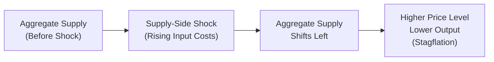

## Understanding Supply-Side Shocks

Have you ever woken up to discover that your favorite coffee beans just doubled in price overnight—maybe due to a bad harvest in Brazil or a sudden spike in shipping costs? Well, that little shock you felt at the store is somewhat analogous to a bigger phenomenon called a “supply-side shock” in macroeconomics. A supply-side shock is basically any unexpected event that changes the cost or availability of important production inputs—like labor, energy, metals, or technology—across an entire economy. And while an annoying coffee price spike might only ruin your morning, a large-scale supply-side shock can throw entire industries into chaos, push price levels higher, reduce output, and even create dreaded stagflation (ugh).

In the context of the CFA® Level II curriculum, supply-side shocks underscore how the production side of the economy can experience abrupt upward or downward shifts. So, let’s walk through these shocks, see how they move the aggregate supply curve, and figure out how to mitigate the resulting risks. We’ll talk about real-life examples, from energy crises to agricultural disasters, and highlight what policymakers and investors can (or sometimes can’t) do to protect themselves.

## Shifting the Aggregate Supply Curve (and Stagflation)

When a supply-side shock occurs—maybe an oil price jump or a resource shortage—the aggregate supply curve in a typical macroeconomic model can shift leftward (i.e., upward in price level) if the shock is negative or rightward if the shock is positive (though we usually worry more about the negative scenarios). A negative shock, such as the sudden disruption in a vital raw material, raises production costs for firms across many sectors. That means:

• A higher price level for consumers.  
• Potentially lower real output (or at least decelerating growth).  

This perilous combination of rising inflation and slowing economic activity is often referred to as stagflation. It’s really the worst of both worlds—folks can’t buy as much as they used to because prices are rising, and companies can’t produce as much because input costs are out of control. It’s one of those dreaded scenarios that keeps policymakers up at night.

To visualize this in a very simplified way, here’s a quick flow diagram of a negative supply shock:

While this diagram oversimplifies reality, it shows how a jolt in input costs or availability can ripple through the entire economy, tamping down output while pushing prices up.

## How Different Sectors Respond

Now, let’s talk about sector-level effects. Different industries rely on different inputs, so you can bet your coffee shortage that each sector’s vulnerability to a shock is unique. Consider the following table:

| Sector          | Key Inputs                                    | Vulnerabilities to Supply-Side Shocks                                                      |
|-----------------|-----------------------------------------------|--------------------------------------------------------------------------------------------|
| Energy          | Oil, Natural Gas, Renewables, Skilled Labor   | Disruptions in oil and gas supply, rising commodity prices for renewables manufacturing, labor strikes |
| Transportation  | Fuel, Infrastructure, Logistics               | Fuel price volatility, shipping disruptions, insufficient infrastructure maintenance       |
| Manufacturing   | Metals, Components, Labor, Electricity        | Commodity price escalations (steel, copper), global supply chain hiccups, potential blackouts |
| Agriculture     | Water, Seeds, Machinery, Fertilizers          | Extreme weather, drought, flooding, volatile input costs (e.g., fertilizers, machinery)    |
| Technology      | Semiconductors, Rare Earth Metals, Talent     | Shortages of chips or rare metals, rapid wage inflation for skilled workers                |
| Utilities       | Natural Gas, Coal, Renewables, Power Grids    | Commodity price surges, grid failures, unforeseen natural disasters affecting infrastructure|

When there’s a big supply-side shock—say, a sudden spike in energy costs—it can severely dent transportation companies’ profits, because fuel is a huge part of their cost base. Meanwhile, heavy manufacturing might see its margins shrink if essential metals suddenly become more expensive or harder to source. In technology, we’ve seen real examples of entire product lines delayed by semiconductor shortages (remember those chip bottlenecks in the auto industry?). Agriculture, of course, is famously vulnerable to extreme weather events—floods, droughts, or storms can literally wipe out an entire harvest.

### Resource-Intensive vs. Labor-Intensive Sectors

Broadly speaking, resource-intensive sectors (e.g., energy, metals & mining, chemical manufacturing) are extremely sensitive to commodity price volatility, because raw inputs form a significant chunk of their production costs. Meanwhile, labor-intensive sectors (e.g., service industries, education, hospitality) might be more exposed to labor shortages or rapid wage inflation.

It’s also worth noting that supply-side shocks sometimes create winners and losers within the same industry. For instance, an agriculture firm that has cleverly hedged fertilizer costs might come out on top during a fertilizer shortage, while its competitor that did no hedging might face reduced margins.

## Policymaker Responses

Central banks and governments don’t just sit around when supply-side shocks happen—although sometimes, there’s only so much they can do. Negative supply shocks can trigger a policy dilemma because standard demand-side measures, like cutting interest rates, may stoke further inflation if the real constraint is on supply.

1. Targeted Subsidies or Tax Breaks: Policy might target certain industries with subsidies (like for renewable energy) to cushion the cost burden of a shock.  
2. Strategic Reserves: Governments sometimes store key commodities—like oil, food grains, or metals—to release into the market when shortages drive prices to damaging levels. Think of the U.S. Strategic Petroleum Reserve or China’s grain reserves.  
3. Emergency Measures: In real crisis scenarios, governments might enact rationing (limiting how much crucial goods or services individuals can buy) or impose export bans to safeguard domestic supply.

That said, these measures can sometimes distort markets if not carefully implemented, and they don’t always fix the underlying issue (like a total shortage of raw materials). For CFA® exam purposes, it’s important to recognize that supply-side shocks often require supply-side or structural policy solutions rather than quick fixes that address only demand.  

## Risk Mitigation Strategies for Investors

All right, if you’re an investor or portfolio manager, how do you handle these big jolts? You can’t exactly control the weather or prevent a global commodity shock, but you can get strategic.

• Sector Rotation: Keep an eye on which sectors are likely to benefit from rising commodity prices (e.g., energy producers) versus those that suffer (e.g., airlines). When early signs of a negative energy shock emerge, rotating from energy-intensive sectors toward upstream commodity producers may help cushion the blow.  
• Hedging with Commodities: Investors often use futures, options, or swaps on key commodities (like oil or agricultural products) to protect themselves against unexpected price spikes. Oil futures are an especially common hedge for transport and shipping companies.  
• Global Diversification: A supply shock might hit one region more severely than another. For instance, a drought in one country may not degrade production in a country halfway around the world. Holding international equities, debt, or real assets can help distribute the risk.  
• Investing in Strategic Reserves: Some hedge funds or large commodity houses even build their own “reserves,” purchasing critical commodities in anticipation of shortages. This approach requires significant capital and expert market knowledge, but it can pay off if the shortage is acute enough.

### Common Pitfalls

• Overconcentration in Vulnerable Sectors: Relying heavily on a sector that’s extremely prone to supply shocks (e.g., cyclical resource extraction) without a carefully designed hedge can blow up an entire portfolio.  
• Neglecting Correlations and Spillovers: Commodity markets are often interconnected; a spike in oil prices can also raise shipping costs, eventually feeding into higher prices for many goods.  
• Panicked Exit: Exiting a market entirely at the first sign of a shock might cause investors to lock in losses unnecessarily—especially if the shock is temporary or smaller than initially feared.

## Real-World Examples

### Energy Crisis Scenario

Imagine a situation where geopolitical tensions escalate, causing a sudden halt in oil exports from a major supplier. Transportation companies watch their fuel bills skyrocket, with cost estimates jumping by 30% in just a couple of weeks. Air travel, trucking, and shipping suffer margin squeezes, and you see airline ticket prices heading north. Meanwhile, alternative energy providers might see a spike in demand for their products, or they might face supply constraints for the metals and batteries required to scale capacity quickly.

### Agricultural Disruption

You might remember episodes of severe drought wiping out crops across large farming regions. In those cases, agricultural commodity prices (corn, wheat, soybeans) can soar. Food-processing companies dealing with these crops struggle to keep up with the cost pressure, passing on higher prices to consumers. If the disruption is global in scale—like a massive El Niño event—entire areas might record historically low yields, spurring further inflationary pressure on food items.

At the same time, businesses with advanced supply chain and storage strategies—like large-scale agribusinesses or well-capitalized conglomerates—might buy grains in anticipation of shortfalls. This foresight can limit losses or even lead to windfall profits if they later sell at the elevated prices.

## Practical Observations

• Keep Track of Policy Trends: If the government is drawing down strategic oil reserves, it may offer short-term price relief. Over the longer run, though, underlying supply constraints might persist.  
• Look for Hedge Indicators: Various forward markets or futures markets will give you a sense of how the industry is pricing potential supply constraints.  
• Monitor Industry-Specific News: In technology, a shortage of a specialized semiconductor can lock up smartphone manufacturing. In agriculture, a fertilizer shortage can quickly spoil farmers’ planting plans.  

## Glossary

• Supply-Side Shock: An event that drastically alters the availability or cost of key production inputs (labor, raw materials, energy).  
• Stagflation: A period of stagnant economic growth or high unemployment, combined with rising inflation.  
• Sector Risk: The exposure of specific industries (energy, agriculture, tech, etc.) to supply or input price shifts.  
• Strategic Reserves: Government-held or privately held caches of essential commodities, released during supply crises to stabilize markets.  
• Hedging: Using derivatives (options, futures, swaps) to offset the risk of adverse price moves in an underlying asset (e.g., oil futures to hedge transport costs).  
• Commodity Price Volatility: Rapid or unpredictable price swings in raw materials, often exacerbated by supply constraints or demand spikes.  
• Sector Rotation: Shifting allocations across different sectors based on economic indicators and expected performance over a given cycle.

## References and Further Reading

- Blanchard, Olivier. “Macroeconomics.” Pearson. Provides an excellent foundation on how supply is analyzed in macroeconomic frameworks.  
- Energy Information Administration (EIA):  
  https://www.eia.gov/  
  Great for real-time data, policy updates, and research on global energy trends.  
- “Global Commodity Markets” by the International Monetary Fund (IMF):  
  https://www.imf.org/external/np/res/commod/index.aspx  
  Provides country-level data on commodity imports/exports and broader analysis on supply conditions.

## Test Your Knowledge: Supply-Side Shocks & Sector Risk Management



### Which statement best describes a supply-side shock?
- [ ] A sudden increase in consumer demand that leads to higher inflation.  
- [x] An unexpected event that alters the cost or availability of critical production inputs.  
- [ ] A long-term increase in the labor force resulting in more productive output.  
- [ ] A monetary policy decision that lowers interest rates.  

> **Explanation:** A supply-side shock is all about unexpected changes in key production inputs—like labor or raw materials—rather than shifts in demand or monetary policy.

### If a negative supply shock causes the aggregate supply curve to shift left, which macroeconomic condition often arises?
- [ ] Deflation with high unemployment.  
- [ ] Higher output accompanied by falling prices.  
- [x] Stagflation, where prices rise while output declines or stagnates.  
- [ ] Rapid economic expansion and lower prices.  

> **Explanation:** A leftward shift in aggregate supply frequently leads to higher price levels and reduced output, known as stagflation.

### In an environment where oil prices suddenly spike, which sector is most likely to face immediate margin compression?
- [x] Transportation (airlines, shipping, etc.)  
- [ ] Software development  
- [ ] Media and entertainment  
- [ ] Telecommunication services  

> **Explanation:** Transportation relies heavily on fuel; a surge in oil prices directly increases costs, compressing profit margins.

### Which of the following is a common policy response to negative supply shocks in energy markets?
- [ ] Cutting interest rates to reduce inflation.  
- [x] Releasing oil from strategic reserves to alleviate sudden shortages.  
- [ ] Increasing capital requirements for banks only.  
- [ ] Immediately banning foreign investment in domestic energy firms.  

> **Explanation:** Governments often use strategic reserves to help stabilize supply and control runaway price spikes during negative energy-related supply shocks.

### What is the primary function of hedging in the context of supply-side shocks?
- [x] To offset or reduce the financial impact of a sudden increase in input prices.  
- [ ] To maximize exposure to commodity price movements.  
- [ ] To remove all risk from an investment portfolio.  
- [ ] To speculate on currency fluctuations only.  

> **Explanation:** Hedging uses financial instruments like futures or options to counterbalance adverse price movements in commodities or other inputs.

### A drought severely reduces agricultural output in a major corn-exporting region. Which statement best describes the initial impact?
- [x] Corn prices likely rise due to reduced supply, pushing up input costs for related industries.  
- [ ] Corn prices rapidly fall, resulting in global deflationary pressures.  
- [ ] There will be no effect on consumer prices as long as government subsidies are in place.  
- [ ] The shipping industry immediately becomes more profitable.  

> **Explanation:** A significant shortage of corn supply typically raises corn prices, increasing costs for multiple sectors like food processing and livestock feed.

### One risk for an investor who has heavily concentrated in oil-refining companies during an energy crisis is that:
- [ ] Refining margins are always higher when oil prices are high.  
- [x] The investor may face elevated sector risk if oil supply disruptions worsen.  
- [ ] The refining sector is fully insulated from input price volatility.  
- [ ] The investor cannot use financial derivatives to reduce exposure.  

> **Explanation:** Oil refining can still be exposed to supply disruptions in crude oil or changes in regulatory policies, creating a concentrated sector risk.

### An example of sector rotation in response to a negative supply shock affecting metals would be:
- [ ] Moving investments from precious metals mining into base metals mining.  
- [ ] Withdrawing all capital from the financial markets.  
- [x] Shifting out of metal-intensive manufacturing stocks and into technology companies less dependent on those inputs.  
- [ ] Buying more shares in the affected metal-consuming manufacturers.  

> **Explanation:** Sector rotation involves reallocating from sectors vulnerable to high commodity costs (e.g., heavy manufacturing) to sectors less exposed (tech, services) when supply-side shocks occur.

### Which scenario exemplifies a positive supply-side shock?
- [ ] A major pipeline rupture that reduces available oil supply.  
- [ ] Prolonged labor strikes across a crucial port city.  
- [ ] A regional conflict that blocks vital shipping routes for metals.  
- [x] Technological breakthroughs that lower production costs in manufacturing.  

> **Explanation:** Positive supply-side shocks reduce production costs and potentially shift the aggregate supply curve rightward, boosting output and lowering price pressures.

### True or False: Governments sometimes turn to rationing key commodities as an extreme response to severe supply-side disruptions.
- [x] True  
- [ ] False  

> **Explanation:** When supplies are critically low, governments can impose rationing to ensure essential goods are distributed more evenly or fairly among the population.


