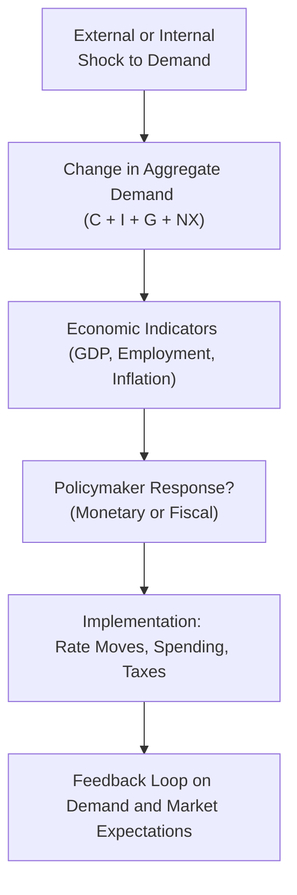

## Overview

Demand-side shocks are those big, and sometimes surprising, jolts to an economy that come from changes in overall demand—think of sharp upswings or downswings in consumer and business spending, abrupt fiscal expansions, or contractions driven by politics or sentiment, or even large-scale global events that cause investors to either rush in or flee. These shocks can be exhilarating if you’re riding the wave of strong demand, but they can also be terrifying if demand suddenly falls off a cliff. In this section, we’ll explore the mechanics of demand-side shocks, how policymakers typically respond, and why financial markets pay such close attention.

## Characteristics of Demand-Side Shocks

A demand-side shock is an unexpected (and often swift) shift in aggregate demand (AD). While “unexpected” can sometimes feel subjective—economists do try to forecast these things—shocks typically take most observers by surprise in scope or timing.

Aggregate demand in an economy can be expressed (in a simplified form) as:

 AD = C + I + G + NX 

where:
- \\( C \\) = Consumer spending  
- \\( I \\) = Business investment  
- \\( G \\) = Government spending  
- \\( NX \\) = Net exports

When any of these components experiences a significant and quick change—such as a plunge in consumer confidence or a dramatic government stimulus package—a demand-side shock may ensue.

### Real-World Examples

• Geopolitical Tensions: Suppose there’s a sudden trade embargo orchestrated by multiple nations. That could freeze certain export markets, drastically lower net exports (NX), and pull aggregate demand downward.

• Large-Scale Fiscal Initiatives: Imagine a government passing a massive infrastructure bill worth hundreds of billions of dollars—households and businesses might see higher incomes or get new jobs, boosting consumption (C) and investment (I).

• Shifts in Consumer/Investor Sentiment: Even something intangible like a viral social media narrative about economic doom can reduce household spending as people get cautious and start saving more. Abrupt shifts in sentiment are potent drivers of demand-side shocks.

## Expansionary vs. Contractionary Demand Shocks

### Expansionary Demand Shocks
When an economy experiences an expansionary demand-side shock, aggregate demand rises rapidly, possibly outstripping the economy’s ability to produce at current capacity. Let’s say an unexpected boom in consumer spending hits retail, housing, and travel all at once. Businesses scramble to increase output, hire more workers, and potentially hike prices in the process. If the economy is near full capacity, inflationary pressures typically accelerate.

### Contractionary Demand Shocks
On the flip side, contractionary shocks occur when demand plummets. Take a scenario where consumer sentiment collapses overnight because of a global pandemic. Spending on restaurants, hotels, and discretionary items slows, and businesses might cut back investment. Unemployment can rise, and deflationary pressures can emerge (or at least disinflation—lower inflation rates). The shock can be self-reinforcing if reduced spending triggers more layoffs and increasingly negative sentiment.

## Policy Tools and Responses

Governments and central banks have several levers to pull in response to these kinds of shocks. Sometimes they do so quickly—like an emergency interest rate cut—and sometimes more gradually, as with longer-term public spending programs.

### Monetary Policy Responses

Central banks can employ:

• Interest Rate Adjustments: Lowering interest rates can be a fast way to stimulate demand. Cheaper rates encourage borrowers to invest in projects or spend on big-ticket items. If an expansionary shock is already running too hot, raising rates might help cool the economy and contain inflation.

• Quantitative Easing (QE): A method of injecting liquidity by purchasing government bonds or other securities in large quantities. This can lower long-term rates and facilitate lending when the conventional rate tool (policy rate) hits near-zero bounds.

• Reserve Requirements: Central banks can adjust how much capital banks must hold in reserve. Lower requirements effectively free up more funds for lending.

• Forward Guidance: This is about communicating intentions. A central bank might say, “Hey, we’re planning to keep rates low for the next 12 months,” and that statement alone influences market expectations, interest rates, and investment decisions right away.

### Fiscal Policy Responses

By contrast, fiscal policy focuses on taxes and government spending:

• Government Spending: Boosting public works, infrastructure, or social programs can directly add to aggregate demand. During downturns, targeted spending might stem job losses. During overheated expansions, spending cuts could help ease inflationary pressures (though politically this is often more challenging).

• Tax Policy: Cutting taxes gives households and businesses more disposable income, hopefully spurring demand. Raising taxes, on the other hand, can help cool an overheated economy or pay down deficits (again, not always easy politically).

• Automatic Stabilizers: These are “built-in” policy tools that require no new legislation to kick in. During recessions, unemployment insurance automatically helps sustain consumer spending, while progressive tax systems collect fewer taxes when incomes fall. These stabilizers help moderate swings in demand.

## The Interplay of Supply and Demand Shocks

Sometimes, an economy faces both a supply shock and a demand shock at the same time. This is the dreaded “stagflation” scenario from the 1970s in which oil supply constraints (negative supply shock) combined with loose monetary policies and robust demand. Policymakers may attempt to quell inflation with rate hikes, but if demand is also contracting, those rate hikes could exacerbate unemployment.

Balancing these considerations is tricky. A contractionary demand shock paired with a negative supply shock spurs tough policy choices. Stimulative policies to boost demand may worsen inflation from the supply shortfall, while tightening policies to rein in inflation could deepen a recession.

## Market Reactions to Demand-Side Shocks

Investors pay close attention to demand-side developments because outcomes can dramatically shift earnings forecasts, interest rates, and asset valuations.

- Equities: A positive demand shock might spur corporate revenues and boost stocks. However, if inflation expectations rise too quickly, equity valuations could suffer if central banks pivot to raising rates.  
- Bonds: In contractionary environments, bond prices often rise (yields fall) if investors anticipate rate cuts. In expansions, bond yields could climb due to expected inflation and subsequent tightening.  
- Foreign Exchange: A significant monetary or fiscal response might strengthen or weaken the currency, depending on interest rate differentials and investor sentiment toward the country.

Here’s a simple diagram illustrating how a demand-side shock can propagate and influence policy responses:

In practice, each arrow might conceal a whirlwind of market speculation, lobbying, or new data releases. But if you follow the chain of events, you’ll see that identifying a demand-side shock is only the beginning. The real puzzle is figuring out how policy and markets evolve in tandem.

## Best Practices and Common Pitfalls

• Watch Capacity Constraints: If you see expansionary demand when output is at or near potential GDP, expect inflation. Analysts often overlook capacity constraints, leading to underestimation of inflationary pressures.

• Consider Political Will: Fiscal policy can be potent, but sometimes legislatures are gridlocked. Even if an expansionary measure is needed, it may get hung up in politics.

• Communicate Clearly: Policymakers who fail to manage expectations (especially around rate decisions) could amplify market volatility. Central banks often use press releases and forward guidance to shape sentiment.

• Avoid “One-Size-Fits-All” Approaches: Stimulus might be counterproductive if the problem is supply-based inflation or structural unemployment. Policy tools need tailoring to the actual situation.

## Personal Reflection

I remember when I first studied the “stagflation” era (1970s) and how perplexed policymakers were by rising prices and rising unemployment. At the time, we all thought that if prices were high, unemployment should be low (the simple Phillips curve notion). But real life can be messy, especially when shocks converge from multiple angles. You can imagine the surprise of economists who had to reconcile theory with practice—kind of like your friend who proudly claims to have the perfect diet, only to give into a chocolate cake binge when stress hits. It’s a reminder that no single framework can predict everything, and a certain level of humility is necessary.

## References

- Mishkin, Frederic S. “The Economics of Money, Banking, and Financial Markets.”  
- Romer, Christina D., and David H. Romer. “The Evolution of Economic Understanding and Postwar Stabilization Policy.” Journal of Economic Perspectives.  
- Federal Reserve publications on policy tools and guidelines: https://www.federalreserve.gov/

-----

## Test Your Knowledge: Demand-Side Shocks and Policy Responses



### Which of the following is an example of a demand-side shock?

- [ ] A sudden increase in oil prices that restricts production.
- [ ] An unexpected famine that reduces the nation’s labor force.
- [x] A large-scale government infrastructure program massively boosting consumer and business spending.
- [ ] A technological improvement that lowers production costs.

> **Explanation:** A surge in spending due to government infrastructure outlays shifts aggregate demand upward, making it a clear example of a demand-side shock.

### When an economy is operating near full capacity, an expansionary demand shock is most likely to result in:

- [ ] Reduced inflation and rising unemployment.
- [x] Increasing inflationary pressures.
- [ ] A decline in nominal interest rates.
- [ ] A significant drop in business confidence.

> **Explanation:** Near full capacity, additional demand increases pressure on limited resources, pushing prices up and generating inflationary pressures.

### What is the typical central bank response to a significant contractionary demand shock?

- [ ] Increasing taxes to reduce disposable income.
- [ ] Hiking required reserve ratios to secure bank capital.
- [x] Cutting interest rates to encourage borrowing and spending.
- [ ] Selling government bonds to reduce the money supply.

> **Explanation:** Central banks commonly lower rates to boost borrowing and demand during a major contractionary scenario.

### Which of the following policy tools is an example of an automatic stabilizer?

- [x] A progressive income tax system that collects less tax when incomes fall.
- [ ] A new stimulus bill passed by Congress.
- [ ] A central bank’s announcement of future QE.
- [ ] A sudden cut in corporate tax rates through executive order.

> **Explanation:** Progressive tax systems automatically adjust tax liabilities with changes in income, helping stabilize demand without new legislation.

### Which of the following events could be considered both a demand shock and a supply shock?

- [x] A major geopolitical conflict that reduces international trade while frightening consumers into curtailing spending.
- [ ] An unexpected agricultural breakthrough that increases yields.
- [ ] A corporate tax cut boosting company investments.
- [ ] A sudden technology failure that halts production temporarily.

> **Explanation:** A geopolitical conflict can disrupt supply chains (supply shock) and hit consumer confidence at the same time (demand shock).

### If aggregate demand suddenly declines and policymakers respond too slowly, the likely outcome could be:

- [ ] Accelerating inflation with constant GDP.
- [ ] Rapid growth in GDP.
- [x] Rising unemployment and possible deflationary pressure.
- [ ] Neutral effect on output and prices.

> **Explanation:** With a delayed response, businesses cut production and staff, causing unemployment to rise and demand to drop further, possibly inciting deflation.

### How do bond markets typically react to an abrupt contractionary demand shock?

- [x] Bond prices usually rise as yields fall, anticipating lower interest rates.
- [ ] Bond prices usually fall as yields rise, expecting higher interest rates.
- [ ] Bond prices remain unaffected by demand conditions.
- [ ] Real yields always rise due to inflation anxiety.

> **Explanation:** During a contractionary shock, investors often expect central banks to cut rates, driving bond yields lower (so prices rise).

### Which of the following describes the simultaneous presence of a negative supply shock and a contractionary demand shock?

- [x] Policymakers face difficult trade-offs between stabilizing prices and supporting demand.
- [ ] Automatic stabilizers will fix both issues immediately.
- [ ] It typically leads to hyperinflation.
- [ ] It has no impact on unemployment.

> **Explanation:** Negative supply shocks push prices up, while contractionary demand shocks reduce spending and growth—a tough scenario that forces policymakers to prioritize between inflation control and employment.

### An expansionary fiscal policy might be least effective if:

- [x] The economy is already near or at full capacity.
- [ ] The economy is in a deep recession.
- [ ] There are no supply constraints.
- [ ] The government implements a temporary tax cut.

> **Explanation:** When near full capacity, additional fiscal stimulus can quickly translate into inflation rather than increased output.

### Automatic stabilizers differ from discretionary fiscal measures because they:

- [x] Work without additional legislative or political intervention.
- [ ] Require a new bill or executive order to take effect.
- [ ] Are solely driven by the central bank.
- [ ] Increase the volatility of business cycles.

> **Explanation:** Automatic stabilizers (like unemployment insurance, progressive taxes) operate based on prevailing economic conditions without the need for new legislative action.


