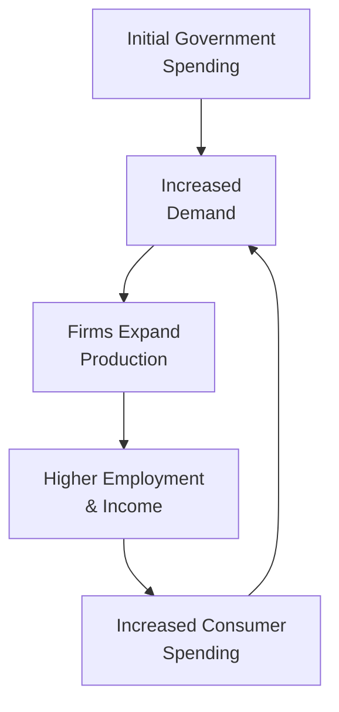

## Understanding Externalities

Have you ever been awakened at 6 am because your neighbor decided it was a great time to run a leaf blower? Or maybe you’ve benefited from a lovely community park near your home, even though you never chipped in for its maintenance costs? These are real-life examples of externalities—those pesky or pleasant side effects of economic activities that spill over onto parties who aren’t directly involved in a transaction.

In macroeconomic terms, externalities occur when the actions of individuals, firms, or governments impose costs or confer benefits on others without direct compensation or payment. Despite sounding trivial in some everyday contexts, externalities can have a substantial impact on economic efficiency and resource allocation when aggregated across entire industries or nations.

### Positive vs. Negative Externalities

• Negative externalities happen when the side effects harm non-consenting third parties. Think of pollution from a factory or congestion created by an influx of cars on a highway. The cost of these side effects—health risks, environmental damage, wasted time—typically isn’t reflected in the price of the product or service causing the harm.  
• Positive externalities represent beneficial spillovers. For instance, a company invests in worker training, and that skill development later benefits other firms when those trained workers switch jobs. Or a technological breakthrough in green energy that reduces greenhouse gas emissions for everyone, not just the adopting firm.

### Market Failure and the Role of Government

When the price of a good doesn’t capture all the social costs (negative externality) or all the social benefits (positive externality), market outcomes can be inefficient. Economists call these scenarios “market failures” because they deviate from the ideal free-market outcome. In many cases, governments step in to address these inefficiencies, often using tools such as:

• Taxes (to discourage negative externalities, e.g., carbon taxes)  
• Subsidies (to encourage positive externalities, e.g., grants for green technology)  
• Regulations (emission standards, zoning laws)  
• Provision of public goods (defense, basic infrastructure, and so forth)

It may feel like a hassle (Ever filed corporate tax forms?), but government policies aim to align private incentives with socially optimal outcomes. For example, a carbon tax tries to internalize the cost of environmental damage into the market price of emissions. Similarly, subsidies for education might encourage more widespread skill development. 

## Public Goods and Why They Matter

There’s an important related concept here: public goods. These are goods or services that are both non-rivalrous (your consumption doesn’t reduce how much is available to someone else) and non-excludable (you can’t easily stop others from enjoying the benefits). Classic examples include street lighting, a national defense system, or a scenic park.

Public goods are almost always subject to the “free-rider problem”—people can benefit from these goods whether or not they pay for them. Because the private sector can’t capture enough revenue to justify providing public goods at a socially optimal level, government provision (usually funded through taxation) becomes crucial. Like externalities, public goods illuminate why unfettered markets sometimes need outside intervention to produce the best results for society.

## Fiscal Multipliers: The Amplification Effect

Let’s pivot to a concept many of us first hear about in macroeconomics: the fiscal multiplier. The idea is pretty simple but profoundly powerful: a one-dollar increase or decrease in government spending can lead to more (or less) than one-dollar worth of change in a country’s overall GDP.

### Why Multipliers Exist

If the government decides to build a bridge, it pays construction firms, who in turn pay workers, who then spend their salaries on groceries, shoes, and maybe streaming services—look, we all enjoy guilty pleasures sometimes. That extra consumer spending ripples through the economy, creating additional rounds of income for firms and employees in a wide range of industries.

This chain reaction, or ripple effect, is what we call the “multiplier process.” But the size and magnitude of this multiplier can vary dramatically depending on factors like:

• The marginal propensity to consume (MPC)  
• The economy’s openness to trade  
• Interest rates and the liquidity trap  
• The extent of idle resources  
• Confidence levels and credit availability

### Simplified Two-Sector Model

In a very simplistic, two-sector (households and government) closed economy model with no taxes, the multiplier \\(\text{(k)}\\) might look like this:


k = \frac{1}{1 - \text{MPC}}


If the marginal propensity to consume (MPC) is 0.8, then:


k = \frac{1}{1 - 0.8} = \frac{1}{0.2} = 5


Meaning the initial increase in government spending of \$1 could (in theory) create up to \$5 in additional output. However, such a model often overlooks taxes, imports, and real-world complexities like inflation or shifts in consumer confidence.

### More Realistic Three-Sector Model

Let’s add taxes (T) and imports (M). In a three-sector model that includes government, households, and a foreign sector, the multiplier formula often modifies to account for leakages (taxes and imports). A more common multiplier expression can look like:


k = \frac{1}{1 - \text{MPC} \times (1 - t) + m}


Here:  
• \\( t \\) is the average tax rate (a fraction of income).  
• \\( m \\) is the marginal propensity to import.  
• The term \\((1 - t)\\) is the fraction of disposable income people can actually spend.  

If your economy has significant leakages through taxes and imports, a big chunk of every additional dollar earned doesn’t get spent domestically, so the multiplier effect shrinks accordingly.

## Short-Run vs. Long-Run Implications

Well, multipliers are exciting in the short run—public works projects might quickly get money into people’s pockets. But in the long run, certain factors can limit or reduce these beneficial impacts:

• Crowding Out: When the government borrows heavily to fund spending, that might push up interest rates, making it more expensive for the private sector to borrow for investment. Hence, government spending could “crowd out” private spending—reducing the net positive effect on GDP.  
• Inflation: If an economy is already near full capacity, increasing demand further might result in inflation rather than real output growth.  
• Future Tax Burden: Debt-financed spending has to be repaid or rolled over. Potentially, future tax hikes or reduced spending programs might offset the earlier positive effect.

Also, in scenarios like a liquidity trap, central banks (with rates near zero) may lose efficacy in jump-starting the economy. In these cases, strong fiscal stimulus could indeed achieve a potent multiplier effect since there’s less risk that higher interest rates will choke off private spending.

## Visualizing the Spending Cycle

Here is a basic flowchart showing how government spending can circulate through an economy, creating multiplier effects:

Notice that the loop continues as long as there’s some portion of added income that’s spent back into domestic markets. But each cycle might be smaller than the last because of savings, taxes, and imports (leakages).

## Real-World Vignettes and Examples

### Infrastructure Projects

Probably the most cited modern example is large-scale infrastructure spending. Suppose a government invests in highways or high-speed rail. Not only do construction firms benefit, but also a broader “positive externality” arises if these projects reduce transportation costs and help businesses operate more efficiently. That can stimulate private sector investment on top of the direct spending effect.

### Healthcare and Education

Government support for healthcare and education often yields positive externalities. A community with better healthcare can reduce absenteeism, boost labor productivity, and even lower insurance costs. In the long run, well-educated populations foster innovation. From a fiscal perspective, those higher skills and productivity feed back into stronger GDP—amplifying the initial government expenditures through the multiplier process (though with a potentially long lag).

### Green Energy Subsidies

Imagine a firm invests in clean-energy technology using a government research subsidy. The entire population reaps the environmental benefits (reduced pollution, lower long-term climate risks), and other firms might apply the breakthroughs to develop new products. We see potential for a double effect: a stimulus to the manufacturing sector (short-term multiplier) and a positive externality in terms of a healthier environment (long-term benefit).

## Balancing Act: Watch Out for Pitfalls

• Overstating the Multiplier: Sometimes we get carried away with the idea that a dollar spent will magically produce five or six more. Real economies have frictions, leakages, and dynamic changes in consumer behavior.  
• Timing Lags: Government programs aren’t instant. It can take months or even years to get a major infrastructure project on track, at which point the economy’s original problem might have shifted.  
• Political Myopia: Politicians often focus on projects that look good to voters rather than those that yield the highest social returns. Hello to the infamous “Bridge to Nowhere.”  
• International Reactions: In open economies, part of that new spending might flow into imports, limiting the domestic multiplier while potentially boosting economic output in a trading partner’s economy.

## Putting It All Together for CFA® Candidates

On the CFA® Level II exam, these concepts commonly appear in vignettes that discuss government policy decisions, macroeconomic conditions, or global shifts in demand. You might see an item set describing a proposed infrastructure program and be asked to analyze its likely impact on GDP, interest rates, or the private sector. Or, you might need to assess how externalities from a large corporate project affect local communities and government intervention.

• Understand how externalities can lead to non-optimal market outcomes.  
• Consider how the magnitude of a fiscal multiplier changes under various economic conditions.  
• Be mindful of short-run vs. long-run nuances (especially crowding out).  
• Carefully parse any data on taxes, import propensity, and consumer spending to gauge the likely multiplier effect.  

Stay focused on the big picture: externalities can justify government involvement, while fiscal multipliers show how those interventions may influence aggregate demand. In exam questions, integrating these ideas helps form a more holistic analysis of economic scenarios.

## References and Further Reading

- Krugman, Paul, and Wells, Robin. “Macroeconomics.” Worth Publishers.  
- “Fiscal Multipliers: Size, Determinants, and Use in Macroeconomic Projections,” IMF Working Paper: https://www.imf.org/external/pubs/ft/wp/  
- Stiglitz, Joseph E. “Economics of the Public Sector.”  
- For official curriculum context, see CFA Institute Level II Economics readings on fiscal policy and market failures.

---

## Test Your Knowledge: Externalities and Multiplier Effects



### 1. Which of the following describes a potential positive externality?
- [x] A firm invests in employee training, and other firms later benefit from the enhanced skills of those workers.  
- [ ] A concert that sells tickets and excludes non-payers from attending.  
- [ ] A local factory emits waste into the river, harming the local fisheries.  
- [ ] A toll road that requires all drivers to pay a fee for use.  

> **Explanation:** Employee training that increases workforce skills can spill over to other firms if workers move. This benefit is not directly compensated, qualifying as a positive externality.

### 2. Why do negative externalities cause market failures?
- [ ] Because they allow producers to internalize all costs.  
- [x] Because the social cost is higher than the private cost, leading to overproduction.  
- [ ] Because they always result in underproduction of goods.  
- [ ] Because prices incorporate all external costs without government intervention.  

> **Explanation:** Negative externalities mean some costs are borne by third parties rather than the producer, so the market overproduces relative to the socially optimal amount.

### 3. Which policy measure is most relevant for reducing negative externalities?
- [ ] Decreasing the marginal propensity to save.  
- [x] Imposing a corrective (Pigouvian) tax on the polluter.  
- [ ] Increasing government expenditures on unrelated projects.  
- [ ] Eliminating trade barriers on imports.  

> **Explanation:** A Pigouvian tax forces the polluter to internalize some or all of the external costs, thereby aligning private costs with social costs.

### 4. Public goods are often provided by the government because:
- [x] They are non-rivalrous and non-excludable, creating a free-rider problem.  
- [ ] Their consumption can be monitored and charged without difficulty.  
- [ ] Private firms can effectively monetize every user’s consumption.  
- [ ] The MPC is greater than one.  

> **Explanation:** Public goods are non-rivalrous and non-excludable. Because you can’t prevent non-payers from using them, private markets tend to underprovide such goods.

### 5. In a simple multiplier model with no taxes or imports and an MPC of 0.75, how large is the fiscal multiplier?
- [x] 4  
- [ ] 2  
- [ ] 3  
- [ ] 5  

> **Explanation:** The multiplier k = 1 / (1 – MPC) = 1 / (1 – 0.75) = 4.

### 6. Which factor would most likely reduce the effectiveness of fiscal multipliers?
- [ ] Low interest rates and unused capacity.  
- [ ] High marginal propensity to consume.  
- [x] Rising interest rates that crowd out private investment.  
- [ ] A narrow balance of payments deficit.  

> **Explanation:** Crowding out occurs when government borrowing leads to higher interest rates, reducing private sector spending and counteracting fiscal stimulus.

### 7. A liquidity trap situation implies:
- [ ] Monetary policy is very effective, overshadowing government spending.  
- [ ] The economy is at full employment, so any spending only fuels inflation.  
- [x] Very low or near-zero interest rates make monetary policy less impactful.  
- [ ] Exports must rise to sustain economic growth.  

> **Explanation:** In a liquidity trap, people prefer holding cash over investing, and near-zero interest rates limit the effectiveness of traditional monetary policy tools.

### 8. Which of the following is least likely to be an example of a positive externality?
- [ ] Technological spillover from research and development.  
- [ ] Well-maintained city parks that improve community welfare.  
- [x] Traffic congestion from increased car ownership.  
- [ ] Education leading to higher overall productivity.  

> **Explanation:** Traffic congestion imposes costs on others in the form of slower commutes and pollution. It is a negative externality, not a positive one.

### 9. In an open economy, which additional “leakage” typically reduces the size of the fiscal multiplier?
- [x] Imports  
- [ ] Investment  
- [ ] Private savings  
- [ ] Government spending  

> **Explanation:** In an open economy, some of the increased demand goes to purchasing imports instead of domestically produced goods, thereby reducing the multiplier effect.

### 10. True or False: A higher marginal propensity to consume generally leads to a larger fiscal multiplier, all else being equal.
- [x] True  
- [ ] False  

> **Explanation:** The fiscal multiplier increases when the marginal propensity to consume is higher, because a greater portion of each new dollar earned is recycled into consumption spending.


