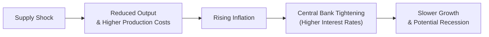

## Setting the Stage

When we talk about economic shocks, we’re basically discussing those moments when the real world decides it doesn’t want to behave like steady-state textbook models. Some of us have lived through big surprises—maybe a sudden spike in oil prices or a sharp dip in consumer demand—and watched how quickly financial markets can swirl with worry. In the context of macroeconomics, these shocks force us to ask a few key questions:

• Is this a supply-side issue or a demand-side issue?  
• What does this mean for productivity, inflation, and unemployment?  
• How might central banks and governments respond?  
• As an investor or analyst, how do we pivot our strategies to account for these changes?

This section tackles these problems through realistic vignettes. We’ll bring together concepts learned throughout Chapter 15—everything from productivity trends to policy interventions—to help you practice the step-by-step thinking process tested in the CFA exam. We’ll also highlight how single events can trigger multiple chain reactions in macroeconomic indicators and global capital markets.

## Key Concepts and Glossary (Quick Refresher)

Before diving into the vignettes, let’s remind ourselves of a few important terms and ideas:

• “Vignette Analysis” – This refers to the item-set approach used in many professional exams, including the CFA exam. You’ll receive a scenario (often a page or two of text with data tables), and you need to answer questions that require synthesizing the given information.  
• “Combined Shocks” – These are situations where both supply-side and demand-side disruptions strike at the same time. They can be notoriously tricky since the policy trade-offs are never straightforward.  
• “Flight to Quality” – An investor behavior where they shift capital into lower-risk assets—often government bonds or stable currencies—when uncertainty or volatility runs high.  
• “Time Management” – A crucial exam strategy. Read carefully, identify key details quickly, and budget how much time you’ll spend on each question.  
• “Scenario-Based Exercise” – A practice format that simulates the real exam environment, requiring you to interpret data and craft a coherent analysis under time pressure.

## Mapping Out the Chain Reactions

Many economic shocks develop a chain of events. Visualizing that chain can help you predict the next domino to fall. Here’s a high-level mermaid diagram summarizing how a typical supply shock might escalate:

Sure, not every economy will follow this exact path, but it’s a handy mental framework. Demand shocks can look similar but might start with changes in consumer or business spending, or government fiscal stimulus.

## Vignette 1: The Sudden Commodity Crunch

Imagine an economy named “Zentoria” that usually expands at an annual GDP growth rate of 3%. Zentoria is known for its reliance on imported copper for high-tech manufacturing. Suddenly, a major global copper supplier faces prolonged strikes and production outages. Zentoria sees a 40% spike in copper prices over just two months.

Key Data Points:
• Previous GDP growth forecast: 3.0%  
• Revised GDP growth forecast: 2.0%  
• Domestic inflation forecast jumps from 2.2% to 3.6%  
• Policy interest rate is currently 2.5%  
• Expected central bank rate hike by 0.75% over the next quarter

### Step-by-Step Thinking

“Okay, so what’s going on?”

1. Identify the Nature of the Shock.  
   This is clearly a supply-side shock. Copper is suddenly more expensive and in short supply. Manufacturers have higher input costs, which might reduce output as profit margins compress and businesses can’t easily pass on the entire cost to consumers.

2. Influence on Productivity, GDP, and Inflation.  
   With higher copper prices, industries using that commodity could see diminishing productivity—both because of cost increases and because they might cut back on production due to margin pressures. GDP growth forecasts drop from 3.0% to 2.0%. Meanwhile, inflation picks up from 2.2% to 3.6% as higher production costs filter into consumer prices (both for electronics and any other copper-intensive goods).

3. Potential Policy Response.  
   The central bank wants to tackle higher inflation expectations. Because the forecast now shows a significant jump in inflation, the bank is considering rate hikes—0.75% is a strong step, reflecting a real concern about persistent inflation pressure. Fiscal policy might also come into play if the government decides to subsidize specific industries or impose trade measures. But that might risk complicating things further (e.g., fueling even more inflation or creating overspending in the budget).

4. Market and Investment Strategy Implications.  
   Investors might anticipate that the central bank’s tightening will slow corporate earnings. Bond yields could rise (driving prices down), while cyclical equities might get hit especially hard if they rely on copper or supply chains linked to copper. We might see a shift toward defensive sectors—such as utilities or consumer staples—and a flight to quality in government bonds, despite rising yields. Indeed, sometimes investors are okay with slightly lower bond prices if it means they can lock in safer holdings.  
   Meanwhile, commodities themselves (like copper or substitutes) could become more appealing if investors expect persistent shortages.

### Reflective Thoughts

It’s quite possible that the central bank overshoots in its tightening, leading to a sharper slowdown. Alternatively, if the copper supply normalizes sooner than expected, the inflicted economic pain could abate quickly. These scenarios matter for portfolio positioning—a dynamic environment calls for swift responses.  

## Vignette 2: The Booming Consumption Engine

Now let’s look at “Econia,” an economy that’s typically cruising along at 2.5% annual growth. Econia’s government recently launched a massive stimulus program: sending out direct cash transfers equivalent to 5% of GDP to households. In addition, consumer confidence hits record highs, driving a powerful surge in retail spending and property purchases.

Key Data Points:  
• Previous GDP growth forecast: 2.5%  
• Revised GDP growth forecast: 4.0%  
• Unemployment rate: down from 5.5% to 4.0%  
• Inflation forecast: up from 2.3% to 3.1%  
• 10-year government bond yield: 2.0% → 2.4%

### Step-by-Step Thinking

1. Identify the Nature of the Shock.  
   Here, we have a demand-side shock. The direct transfers and robust consumer confidence have pushed spending upward. Demand for goods and services is at near-record levels, which typically leads to faster GDP growth but also higher prices.

2. Influence on Productivity, GDP, and Inflation.  
   GDP is surging to 4.0%. Labor markets look tight—unemployment is at 4.0%. That might give workers more bargaining power, which then can cause wage inflation to creep up. Higher wages, in turn, amplify demand further. This virtuous (or vicious, depending on perspective) cycle can lead to more inflationary pressure, now at 3.1% and potentially rising if wage-price spirals take hold.

3. Potential Policy Responses.  
   The central bank might decide to raise interest rates to cool demand. Another possibility: the government could scale back stimulus before inflation gets too hot. Remember, though, it’s politically ambiguous to remove stimulus too soon—nobody likes to be known as the official who halted “the good times.” So, the government might also stand by and let the central bank handle inflation, which may create tension between fiscal and monetary authorities.

4. Effects on Markets and Investment Strategy.  
   Equities, especially those in consumer discretionary, might see a short-term boost as the economy hums along. Real estate could climb further if easy credit persists—though if interest rates rise significantly, that might choke off demand. Meanwhile, bond prices might slide with the higher yield environment. All of this sets the stage for potential sector rotation: investors may pivot to cyclical sectors or, given the risk of policy rate hikes, seek undervalued defensive sectors or inflation-protected securities (TIPS, for example).

### Reflective Thoughts

Managing demand-led “overheating” can be tricky. If policy tightens too late, inflation can become entrenched. If it tightens too soon, the growth spurt might fizzle out prematurely. From an analyst perspective, watch out for how the central bank times its moves. Bold or unexpected hikes can shock asset prices.

## Vignette 3: Double Trouble (Combined Shock)

Sometimes, the universe decides to really keep us on our toes. Consider “Arbington,” an economy that’s simultaneously grappling with a geopolitical conflict that disrupts energy supplies (supply shock) and a wave of post-pandemic pent-up demand for services (demand shock). The combination is a perfect storm.

Key Data Points:  
• Energy supply constraints: 20% drop in imported crude oil volumes  
• Consumer spending growth: 4.5% yoy (previous 2.8%)  
• Core inflation: from 2.5% to 3.8%  
• GDP growth: still unknown, with estimates ranging from 1.0% to 2.5%  
• Government deficit ratio: 5.5%, up from 4.0% last year  
• Global risk appetite is declining, leading to a flight to quality (government bonds in stable economies, gold, stable currencies)

### Step-by-Step Thinking

1. Identify the Nature of the Shock.  
   This is a “combined shock.” On the supply side, energy disruptions drive up production costs for businesses across the board. On the demand side, we have a strong wave of consumer spending.

2. Influence on Productivity, GDP, and Inflation.  
   Productivity suffers due to energy supply issues. At the same time, businesses are bombarded by higher input costs. On the demand side, folks are re-entering the service economy with gusto—vacations, restaurants, entertainment. That’s fueling further inflation. Any official GDP forecast is murky because these forces can push in different directions: demand pushes it up, supply constraints pull it back down.

3. Potential Policy Responses.  
   The central bank might weigh the trade-off: do we focus on taming inflation or supporting growth, or do we attempt a middle ground? The government might announce subsidies for energy or accelerate domestic energy production. However, an already growing deficit (5.5%) suggests the government might have limited fiscal room. Another possibility is partial price controls on energy, which are always controversial for their secondary effects—like supply shortages or black markets.

4. Market and Investment Strategy Effects.  
   Investors might become more cautious overall. Arbington’s equity markets could see negative sentiment if inflation appears uncontrollable. Global investors may flee risky assets—particularly equities that rely on cheap energy. Meanwhile, the local currency might come under pressure if interest rates fail to keep pace with inflation. Some investors might shift to gold, given the perceived flight to “hard assets.”

### Reflective Thoughts

Combined shocks often require nuanced policy solutions. It’s not always straightforward to raise rates because that might exacerbate an already weakening growth environment. At the same time, not raising rates could let inflation spin out of control. In these circumstances, a balanced approach—targeted subsidies and modest rate hikes—might be the lesser evil.

## Key Takeaways: Handling Exam-Style Vignettes

• Always read carefully. Don’t jump to a conclusion about the nature of the shock without reviewing all the details (tables, text commentary, etc.).  
• Link cause-and-effect. If supply constraints raise input costs, think about what that does to inflation, profit margins, and the central bank outlook.  
• Be mindful of “second-round” effects. For instance, could higher energy prices ripple into other commodities or segments of the market?  
• Distinguish between short-term responses (e.g., immediate investor flight to quality) and medium-term outcomes (e.g., reallocation to growth sectors once the dust settles).  
• Use time management. On exam day, quickly identify relevant data—GDP forecasts, inflation rates, bond yields—and parse them in the context of the question. Don’t spin your wheels reading the same paragraph multiple times.

## Best Practices and Common Pitfalls

It’s tempting to latch onto one detail—like “inflation up to 3.6%”—and ignore the rest. But the exam loves scenarios where multiple indicators shift simultaneously. You’ll need to see the big picture. Another common pitfall is forgetting that market participants’ behavior (the “flight to quality” phenomenon, for instance) can compound policy actions, making outcomes more extreme.

A short personal anecdote: I remember once in practice sessions, I spent all my time focusing on how interest rates might move and completely forgot to see that the currency in the vignette was pegged to another currency. That changed the picture entirely because the central bank’s capacity to raise rates was limited by the need to defend the peg. Always read every line of the vignette—sometimes the small print changes the entire analysis.

## Practical Tools and Visual Aids

Sometimes, to stay organized, you might create a mini table:

| Factor                         | Situation in Vignette      | Likely Outcome                       |
|--------------------------------|----------------------------|--------------------------------------|
| Nature of Shock                | Supply or Demand or Both?  | Different policy, growth, inflation  |
| GDP Growth Trend               | Increasing / Decreasing    | Implications for unemployment, wages |
| Inflation Trend                | Mild / Stubbornly high     | Monetary policy stance               |
| Policy Action Likely           | Rate Hikes / Fiscal Tools  | Effect on credit conditions          |
| Market Reaction                | Risk-on / Risk-off         | Sector rotation, bond yields, etc.   |

## Scenario-Based Exercises and Step-by-Step Solutions

The best way to master these techniques is straightforward: practice. Try your hand at the vignettes we’ve presented. Then go step by step, analyzing shock type, key economic variables, and policy/market reactions.

1. Write down the main variables (growth, inflation, unemployment, interest rates).  
2. Note any immediate ramifications (consumer spending, business investment, trade).  
3. Look for secondary or snowballing effects (wage dynamics, currency moves, investor sentiment).  
4. Decide on the probable monetary/fiscal policy path.  
5. Predict financial market shifts: equity outlook, bond yield direction, currency expectations, commodity strategies, etc.

## Additional References for Multi-Shock Scenarios

• Past CFA Institute mock exams that feature integrated macroeconomic data points and tricky item sets.  
• “Applied Macroeconomics for Emerging Markets” by Franklin publishing, for detailed multi-shock scenario examples.  
• Economic event simulations from the Bank for International Settlements (BIS):  
  https://www.bis.org/  
These sources offer more real-world data sets and help you see how academic theory stands up to actual economic turbulence.

## Closing Thoughts

A single shock can be stressful. A combined shock can be downright chaotic. But with a clear, methodical approach, you can peel back the layers and craft a coherent analysis. Think of it like detective work: gather the clues, test your hypotheses, and predict potential outcomes. As you refine these skills, you’ll find that you can neatly bundle an overwhelming scenario into a well-structured solution outline—exactly what’s needed when tackling exam vignettes.

Practice, stay calm when multiple variables move at once, and keep focusing on the cause-and-effect sequences. With enough reps and a disciplined approach, you’ll develop the instincts to respond to any macroeconomic “pop quiz” confidently—whether that’s in a real exam room or in the real world.

---

## Test Your Mastery of Economic Shocks and Policy Reactions



### A commodity-exporting country experiences a sharp rise in commodity prices, boosting its terms of trade and GDP growth. Which short-term effect is most likely?

- [ ] A decrease in corporate earnings.
- [x] An appreciation of the country’s currency.
- [ ] A reduction in inflationary pressures.
- [ ] A decline in consumer spending.

> **Explanation:** Higher commodity export revenues typically increase demand for the exporting country’s currency, causing an appreciation in the short term. This can also boost corporate earnings in commodity sectors.

### In a demand-driven overheating scenario, which is the most direct tool for the central bank to cool off excessive demand?

- [ ] Imposing wage controls on employers.
- [x] Raising policy interest rates.
- [ ] Deregulating certain industries.
- [ ] Enacting large-scale stimulus packages.

> **Explanation:** Central banks typically raise policy interest rates to counter demand-pull inflation. Wage controls are more of a fiscal or legislative approach, and stimulus packages usually reinforce demand rather than reduce it.

### When a supply shock triggers higher production costs, which of the following best describes the immediate consequence on price levels?

- [ ] Decrease in consumer prices due to cost absorption by firms.
- [x] Higher input-driven inflation (cost-push inflation).
- [ ] Stable inflation with no effect on wages.
- [ ] Deflationary pressure, as consumers buy less.

> **Explanation:** Supply shocks that raise input costs often result in “cost-push inflation,” meaning prices rise to reflect higher production costs.

### In a combined shock scenario, what is the main policy dilemma a central bank faces?

- [ ] Whether to inflate the currency to improve exports.
- [ ] How to restructure corporate governance rules.
- [x] Balancing the trade-off between containing inflation and supporting growth.
- [ ] Eliminating bank reserves to spur lending.

> **Explanation:** A combined shock exerts upward pressure on inflation and downward pressure on growth simultaneously, forcing the central bank to juggle two competing objectives at once.

### Which statement best reflects “flight to quality” behavior?

- [x] Investors sell riskier assets and purchase high-grade bonds or safer currencies.
- [ ] Governments reduce taxes to attract foreign investors.
- [x] Investors increase speculative positions in cryptocurrencies.
- [ ] Central banks lower reserve requirements to increase liquidity.

> **Explanation:** Flight to quality occurs when investors move their capital from higher-risk assets to safer assets, usually top-rated government bonds or stable currencies. The mention of speculative crypto positions could actually be a flight to risk, not quality, so be careful reading the choices.

### A government with a high fiscal deficit faces a supply shock in energy costs. Which immediate fiscal tool might it consider to offset the burden on citizens?

- [x] Targeted subsidies on energy.
- [ ] Widespread capital controls on foreign investment.
- [ ] Aggressive interest rate reductions.
- [ ] Prohibiting government borrowing entirely.

> **Explanation:** Targeted energy subsidies are a common policy tool to mitigate consumer burden, though they risk worsening deficits. Capital controls, interest rates, and government borrowing policies are distinct approaches not directly addressing energy costs to consumers.

### In a scenario where inflation expectations become unanchored due to a supply shock, what is a likely central bank response?

- [ ] Maintains historically low interest rates to spur growth.
- [ ] Sells foreign exchange reserves to stabilize the currency.
- [x] Raises interest rates to curb inflation expectations.
- [ ] Lowers capital adequacy requirements for commercial banks.

> **Explanation:** When inflation expectations become unanchored, central banks often lean toward tighter monetary policy (rate hikes) to prevent a wage-price spiral or runaway inflation sentiment.

### Which factor most directly explains why an overheating economy can drive wage growth higher?

- [ ] Supply chains become shorter.
- [x] Labor markets tighten, giving workers more bargaining power.
- [ ] Companies adopt capital-intensive production methods.
- [ ] Fiscal deficits automatically shrink.

> **Explanation:** When an economy overheats, unemployment falls, labor demand increases, and employees have more negotiating power, pushing wages up.

### A government introduces a large-scale housing stimulus at the same time that labor markets are tightening. Which outcome is most plausible?

- [ ] Housing prices plummet due to mortgage congestion.
- [x] Overall inflation accelerates amid robust demand in housing and labor markets.
- [ ] Unemployment jumps significantly since wages fall.
- [ ] Bond yields crash, reflecting reduced government borrowing needs.

> **Explanation:** A robust housing stimulus combined with tightening labor markets often drives stronger overall demand (housing, construction, consumer spending), contributing to higher inflation.

### A central bank that “overshoots” with an excessive rate hike during a supply shock might see which effect?

- [x] A deeper economic slowdown or potential recession.
- [ ] Lower unemployment as hiring accelerates.
- [ ] Increased wage growth due to strong labor demand.
- [ ] A stable currency with no impact on asset prices.

> **Explanation:** Excessive rate hikes can choke growth, causing a downturn. This can lead to higher unemployment and potentially a recession if rates are raised too quickly or too far.


