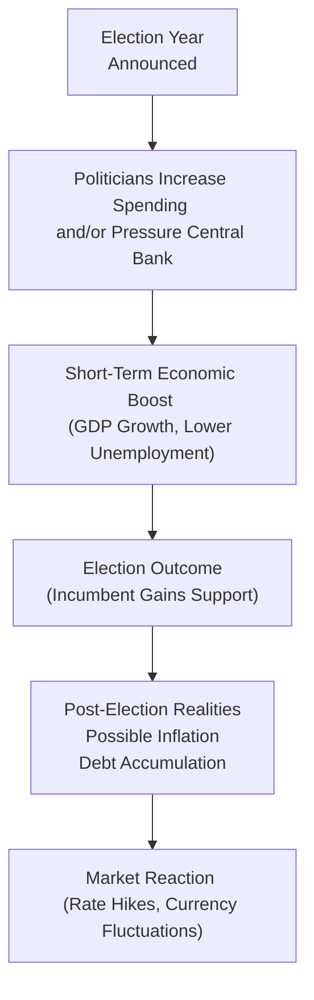

## Introduction and Core Concepts

So, has it ever crossed your mind that politicians might, well, tweak policy just before an election to make things look rosier? Trust me, you’re not the only one. Many economists have formalized this observation within the concept of political business cycles. In short, during an election year (or any critical transition in leadership), governments sometimes ramp up spending, cut taxes, or push other measures that stimulate the economy—at least in the short run. Meanwhile, monetary authorities might feel overt or subtle pressure to keep interest rates low so that people see a surge in growth, ultimately giving some extra sparkle to the incumbent administration’s popularity.

That said, there is a big risk: what looks like a nice boost during campaign season might come back to bite the economy later. Debt levels can shoot up, inflation might edge higher, and the long-term structural integrity of the economy may suffer. And guess what? That is precisely where the study of political cycles and election effects gets so fascinating—and, of course, relevant to your CFA program.

Below, we explore key theories and practical realities of how political motivations can decisively shape macroeconomic policies, yield curves, currency exchange rates, and investor sentiment. Uncertainty about policy direction—and whether it’s driven by genuine market considerations or short-term political posturing—can introduce serious volatility into financial markets. Let’s dig in.

## The Political Business Cycle

### Overview
A political business cycle occurs when those in power manipulate fiscal and/or monetary policy levers to produce favorable short-term economic outcomes that coincide with election timelines. For example, politicians might push for:
- Stricter price controls or interest rate caps to keep inflation artificially low.  
- Bigger public infrastructure projects to create a short-run spurt in employment.  
- Tax cuts or direct stimulus checks that give voters higher disposable incomes.

All of these can translate to quick votes if timed right, but the catch is that once the election passes, the economy often faces a “hangover.” Debt might be higher, inflation could accelerate, or structural reforms that are badly needed get postponed to avoid hurting election prospects.

### Historical Anecdote
You know how you might delay a big project at work—or put it aside—until after the weekend, so you don’t spoil your fun plans? Politicians sometimes do the same. One memorable (though somewhat dramatized) example many textbooks highlight is from the 1970s in various industrial democracies, where expansions in government spending often suspiciously lined up with election timetables. Whether or not it was intentional, many economists saw a pattern. With advanced econometric methods, these phenomena were codified into the notion of the “political business cycle.”

## Public Choice Theory and Practitioner Realities

### Politicians, Lobbyists, and Bureaucrats
Public choice theory posits that policymakers are not solely altruistic guardians of the public interest. Rather, they are individuals driven by self-interest—just like the rest of us. Lobbyists seek policy favors, bureaucrats might want larger budgets for their departments, and politicians want reelection. This could lead to:
- Pork-barrel spending: resources funneled into a specific region to win votes rather than finance economically sound projects.  
- Rent-seeking behavior: individuals or firms lobbying for regulations that protect their market power at the expense of broader societal welfare.

### Example
Imagine a scenario where a government invests a hefty sum in a stadium project in a key voter district right before the election. The net economic benefits might be modest or even negative in the long run, but it helps incumbents garner local support. These short-term political moves frequently distort capital allocation, hamper fair competition, and can inflate government debt without delivering meaningful productivity gains.

## Influence of Political Ideology

### Fiscal Priorities
Conservative or progressive, populist or liberal—each ideology frames a distinct policy agenda. Some parties emphasize cutting taxes and reducing government deficits. Others prioritize welfare programs, healthcare, and social insurance, leading to higher public spending. So, if you see a shift from a conservative to a progressive regime, expect:
- Potentially larger federal budgets devoted to social spending.  
- Changes in how resources are allocated between defense, infrastructure, and subsidies.  
- Possible shifts in taxation structure that impact corporations and individuals differently.

### Monetary Implications
Political leanings can also shape the environment for monetary policy. While many modern central banks strive for independence, a populist regime might push for looser monetary policy to spur short-run growth, or a more conservative regime might deem it crucial to contain inflation through tighter controls.

## Timing, Delayed Reforms, and Abrupt Reversals

### Election Cycles and Delayed Implementation
Sometimes governments defer tough reforms—like pension restructuring or subsidy cuts—because they don’t want to upset voters. Picture an administration that knows they need to overhaul the tax code or streamline entitlements but postpones it until after the election, hoping to preserve their popularity in the near term. This procrastination can create cyclical waves of policy uncertainty.

### Unexpected Shifts
Policy reversals can also happen if the incoming administration takes a radically different view or has different allies in the legislature. From an investor standpoint, such abrupt changes can bring about:
- Currency devaluation or appreciation (depending on how markets interpret new policies).  
- Fluctuations in sovereign bond yields.  
- Disruptions in corporate profitability if repeated policy reversals undermine business confidence.

## Central Bank Independence: A Critical Moderator

### Rationale
A central bank that operates free from direct political influence can moderate election-driven impulses. The typical design includes:
- Fixed terms for key policy-setters.  
- Legal safeguards preventing direct orders from politicians.  
- Clear inflation or employment targets.

### Impact on Elections
An independent central bank often resists excessive monetary expansion pre-election, thereby damping the amplitude of political business cycles. Markets typically prize such independence, rewarding economies with lower risk premiums. However, in some countries, central bank autonomy is limited or under constant pressure, making it easier for politicians to press for loose monetary policy that might buoy pre-election growth.

## Political Gridlock and Coalition Dynamics

### Slowed Legislation
If no single party has a majority, forming a coalition or dealing with an opposing legislature can slow policy approval. Gridlock can be, well, frustrating but also ironically beneficial at times. It may prevent detrimental or extreme policies from quickly materializing, offering a form of checks and balances.

### Bottlenecks in Reforms
Unfortunately, gridlock can also stall crucial measures—think deficit control, infrastructure spending, or regulation for critical sectors. Prolonged uncertainty can strain investor sentiment, spike borrowing costs if credit rating agencies factor in legislative inertia, and hamper the administration’s ability to respond swiftly to economic shocks.

## Interpreting Market Signals Around Elections

### Yield Curve Fluctuations
Investors keep a keen eye on sovereign bond yields heading into election season. If they suspect the government will engage in election-season largesse or adopt populist measures, yields may rise to factor in inflation, default risk, or both.

### Currency Movements
Uncertain election outcomes can rock the currency markets. If the incumbent’s reelection is uncertain, or if a populist candidate with expansionary (and possibly inflationary) policies is gaining momentum, currency depreciation can ensue beforehand. Conversely, a victory by a market-friendly candidate might lead to currency appreciation.

Below is a mermaid diagram illustrating how political events might shape market dynamics:

## Calculating Potential Impacts of Election Shifts

### Currency Spot and Forward Rates
When markets anticipate an election surprise, forward currency contracts adjust rapidly to reflect the perceived risk of a drastic policy shift. If you want to estimate how an unexpected election result might change currency rates, you can:

1. Gather interest rate differentials and expected inflation differentials between the country and its main trading partners.
2. Consider any risk premium for political uncertainty (using CDS spreads, bond yield spreads, or political risk indices).
3. Compute adjusted forward points to reflect new interest rate expectations.

A simple formula for forward exchange rates can appear as:

 F_{\text{domestic/foreign}} = S \times \frac{(1 + i_{\text{domestic}})}{(1 + i_{\text{foreign}})} 

But in reality, you might add risk premium terms to capture the election-induced volatility:

 F_{\text{adjusted}} = F_{\text{unadjusted}} \times (1 + \text{Election Risk Premium}) 

### Sovereign Bond Spreads
To gauge the immediate cost to government financing if an “election surprise” occurs, you can compare the country’s bond yield to a risk-free benchmark (often US Treasuries). Suppose the spread widens after an unexpected result—this indicates more perceived risk or potential default concerns.

## Best Practices for Analyzing Election-Fueled Data in a Vignette

- Look for references to newly approved spending bills or tax cuts preceding an election—ask yourself whether they’re likely to last or are just short-term sweeteners.
- Evaluate the existing debt-to-GDP ratio. High public debt might be a risk magnifier if there’s an election-driven spending spree.
- Check if the central bank has a history of succumbing to political pressure, which might yield artificially low interest rates leading up to the election.
- Consider the potential for sudden policy reversals if a less market-friendly party wins.

## Common Pitfalls and Strategies to Avoid

- Overestimating the permanence of election-year stimuli. Many expansions might fade quickly once the election passes.  
- Underestimating structural deficits created by election-fueled spending, which can eventually prompt higher taxes or interest rates.  
- Ignoring the legislative environment (gridlock or coalition dynamics) that might prevent or water down the promised reforms.  
- Failing to incorporate political risk premiums in bond yield or currency analysis.

## Putting It All Together: Final Thoughts

It’s tempting to see elections as purely political events, but for global investors, they often mark periods of sharp policy shifts, volatility in money markets, or sudden changes in interest rates and yields. Understanding political cycles and election effects on policy is crucial for anticipating macroeconomic outcomes and hedging portfolio risk—especially at the CFA Level II exam, where item-set vignettes often blend politics, economics, and market data into a single scenario.

Analyzing how politicians’ self-interest interacts with central bank policy, public finance constraints, and the broader global economy is an essential skill. You may find yourself reading a vignette about “unexpected spending packages” or “surprise election outcomes” and be asked to gauge the impact on sovereign yields or currency forward rates. Be aware of the short-term boosts, the long-term consequences, and the market’s probable reaction.

## Glossary

- Political Business Cycle: Cyclical fluctuations in macroeconomic policies timed around election periods to influence voter perception.  
- Public Choice Theory: A framework suggesting politicians, bureaucrats, and lobbyists act in their own self-interest, potentially leading to inefficient policies.  
- Pork-Barrel Spending: Government outlays aimed at localized projects, often for political gain rather than economic soundness.  
- Rent-Seeking: Efforts by individuals or firms to gain economic benefits via political means rather than productive activity.  
- Central Bank Independence: The degree to which a central bank can implement policies free from political influence, typically resulting in more stable, long-term-oriented monetary policy.  
- Gridlock: A legislative stalemate where conflicting political interests prevent the passage of significant reforms.  
- Election Surprise: An unexpected electoral outcome that deviates from polling data, often causing market volatility.  
- Policy Reversal: A sudden or dramatic shift in government policies, frequently arising when a new administration takes power or existing political conditions change.

## References and Further Reading

- Alesina, A. (1989). “Politics and Business Cycles in Industrial Democracies.” Economic Policy.  
- Drazen, A. (2000). “Political Economy in Macroeconomics.” Princeton University Press.  
- International Monetary Fund (IMF) Working Papers on political economy cycles:  
  https://www.imf.org/en/Publications/search?series=IMF+Working+Papers

## Exam Tips

• When reading the vignette, quickly identify any reference to elections, newly passed spending measures, or external commentaries about the central bank’s alignment with government.  
• Recognize that short-term boosts to employment or GDP might not be sustainable. Try to see how this affects indicators like inflation, debt sustainability, or bond market sentiment.  
• If central bank independence is highlighted (or threatened), consider how that changes your expectation for monetary policy.  
• Evaluate risk premiums in both currency and bond markets when faced with surprising election results or policy reversals.  
• Time management: these vignettes can have a lot of contextual “fluff.” Highlight the numbers that matter—e.g., new spending levels, changes to the policy rate, or inflation data—and separate them from background political commentary.

## Practice Questions on Political Cycles and Election Effects



### Assessing Election-Year Spending

- [x] Politically motivated fiscal expansion can stimulate short-term growth but risks higher debt.
- [ ] Politically motivated fiscal expansion always reduces the debt-to-GDP ratio.
- [ ] Politically motivated fiscal expansion does not affect investor confidence.
- [ ] Politically motivated fiscal expansion is always supported by independent central banks.

> **Explanation:** Many governments favor short-term stimulus to appeal to voters. This can boost growth temporarily but also elevate debt if there is no offsetting increase in taxation or spending cuts elsewhere.

### Evaluating Central Bank Independence

- [x] A fully independent central bank can help smooth out political business cycles by resisting election-year expansionary pressures.
- [ ] Central bank independence is irrelevant once an election cycle begins.
- [ ] Political business cycles are unaffected by central bank autonomy.
- [ ] Central bank independence guarantees no inflation.

> **Explanation:** When central banks are independent, they can set policy aimed at long-term economic stability rather than yielding to short-term political goals.

### Post-Election Policy Reversal

- [x] Can lead to abrupt shifts in currency and sovereign bond markets.
- [ ] Won’t impact investor confidence if a new government is elected.
- [ ] Is irrelevant when the outgoing administration had budget surplus.
- [ ] Automatically improves bond credit ratings.

> **Explanation:** Major policy changes (e.g., new spending priorities or abrupt halts to ongoing reforms) can significantly move exchange rates and yield spreads.

### Public Choice Theory

- [x] Suggests politicians act in their own self-interest, possibly creating inefficient policies.
- [ ] Predicts politicians always prioritize the public good over personal gain.
- [ ] States that rent-seeking behavior is never associated with political activity.
- [ ] Denies the role of lobbyists in shaping economic policy.

> **Explanation:** Public choice theory acknowledges that self-interest (for votes, budget growth, or market power) can distort policy outcomes away from optimal economic efficiency.

### Political Gridlock Effects

- [x] Gridlock can stall critical legislation, thereby increasing policy uncertainty.
- [ ] Gridlock guarantees lower deficit spending.
- [x] Gridlock can also prevent extreme or harmful proposals from passing easily.
- [ ] Gridlock never influences bond investors’ perceptions of political risk.

> **Explanation:** Investors recognize that gridlock might delay reforms but also block large, potentially reckless spending bills. The net effect can be a toss-up depending on context.

### Election Surprises in Currency Markets

- [x] Often translate into higher currency volatility and widened spreads in forward markets.
- [ ] Rarely affect spot rates if the outcome is completely unexpected.
- [ ] Automatically lead to currency appreciation in emerging economies.
- [ ] Guarantee stable nominal exchange rates post-election.

> **Explanation:** A surprise outcome usually shakes market sentiment, triggering speculation in currency and fixed income markets.

### Politically Motivated Tax Cuts

- [x] Provide immediate disposable income growth but risk long-term revenue shortfalls.
- [ ] Only affect the richest segments of the population.
- [x] Often coincide with re-election campaigns.
- [ ] Always reduce the budget deficit.

> **Explanation:** Politicians frequently time tax cuts for electoral gains, which might improve short-term growth at the potential cost of a larger deficit if spending is not adjusted.

### Pork-Barrel Spending

- [x] Targets specific districts for political gain but may not boost national productivity.
- [ ] Always accounts for the country’s greatest economic needs.
- [ ] Aligns perfectly with central bank inflation targets.
- [ ] Has little impact on lobbying or rent-seeking activities.

> **Explanation:** Pork-barrel spending directs resources to local projects to curry favor with certain constituencies, often ignoring broader economic benefits or efficiency.

### Analyzing Vignette Data

- [x] Look for timing of any new fiscal measures in relation to upcoming elections.
- [ ] Always assume short-term spending is a permanent policy change.
- [ ] Disregard references to debt levels or bond yields in an election year.
- [ ] Conclude that all new spending measures are inflationary.

> **Explanation:** Evaluating the timeline of policy announcements is crucial in spotting election-driven initiatives. Changes to debt and yields can hint at how markets are reacting to potential political motives.

### True or False: Potential Downsides of Political Business Cycles

- [x] True
- [ ] False

> **Explanation:** Political business cycles can undermine long-term economic stability by generating short-term expansions followed by inflationary pressures or worsening public finances.


