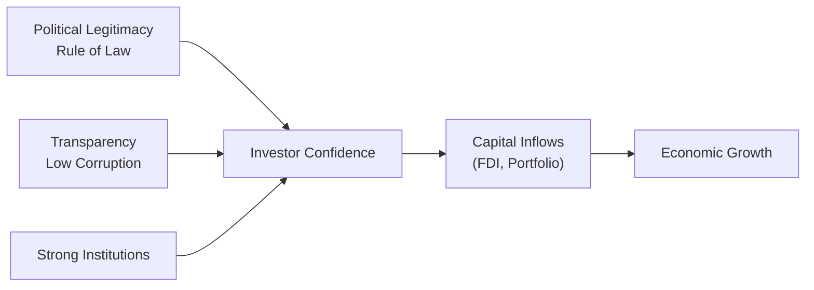

## Understanding Government Stability and Investment Climate

Sometimes I like to remember a conversation I had a few years ago with a friend who was considering investing in a small emerging market nation. He was excited about the upside—sky-high growth forecasts, new infrastructure projects, you name it. But, um, the country’s parliament had just dissolved due to a no-confidence vote, and we suddenly saw the currency drop by nearly 10% in a matter of weeks. That single political event threw the market into complete disarray.

So, what happened? Well, the real driver was government stability—or in that case, a lack of it. Let’s dig deeper into how government stability can make or break investor confidence, how it can affect everything from sovereign bond spreads to foreign direct investment (FDI), and how you, as a CFA Level II candidate, can spot these dynamics in vignettes and real-life data. After all, fragile political systems can lead to abrupt policy shifts, sudden capital flight, skyrocketing bond yields, and—yikes—even bank runs. Understanding these risks is crucial for investment analysis at the local or global scale.

Below, we’ll walk through the dimensions of government stability, from political legitimacy and rule of law to corruption levels and regulatory transparency. We’ll also explore how rating agencies incorporate political risk into sovereign ratings and how you might approach scenario analysis when faced with political unrest or major corruption scandals.

## Key Dimensions of Government Stability

### Political Legitimacy and Rule of Law

Political legitimacy reflects the degree to which the population accepts and supports its government’s authority. A legitimate government can typically enact policies more smoothly and reduce the risk of public backlash or protest. Rule of law, on the other hand, centers on equality under the legal system and provides the framework for fair and predictable enforcement of contracts.

• Importance for Investors: When treaties, contracts, and property rights are enforced reliably, businesses can plan with confidence. Uncertainty over contract enforcement or property confiscation deters long-term investment.  
• Example: Many emerging markets may have tremendous growth potential, but if the judicial system is slow or not truly independent, foreign investors tend to hesitate. They worry their capital might be at risk if legal disputes do not get fair treatment.  

### Transparency, Low Corruption, and Regulatory Consistency

Corruption is often described as the abuse of public power for private benefit. Picture a scenario where governments select infrastructure projects based not on merit, but on personal gain or nepotism. This fosters inefficiency, distorts resource allocation, and can even drive up the overall cost of doing business.

• Transparency: Clear, open policymaking ensures any changes to taxes, subsidies, or labor laws come with fair warning and stakeholder input.  
• Corruption’s “Hidden Tax”: Firms must pay bribes or navigate a maze of regulatory hurdles that can inflate costs. This can discourage foreign investors who might simply prefer a market with straightforward regulations.  

If you find yourself reading a vignette about competitive bidding on a government contract—and then see a mention of side payments to officials—there’s your red flag for corruption. Expect the vignette to pivot into analyzing how that environment influences cost structures, additional risk premiums, and project viability.

### Institutional Quality and Long-Term Growth

Strong institutions often lead to consistent economic policies and stable growth patterns. Here, “institutions” refer to the rules and organizations that guide social, economic, and political interactions—things like an independent central bank, robust regulatory agencies, or an effective judiciary.  
• Impact: High institutional quality typically connects to lower borrowing costs (since bond markets trust the legal environment), more direct investment, and better macroeconomic resilience.  
• Vignette Clue: You may see references to effective M&A regulations, strong corporate governance codes, or minimal bureaucratic overhead. Such factors usually foreshadow stable, predictable markets.

Below is a Mermaid diagram illustrating how the pillars of government stability tie into investor confidence and capital flows:

As shown above, stable governance with robust rule of law, transparency, and strong institutions often leads directly to stronger investor confidence. That, in turn, fosters greater capital inflows and supports economic growth.

## Fragile Political Environments and Market Volatility

### Volatility in Currency, Equity, and Fixed-Income Markets

In contrast, unstable governments frequently face abrupt policy changes, leadership turnovers, or even military coups. These events can jolt the currency market first, as investors pull out capital, anticipating potential currency devaluation or exchange rate controls. Equity markets may see panicked sell-offs if investors expect corporate earnings to dip under unfavorable legislation. Meanwhile, bond yields can spike if investors demand higher premiums to bear the risk of potential default or inflationary financing strategies.

It’s not unusual to see equity markets fall 5–10% in a single day after a negative political shock (for instance, a corruption scandal involving top government officials). Emerging market sovereign bond spreads can widen by dozens of basis points if rating agencies signal a possible downgrade due to continuing political turmoil.

### No-Confidence Votes, Sudden Leadership Changes, and Coups

Here’s where the drama kicks in. A no-confidence vote in a parliamentary system reveals that the ruling coalition or party no longer holds a mandate. From the lens of investors:

• Policy Uncertainty: If you’re uncertain whether new leadership might scrap or significantly alter prior policies, you assign a higher risk premium.  
• Economic Disruption: Projects in progress may be frozen, key infrastructure spending might be delayed, or foreign investors might wait on the sidelines to see if new leadership changes licensing regulations.

Coups or unconstitutional power grabs can produce an even greater shock. Political turmoil almost always hits investor sentiment—especially if the new regime lacks legitimacy or intends to rewrite major economic policies.

## Corruption and Its Economic Consequences

Corruption can feel like a subtle thing sometimes, but it carries massive implications for a country’s economy and capital markets:

1. Misallocation of Resources: Projects might be awarded to firms with the best “connections” rather than those with the best value proposition.  
2. Reduced Efficiency: Bribes and nepotism hamper innovation, as less efficient solutions might pass regulatory hurdles through corruption.  
3. Higher Transaction Costs: International companies frequently face the risk that local intermediaries or officials demand bribes. This can become a form of “tax” that eats into profits.  
4. FDI Deterrence: Without transparent processes, foreign investors know they face undue risks or moral hazards. At the slightest sign of institutional weakness, capital flees.

## Quantitative Measures of Government Stability

### World Bank: Worldwide Governance Indicators (WGI)

The World Bank’s Worldwide Governance Indicators score countries on dimensions such as Voice and Accountability, Political Stability, Government Effectiveness, Regulatory Quality, Rule of Law, and Control of Corruption. Investors often use these indices to benchmark the relative “governance risk” of a country.

If your CFA vignette references WGI data, you might see statements like:  
• “Country X ranks in the 20th percentile for Rule of Law compared to region peers’ 70th percentile.”  
• “Government Effectiveness has declined by 15 points over the last decade.”  

You’d interpret that as higher volatility risk, potential negative effects on investment flows, or an elevated cost of capital.

### Transparency International: Corruption Perceptions Index (CPI)

Transparency International’s Corruption Perceptions Index ranks countries based on perceived levels of corruption in their public sector, using surveys and expert assessments. A low CPI score can be a red flag. As a practical matter, a consistent improvement in a country’s CPI ranking might signal progress in governance reform, conducive to more stable capital market development.

## Influence on Sovereign Bond Ratings

### How Rating Agencies Assess Political Stability

Credit rating agencies like Moody’s, S&P, and Fitch factor in a range of political and institutional dynamics when assigning sovereign ratings. Government stability heavily influences the probability of default under stressful conditions—say, if a government with a shaky mandate tries to finance expansionary fiscal policies.

• Indicators Considered: Credible budget processes, an independent central bank, track record of stable leadership transitions, and freedom from large-scale corruption.  
• Rating Impact: A negative shift in perceived stability—like abrupt leadership changes or a corruption scandal involving senior policymakers—can lead to a downgrade. The country’s borrowing costs may surge, and the currency might slide in response.

Watching rating agency reports can be a quick pulse check for how capital markets might react to a brewing political crisis.

##Market Reactions: From Capital Flight to Currency Weakness

### Social Unrest, Protests, and Geopolitical Conflict

Social unrest can be the match that sparks capital flight. If protests become violent or if investors sense a risk of property damage or supply chain disruptions, portfolio managers might reduce exposures. Add geopolitical conflict into the mix—like tensions between neighboring countries—and you get even higher risk premiums.

• Rapid Capital Outflows: Investors will often divest from equities, local bonds, and currency positions.  
• Currency Depreciation: Capital flight typically drives down demand for the currency, weakening spot rates. Central banks may attempt to stem outflows by raising interest rates or imposing capital controls.

### Scenario Analysis

Imagine analyzing a Level II vignette that details how a newly elected government proposes higher corporate tax rates and suggests renegotiation of certain foreign investment deals. The potential outcomes might be:  
• Investors fear unexpected tax hikes, leading to a quick equities sell-off.  
• Government statements on “renegotiation” might mean a partial default on outstanding external debt. Bond yields spike.  
• In a “best case,” the government clarifies its policies and reaffirms commitment to investor-friendly regulation, calming markets somewhat.

Conversely, in stable systems with well-established frameworks, a shake-up in leadership might not spook markets too much if investors trust that the system’s checks and balances will keep policy on track.

## Best Practices in Analyzing Government Stability

• Monitor Macro Indicators and Ratings: Keep an eye on the World Bank and Transparency International data, along with changes in sovereign ratings.  
• Evaluate Policy Continuity: Investigate whether institutions are strong enough to ensure policy continuity even if leadership changes.  
• Factor in Corruption Risk: In your valuation models, build in a risk premium if the region exhibits high corruption or if corruption is on the rise.  
• Stay Alert to Local News: Political developments often break quickly—especially no-confidence votes or dissolution of parliaments—so swift trades might become necessary.

## Common Pitfalls and Strategies to Overcome Them

• Misreading Short-Term Turbulence: Not all government changes lead to long-term instability. If institutions are robust, a short-term fluctuation could present a buying opportunity.  
• Underestimating Structural Corruption: Some investors set their valuations ignoring the “hidden tax” of corruption. This can lead to overvalued investment projections.  
• Overlooking External Support: International support from organizations (IMF or regional banks) can provide a backstop in times of crisis, limiting downside risk.

## Putting It All Together: Vignette Analysis

In the CFA Level II exam context, you might face an item set describing:  
• A corruption probe targeting the Prime Minister’s office, leading to political upheaval.  
• Changing bond yield spreads as investors grow unsettled.  
• The World Bank’s Governance Indicators showing a downward trend.  
• Rating agencies commenting on potential downgrade.  
• Social unrest pushing the ruling party to expedite new legislation that’s unclear or possibly anti-business.

Your job is to interpret how these factors jointly affect the currency market, cost of capital, equity valuations, and overall investor sentiment. Recognizing that government stability isn’t just about a single individual but about the entire system’s capacity to handle transitions will guide you to a comprehensive analysis.

## Final Exam Tips

• Time Management: In item-set questions, jump quickly to the key numbers—like rating changes, WGI data, or corruption index scores—to gauge the scale of political risk.  
• Connect the Dots: If the vignette mentions social unrest, a scandal, and yields spiking 50 bps, you can suspect capital flight. Check if the central bank might intervene.  
• Use Scenario Analysis: Consider best-case versus worst-case outcomes if leadership changes or a new policy is under discussion.  
• Don’t Overcomplicate: Sometimes a modest leadership reshuffle in a highly stable country won’t rattle the markets much, so watch the institutional context.  

## References / Further Reading

- North, D.C. (1990). Institutions, Institutional Change and Economic Performance. Cambridge University Press.  
- World Bank Governance Indicators:  
  https://info.worldbank.org/governance/wgi/  
- Transparency International – Corruption Perceptions Index:  
  https://www.transparency.org/  

----

## Government Stability and Market Sentiment Practice Questions



### Question 1

A parliamentary system has experienced three no-confidence votes in two years, causing multiple leadership changes. How should an analyst most likely view this scenario with respect to future investment inflows?

- [ ] Potentially positive for investment inflows because frequent changes can generate reform momentum  
- [ ] Neutral, because leadership changes have a minimal impact on market sentiment  
- [x] Negative for investment inflows, as government instability raises uncertainty about policy continuity  
- [ ] Positive if new leadership announces tax cuts  

> **Explanation:** Frequent government reshuffles typically increase policy uncertainty, discouraging stable, long-term investments. Investors fear disruptions to policy frameworks and may demand higher risk premiums.

### Question 2

A country with strong rule of law, an independent judiciary, and effective anti-corruption agencies is most likely to experience which of the following market outcomes?

- [ ] Lower Foreign Direct Investment (FDI)  
- [x] Lower bond yields due to higher investor confidence  
- [ ] Higher inflation volatility  
- [ ] Sustained depreciation of the local currency  

> **Explanation:** Strong institutions and anti-corruption measures boost investor confidence, leading to lower required returns on sovereign debt and bolstered currency strength.

### Question 3

Which of the following best describes the relationship between persistent corruption and corporate investment?

- [ ] Persistent corruption boosts productivity by incentivizing bribe payments  
- [x] Persistent corruption distorts resource allocation and reduces the willingness of firms to invest  
- [ ] Persistent corruption has no measurable effect on long-term economic growth  
- [ ] Persistent corruption fosters open competition by bypassing bureaucracy  

> **Explanation:** Corruption often leads to a misallocation of resources and creates additional “hidden” costs that deter firms from investing.

### Question 4

An analyst is evaluating a vignette describing widespread protests over alleged election fraud. The government responds by imposing capital controls, limiting foreign currency transactions. Which of the following market reactions is most likely?

- [x] Rapid decline in currency value on the black market  
- [ ] Lower bond yields as confidence in local assets increases  
- [ ] Increase in international reserves due to investor trust  
- [ ] Immediate strengthening of the local currency in official markets  

> **Explanation:** Capital controls often push investors to seek the local currency’s value on unregulated black markets, causing the official currency to decline sharply, and fueling further instability.

### Question 5

If a rating agency cites “growing political instability and risk of default” for a sovereign bond downgrade, which immediate effect might a CFA Level II candidate anticipate?

- [ ] Decline in bond yields due to increased liquidity  
- [x] Widening of sovereign bond spreads due to elevated perceived risk  
- [x] Potential outflow of capital from the country’s bond market  
- [ ] Strengthening of the local currency  

> **Explanation:** A downgrade implies a higher probability of default, making investors demand higher yields (wider spreads) and fueling capital outflows, often putting downward pressure on the local currency.

### Question 6

Which factor, mentioned in a CFA exam vignette, most strongly indicates robust institutional quality?

- [x] Independent central bank with established policy credibility  
- [ ] Frequent changes to tax regulations  
- [ ] Lack of property rights legislation  
- [ ] Significant nepotism in public contract awards  

> **Explanation:** An independent central bank with a consistent track record promotes monetary stability and signals strong institutional frameworks, a hallmark of robust governance structures.

### Question 7

Which scenario most likely indicates that currency depreciation could accelerate?

- [x] Reports of a major corruption scandal involving the finance minister  
- [x] Public announcement of capital controls on foreign-currency withdrawals  
- [ ] Significant trade surplus and stable leadership  
- [ ] Oversight by an independent judiciary  

> **Explanation:** A corruption scandal undermines trust, and capital controls worry investors who try to exit quickly, intensifying downward pressures on the currency.

### Question 8

What is a primary concern when the World Bank’s Worldwide Governance Indicators show a significant drop in Government Effectiveness and Rule of Law for a country?

- [x] Potential capital declines as investors price in higher uncertainty  
- [ ] Immediate trade surplus  
- [ ] Rapid increase in FDI due to undervalued assets  
- [ ] Automatic currency appreciation  

> **Explanation:** Weaker governance typically spells trouble for attracting capital and can lead to increased volatility as markets require higher premiums for the additional risk.

### Question 9

When analyzing a potential acquisition in a region with high perceived corruption according to Transparency International’s Corruption Perceptions Index, which of the following should be the primary concern?

- [x] Additional bribe-related costs or inefficiencies lowering net returns  
- [ ] Speedy government approvals and minimal contract issues  
- [ ] Rapid improvement in the rule of law  
- [ ] Decreased operational risk across the board  

> **Explanation:** In a highly corrupt environment, bribes, administrative delays, and favoritism can eat into returns, posing a significant risk to project feasibility.

### Question 10

True or False: A strong rule of law and transparent governance frameworks typically reduce the volatility of foreign capital flows into a country.

- [x] True  
- [ ] False  

> **Explanation:** Strong governance builds consistent market expectations. Transparency and reliable legal structures attract more stable inflows, less prone to sudden reversals.


