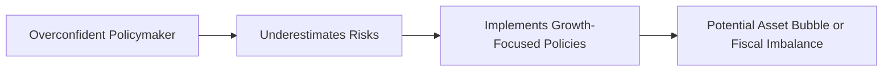

### Introduction
It might seem at first glance that big economic policies are determined by calm, rational analysis. But let me tell you, that’s rarely the entire story. I remember once having a conversation with a financial analyst friend who was convinced the central bank would hold interest rates stable, despite a lot of contradictory signals. He was confident—maybe too confident—based on a single data point. When the bank actually reversed course, he realized just how human these decisions can be. Policies are often influenced by hopes, fears, social pressures, and all sorts of biases we’re not even aware of. This is where behavioral economics meets macroeconomics. And for anyone prepping for the CFA Level II exam, recognizing these psychological forces can help you parse vignettes more intelligently.

### Cognitive Biases in Policymaking
In theory, macroeconomic policy aims to optimize factors like GDP growth, employment, and inflation. However, policymakers are people—yep, they get tired, they watch the news, they have career concerns, and they may cling to old forecasts. They’re prone to overconfidence, anchoring, and other biases. Let’s break down a few high-impact ones:

#### Overconfidence
Overconfidence is the belief that our knowledge or predictive power is better than reality suggests. You might see a finance minister proclaim that their growth targets are a “sure thing,” dismissing early warning signs of a recession. This might ring a bell if you recall those item sets where officials assume they have a perfect read on inflation or asset bubbles, only for the economy to do the opposite.

In real life, central bankers or treasury departments might overlook downside risks in their inflation forecasts because they’re convinced that prior models have it all figured out. Overconfidence can lead to underestimating the severity of fiscal deficits, ignoring the possibility of sudden capital flight, or launching stimulus packages that assume robust multiplier effects without thorough data.

#### Anchoring
Anchoring happens when a specific initial number or viewpoint latches on to our thinking, unconsciously guiding subsequent decisions. Suppose a policymaker sees an early GDP forecast of 3%: they might fixate on 3% even if new data suggests 1.5%. In exam vignettes, pay attention to language like “The ministry initially expected high potential growth,” but then fails to update after new cautionary data arrives.

It can also affect interest rate decisions. If the last major policy meeting concluded with rates at 2%, policymakers may anchor around 2% for subsequent meetings, failing to raise or lower quickly enough to adjust to new economic conditions.

#### Confirmation Bias
Confirmation bias is the tendency to notice and place more weight on information that supports an existing belief. If an administration thinks a fiscal stimulus will magically fix unemployment, they might highlight every success story stemming from the stimulus while rationalizing any failures or ignoring them outright.

When analyzing vignettes, watch for policymaker quotes like “The data is consistent with our stance,” as they selectively pick only the growth figures that appear positive while dismissing consumer confidence drops or rising defaults. This is a clue that the policy might rest on a shaky foundation.

### Herd Behavior in the Macroeconomic Context
Ever watch a crowd of people rush into a popular store because they think they’ll miss out on some huge discount? Well, macro-level herd behavior can look similar, except the stakes might be sky-high—like a massive bubble or a global panic.

Financial markets can transform into feeding frenzies: if big players start buying an asset, others may “herd” in, worried about missing the party. In a bubble scenario, you’ll see rapidly climbing prices unmoored from fundamental values. Alternatively, if a prominent investor bails out, a wave of panic selling can follow, crashing prices within hours.

For exam item sets, look for clues: such as references to quickly inflated asset values (“Housing prices jumped 30% in six months”) or economists referencing “contagion” in different markets. These are dead giveaways that herd behavior might be driving events. Governments can also herd in an odd way—if one government imposes capital controls and sees some short-term success, other countries might quickly replicate the same policy, ignoring structural differences.

### Bounded Rationality
Let’s be real: nobody has perfect data or unlimited time to consider every possible scenario. Policymakers are no exception. They might rely on rules of thumb, historical analogies, or partial data. Bounded rationality suggests that we make decisions with the limited information and mental capacity we have, often “satisficing” rather than fully optimizing.

An example? A central bank might rely on a simplified inflation model that was fairly good in the past but misses new complexities like global supply-chain disruptions. Or a finance minister prioritizes a quick fix to shield a certain domestic industry instead of thoroughly analyzing the long-term trade-offs. In a vignette, watch for references to outdated economic models or committees that skip thorough cost-benefit because “We didn’t have time to analyze everything.” That’s bounded rationality in action.

### Framing Effects
Framing effects can be surprisingly powerful in shaping policy decisions—and the public’s reaction. Call a tax policy a “rebate,” and everyone perks up at the idea of getting money back. Call it a “cut,” and you might have a different psychological impact. If a fiscal announcement is couched in terms of “preventing job losses,” the public might see it as positive, even if it’s essentially the same policy that might reveal negative side effects when presented differently.

When you see a vignette describing a policy shift, pay close attention to how it’s portrayed to the public: “We’re giving you a break” or “We’re slashing needed revenue.” These subtle distinctions can make people comfortable (or outraged) and alter consumption, saving, and investment decisions. Don’t be surprised if exam questions probe how public framing affects consumer confidence or electorate behavior.

### Loss Aversion
Loss aversion basically says people hate losing more than they like winning the same amount. If you’ve ever clung to a losing stock in your personal portfolio, hoping someday it’ll magically bounce back, you’ve felt this. Governments are the same way. They might double down on a failing policy because admitting defeat would bruise reputations and cause short-term pain—like telling the public that taxes need to rise to close a deficit. Instead, they keep the policy afloat to avoid a visible “loss.”

Loss aversion explains why some governments won’t implement harsh but necessary “structural reforms” that come with real short-term pain. They fear the fallout, especially in an election year. On the exam, you might see references to delayed or watered-down reforms on labor or pension systems because officials dread political backlash. These are classic signs that loss aversion is at play.

### Present Bias
Imagine being offered $100 today versus $110 in a month—some folks will grab the $100 right now. Present bias leads governments to favor short-term gains, like stimulus spending or easy credit conditions, even though the result might be a ballooning debt or punishing inflation down the road.

This can help you explain patterns like rising sovereign debt loads or repeated short-term stimulus measures. Analysts are often told, “Wait, the government will eventually rein in spending,” yet deficits climb anyway. That’s present bias. In an exam context, watch if the official discussion prioritizes immediate economic “wins” over structural discipline. If so, the macro environment may face mounting risks hidden behind short-term improvements.

### Sentiment Indicators
Sentiment indicators—like consumer confidence or business optimism—can both reflect and reinforce behavioral biases. A sudden surge in consumer confidence can spur extra spending (“Because everyone else feels good, we should buy that new car, right?”). Over-optimism can escalate booms, while a dip in confidence can bring spending to a screeching halt.

Remember: these indicators are also subject to framing. If leaders repeatedly paint a rosy picture, consumer sentiment may brighten undeservedly, fueling a potential mismatch between sentiment and actual economic conditions. Exam items often mention sentiment surveys, and part of your job is to figure out whether they’re consistent with fundamentals or if behavioral factors might be exaggerating the data.

### Interpreting Policy Vignettes with Behavioral Biases
Item sets in the CFA exam often describe a government or central bank’s policy stance, citing forecasts, macro data, and official statements. When reading these vignettes, you might see:

• Officials ignoring or downplaying certain statistics (possible confirmation bias).  
• Emotional or “last-minute” decisions based on incomplete analysis (bounded rationality).  
• Grandiose predictions with minimal downside mention (overconfidence).  
• Policies that stay in place too long despite harmful side effects (loss aversion or policy inertia).  
• “Hot” asset markets or panic-induced sell-offs (herd behavior).  

One tip is to read carefully for the language hinting at incomplete evidence, selective references to data, or reluctance to pivot. If a news snippet says “Despite mounting warnings, the finance minister insisted the growth target is easily attainable,” that’s a classic overconfidence or confirmation bias clue. The question might ask you to evaluate the potential pitfalls of that stance or identify which bias is driving the decision.

### Evaluating Policy Speeches and Government Releases
Whenever you see a major policy speech in a vignette, ask:

1. Are growth and employment targets described without mention of downside risk? (Check for overconfidence.)  
2. Are references to negative data absent or glossed over? (Possible confirmation bias or framing effect.)  
3. Does the speech rely on old trends or a single outlier data point? (Anchoring or bounded rationality.)  
4. Are short-term solutions emphasized at the expense of structural reforms? (Present bias meets loss aversion.)  

If the official communication is long on positivity but short on balancing viewpoints, that’s a sign biases could be at play.

### Best Practices, Pitfalls, and Strategies
• Remain Data-Driven: When analyzing macro policy decisions, always revisit actual statistics instead of relying on rosy statements.  
• Identify Contradictions: If the data in the vignette doesn’t match the official line, you’ve likely found overconfidence or confirmation bias.  
• Consider Time Horizons: Check if policies focus unhealthily on near-term benefits, ignoring looming liabilities—classic present bias.  
• Evaluate Sentiment and Fundamentals: High consumer confidence might be driven by positive framing or good marketing, but does the economy’s underlying data support the enthusiasm?

### Visualizing the Flow of Behavioral Bias to Policy Outcomes
Below is a simple flowchart to illustrate how cognitive bias can contribute to macroeconomic imbalances:

### Final Thoughts for Exam Day
On exam day, you’ll likely face vignettes that combine multiple biases. For instance, a central bank might be anchored to past inflation targets while a finance ministry displays overconfidence in its GDP forecasts. Think carefully about where the evidence leads and which biases or heuristics can explain the mismatch between policy and reality.

Remember, your job isn’t just to name a bias but to connect how that bias might result in specific macroeconomic outcomes—like overspending leading to inflation, or herd behavior leading to asset price volatility. Keep an eye out for framing cues and incomplete data sets, and have a methodical approach to analyzing each policy move.

### Glossary
• **Cognitive Biases:** Systematic errors in thinking that affect decisions and judgments.  
• **Herd Behavior:** The tendency of individuals or institutions to mimic the actions of a larger group.  
• **Bounded Rationality:** The notion that real-world decision-making is constrained by limited information, time, and cognitive capacity.  
• **Framing Effect:** How different presentations of the same information can shift perceptions and decisions.  
• **Loss Aversion:** A bias where losses cause more distress than equivalent gains cause pleasure.  
• **Present Bias:** Overvaluing immediate outcomes relative to future benefits or costs.  
• **Sentiment Indicators:** Metrics capturing the optimism or pessimism of consumers and businesses.  
• **Policy Inertia:** A tendency for institutions to resist or delay policy changes, often due to biases or structural constraints.

### References / Further Reading
- Kahneman, D. (2011). Thinking, Fast and Slow. Farrar, Straus and Giroux.  
- Shiller, R. (2015). Irrational Exuberance. Princeton University Press.  
- Thaler, R.H. (2016). “Behavioral Economics: Past, Present, and Future.” American Economic Review.

### Test Your Knowledge: Behavioral Economics in Macroeconomic Policy



### 1. Which of the following issues is most likely a result of overconfidence among policymakers?
- [ ] Persistent reliance on prior GDP data despite new contradictory evidence
- [x] Underestimating potential downside risks when launching ambitious growth policies
- [ ] Switching policies abruptly due to shifting public sentiment
- [ ] Adopting multiple data sources to confirm an initial economic forecast

> **Explanation:** Overconfidence typically leads policymakers to dismiss or undervalue potential hazards, believing their forecasts or plans are more reliable than they are.

### 2. In a scenario where a finance minister refuses to revise budget predictions even after official statistics show a clear downturn, which bias is most likely at play?
- [ ] Loss aversion
- [x] Anchoring
- [ ] Herd behavior
- [ ] Present bias

> **Explanation:** Anchoring occurs when a person fixes on initial information (the original budget prediction) and fails to adjust despite newer evidence.

### 3. A government that increases short-term spending on subsidies while delaying the necessary tax reforms for long-term debt reduction displays which bias?
- [ ] Confirmation bias
- [ ] Framing effect
- [x] Present bias
- [ ] Herd behavior

> **Explanation:** Present bias causes policymakers to prioritize immediate fiscal or political gains over sustainable long-term solutions.

### 4. A central bank highlighting only the favorable indicators of a stimulus program, while downplaying evidence that real wages have stagnated, is an example of:
- [ ] Loss aversion
- [x] Confirmation bias
- [ ] Anchoring
- [ ] Herd behavior

> **Explanation:** Confirmation bias leads individuals or institutions to overemphasize data supporting their assumptions and ignore contradictory data.

### 5. Loss aversion is most closely related to which outcome in macro policy?
- [x] Policymakers refusing to cut a failing program to avoid admitting defeat
- [ ] Policymakers adopting short-term fixes despite future harm
- [ ] Policymakers ignoring a new set of data in favor of old statistics
- [ ] Policymakers staffing committees with those who only agree with them

> **Explanation:** Loss aversion fosters avoidance of “taking a loss” even if halting or adjusting the program could yield better outcomes.

### 6. Which of the following best illustrates herd behavior?
- [x] A sudden asset price surge as more investors buy in, lured by rising prices
- [ ] A refusal to raise interest rates because past history suggests stability
- [ ] Underestimating the negative impact of a policy
- [ ] Quick adoption of structural reforms based on a thorough national referendum

> **Explanation:** Herd behavior is evident when investors or institutions follow the crowd into (or out of) a particular asset or strategy, often ignoring fundamental analysis.

### 7. Which indicator might reflect or amplify behavioral biases in an economy?
- [ ] The official unemployment rate
- [x] Consumer confidence index
- [ ] Manufacturing labor participation rate
- [ ] Central bank foreign reserve holdings

> **Explanation:** Sentiment indicators such as consumer confidence can both reveal and reinforce public optimism or pessimism, often influenced by framing or herd effects.

### 8. In analyzing a vignette where a government official frequently uses terms like “ensured success,” “no-risk,” and “foolproof,” you should suspect:
- [ ] Loss aversion
- [ ] Framing effect
- [x] Overconfidence
- [ ] Anchoring

> **Explanation:** Such absolute, unwavering language strongly suggests an overconfidence bias, where the official overestimates the certainty of a positive outcome.

### 9. A central bank that relies solely on a simplified inflation model—though many new global factors have emerged—best demonstrates:
- [ ] Herd behavior
- [ ] Loss aversion
- [x] Bounded rationality
- [ ] Framing effect

> **Explanation:** Bounded rationality involves using limited models or heuristics because the decision-makers lack the resources or time to capture all complexities.

### 10. True or False: Delaying structural reforms due to fear of public backlash is most closely linked to overconfidence bias.
- [ ] True
- [x] False

> **Explanation:** Delaying tough actions out of fear of backlash is strongly indicative of loss aversion, as officials are avoiding the pain or “loss” associated with the unpopular move.


