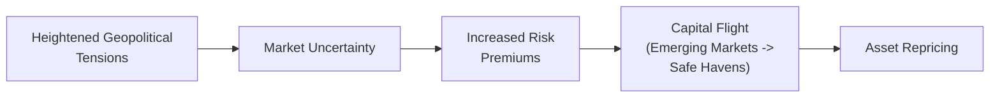

## Introduction
I still remember the first time I noticed how quickly geopolitical news could rattle the markets—it was a seemingly small territorial dispute, yet investors started bailing out of certain emerging market currencies at lightning speed. The best-rated local debt also tanked for a few days. It was definitely one of those moments where I went, “Whoa, so this is how politics can shake up financial assets.” Geopolitical risk can feel amorphous—but it’s a critical part of understanding asset pricing, especially when we see trade wars, territorial conflicts, or sudden government regime changes. 

Geopolitical events (including sanctions, embargoes, or even big political alliance changes) can upend longstanding assumptions about trade flow stability, corporate profitability, and access to resources. In finance terms, that often translates into higher risk premiums, capital flight to safe-haven assets (think U.S. Treasuries or gold), and big shifts in foreign exchange rates. It’s no wonder that geopolitical risk analysis is now deeply woven into investment decision-making processes around the world.

Below, we explore how these risks filter into asset prices, highlight key frameworks like the Geopolitical Risk Index (GPR), discuss black swan events, and show how to interpret exam vignettes that mention threats of sanctions or expropriation. We’ll also look at how multinational corporations adapt to such instability and identify best practices for analyzing country risk from a big-picture perspective.

## Defining Geopolitical Risk
Geopolitical risk spans a wide array of political and economic uncertainties that can spark changes in trade policies, regulatory environments, and investor protections:

• Military conflicts, territorial disputes, and cross-border tensions.  
• Trade wars, tariffs, quotas, and unexpected embargoes.  
• Political alliances that isolate certain nations or pivot investment flows.  
• Terrorism or heightened security threats.  
• Economic sanctions that restrict movement of capital, goods, or services.  

Because these events can reshape national or regional markets in ways that standard macro fundamentals (like GDP growth or inflation) don’t always anticipate, geopolitical considerations add another layer of complexity to investment analysis.  

## Impacts on Asset Pricing
When geopolitical tensions flare up, investor psychology tends to change overnight. You might recall how currency and equity markets reacted when the trade disputes between major world economies heated up: credit spreads for some emerging markets soared, while yields on core government bonds dropped from a boost in safe-haven demand.

Below is a simple illustration of how tensions can drive asset repricing:

### Risk Premium Increases and Credit Spreads
In periods of relative calm, credit spreads often reflect fundamental risk factors—like corporate profitability and default probabilities. Once serious conflict or uncertainty hits, investors demand additional compensation for potential losses. We wind up with:

• Wider credit spreads on corporate and emerging market (EM) bonds.  
• Lower prices on riskier assets, even if underlying economic fundamentals remain stable.  
• Airlines, travel companies, and resource-extraction sectors at the front lines of repricing.  

### Capital Flight and Safe-Haven Assets
If a dispute escalates, investors may flee from riskier economies and currencies to what they perceive as “safer” assets or currencies. Think of the U.S. dollar, Swiss franc, or Japanese yen. Gold and low-volatility government securities are also traditional refuges. This can cause:

• EM currencies to depreciate sharply.  
• Increased volatility in foreign exchange markets (and possibly a squeeze on carry trades).  
• Spikes in gold or other metals used as inflation or uncertainty hedges.  

### Currency Valuations and Exchange Rate Interplay
Structurally, global capital has demonstrated a “flight-to-quality” dynamic whenever big geopolitical news flares up. For example, if a major energy producer experiences a sudden political crisis, oil prices might jump. If that crisis hints at a broader conflict, we often see a parallel flight into U.S. Treasury bills. When a crisis affects a country’s sovereign obligations, that currency can tumble, and local bond yields skyrocket—unless a central bank intervenes or capital controls emerge to stabilize outflows.

## Assessing and Measuring Geopolitical Risk
You might be thinking: “So, how do I track or measure all this political craziness?” Well, scenario analysis is a strong starting point, but there are also some formal indices:

• Geopolitical Risk Index (GPR): A measure derived from textual analysis of news reports. It shows when there’s a heightened frequency of articles referencing war threats, sudden political tensions, or terrorist events.  
• News-based Indices: Vendors track references to trade policy disputes, nuclear standoffs, or military aggression to gauge how the press is covering global tensions.  
• Forward-Looking Intelligence Briefs: These are internal or external analyses that use on-the-ground knowledge to forecast “hot spots” where political risk might accelerate.  

By monitoring these indices, analysts can tease out short-term risk spikes and distinguish between “noise” and fundamental changes in the market’s risk structure. For instance, let’s say the GPR notices a growing volume of articles suggesting an imminent disruption in oil shipments from a major region. Even if official statements attempt to calm nerves, the market may still re-price energy assets and consider worst-case scenarios.

## Black Swan Events
Then there are black swan events: sudden regime collapses, major global conflicts, or abrupt policy changes that come out of left field. They often blindside markets because they weren’t broadly predicted or widely priced in. The ripple effect can be severe:

• A country’s entire stock market can plunge within days if a new regime seizes foreign-owned oil fields or imposes total capital controls.  
• A surprise peace agreement can likewise boost markets if it eliminates a terrifying risk, though such “good” black swans are less frequently discussed.  

Analyzing black swans can be tricky because by definition they’re rare and can’t be precisely modeled by historical data. At times, advanced scenario building or “tail risk” stress tests can help you see how a portfolio might handle the shock of large and abrupt changes in currency values, interest rates, or local government bond defaults.

## Interpreting Vignettes with Geopolitical Tensions
In a CFA-style item set or vignette, watch for clues about:  
• Threatening statements made by officials.  
• Diplomatic breakdowns during trade negotiations.  
• Sanctions or embargoes that limit a company’s ability to export or import key inputs.  
• Expropriation hints—like sudden new laws allowing government seizure of foreign-run mines.  
• Potential for capital controls, especially if local investment capital is draining out of a country.  

The immediate angle for exam questions is typically how these signals affect company valuations or sovereign bond yields. For instance:

• Corporate Valuation: If the vignette mentions a major mining firm in a region prone to expropriation, be prepared to adjust for a higher discount rate, or a cut in projected free cash flows from local operations.  
• Sovereign Yield: If there’s political instability suggesting the government might default or restructure debt, yields would likely spike, and the question might ask you to compute how bond prices react.  

## Multinational Corporations and Geopolitical Instability
Multinational corporations (MNCs) often respond to rising geopolitical tensions by diversifying supply chains or reshoring some manufacturing to mitigate risks. If you see an item set describing a major conflict that disrupts shipping lanes, expect that MNC’s cost structure (e.g., rerouting shipping routes) and revenues (e.g., losing customers in certain sanctioned territories) could be impacted.

Other potential tactics include:  
• Hedging currency exposures through forward or options contracts.  
• Shifting capital expenditures away from high-risk regions.  
• Strengthening local partnerships or using local financing structures to reduce the appearance of “foreign” control.  

From an exam perspective, the question might revolve around how these strategies alter the firm’s weighted average cost of capital or relevant discount rates in the face of elevated country risk.

## Best Practices for Analyzing Country Risk
If you’re incorporating geopolitics into asset pricing, you typically want to:

• Check sovereign balance sheets and external reserves. Countries with large foreign exchange reserves might better weather crises.  
• Monitor legal frameworks: A history of expropriation or unpredictable judiciary decisions can amplify risk premiums.  
• Watch for local sentiment changes—if a populist movement sweeps to power, it may rewrite tax policies, trade agreements, or even investor protections.  
• Keep an eye on capital control likelihood: Restricting capital outflows can complicate foreign investor repatriation and hamper liquidity in local markets.  
• Evaluate the potential for government expansions of authority—especially if the political climate permits emergency decrees that override commercial contracts.  

From a quantitative perspective, you might use sovereign risk spreads or credit default swap (CDS) pricing for a real-time gauge of how markets are discounting any potential default or political meltdown.  

## Putting It All Together
When panic sets in, safe-haven flows can spike, and certain advanced economies see demand for their government bonds skyrocket. Meanwhile, risk assets in the eye of the storm can suffer precipitous declines. The true challenge for investment professionals is in sifting through the daily noise to spot genuine structural turns or improbable but influential black swans.

In the exam context—especially at Level II—your item set might provide a scenario like:  
• A new conflict in a major energy-exporting region.  
• Threats of imposing or lifting sanctions on key trading partners.  
• Hints that local currency is at risk from capital flight and the central bank may enforce capital controls.

You’ll need to connect the dots to figure out:  
• Which currency will strengthen or weaken?  
• How might credit spreads widen for relevant sovereign or corporate bonds?  
• Will commodity prices (oil, metals) surge or slump?  
• Does the combination of higher production costs, tariffs, or expropriation risk reduce the net present value (NPV) of an investment project?

## Common Pitfalls and Challenges
• Overreliance on Historical Data: Geopolitical events often lack robust historical precedents, so typical regression-based risk models can fail.  
• Knee-Jerk Reactions: Not all political threats result in real economic damage. At times, markets overreact to scare headlines.  
• Ignoring Cross-Country Interdependencies: A conflict that disrupts supply chains in one region may reverberate across multiple geographies.  
• Failing to Read between the Lines: Policy changes don’t always come with a press release. If the exam vignette mentions “calls for confiscation of foreign assets,” that’s your signal that there might be a forced reevaluation of returns!  

## Conclusion and Exam Tips
• Remember that heightened geopolitical tension can inflate discount rates, as investors price in new tail risks.  
• Scenario and sensitivity analysis often reveal your vulnerabilities to black swan events.  
• Incorporate the possibility of capital controls or expropriation when assessing country risk.  
• Pay attention to any mention of sanctions, embargoes, or new trade agreements—it’s a clue that exchange rates, bond spreads, or equity valuations will shift.

On the exam, be sure to carefully read the item set for specific “geopolitical triggers,” and then methodically walk through how that might alter your financial assumptions. If the scenario involves major supply chain disruptions, reflect that in your cost projections. If the question describes potential seizure of assets, you’ll need to factor a high risk premium into your valuation model.

Stay flexible in your thinking and always watch for the hidden chain reactions that can unfold when big political events hit: commodity price swings, interest rate policy changes, or abrupt currency moves. The more you practice with hypothetical “worst-case” vignettes, the more comfortable you’ll be performing real-time mental stress tests. 

## Glossary
• Geopolitical Risk Index (GPR): A measure of adverse geopolitical events derived from news references (e.g., warfare, tensions, security threats).  
• Safe-Haven Assets: Assets (e.g., U.S. Treasuries, gold, Swiss franc) that typically attract inflows during times of heightened uncertainty.  
• Capital Controls: Government policies limiting or regulating capital inflows and outflows, often to manage currency stability or financial crises.  
• Expropriation: A government taking property or assets, sometimes with little or no compensation, often for “public interest.”  
• Embargo: An official ban on trade or commercial activities with a particular country.  
• Trade War: An economic conflict involving tariff escalations and retaliatory trade barriers between nations.  
• Black Swan Event: A rare and unpredictable occurrence with significant market or economic impact.  
• Reshoring: Bringing production or services back to a firm’s home country, often for security or geopolitical risk reasons.

## References / Further Reading
- Caldara, D. & Iacoviello, M. (2018). “Measuring Geopolitical Risk.” Working Paper, Board of Governors of the Federal Reserve System.  
- Eurasia Group’s Geopolitical Risk Analyses: https://www.eurasiagroup.net/issues/top-risks  
- Michel-Kerjan, E. & Slovic, P. (2010). “The Irrational Economist.” Public Affairs  

## Test Your Knowledge: Geopolitical Risks and Asset Pricing



### A country imposes capital controls to prevent massive capital outflows under rising geopolitical tensions. Which of the following is the most likely effect on its currency and bond market?  
- [ ] The currency appreciates, and bond yields fall significantly.  
- [ ] The currency remains stable, and bond yields remain unchanged.  
- [x] The currency faces downward pressure, and bond yields rise due to investors’ higher perceived risk.  
- [ ] The currency appreciates, and bond yields rise due to safe-haven demand.  

> **Explanation:** Capital controls often signal desperation to protect reserves. This typically undermines foreign investor confidence, putting downward pressure on the currency, while higher yields reflect increased uncertainty.

### Geopolitical risks can cause capital flight from emerging markets to safe havens. Which of the following assets is traditionally considered a safe haven?  
- [ ] Pro-cyclical equities  
- [x] U.S. Treasury bonds  
- [ ] Emerging market credit default swaps  
- [ ] High-yield corporate bonds  

> **Explanation:** U.S. Treasuries are historically viewed as a safe haven given their high liquidity and the relative economic size and stability of the U.S.

### A firm operating overseas worries about potential political instability that might expropriate its local assets. Which immediate valuation adjustment is typically the most relevant?  
- [ ] Lower weighted average cost of capital  
- [x] Higher discount rate to account for elevated country risk  
- [ ] Zero cost of equity  
- [ ] Elimination of any default spread  

> **Explanation:** A higher discount rate (or additional risk premium) is required to reflect the risk of losing or severely compromising future cash flows.

### A black swan event in a major commodity-producing region suddenly disrupts global oil supply. What is the first impact you might expect in the commodity market?  
- [x] A sharp increase in oil prices due to reduced supply  
- [ ] A sharp decrease in oil prices due to reduced demand  
- [ ] Oil prices remain unchanged  
- [ ] Oil prices decline, but only temporarily  

> **Explanation:** A sudden disruption typically drives prices up, as the market prices in tighter supply immediately.

### Which of the following best describes a scenario where geopolitical tension escalates until sanctions are imposed on a major exporting country?  
- [ ] Lower risk premiums for related industries  
- [ ] Strengthening of the sanctioned country’s currency  
- [x] Reduced global supply, price volatility, and higher risk premiums for industry players  
- [ ] Greater availability of goods for domestic consumers in the sanctioned country  

> **Explanation:** Sanctions restrict trade, diminish supply, and often trigger higher volatility and risk premiums for companies tied to the targeted sector or region.

### A heightened Geopolitical Risk Index (GPR) reading can result in all of the following except:  
- [ ] Increased investor demand for gold  
- [ ] Widening of credit spreads in emerging markets  
- [ ] Flight to safe-haven currencies  
- [x] Reduction in risk premia demanded by investors  

> **Explanation:** A high GPR reading generally indicates greater uncertainty, which increases risk premia rather than reducing them.

### Which is a typical corporate strategy in response to rising geopolitical risks in a critical supply chain region?  
- [x] Diversify or relocate parts of the supply chain to more stable regions  
- [ ] Concentrate all production in the same high-risk region  
- [ ] Increase inventory holding in only the highest-risk region  
- [ ] Reduce all forms of hedging to lower costs  

> **Explanation:** Firms often mitigate risks by spreading production across multiple jurisdictions or bringing it back to a home base (reshoring).

### A government believes its foreign reserves are sufficient to withstand short-term geopolitical turmoil. Which factor would you watch to confirm this ability?  
- [ ] The size of commercial bank private holdings only  
- [ ] Historical average risk-free rate  
- [x] The ratio of foreign reserves to short-term external debt  
- [ ] Local municipal bond yields  

> **Explanation:** The ratio of foreign reserves to short-term external obligations is a key measure of a government’s capacity to meet its immediate external liabilities.

### How do trade wars typically influence equity valuations in exposed industries, such as automobile or technology manufacturing?  
- [x] They create uncertainty, often reducing valuations for firms relying on international supply chains  
- [ ] They bolster international competitiveness, increasing valuations  
- [ ] They have no impact on valuations  
- [ ] They shift valuations upward only for domestic companies  

> **Explanation:** Tariffs, quotas, and retaliations can disrupt supply chains and increase costs, reducing cash flows and valuations.

### True or False: Black swan events are easily identifiable in advance, and most models predict them accurately.  
- [ ] True  
- [x] False  

> **Explanation:** By definition, black swan events are incredibly difficult to predict. Traditional risk models can fail when faced with unprecedented geopolitical shocks.


