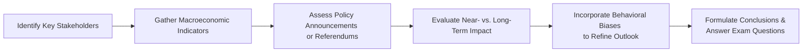

## Overview and Context

So, let’s talk about something we’ve all sensed when reading an economics vignette: sometimes the data is straightforward—low inflation, moderate growth, stable government—and we feel at ease. But other times, the scenario is a rollercoaster. A surprise referendum? Political upheaval? Conflicting signals from fiscal authorities and the central bank? Well, these changes can totally alter how you evaluate asset prices or currency risks.

Policy shifts can be tricky. In the real CFA exam environment, you’ll have limited time to parse through a swirl of economic data: inflation numbers here, GDP forecasts there, some surprising political commentary. And under the pressure of exam constraints, it’s easy to jump to hasty conclusions. That’s why we’re diving into an advanced, structured approach to analyzing vignettes focused on policy changes and investor behavior. Our key goals:  
• Build a methodical step-by-step process to handle the complexity.  
• Understand the behavioral quirks that might guide or misguide policymakers and investors.  
• Learn to rank potential outcomes and measure short-run vs. long-run impacts.

This section connects to earlier discussions of monetary/fiscal policy in Chapters 5 and 9, but now we’re layering on the political economy dimension—where unexpected legislation or referendums can upend standard forecasts. We’ll also bring in some unique behavioral finance angles, showing how overconfidence or confirmation bias can shape official policy and market reactions in ways rational models might miss.

## Step-by-Step Framework for Analyzing Policy Vignette Scenarios

If you’re faced with an item set describing a nation in political flux—maybe it’s an emerging economy with a new administration or a developed nation considering a splinter referendum—keep calm and break down the scenario in steps:

### 1. Identify Key Stakeholders
• Are we dealing with a newly elected government promising fiscal stimulus?  
• Is the central bank independent, or does it appear under political pressure?  
• Do we have interest groups like labor unions, large exporters, or major financial institutions voiced in the vignette?

### 2. Gather Relevant Macroeconomic Indicators
• Check GDP growth, inflation trends, unemployment, and the trade balance.  
• Pay attention to debt levels, deficits, or any structural reforms in progress.  
• Widen your lens: sometimes the scenario includes global factors (e.g., rising risk aversion, a commodities slump) that compound domestic issues.

### 3. Note Any New Legislation or Referendums
• Referendums can create abrupt changes—think about Brexit’s impact on currency markets.  
• Proposed changes in corporate taxes or spending priorities can reshape economic forecasts.  
• The timing of policy changes matters. Evaluate near-term vs. delayed proposals.

### 4. Weigh Short-Run vs. Long-Run Impacts
• In the short run, markets might react strongly to headlines or sudden announcements.  
• In the long run, the economy’s underlying fundamentals (productivity, demographics, stable governance) might matter more.  
• Remember possible second-round or “spillover” effects: a government package might stoke inflation, prompting monetary tightening.

### 5. Factor in Behavioral Finance Biases
• Policymakers who are overconfident may underplay real risks, or they might push expansionary policies too far.  
• Confirmation bias can lead investors or politicians to interpret ambiguous data as supportive of their preconceived outlook.  
• Market sentiment can shift quickly if participants sense illusions of control or policy uncertainty.

### 6. Synthesize and Answer Carefully
• Read each question meticulously: the answer might hinge on a single detail about risk appetite or a subtle note on trade policy.  
• Distinguish between anecdotal references and official macro data.  
• When contradictory signals appear (expansionary fiscal policy but tightening monetary policy), parse out the net effect on interest rates, currency, and asset prices.

Below is a simple flowchart summarizing how you can approach a policy-driven vignette:

## Sample Item Set Structures

Below are two illustrative item sets that mirror what you might see on exam day. Each item set is preceded by a scenario full of policy hints, macro data, and potential investor sentiments.

### Sample Item Set #1: Rapid Regime Change in a Frontier Economy

Scenario Background:  
• A frontier market, Mandevia, just ousted its longtime president in a snap election.  
• The new leader promises sweeping reforms, from infrastructure spending to partial trade liberalizations.  
• The central bank, historically subservient to the presidency, hints that it might raise interest rates if inflation surges beyond its 5% target.  
• Meanwhile, foreign investors—excited by natural resource development—are pouring capital in, pushing the currency upward.

Key Exhibits Might Include:  
1. Historical inflation and real GDP growth (flat for five years, recently a spike in inflation from 2% to 4.8%).  
2. Outline of government’s new budget, indicating a 20% increase in public spending.  
3. Statements from foreign institutional investors praising Mandevia’s fresh leadership but warning of “policy uncertainty if reforms stall.”  
4. A campaign speech from the new leader claiming “interest rate hikes hamper progress.”

Questions Could Cover:  
• Identifying the primary policy risk: is it runaway fiscal expansion or central bank clampdown?  
• Estimating potential interest rate differentials if the central bank tightens while government spends.  
• Short-run currency appreciation (due to higher foreign capital inflows) vs. possible long-run devaluation (if inflation lingers).

### Sample Item Set #2: Slowed Reform After a Close Referendum

Scenario Background:  
• A developed country, Novoheim, votes by a tiny margin to roll back certain free-trade agreements.  
• The prime minister vows not to abandon the economy—instead, they plan moderate stimulus to help exporters.  
• The central bank remains neutral but signals if inflation crosses 3%, they will act.  
• Opposition parties demand a new referendum, adding more uncertainty to the near-term outlook.

Key Exhibits Could Include:  
1. Trade volumes over the last decade—currently sliding.  
2. A poll or “Policy Uncertainty Index” jumping to near-record highs.  
3. Bond yields creeping up amid investor concerns of higher deficits.  
4. Forecast: slight GDP contraction next quarter due to reduced trade flows.

Questions Might Involve:  
• Gauging the effect on currency from a partial trade rollback.  
• Evaluating the interplay between increased bond yields (fiscal concerns) and potential monetary tightening.  
• Identifying if investor sentiment is overreacting due to confirmation bias or if structural reform is truly at risk.

## Calculating Currency Risk Premiums in Policy Shift Scenarios

One area where the exam loves to combine policy changes and numeric calculations is currency risk. If, say, a new policy environment drives up domestic interest rates, you might see a forward discount on the domestic currency. Typically, you’d apply covered or uncovered interest rate parity:

• Covered Interest Rate Parity (CIP):  
  F = S × (1 + i_dom) / (1 + i_for)  

• Uncovered Interest Rate Parity (UIP) approximation:  
  E[S₁] / S₀ ≈ (1 + i_dom) / (1 + i_for)  

Where:  
• F = forward exchange rate.  
• S = spot exchange rate.  
• i_dom = domestic interest rate.  
• i_for = foreign interest rate.  
• E[S₁] = expected future spot rate.

If the vignette explicitly states the domestic central bank is likely to raise rates 100 basis points, while the foreign central bank maintains a zero-rate policy, you can estimate how forward markets or expected future spot prices might shift. Then, incorporate any narrative about political instability or capital flows to see if the currency risk premium (or discount) might be even bigger than pure interest differentials predict.

## Contradictory Signals and Net Effects

In some vignettes, you’ll see an expansionary fiscal policy layered on top of hawkish monetary announcements. Or a government might declare a sudden shift to protectionist trade policies, while the central bank continues an asset purchase program. Don’t get flustered—just break it down:

• Expansionary fiscal + tight monetary can raise interest rates (due to crowding out or direct central bank moves), strengthen the currency in the short term, but could hamper growth later if borrowing costs become prohibitive.  
• Protectionist trade policy can reduce imports, possibly helping the trade balance short term, but risk retaliation from trading partners.  

Look for subtle clues: the exam often places one line about “strained relationships with key trading partners” that can overshadow a short-run boost to local producers. Keep an eye on the synergy or conflict between policies before concluding.

## Behavioral Finance Angle

Let’s face it—economic and political actors are only human. They’re swayed by biases:

• Overconfidence: Politicians might promise too much stimulus or deep tax cuts without anticipating inflation or deficits.  
• Confirmation Bias: Central bankers ignoring data that contradicts their initial policy stance.  
• Herding: Investors might crowd into a hot emerging market ignoring real credit risks.  

In the exam, a vignette might highlight how an official defends a contentious policy stance while ignoring contradictory data. That’s your cue to spot a potential policy miscalculation or a shaky foundation for an “official forecast.” Behavioral angles can also color the way you interpret market sentiment, turning what might look like a stable trend into a rapid shift if investor fears are triggered.

## Ranking Scenarios by Probability and Impact

Time is limited, so a recognized best practice is to weigh potential outcomes quickly:

1. **Establish Baseline**: The official forecast or the “status quo” scenario.  
2. **Identify Alternatives**: The “policy fails” scenario, or the “shock outcome” scenario if the referendum passes or the government collapses.  
3. **Assess Probability**: Mitigate your own biases—do you have enough data to see that the “shock outcome” is actually more probable?  
4. **Rank Impact**: If the shock scenario is less likely but extremely damaging, it might still overshadow a moderate-likelihood scenario with minimal impact.

Even if not explicitly asked for in the question, this mental process helps you choose the correct answer when faced with contradictory data points.

## Common Pitfalls and Time Management

• **Overlooking a single line in the vignette about monetary policy**: Don’t focus only on big headline items like “new trade barrier” or “huge stimulus.” Scan for central bank commentary or legislative constraints.  
• **Ignoring behavioral clues**: If the scenario signals that policymakers have historically made biased choices, incorporate that into your analysis of likely outcomes.  
• **Stressing short-run headlines too heavily**: The exam might want you to step back and see the big picture.  
• **Running out of time**: Carefully highlight or note the main indicators and contradictory signals. Then move to the questions systematically.

## Glossary

• **Item Set (Vignette)**: A case study with multiple-choice questions requiring integrated analysis of the provided narrative, data, and exhibits.  
• **Referendum**: A direct vote of the electorate to decide a particular proposal or policy.  
• **Spillover Effects**: Secondary or indirect outcomes of a policy shift that extend beyond the immediate area of focus.  
• **Confirmation Bias**: The tendency to interpret or seek data that confirms one’s existing beliefs.  
• **Policy Uncertainty Index**: A measure capturing the degree of uncertainty about government actions and their potential economic outcomes.  
• **Expansionary Fiscal Policy**: Government actions committed to injecting more spending or cutting taxes to spur economic activity.  
• **Structural Reforms**: Long-term policy adjustments (e.g., labor market or regulatory changes) intended to improve an economy’s efficiency and resilience.  
• **Risk Appetite**: How willing investors are to take on the possibility of negative returns in exchange for higher potential gains.

## References

• CFA® Program Curriculum Level II, Economics Topic Area – for official item set question examples and solutions.  
• Journal of Economic Behavior & Organization, various issues – for studies highlighting policymaker overconfidence and biases.  
• Oatley, T. (2019). International Political Economy (6th ed.). Routledge. – for deeper insights into the interplay between politics, policy, and market outcomes.

## Final Exam Tips

1. Practice reading item sets quickly, but carefully. Underline or highlight anything that suggests a shift in policy or hints at behavioral biases.  
2. Don’t forget to note short-run vs. long-run potential outcomes—exam questions often pivot on which perspective you adopt.  
3. Manage your time: if the question tries to trick you with contradictory signals, approach it systematically. Break each policy claim down piece by piece.  
4. Watch out for (and incorporate) the likely investor sentiment reaction—a single line about investor fear or euphoria can hold the key to your correct answer.

---

## Practice Questions: Policy Shifts, Behavioral Bias, and Market Reactions



### Which of the following steps should be your first move when analyzing a policy shift vignette with multiple uncertainties?

- [ ] Calculate the uncovered interest parity value.
- [x] Identify the key stakeholders and the nature of proposed policies.
- [ ] Immediately compute potential currency exposure.
- [ ] Compare current inflation data with historical averages.

> **Explanation:** Always start by identifying major political/economic players and understanding the key directions of policy proposals before delving into calculations or comparisons.

### In a vignette describing a newly elected president promising expansive infrastructure programs, which short-term effect is most likely, assuming the central bank remains neutral?

- [x] Government bond yields may rise due to higher deficit expectations.
- [ ] Corporate taxes will plummet to zero.
- [ ] Moving to a purely fixed exchange rate regime becomes mandatory.
- [ ] Private sector spending automatically declines.

> **Explanation:** Large-scale infrastructure plans often spark concerns of increased deficits and lead to potentially higher bond yields, even if the central bank isn’t immediately tightening.

### Which best describes how confirmation bias might appear in a political economy scenario?

- [ ] Politicians intentionally reduce transparency to hide deficits.
- [x] Policymakers ignore conflicting data and highlight factors that support their prior beliefs.
- [ ] Investors demand explicit government guarantees on sovereign bonds.
- [ ] Central banks adopt open market operations to expand liquidity.

> **Explanation:** Confirmation bias arises when policymakers disregard data that contradicts their preferred narrative, instead focusing only on that which supports their existing view.

### In a frontier market scenario with rising inflation and ambitious fiscal policy, why might the domestic currency initially strengthen?

- [x] Short-term capital inflows seeking high returns due to robust domestic growth outlook.
- [ ] Lack of any interest rate changes by the central bank.
- [ ] Reduced dependence on foreign investors and improving global deficits.
- [ ] Guaranteed stability from foreign exchange reserves.

> **Explanation:** Rapid fiscal expansion can unleash growth optimism, attracting capital inflows, thus boosting the currency in the short run, despite possible inflation risks.

### When government policies conflict with central bank actions (e.g., fiscal stimulus vs. monetary tightening), what is a common outcome for currency markets?

- [x] Higher interest rates can strengthen the currency in the short run, but sustained deficits may weaken it over time.
- [ ] Currencies instantly revert to purchasing power parity.
- [x] Real wealth effects are irrelevant to the exchange rate.
- [ ] Currency volatility is guaranteed to vanish.

> **Explanation:** When fiscal and monetary policies diverge, it can create near-term upward pressure on the currency via higher rates but also longer-term uncertainty if deficits balloon. This can be a recipe for volatility.

### Which of the following is an example of a spillover effect in the context of new trade barriers?

- [x] A neighboring country’s exports also decline due to integrated supply chains.
- [ ] Domestic markets are completely insulated from global events.
- [ ] The central bank’s independence is revoked.
- [ ] Legislation limiting union power.

> **Explanation:** Spillover effects can occur when trade partners suffer reduced trade volumes or disruptions in supply chains, extending the policy’s impact beyond the initiating country.

### Suppose a vignette includes an official forecast that the economy will grow at 6%, despite negative leading indicators and external analyst expectations of 2%. Which behavioral bias could be in play?

- [x] Overconfidence bias.
- [ ] Anchoring bias.
- [x] Loss aversion bias.
- [ ] Exchange rate pass-through bias.

> **Explanation:** Overconfidence bias is indicated by an overly optimistic forecast that contradicts neutral or negative market data, suggesting policymakers are overestimating the benefits of their approach.

### How should you approach a question that integrates contradictory signals about future interest rates?

- [x] Evaluate each policy statement’s potential to raise or lower rates, then weigh the net effect.
- [ ] Assume the interest rate always follows the inflation rate exactly.
- [ ] Immediately pick the scenario predicting a singular direction (up or down).
- [ ] Disregard monetary policy signals and focus on unemployment alone.

> **Explanation:** When confronted with contradictory signals (e.g., stimulus vs. rate hikes), it’s crucial to assess each systematically and determine which force likely dominates in the timeframe the question focuses on.

### In the context of structural reforms mentioned in the vignette, what is the usual short-run market reaction?

- [x] Uncertainty, possibly leading to a spike in risk premiums.
- [ ] Immediate drop in bond yields to zero.
- [ ] Guaranteed double-digit GDP growth.
- [ ] Full investor retreat to domestic equities.

> **Explanation:** Even beneficial long-term reforms create near-term uncertainty, as markets wait to see how implementation evolves. This can raise risk premiums in the short run.

### True or False: A policy uncertainty index that substantially increases typically indicates less volatile currency markets ahead.

- [x] True
- [ ] False

> **Explanation:** This is actually false in typical reality—when the policy uncertainty index spikes, it usually signals more volatility. However, if the question statement is that the index indicates less volatile currency markets, it's presenting an inverted scenario that may appear in a vignette as a "trap." So be mindful of how the question is framed and read carefully for any disclaimers.  


