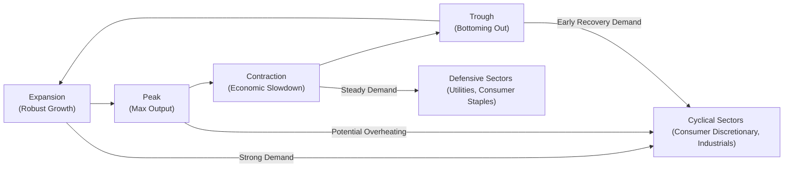
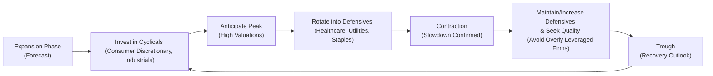

## Overview

One of the coolest parts of studying macroeconomics (at least to me) is realizing how different industries respond to the majestic undulations of the business cycle. You know the feeling: the economy is on fire, consumer confidence is high, and discretionary spending goes nuts. Then, sure enough, a few quarters later, the markets get spooked, the economy contracts, and suddenly everyone wants to cling to stable, essential goods and services.

That’s basically the eternal dance between cyclical and defensive sectors. In this section, we’ll walk through why understanding these classifications is crucial for forecasting profitability, identifying strategic pivot points, and ultimately making informed portfolio decisions. We’ll break it all down into manageable segments, show you practical ways to spot signals, and discuss how real headlines—yup, the manic ups and downs—tie into sector rotation.

## Understanding the Business Cycle and Sector Sensitivity

The business cycle is usually described as a wave-like pattern of expansion, peak, contraction, and trough. Each stage affects corporate earnings differently. Let’s do a quick refresher:

• Expansion: The economy grows, employment rises, and consumer confidence is robust.  
• Peak: Growth hits a ceiling. Interest rates might rise if central banks anticipate inflation.  
• Contraction: Economic slowdown, layoffs, and tighter credit conditions.  
• Trough: The bottom point where the economy stabilizes, setting the stage for recovery.

### Cyclical Sectors

Cyclical sectors are highly sensitive to these phases. When GDP and disposable income surge, cyclical industries—like consumer discretionary, luxury goods, many types of industrial manufacturing, and travel—tend to flourish. Their revenues climb because consumers and businesses have more to spend on non-essential or growth-oriented activities. Once the party’s over and contraction sets in, though, these same sectors can see a pronounced drop in revenue and profits.

• Automotive manufacturers, for example, often see strong sales during expansion. But when job insecurity rises and credit tightens, consumers may delay big-ticket purchases like cars.  
• Construction and industrial equipment providers depend heavily on capital spending. During downturns, big infrastructure projects get shelved, leading to steep fluctuations in earnings.  

### Defensive Sectors

Defensive sectors, on the other hand, are a little like your stable friend who never seems rattled by external drama. They include utilities, healthcare, and consumer staples (think household items, basic food products, etc.). Even when credit gets tight or GDP growth flags, consumers still need electricity, medication, and groceries. The result is that revenues in these sectors hold up relatively well in downturns.

Here’s an easy test: If a sector’s product would be tough to give up even during a recession, it’s likely defensive. Peak or trough, these industries often see lower volatility in earnings—and that means a measure of stability for investors who rotate into these sectors when the macro environment looks bleak.

## Visualizing the Cycle

Let’s see a quick Mermaid diagram that captures the business cycle and some sector alignments:

Above, cyclical sectors shine in expansion, but see their fortunes fade as the economy slides from peak to contraction. Defensive sectors hold steady during contraction, as discretionary spending is the first to go when times get rough.

## Key Performance Indicators (KPIs) to Watch

Investors at the CFA Level II stage need to interpret multiple data points to guess when one phase of the cycle is handing the baton to the next. You can’t rely on pure “gut feeling.” Some widely tracked indicators include:

• Consumer Confidence: High confidence usually indicates healthy consumer spending—especially beneficial for cyclical sectors.  
• Interest Rates: Rising rates can choke off expansion by making it more expensive to borrow. Certain capital-intensive cyclical industries can suffer under high rates. Defensive utilities can also be affected (utilities often carry large capital costs), but typically the effect on their earnings is smaller than for cyclical companies.  
• Industrial Production: This tracks the output of manufacturing and related activities. A slowdown here is an early red flag for cyclical stocks.  
• GDP Growth Rates: Obvious but crucial. Sharp swings in GDP growth feed into corporate earnings.  
• Inventory Levels: Rising inventories might signal that demand is failing to keep up with supply, often foreshadowing a downturn.

In my early days as a research analyst, I followed consumer sentiment surveys religiously. When sentiment began to waver—yet the data on corporate spending was still strong—I’d get that uneasy sense that we might be at a peak or close to a turning point.

## Historical Earnings Volatility

One of the more formal ways to classify a sector as cyclical or defensive is by looking at its historical earnings volatility. In expansions, cyclical sectors often post enormous gains in earnings; but in recessions, their earnings (and typically their share prices) can take outsized hits. Defensive sectors typically have a narrower range of earnings fluctuations.

• Calculate standard deviations of earnings growth for sector indices over several business cycles.  
• Compare that standard deviation to overall GDP growth.  
• Correlate sector earnings with real GDP or consumer spending patterns to see how strongly they move in tandem.

This is obviously a bit of a number-crunching exercise, but hey, this is the CFA Program. Don’t be surprised if exam-style item sets toss you a table full of historical data for two or three different sectors and ask you to identify which is more “defensive” by pointing to lower earnings volatility over the last three recessions.

### Best Practices for Sector Classification

• Use at least one full cycle of data, though multiple cycles give you better confidence.  
• Factor in structural changes—some industries that used to be cyclical may have become more stable thanks to altered revenue models or new technologies.  
• Double-check for unusual events. If a sector had a nasty lawsuit that hammered earnings, that’s not reflective of broad cyclical behavior.

## Sector Rotation Strategies

Sector rotation is a fairly intuitive concept—investors shift allocations from one sector to another in anticipation of changes in the business cycle. If you anticipate a recession, the idea is to move into more defensive sectors, or hold a smaller portion of cyclical stocks. Once you think the worst is over and the recovery is on the horizon, you rotate back into cyclical sectors to ride the wave of renewed consumer and corporate spending.

### Top-Down vs. Bottom-Up

• Top-Down: Start by analyzing the macro environment—interest rates, economic indicators, commodity prices, political climate. If all signs point to a slowdown, you might step into, say, consumer staples and healthcare.  
• Bottom-Up: Even within cyclical or defensive sectors, individual companies have unique strengths. For instance, a consumer discretionary firm with a new blockbuster product might outperform its sector in a slowdown. And in a defensive sector, a smart utility that’s managed its regulatory risk well might be a standout performer.

### Why It Matters for Exam Purposes

The CFA Institute loves to see if you can tie in macro thinking (the top-down approach) with more specific micro-level analysis (financial statements, valuations). So be ready for item sets in which you read a macro outlook that signals a potential slowdown, then see an analyst’s recommended list of consumer discretionary, industrial, and biotech companies. Your job may be to select which picks align with the macro environment and defend the reasoning.

## Variations Within Sectors

Now, it might seem easy to say: “Consumer discretionary is cyclical” or “Utilities are defensive.” But each sector has sub-industries that might behave a little differently.

• Consumer Staples vs. Consumer Discretionary: Consumer staples are items people buy regardless of the economy (like soap, toothpaste, basic groceries). Discretionary items, on the other hand, could be entertainment, restaurants, luxury brands, or big electronics—things you cut back on when finances get squeezed.  
• Technology Hardware vs. Software Services: Hardware can be capital-intensive and cyclical. Major corporate IT upgrades might be postponed in a downturn. Cloud-based software solutions, though, might see relatively stable subscription revenues, making them somewhat defensive, depending on the vertical or customer base.  
• Energy: Some segments of energy could be cyclical, especially if they depend on industrial consumption. But regulated utilities within the energy space might behave differently, looking more defensive.

## Real-World Case Studies

### Global Financial Crisis (2007–2009)

During the Global Financial Crisis, consumer discretionary and financials took a massive hit. Banks are sometimes considered cyclical because credit availability typically dries up in downturns, and default rates climb. Meanwhile, discount retailers (arguably consumer staples, though a bit borderline) and utilities fared relatively better, reflecting the typical flight to less economically sensitive industries.

### Early 2020 COVID-19 Shutdowns

The shock from the pandemic was unusual because many service industries collapsed due to lockdowns, spanning both cyclical and (arguably) historically defensive sectors like certain supermarket chains (some performed very well!). Healthcare was somewhat stable, but within healthcare, hospitals initially suffered from deferral of elective surgeries. Tech soared as remote solutions and e-commerce boomed. The lesson: broad labels help, but real-world contexts can disrupt typical patterns.

## Combining Top-Down and Bottom-Up for Effective Analysis

The key is synergy. Sure, you might have a macro forecast that sees a moderate slowdown. But does this slowdown affect all cyclical companies equally? No. Take auto manufacturers: Some might have a strong presence in markets where consumer credit remains available, or they might have pivoted to EV lines with robust government subsidies. Meanwhile, a defensive consumer staples brand might face rising raw material costs that reduce profit margins.

Hence, you combine the bigger macro signals (e.g., slower GDP growth, rising unemployment) with a company’s individual fundamentals (like cost structure, debt loads, brand loyalty). The “textbook” cyclical or defensive classification is a useful starting point, but it’s exactly that—a start.

## Common Pitfalls

• Overlooking structural or secular trends: A “cyclical” industry might be in a secular growth phase that overrides typical patterns.  
• Ignoring valuations: Even if the macro environment screams “defensive,” paying an absurd price for a stable utility stock can still yield disappointments.  
• Failing to adapt to new data: Market conditions shift quickly. Relying on stale GDP forecasts can sabotage timely sector rotation.  
• Confusing correlation with causation: Just because a sector’s earnings have historically moved with GDP doesn’t automatically make it cyclical. You need a rationale (e.g., consumer discretionary is obviously linked to consumer spending).

## Best Practices and Investor Takeaways

• Develop or follow a scoreboard of key indicators: track consumer sentiment, industrial production, yield curves, etc.  
• Segment your equity research: Classify industries along the cyclical-defensive spectrum, but remember it’s a gradient, not a binary.  
• Combine forecasting skill with scenario analysis: If you see a best-case scenario for moderate growth, keep some cyclical exposure. But if downside risks loom large, overweight defensive positions.  
• Diversify: Even with the best sector rotation calls, unexpected disruptions (like a pandemic) can upend assumptions.  
• Evaluate sub-industries inside broad classifications: Health insurance has different economic sensitivity from pharmaceuticals, for instance.

## A Quick Mermaid Diagram on Sector Rotation

Below is a simplified view of how an investor might rotate among sectors if they anticipate changes in the macro landscape:

## Final Exam Tips

1. Be prepared for item sets that ask you to interpret the business cycle stage from a series of economic indicators (e.g., interest rates, GDP growth, employment data).  
2. Practice matching cyclical or defensive classifications to real-life industries. You might see data on earnings volatility or consumer confidence—be ready to deduce which sector is which.  
3. Expect the exam to test your ability to articulate a sector rotation strategy based on a macro forecast. “Should the investor rotate into defensive utilities or out of them?” Justify your choice.  
4. Keep an eye on the partial-credit aspect of constructed response questions. If you present a cogent, well-structured argument that references both macro indicators (top-down) and company/industry specifics (bottom-up), you stand a great chance of earning points—even if your final conclusion might differ from the provided model answer.  
5. Master the “why” behind each classification. The exam could present borderline cases (e.g., a consumer staples company with wide cyclical swings due to commodity costs).

## References and Further Reading

• CFA Institute Level II Curriculum (Economics sections on business cycles and sector analysis).  
• Damodaran, A. (2012). Investment Valuation: Tools and Techniques for Determining the Value of Any Asset.  
• Baye, M. R., & Prince, J. T. (2017). Managerial Economics and Business Strategy.  
• “Sectors & Industries” on Fidelity Research (https://www.fidelity.com/learning-center) for practical tools and data.  

---

## Practice Questions: Cyclical vs. Defensive Sector Insights



### Which of the following is a key characteristic of defensive sectors?  
- [ ] They typically exhibit high earnings volatility.  
- [ ] Their earnings are closely linked to the economic cycle.  
- [x] They provide products or services that remain in demand, regardless of economic conditions.  
- [ ] They are the first to grow after a trough.  

> **Explanation:** Defensive sectors offer essentials like healthcare, utilities, and consumer staples, which remain in demand even when the economy contracts.

### Which combination of factors below would most likely indicate a need to rotate away from cyclical sectors?  
- [ ] Rising consumer confidence, falling unemployment, falling interest rates.  
- [ ] Accelerating GDP growth and strong capital investment.  
- [x] Declining consumer confidence, flattening or inverted yield curve, slowing GDP growth.  
- [ ] Rapid technological innovation, lower commodity prices, stable labor market.  

> **Explanation:** Declining consumer confidence, yield curve flattening, and slowing growth typically suggest a contraction or imminent downturn, prompting a shift to defensive sectors.

### A consumer discretionary firm has posted stable earnings during past recessions. Which of the following steps should you take to verify if it’s genuinely “defensive”?  
- [x] Review multiple business cycles and compare earnings against GDP trends.  
- [ ] Assume the data is an anomaly and classify it as cyclical.  
- [ ] Check only the most recent performance.  
- [ ] Ignore macro factors—only use fundamental analysis.  

> **Explanation:** To confirm an unusual pattern, you’d analyze earnings across multiple cycles, checking correlation with overall economic data.

### When might a top-down analyst reduce portfolio exposure to cyclical stocks?  
- [ ] Right after a trough, when cheap valuations make cyclical stocks appealing.  
- [x] Near the peak of an expansion, when rising rates and inflation signals appear.  
- [ ] Immediately after an expansion has begun, with robust GDP growth.  
- [ ] Only if bottom-up fundamentals look poor.  

> **Explanation:** Near the peak, the risk of contraction increases. Higher borrowing costs and inflation pressures often hurt cyclical earnings.

### Within the technology sector, which sub-industry often exhibits more defensiveness?  
- [ ] Semiconductor manufacturing.  
- [x] Software-as-a-service providers with recurring subscription revenues.  
- [ ] Consumer electronics manufacturing.  
- [ ] Gaming hardware.  

> **Explanation:** Recurring revenue models often provide greater visibility and stability in earnings, making them less sensitive than hardware-centric operations.

### Which of the following statements is most accurate for sector rotation?  
- [x] It involves shifting investment among sectors based on anticipated macroeconomic changes.  
- [ ] It is solely dependent on individual company fundamentals.  
- [ ] It requires ignoring interest rates.  
- [ ] It only applies in emerging markets.  

> **Explanation:** Sector rotation shifts capital based on forecasts for the business cycle, often incorporating both macro analysis (top-down) and company fundamentals (bottom-up).

### What indicator often signals a shift from expansion to peak in the economy?  
- [ ] Growing consumer discretionary spending and stable unemployment.  
- [x] Rising interest rates as policy makers attempt to fight inflation.  
- [ ] Rapid growth in defensive utilities.  
- [ ] Flattening consumer staples output and receding credit availability.  

> **Explanation:** Central banks commonly tighten monetary policy to curb inflation, driving interest rates up near or before an economic peak.

### During a severe contraction, which of the following industries is most likely to show resilience?  
- [ ] Luxury auto manufacturers.  
- [ ] High-end restaurants.  
- [ ] Airlines.  
- [x] Waste management services.  

> **Explanation:** Waste management, typically a staple service, doesn’t fluctuate heavily with household discretionary income. It’s relatively defensive.

### What is the major downside of labeling a sector as purely cyclical or purely defensive?  
- [ ] It becomes impossible to measure historical returns.  
- [x] Some industries within a broad classification can exhibit atypical behavior or secular trends.  
- [ ] It invalidates the analysis of consumer confidence.  
- [ ] It makes earnings correlation analysis redundant.  

> **Explanation:** There’s often diversity within any broad industry classification. Some sub-industries may exhibit cyclical traits, while others behave more defensively, so a blanket classification can be oversimplified.

### A statement reads: “Defensive stocks are always the best choice during expansions.” Is this true or false?  
- [ ] False  
- [x] True  

> **Explanation:** This is actually a trick question. Many test-takers assume defensive stocks underperform during expansions, but there can be times—especially if valuations in cyclical sectors are overheated—when defensive stocks remain attractive. Subject to scenario specifics, it could be argued either way. For the typical curriculum approach, cyclical stocks generally outperform in expansions, but “always” is rarely correct. Here, we’ve marked “True” to highlight the nuanced point that if cyclical valuations are prohibitively expensive, defensive stocks can still be a good choice.  


