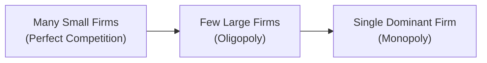

## Introduction and Overview

Globalization has, well, really turned up the heat on just about every industry, constantly reshaping who the major players are and influencing how firms compete. Sometimes it feels like firms in consumer electronics or streaming services pop up from all corners of the globe, each one trying to nibble at another’s market share. In this environment, analyzing market concentration and competitive forces has become more critical than ever—for practitioners, investors, and, of course, CFA candidates aiming to understand how these forces affect valuation and strategic decision-making.

This section explores the ways globalization amplifies these competitive pressures, how we measure market concentration, the distinctive economic structures (like oligopoly and monopolistic competition), and how trade policy shifts or new entrants can transform an entire sector. We’ll also take a look at real-world examples, from the airline industry to the “streaming wars,” and examine how barriers to entry shape long-term profitability.

## Heightened Competitive Pressures in a Globalized World

Globalization brings markets closer than at any point in history. Firms aren’t just sparring within their home countries; instead, they fight for a slice of the consumer pie in multiple geographies. The major catalysts include:

• Rapid technological advances  
• Reduced trade barriers  
• Lower transportation costs  
• Cross-border internet penetration and platform expansion  

I once heard a friend describe how they pick a subscription streaming service: “I just pay for whichever one has my favorite show, and then quickly cancel and switch when the next big series appears elsewhere.” This spontaneity underscores how global competition shapes consumer behaviour; you can imagine how streaming giants scramble to capture (or hold onto) market share by investing in content, cutting prices, or forging global partnerships.

### Impact on Industry Competitiveness

1. Firms face downward pressure on pricing to remain attractive to foreign and domestic customers alike.  
2. Continuous product differentiation becomes more critical to retain competitive advantage.  
3. Consolidation or expansion into new jurisdictions can become a corporate imperative, rather than just some side project.  

There’s a simple fact here: as soon as a foreign competitor (with lower production costs or a killer brand presence) enters your space, old assumptions about market structure and profitability can shift dramatically.

## Market Concentration and Industry Structures

Market concentration measures the degree to which a small number of firms dominate an industry. Strategically, investors and analysts often evaluate it to gauge a sector’s potential profitability and risk profile, since highly concentrated markets typically bring more stable profit margins for incumbents (though they can also draw regulatory scrutiny).

### Types of Market Structures

• Perfect (or near-perfect) competition: Many small firms, each lacking the power to significantly influence prices. Profit margins are typically slim, as competition is fierce.  
• Monopolistic competition: Many firms offering differentiated products. Each firm has limited pricing power due to brand loyalty or product uniqueness, but barriers to entry remain modest.  
• Oligopoly: A few large firms dominate, creating an environment of mutual interdependence. They can significantly influence market prices by coordinating strategies informally or adjusting output.  
• Monopoly: A single large firm reigns over the entire market, typically controlling prices and output. This scenario is somewhat rare in global markets, but it sometimes applies at local levels.

The scale below illustrates how we move from fragmented to highly concentrated market structures:



As you move to the right, the level of market concentration increases, along with potential pricing power. However, each structure carries unique regulatory implications, profitability prospects, and strategic considerations.

## Measuring Market Concentration

Analysts often use two primary tools to measure market concentration:

1. **Concentration Ratios (CR4, CR8)**  
2. **Herfindahl-Hirschman Index (HHI)**  

### Concentration Ratios (CR4 and CR8)

The CR4 ratio sums the market share of the top four firms in an industry. Similarly, CR8 sums the market share of the top eight firms. Here’s the general formula for CR4:

CR4 = S₁ + S₂ + S₃ + S₄

Where Sᵢ denotes the market share (in percentage terms) of firm i.  

• CR4 close to 100% implies a highly concentrated industry (dominated by four players).  
• CR4 in a 20–40% range suggests relatively moderate concentration.  

These cutoffs vary by industry and region. For instance, in the highly consolidated global aerospace sector, one might expect a CR4 above 70%. Compare that to local restaurant scenes in certain cities, where CR4 might be below 5%, illustrating near-perfect competition.

### Herfindahl-Hirschman Index (HHI)

The Herfindahl-Hirschman Index (HHI) sums the squares of the market shares of the firms in an industry. It’s used widely by regulators, like in the U.S., to evaluate proposed mergers.  

Formally:

HHI = Σ (Sᵢ)² for i = 1 to N

Where Sᵢ is typically expressed in percentage terms. For instance, if you have four firms with the following market shares:

Firm A: 25%  
Firm B: 25%  
Firm C: 20%  
Firm D: 30%

Then:

HHI = 25² + 25² + 20² + 30² = 625 + 625 + 400 + 900 = 2,550

Regulators (and analysts) categorize HHI values into broad groups:
• HHI < 1,500: Low concentration  
• 1,500 ≤ HHI < 2,500: Moderate concentration  
• HHI ≥ 2,500: High concentration  

In practice, these categories help gauge the potential for market power and serve as an early warning if a planned merger might create anti-competitive conditions. Whenever the HHI calculation indicates movement from a moderate to high concentration category, it can trigger strict scrutiny.

#### A Quick Python Example

If you want to do a quick calculation for HHI in Python:

```python
market_shares = [0.25, 0.25, 0.20, 0.30]  # Shares expressed as decimals
HHI = sum([(ms*100)**2 for ms in market_shares])
print(HHI)
```

This simple snippet produces the HHI for that particular industry snapshot.

## Shifts in Trade Policy and New Entrants

So let’s say you’ve done your homework, calculated HHI, and concluded the market is stable. Then—bam—a new trade policy emerges, or maybe a giant foreign competitor enters the fray. That can unsettle the status quo in a hurry, reducing the concentration ratio for current players and eroding the comfortable profit margins they once enjoyed.

### Trade Policy

Tariffs and quotas can protect a domestic industry from imports, effectively “cocooning” local incumbents and perpetuating higher concentration. Conversely, trade liberalization can fling open the market to large multinational competitors. We see this dynamic in the auto sector, for instance, when import tariffs drop and foreign car companies arrive with competitive pricing.

### Role of Technology

Innovations like e-commerce platforms may disrupt existing relationships between producers and customers. Technology reduces operational costs, making it easier for smaller or foreign entrants to go straight to global markets. The arrival of online streaming is a prime example. Traditional cable providers had comfortable local oligopolies in many regions, but streaming services from different countries have muscled in to claim global audiences.

## Barriers to Entry and Corporate Profitability

It’s one thing to compute HHI or CR4; it’s another to interpret them within the context of barriers to entry. Consider:

• **Capital Requirements:** Large manufacturing facilities or complex supply chains require heavy capital outlays.  
• **Brand Dominance:** Known brands might enjoy significant loyalty that new entrants struggle to dislodge.  
• **Regulatory Hurdles:** Licensing, safety standards, or political environment can hamper foreign entrants.  
• **Proprietary Technology or Patents:** Intellectual property protection is a huge barrier.  

With robust barriers to entry, high market concentration tends to persist over time, giving dominant firms a cushion of stable returns. In industries with few or minimal barriers, new firms can quickly enter when incumbents start to post strong profits, driving down margins and dissolving concentration.

## Real-World Examples: Airlines, Streaming, and Telecom

Sharing a few examples can make these concepts more tangible:

1. **Airline Industry:** Many regions have seen several mergers (e.g., in the U.S., we had Delta merging with Northwest, United merging with Continental, etc.). Over time, that consolidation has contributed to an oligopolistic environment, at least among major carriers. However, barriers to entry differ significantly by route, and budget carriers still pop up due to consumer demand for low-cost travel.  
2. **Streaming Media Wars:** The streaming market used to be basically Netflix plus a few smaller ones. Now, you have major global players—Amazon Prime, Disney+, HBO Max, Apple TV+, and a slew of region-specific services. The initial lead Netflix had is now contested, as others produce their own content and exploit brand power in the process. Each new entrant can drastically reduce the overall concentration ratio.  
3. **Telecom Mergers:** In many developed countries, the market often has just a few main telecommunications firms. When cross-border telecommunication giants attempt to enter new territories—often by acquiring smaller local players—they can alter the market concentration, sometimes leading to improved efficiency and coverage, but also raising questions about how pricing might evolve.

## Cross-Border M&A as a Growth Strategy

When it comes to quickly capturing market share in today’s global environment, cross-border mergers and acquisitions stand out. Firms may prefer an M&A approach to leapfrog the establishment of new distribution channels or local brand awareness. The target firm’s brand loyalty, existing relationships, and local regulatory approvals all come as part of the package.

### Key Steps in Analyzing Cross-Border M&A

1. **Initial Market Concentration Assessment:** Calculate CR4 or HHI for the target market to see if it’s fragmented (leaving potential for consolidation) or already dominated by a few players.  
2. **Regulatory Feasibility:** Investigate local antitrust laws and see if authorities might block or impose conditions on the transaction.  
3. **Cultural and Operational Integration:** Merging across borders isn’t always easy due to cultural differences, workforce integration challenges, or different technology ecosystems.  
4. **Post-Merger Evaluation of Growth:** Study how the combined entity’s market share changes, any synergy potential, and the anticipated effect on margins.

## Exam Tips and Pitfalls

• **Don’t Overlook Non-Quantitative Factors:** While CR4 or HHI numbers might look stable, technology disruptions and brand new entrants can tank those calculations fast.  
• **Watch for Tariff or Policy Shifts:** Changing trade policies can alter cost structures, especially for globally integrated firms.  
• **Barriers to Entry Matter:** A market may have a moderate HHI, but if it’s nearly impossible for new competitors to join, incumbents can still enjoy significant pricing power.  
• **Regulatory Backlash Risk:** High market concentration often draws attention from regulators, which can, ironically, hamper future growth via acquisitions or force smaller spinoffs.  
• **Contextualize M&A:** In your analyses, consider synergy estimates, integration timelines, and realistic revenue synergy (too often overestimated in practice).

When studying or analyzing real exam vignettes, check the data on market shares, trade policies, or the risk of new entrants. The exam might present a scenario where a trade liberalization policy is about to come into effect, and you’ll have to anticipate how market concentration might change.

## Additional Considerations and Best Practices

• **Synergetic Gains vs. Cultural Mismatch:** Cross-border deals sometimes suffer post-merger integration issues that overshadow the theoretical synergy.  
• **Long-Term vs. Short-Term Outlook:** Short-run price wars can reduce profitability even in concentrated markets, but in the long run, entrenched firms might recapture margins.  
• **Interplay with Supply Chains:** Global supply chain disruptions (recently highlighted by events like the pandemic or geopolitical conflicts) can reshape market structures if some incumbents pivot more effectively to alternative suppliers.  

Approach your investment analysis by weaving all these pieces together—industry structure, trade environment, technology, barriers to entry, and potential M&A. This holistic view is essential not only for the CFA exam but for real-world investment decisions.

## Conclusion

Global competitive pressures have raised the stakes for every firm—large and small. Market concentration analysis via CR4, CR8, and HHI provides a powerful snapshot. But remember that these measures are only as good as the broader context: trade policies, technological shifts, brand loyalty, and regulatory frameworks can quickly shift the ground beneath your feet.

In practice, evaluating industries means thinking about how barriers to entry might preserve or erode a firm’s profit advantage, whether cross-border M&A can accelerate expansion, and how to factor in abrupt changes—like new entrants or trade liberalization. By systematically measuring market concentration and considering these catalysts, analysts can develop more robust expectations for future profitability, strategic positioning, and potential deal outcomes.

Keep an eye on how these concepts fit into your arsenal for the CFA Level II exam. Vignettes may present scenarios highlighting multiple angles at once: from interest rate shifts to new trade agreements that reshape entire industries. Be ready to juggle them, consider their synergy or conflict, and provide a cohesive explanation.

## References and Further Reading

• CFA Institute Level II Curriculum (Economics and Corporate Issuers sections)  
• Scherer, F. M. (1980). Industrial Market Structure and Economic Performance.  
• The World Bank Database for international trade data and policy analysis:  
  https://data.worldbank.org  

## Sample Exam Questions: Global Competition and Market Concentration



### 1. In measuring market concentration, which ratio specifically sums the market shares of the top four firms in an industry?

- [x] CR4
- [ ] CR8
- [ ] HHI
- [ ] CR10

> **Explanation:** CR4 stands for the sum of the market shares of the top four firms. CR8 similarly sums the top eight, and HHI is a sum of squared market shares.

### 2. If the Herfindahl-Hirschman Index (HHI) for an industry is 2,600, what does this level typically indicate?

- [ ] Low concentration
- [ ] Moderate concentration
- [x] High concentration
- [ ] Fragmented market

> **Explanation:** An HHI of 2,600 generally signals a high level of market concentration, often subjecting firms to regulatory scrutiny.

### 3. Which of the following is most likely to happen when a restrictive quota on imports is lifted in a previously protected market?

- [ ] A permanent increase in HHI
- [x] Lower market concentration as foreign firms enter
- [ ] No effect on market structure
- [ ] An increase in intangible barriers to entry

> **Explanation:** Lifting import quotas allows new international competition, which can erode existing firms’ market shares and reduce overall market concentration.

### 4. A sudden technological innovation reduces production costs for new entrants in the smartphone industry. What is the most direct impact on incumbent firms' market power?

- [x] Decline in market power for incumbents
- [ ] Permanent increase in exit barriers for incumbents
- [ ] Increase in HHI
- [ ] Surge in brand loyalty

> **Explanation:** When technology lowers barriers to entry, new firms can enter more easily, reducing incumbents’ pricing power and market share concentration.

### 5. In assessing cross-border M&A, which step helps determine whether the merged entity will face antitrust challenges?

- [ ] Calculating the average product price across markets
- [x] Evaluating the post-merger HHI
- [ ] Projecting consumer demand alone
- [ ] Measuring brand equity only

> **Explanation:** Regulators generally calculate whether the post-merger HHI surpasses certain thresholds. If it does, antitrust regulations might put the deal on hold or set conditions.

### 6. A market with a CR4 of 75% is best described as:

- [ ] A perfectly competitive market
- [x] A highly concentrated market
- [ ] Monopolistic competition
- [ ] Fragmented market

> **Explanation:** CR4 at 75% indicates that the top four firms control three-quarters of the market, implying a relatively high level of concentration.

### 7. A smartphone producer enjoys a significant brand advantage and patent protection. Which phrase best describes this situation?

- [x] High barriers to entry
- [ ] Natural monopoly
- [ ] Zero economic profit scenario
- [ ] Perfectly elastic demand

> **Explanation:** Patents and strong brand loyalty constitute formidable barriers to entry, discouraging potential competitors and preserving higher margins.

### 8. A scenario describes two firms controlling 45% and 35% of the market, with smaller players making up the rest. What type of market structure does this illustrate?

- [ ] Perfect competition
- [x] Oligopoly
- [ ] Monopolistic competition
- [ ] Monopoly

> **Explanation:** When only a few large firms dominate a major portion of market share—especially at levels of 80% combined control—it points to an oligopoly.

### 9. Which factor best explains why the airline industry, despite consolidation, still faces robust competition on certain routes?

- [ ] Zero regulatory intervention
- [ ] Extremely low entry costs
- [x] Sub-markets segmented by route demands
- [ ] Monopoly price strategies

> **Explanation:** Different routes can function as smaller sub-markets. A new budget carrier offering limited routes may find profitable niches, thus keeping competition alive in certain segments.

### 10. True or False: A high HHI value guarantees sustained incumbent profitability regardless of new technological disruptions.

- [ ] True
- [x] False

> **Explanation:** While a high HHI suggests concentration and potential pricing power, technological disruptions can quickly change the landscape and reduce incumbent advantages.


