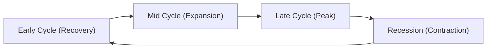

## Introduction and Overview

So you’re flipping through economic data at your desk, sipping that second (or third!) cup of coffee, trying to figure out which sectors might be poised to outperform over the next several months. Maybe interest rates are drifting upward, or perhaps central banks have started making noises about quantitative tightening. If you’ve ever wondered, “Am I supposed to rotate more towards financials when rates go up?” or “Could higher consumer discretionary spending be around the corner?”—then you’re tapping into an approach known as sector rotation.

Sector rotation strategies leverage macroeconomic signals—leading, coincident, and lagging indicators—to anticipate where we stand in the business cycle and how different equities might behave at each phase. In this section, we’ll explore:
• How to combine top-down macroeconomic analysis with bottom-up industry fundamentals.  
• Common sector rotation models, especially in different stages of the business cycle.  
• The use of signals like changes in interest rates, yield curve inversions, or inflation trends for sector allocation.  
• Practical tips on hedging macro risks and enhancing returns with timely rotations.  

We’ll use some personal experiences and real-world stories along the way. Don’t worry if you’ve never tried this before—sector rotation has many moving parts, but it can be a powerful tool for the well-prepared CFA® candidate and investment professional.

## Macroeconomic Indicators and Sector Rotation

### Leading, Coincident, and Lagging Indicators

A successful sector rotation strategy starts with understanding how economic indicators behave relative to overall economic activity:

• Leading Indicators: These shift before the broader economy does. Examples include new orders for manufactured goods, stock market performance, building permits, and consumer sentiment surveys. Because they move first, leading indicators can hint at turning points in the economic cycle (like expansions or contractions) before these changes are reflected in GDP or employment statistics.

• Coincident Indicators: These reflect the current economic situation, moving in tandem with the overall economy. Think real GDP, personal income, and non-farm payrolls. Coincident indicators keep you informed about what’s happening right now.

• Lagging Indicators: These come in after the fact, confirming trends that are already underway. Classic examples are the unemployment rate and the Consumer Price Index (CPI). While sometimes they feel like “too little, too late,” lagging indicators can still validate that a trend is persistent (e.g., a sustained decrease in unemployment).

Understanding how each type fits together is crucial. You’ll want to keep an eye on leading indicators to sense the next big shift in the cycle, use coincident indicators to gauge current conditions, and look at lagging indicators to confirm you’re on the right track.

A quick example: Suppose building permits (leading indicator) start surging, real GDP growth (coincident) remains steady, and inflation (lagging) is crawling upward. This might suggest the economy could soon heat up and cyclical sectors—like industrials or consumer discretionary—could take the lead. You could begin overweighting those sectors in anticipation of a stronger economy.

## Top-Down Analysis in Practice

A top-down framework typically progresses like this:

1. Macro Analysis: Assess global economic trends, central bank policy, fiscal policy, and major structural shifts (e.g., demographic changes).  
2. Sector Selection: Based on your macro view, identify which sectors typically benefit at that stage of the cycle or under those macro conditions (e.g., falling rates, rising GDP).  
3. Company-Level Fundamentals: Narrow down to the most promising firms within favorable sectors. Analyze valuation, growth prospects, competitive advantage, and so forth.  

It’s sort of like picking a travel destination. First, you decide on the country (macro environment), then the city (sector), and finally the neighborhood or hotel (specific company). Adopting a top-down approach ensures your micro-level choices align with the broader macro tailwinds.

## Common Sector Rotation Models across the Business Cycle

### Phases of the Business Cycle

While there’s no universal rule, many strategists break the business cycle into four phases: Early Expansion, Mid Expansion, Late Expansion, and Recession. Different sectors often perform differently in each phase.

Below is a high-level, simplified diagram depicting the concept:

• Early Cycle (Recovery): Interest rates are usually low or falling from previous peaks, consumer spending inches back to life, and businesses restock inventories. Historically, cyclicals like consumer discretionary, financials, and certain industrials often fare well because demand for goods, credit, and capital goods picks up.  

• Mid Cycle (Expansion): Growth is generally stable, and corporate profitability expands. Technology, industrials, and certain commodity-related sectors may continue to rise. Equity markets are usually strong as investors gain confidence in growing earnings.  

• Late Cycle (Peak): Growth might be plateauing or decelerating, inflation can be edging higher, and interest rates might be rising. Defensive sectors like consumer staples, utilities, and healthcare often outperform because investors seek stable earnings and dividends.  

• Recession (Contraction): Economic activity contracts, corporate margins compress, and unemployment typically creeps higher. Necessities-based sectors like healthcare, utilities, and consumer staples shine due to their steady demand.  

### Using Macroeconomic Signals to Anticipate Inflection Points

Identifying phase transitions—inflection points—can be tricky. Hallmarks include yield curve inversions (often hinting at an oncoming recession), sharp changes in the Fed’s or other central banks’ policy stances, or abrupt shifts in inflation.  

• Suppose the yield curve inverts: historically, that’s flashed a recession warning. Many analysts would underweight cyclical sectors like consumer discretionary or industrials, shifting into defensives—maybe consumer staples or healthcare.  

• Conversely, if inflation is subdued and the central bank signals accommodative policy, the economy might shift from mid to late expansion. This environment could still favor cyclical outperformance for a bit, although one would monitor any sign that the rising growth story is peaking.

## Risk Management in Sector Rotation

Sector rotation strategies can add alpha, but they also carry unique risks:

1. Timing Risk: You might anticipate a business cycle phase too early or too late. It’s easy to get “whipsawed” if you rotate out of a sector that continues to perform well.  
2. Concentration Risk: If you go heavily overweight a single sector, you’re exposed to that sector’s idiosyncratic risks (e.g., regulatory changes, commodity price shocks in energy, or technology disruptions).  
3. Macro Forecasting Errors: Macroeconomic forecasting can be imprecise. Even professional economists frequently get timing wrong or miss key variables (like unexpected geopolitical events).  
4. Derivatives and Leverage: Some rotation approaches use derivatives to magnify sector bets or hedge existing exposures. Options, futures, and swaps can be effective if used prudently. Misuse, however, can exacerbate losses.  

### Practical Diversification Tips

• Keep a baseline portfolio that’s diversified across multiple sectors, adjusting tactical weights when signals are strong but avoiding “all-in” bets.  
• Consider pair trades if feasible. For example, if you suspect consumer discretionary will outperform consumer staples during early expansion, benefit from a long position in discretionary and a short position in staples. That can hedge out some systematic risk.  
• Adjust with small increments. A 2–3% sector overweight or underweight might be enough to reflect conviction without over-concentrating your risk.

## Historical Performance and Example Scenario

Let’s run through a hypothetical scenario to see how macro data might influence rotation decisions:

1. Leading Indicators Turn Positive: Building permits and new orders jump. This suggests that the economy—currently in a recession—might begin recovering soon. Consumers could start spending more on discretionary items, maybe traveling or dining out again.  
2. Coincident Indicators Confirm: Real GDP data finally shows positive growth. Unemployment is high but stabilizing. Central bank policy remains accommodative. You overweight consumer discretionary and basic materials, anticipating an early expansion.  
3. Shifting Toward Mid Cycle: Six months later, GDP growth is robust, corporate earnings are up, and technology stocks are rallying. You maintain or increase your weighting in technology and industrials.  
4. Late Cycle Signs: The yield curve flattens. The Federal Reserve hints at rate hikes to curb inflation. You begin rotating out of these cyclical exposures and tilt more heavily toward defensives (healthcare, consumer staples, utilities).  

Historically, well-timed sector rotations in line with those macro signals could have enhanced returns versus a standard balanced or static equity allocation. Of course, past performance never guarantees future results, but a disciplined approach supported by solid macroeconomic research can tilt probabilities in your favor.

## Glossary of Key Terms

• Sector Rotation: A strategy of shifting portfolio allocations to sectors expected to outperform in the next phase of the business cycle.  
• Leading Indicators: Metrics that move ahead of overall economic activity (e.g., building permits, new orders).  
• Coincident Indicators: Indicators that reflect the economy’s current state (e.g., GDP, employment).  
• Lagging Indicators: Variables revealing changes after they have occurred in the economy (e.g., unemployment rate, CPI).  
• Top-Down Analysis: An investment method moving from macroeconomic trends to sector selection and eventually company-level picks.

## Conclusion and Final Exam Tips

In my opinion, sector rotation is both an art and a science—part economics, part markets, part behavioral understanding. As you plan for the CFA® Level II exam:

• Keep track of how to interpret leading vs. coincident vs. lagging indicators in the item sets or vignettes. They’ll often slip in a detail about building permits or an inverted yield curve, expecting you to put the puzzle pieces together.  
• Practice identifying the correct phase of the business cycle from the data provided. The exam loves to test your ability to diagnose economic phase changes quickly.  
• Don’t overlook risk management. The exam can probe how you’d hedge or respond to an unexpected shift in monetary policy or a rapid policy reversal.  
• In any sector rotation question, pay attention to interest rates, inflation trends, and the central bank’s policy stance. Always consider how these might shift the performance of cyclical vs. defensive sectors.  
• Practice with multi-part item sets that require you to integrate macroeconomic signals with fundamental analysis—classic Level II territory!

Remember, it’s not just about rote memorization. They want you to apply these concepts in real-world scenarios. Aim to be flexible and nimble in your approach, just like you’d be in an actual portfolio management role.

## References and Further Reading

• CFA Institute Level II Curriculum (Portfolio Management Readings on Macro Forecasting)  
• Fabozzi, F. J., & Markowitz, H. M. (2002). The Theory and Practice of Investment Management.  
• “Sector Investing” guides from major brokerage firms (e.g., Vanguard, Fidelity, Charles Schwab)  
• Federal Reserve Economic Data (FRED): https://fred.stlouisfed.org/ (for leading, coincident, and lagging indicators)

-------------------------------

## Sector Rotation Strategies Exam Questions



### Which macroeconomic indicator is generally considered a leading indicator?

- [ ] Real GDP
- [x] New orders for manufactured goods
- [ ] High unemployment rate
- [ ] Current CPI reading

> **Explanation:** New orders for manufactured goods change before broader economic activity, offering a preview of upcoming production and demand.

### During the early expansion phase of the business cycle, which sectors are typically favored?

- [ ] Defensive sectors like utilities and consumer staples
- [x] Cyclical sectors like consumer discretionary and financials
- [ ] Gold and precious metals
- [ ] Energy-only sector

> **Explanation:** Early expansion phases benefit sectors sensitive to rising consumer demand, such as consumer discretionary and financials, due to increased spending and credit uptake.

### An inverted yield curve is often interpreted as a signal that:

- [ ] Inflation is likely to spike immediately
- [x] A recession may be on the horizon
- [ ] Corporate profits are about to surge
- [ ] Commodity prices will rally heavily

> **Explanation:** Historically, inverted yield curves have preceded recessions, implying that investors expect short-term rates to exceed longer-term rates when growth is expected to slow.

### In a top-down investment approach, the sequence of analysis is:

- [ ] Stock selection → Macro environment → Sector choice
- [ ] Macro environment → Company analysis → Sector weighting
- [x] Macro environment → Sector weighting → Company analysis
- [ ] Technical analysis → Stock selection → Macroeconomic environment

> **Explanation:** Top-down analysis starts at the macro level, moves to sector-level decisions, and finally targets specific companies within favored sectors.

### Which of the following is most likely a lagging indicator?

- [ ] Building permits
- [x] Unemployment rate
- [ ] PMI (Purchasing Managers’ Index)
- [ ] Retail sales

> **Explanation:** The unemployment rate typically confirms a trend after overall economic conditions have already changed, making it a classic lagging indicator.

### When central banks signal accommodative monetary policy, which sector might you expect to benefit?

- [x] Financials, due to expected credit expansion
- [ ] Consumer staples, because of reduced rates
- [ ] Utilities, due to stable dividends
- [ ] None; monetary policy does not impact sectors

> **Explanation:** Lower interest rates generally reduce borrowing costs and increase loan demand, potentially enhancing profits in banking and financial services.

### In the late cycle (peak) phase, which sector rotation action is commonly observed?

- [x] Investors rotate from cyclical to defensive sectors
- [ ] Investors heavily invest in technology stocks
- [ ] Investors sell all equities and move to cash
- [ ] Investors chase small-cap growth stocks

> **Explanation:** During the late cycle, growth is expected to decelerate. Defensive sectors like consumer staples or healthcare often hold up better when the economy is peaking or starting to slow.

### Which of the following best describes a “pair trade” in sector rotation?

- [ ] Going long an index ETF and shorting a Treasury bond
- [ ] Going long only large-cap stocks in a specific sector
- [x] Going long one sector while shorting another sector for a relative value play
- [ ] Buying put options to hedge existing equity exposure

> **Explanation:** A pair trade is a strategy involving a long position in a favored sector and a short position in a sector expected to underperform, neutralizing some market risk.

### If building permits are rising, consumers are upbeat (rising confidence), and the unemployment rate is still high, which phase might you anticipate is next?

- [ ] Peak (Late Cycle)
- [x] Recovery (Early Cycle)
- [ ] Recession is imminent
- [ ] No shift expected

> **Explanation:** Rising building permits (leading indicator) and improving consumer sentiment are signs of an upcoming recovery, even if unemployment (a lagging indicator) remains high.

### Sector rotation relies on closely monitoring macroeconomic signals. True or False?

- [x] True
- [ ] False

> **Explanation:** Sector rotation is fundamentally linked to macro trends, and effective implementation requires interpreting leading, coincident, and lagging indicators to rebalance among sectors.


