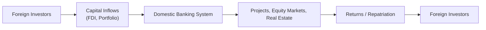

## Capital Account Overview

Sometimes, we get so fixated on a country’s trade surplus or deficit that we forget the other big puzzle piece: the balance of payments (BOP) includes the current account, the capital account, and the financial account. The capital account—combined with the financial account under more modern classifications—tracks cross-border flows of funds, encompassing everything from foreign direct investments (FDI) in factories to short-term portfolio investments in government bonds.

Maybe you’ve seen news articles discussing “capital flight” from an emerging market when investors become nervous, or big infrastructure investments by multinationals in a developing country. These flows are recorded in a country’s capital or financial accounts. From a Level II perspective, it’s crucial to see how the balance of payments data can shape currency demand and supply, and how these flows interact with domestic economic variables like GDP growth, inflation, and interest rates.

### Components of the Capital Account

Under the sixth edition of the IMF’s Balance of Payments Manual (BPM6), the capital account (in practice often referred to in tandem with the “financial account”) includes:
- Foreign Direct Investment (FDI).  
- Portfolio Investment (stocks, bonds without managerial control).  
- Other Investments (bank loans, trade credit, currency deposits).  
- Reserve Assets (held by the central bank, such as gold or foreign currency reserves).

Although the terminologies have evolved (the “capital account” may be fairly small under BPM6, while “financial account” is significant), in much investment literature and many exam contexts, the umbrella term “capital account” often loosely covers all cross-border investment flows beyond pure trade in goods and services.

Capital flows affect a country’s exchange rate because when foreign capital enters, it needs to exchange into local currency. This increased demand can push the currency’s value up (all else equal). Conversely, outflows can depress the currency. Frequent or dramatic changes in flows can spur currency volatility—something central banks and policymakers monitor closely.

### Link to Economic Variables
Capital inflows tend to be attracted by:
- Higher interest rates (better returns on deposits, bonds, etc.).  
- Perceived macroeconomic or political stability.  
- Strong GDP growth outlook (increasing business opportunities).  
- Favorable policy (e.g., lax capital controls, investor-friendly rules).

Meanwhile, dramatic outflows might be triggered by:
- Rising risk sentiment (e.g., global or domestic economic turmoil).  
- Political instability (or even rumors of nationalization).  
- Rapidly changing central bank policies (e.g., rate cuts can reduce yield differentials).

In the short run, capital flows can overwhelm purely trade-based drivers of exchange rates. Hence, analyzing BOP data from a capital-flow perspective is essential for forecasting potential currency moves.

Below is a simple visualization of the movement of capital flows:

## Portfolio Investments vs. Direct Investments

Now, let’s pause for a second: you’ve probably heard folks say, “Well, FDI is ‘sticky’ money, while portfolio flows are flighty.” That’s not just a catchphrase—it conveys the difference in both time horizon and risk posture.

### Short-Term vs. Long-Term
• Portfolio investments (e.g., foreign purchases of a country’s equity or bond markets) can be volatile. Foreign investors might build positions and then liquidate quickly when conditions shift—think of a hedge fund that invests in emerging market bonds attracted by high yields, only to exit rapidly if the currency slides or if global credit conditions tighten.  
• FDI, on the other hand, involves a controlling interest in a local business, real assets, or joint ventures. Because it’s often tied up in physical equipment or local operations, it’s harder to unwind swiftly. This relative “stickiness” can reduce short-term volatility but can also pose higher exit costs for the investor.

### Risk Profiles
• Portfolio flows typically track short-term changes in interest rate differentials and risk appetite. A meaningful chunk of currency speculation or carry trades is captured here.  
• FDI is more about long-term growth expectations—multinationals choose to build factories, distribution centers, or partnerships in countries where they see potential for robust returns. They’re not just chasing the next interest rate cycle; they’re embedding themselves into the host economy.

These distinctions matter for currency valuation and analyzing a country’s susceptibility to “sudden stops.” If a country relies mainly on short-term debt and portfolio investment to fund growth, it can face severe funding shortages if global sentiment turns negative.

## Impact on Currency Valuation and Financial Markets

A surge in capital inflows can spark exchange rate appreciation. Consider a developing economy with rising commodity prices and stable inflation—foreigners may pour in funds to snap up local bonds or equities. Higher demand for the local currency (to invest) pushes its value up. This can sound like a blessing, but you might also see negative side effects, such as reduced export competitiveness. A too-strong currency can make your exports expensive to foreign buyers.

### Dutch Disease
Ever hear of “Dutch disease”? This occurs when a large influx of foreign capital or revenue (often from a boom in commodities like oil) appreciates the currency enough to undermine the domestic manufacturing or export sectors. The phrase references the 1960s Netherlands economy, which struggled competitively after discovering natural gas resources. Current examples often cite energy exporters that become over-reliant on a single resource export.

### Volatility in Capital Flows
When conditions shift—maybe global interest rates rise or commodity prices fall—these inflows can quickly reverse. The local currency might abruptly depreciate, fueling inflation or forcing the central bank to respond with emergency measures. It’s no wonder governments watch these flows with caution. For instance, in exam vignettes, you might read about a hypothetical central bank intervening in the foreign exchange market to stabilize currency movements triggered by excessive capital flight.

## Government Policies and Regulations

Now, the million-dollar question is: how do governments manage or regulate capital flows?

### Capital Controls
Governments may limit or guide cross-border flows through capital controls. These can take the form of:
- Taxes or fees on foreign capital inflows (meant to discourage hot money).  
- Restrictions on the repatriation of profits.  
- Quotas or licensing requirements for foreign portfolio investments.  
- Limits on currency convertibility (e.g., a two-tier exchange rate system).

Such regulations can reduce the volatility of capital flows but may create market distortions. If, for example, a country severely restricts outflows, foreign investors might be reluctant to enter in the first place, as they worry about the difficulty of getting their principal back out.

### Foreign Ownership Limits
Some nations place caps on how much foreign investors can own of local companies (especially in strategic sectors like telecommunications or defense). These constraints can alter the risk–return profile of foreign equity investments, as well as hamper the liquidity of these investments in the secondary market.

### Taxes and Treatment of Capital Gains
Regulations related to withholding taxes, capital gains taxes, or stamp duties on transactions also affect foreign investors’ net returns. Investors must incorporate these aspects into valuation models, which might reduce the attractiveness of certain destinations relative to others with lighter tax regimes.

## Risk–Return Analysis for Cross-Border Investments

Analyzing capital flows and the capital account is only the starting point. Then you must integrate those flows into a rigorous risk–return evaluation. In cross-border investing, it’s not enough to estimate an expected return in local terms—you also consider:
- Political risk (like expropriation, civil conflict, changes in government).  
- Macro risk (inflation, interest rates, currency volatility).  
- Regulatory risk (changing capital controls, taxes).  
- Liquidity risk (how easily can you exit?).  
- Sovereign credit rating (a downgrade can make refinancing costlier and spook foreign bondholders).

### Scenario Analysis for Capital Flows
One approach for the exam—and real life—is to run scenario analyses:
• Scenario A: A favorable global environment (e.g., strong risk appetite, stable commodity prices) might boost capital inflows. The local currency appreciates, interest rates remain low, GDP grows.  
• Scenario B: A tightening global monetary cycle (higher rates in advanced markets) can pull capital out of emerging economies. The local currency depreciates, bond yields spike, inflation risk rises.  
• Scenario C: A domestic political crisis triggers foreign outflows, leading to a currency crisis—reserves might be used to defend the currency, or the central bank might impose emergency capital controls.

By examining the sensitivity of investment returns under these different states, an investor can gauge the cost of these risks and price them in.

## Strategic Asset Allocation Implications

At a portfolio management level, understanding capital flows helps you design a global allocation strategy. For instance, if your macro analysis suggests that certain emerging markets could receive strong inflows due to improving credit ratings or structural reforms, you might overweight equities or local-currency bonds there. Or if you suspect a sudden rate hike in the U.S. will pressure emerging market flows, you might hedge currency exposure or reduce positions preemptively.

### Global Liquidity and Central Bank Policies
Central banks in developed markets (e.g., the Federal Reserve, ECB, or Bank of Japan) have frequently used unconventional monetary policies (think quantitative easing). Such policies can create excess global liquidity that seeks higher yields in emerging and frontier markets. When these polices reverse, so do some of the flows. This dynamic underscores why portfolio managers need to stay alert to central bank signals and anticipate how global liquidity shifts might distort capital flows.

### Cross-Border Allocation Models
Modern portfolio theory has led to sophisticated global asset allocation models that incorporate correlations among assets in multiple countries. Flows of capital can change these correlations, especially during periods of stress when all correlations might spike toward 1.0—a phenomenon many learned painfully during past financial crises. Being mindful of potential abrupt correlation shifts is a key aspect of managing cross-border holdings.

## Glossary

**Capital Account**  
Part of a country’s balance of payments that records net changes in ownership of national assets (under some definitions, mostly intangible assets, debt forgiveness, etc.). Often used colloquially in conjunction with what is formally the “financial account,” which includes FDI, portfolio investment, and other investments.

**Foreign Direct Investment (FDI)**  
Long-term investment where the investor obtains a lasting interest and a degree of control in a foreign enterprise (e.g., building a factory, acquiring majority stakes in local companies).

**Portfolio Investment**  
Investment in securities—equities, bonds, and sometimes derivatives—where the investor does not seek control. These flows can be short-term and volatile.

**Balance of Payments (BOP)**  
Records transactions between one country and the rest of the world, dividing them primarily into the current account (goods and services trade, net income, and current transfers) and the capital/financial accounts (recording capital transfers and financial flows).

**Capital Controls**  
Regulations or restrictions by governments to manage the flow of foreign capital into or out of domestic capital markets. These can include taxes, quotas, and strict ownership requirements.

**Dutch Disease**  
A situation where large foreign inflows or windfalls—often from resource exports—appreciate a country’s currency, undermining other export sectors and skewing the economy’s structure.

## References

- IMF Balance of Payments Manual (Sixth Edition):  
  https://www.imf.org/external/pubs/ft/bop/2007/pdf/bpm6.pdf  

- “Global Capital Flows and the Role of Central Banks,” BIS Working Papers:  
  https://www.bis.org/publ/

## Test Your Knowledge: Capital Account Activities and Cross-Border Investment Decisions



### Which of the following best describes the difference between capital inflows and outflows in the balance of payments?

- [ ] Inflows are recorded in the current account, while outflows are recorded in the capital account.
- [x] Inflows represent foreign investments into the domestic economy, whereas outflows represent domestic funds sent abroad.
- [ ] Inflows occur only when interest rates are higher domestically, while outflows occur only if interest rates are lower.
- [ ] Inflows and outflows refer only to official central bank transactions.

> **Explanation:** Capital inflows are funds flowing into a country’s economy from abroad (e.g., foreign entities buying local assets), while capital outflows are funds leaving the country for foreign investments (e.g., domestic investors purchasing foreign assets).

### Which type of investment is generally considered “stickier” and less prone to short-term reversals?

- [ ] Portfolio investment in government bonds
- [ ] Currency derivatives trading
- [x] Foreign direct investment
- [ ] Speculative currency swaps

> **Explanation:** FDI is less prone to short-term reversals as it often involves owning and operating local businesses or infrastructure, making it considerably less liquid.

### A country experiencing large capital inflows is likely to see which of the following effects on its currency?

- [x] Appreciation pressure
- [ ] Depreciation pressure
- [ ] Immediate capital controls
- [ ] It has no effect on the currency

> **Explanation:** When foreign capital flows into a country, it typically needs to be converted into the local currency, increasing demand for that currency, which tends to push its value higher.

### If a country’s currency appreciates due to large capital inflows, what potential negative consequence can occur?

- [ ] Immediate recession
- [ ] Reduced linkage with global interest rates
- [x] Lower export competitiveness (“Dutch disease”)
- [ ] Rapid population growth

> **Explanation:** A stronger currency can make the country’s exports more expensive to foreign buyers, potentially denting competitiveness—a phenomenon sometimes called Dutch disease.

### Governments often impose capital controls to:

- [x] Manage or restrict cross-border capital flows.
- [ ] Create new money supply automatically.
- [x] Reduce excessive currency volatility caused by “hot money.”
- [ ] Eliminate the current account deficit permanently.

> **Explanation:** Capital controls allow governments to regulate the timing and quantity of foreign capital movement, potentially reducing volatility and preventing destabilizing inflows/outflows.

### Which of the following represents a form of foreign direct investment activity?

- [x] A multinational corporation opening a manufacturing facility in another country.
- [ ] A hedge fund buying short-term government securities across several emerging markets.
- [ ] A retail investor speculating on currency futures.
- [ ] A domestic investor opening a bank account in a neighboring country for personal savings.

> **Explanation:** FDI entails active investment with a lasting interest in a foreign enterprise (e.g., setting up production facilities, owning controlling shares, etc.).

### Which of the following is a scenario that might prompt foreign portfolio outflows?

- [x] Rising global risk aversion and an increase in foreign interest rates.
- [ ] Decreased political uncertainty and an improved credit rating.
- [x] A surprise domestic tax on foreign equity transactions.
- [ ] Lower global interest rates and stable inflation in the host country.

> **Explanation:** Higher interest rates abroad or deteriorating local conditions (such as new taxes or heightened political risk) often prompt foreign investors to sell local assets and move funds elsewhere.

### A country with significant reliance on short-term portfolio investments rather than long-term FDI is at greater risk of:

- [ ] Inventory shortages
- [ ] GDP growth
- [x] Sudden capital flight and currency crises
- [ ] Trade embargoes

> **Explanation:** Short-term portfolio flows can reverse quickly when market sentiment changes, leaving the country vulnerable to abrupt capital outflows and potential currency or liquidity crises.

### Which factor is most likely to attract FDI instead of “hot money” portfolio flows?

- [x] Strong domestic infrastructure and favorable long-term policies
- [ ] High inflation and weak political stability
- [ ] High-frequency trading opportunities
- [ ] A rapidly depreciating currency

> **Explanation:** FDI decisions are more about stable, long-horizon growth and robust policymaking. Investors prefer markets with strong infrastructure, clear regulations, and political stability when making large, long-term commitments.

### True or False: A key goal of capital controls is to eliminate all foreign investment in a country’s bond or equity markets.

- [x] True
- [ ] False

> **Explanation:** Some countries do attempt measures that severely limit or even eliminate certain forms of foreign participation when they fear destabilizing flows. However, not all capital controls aim to remove foreign investment entirely; some simply aim to manage or moderate it.


