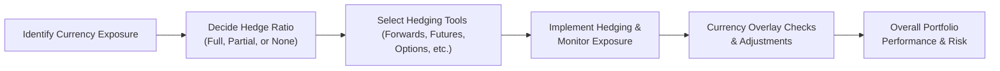

## Overview

This section focuses on how to protect—and potentially enhance—your portfolio returns when investing across borders. Managing currency risk in cross-border portfolios is often just as important as picking the right asset. After all, there’s no point in generating a 10% local-market return if a significant currency drawdown wipes out half of your gains, right? In these pages, let’s explore how currency fluctuations influence investment returns, the different methods to identify and hedge currency exposures, and how to measure success in hedging programs.

## Understanding Currency Exposures

### Transaction, Translation, and Economic Exposure
Ever talk to a friend who works for a multinational company and hear about them complaining that the shifting Dollar–Euro rate is messing up their sales figures? That frustration basically highlights transaction, translation, and economic exposures.

• Transaction Exposure: This arises when you have a specific contract—a future sale or purchase in a foreign currency. FX changes will impact the cash you eventually wind up with (or owe).  
• Translation Exposure: If you or a firm are consolidating foreign assets/liabilities onto the home balance sheet, exchange rate fluctuations can cause book values to change even though the underlying operations might be stable.  
• Economic Exposure: The broader, long-term effect where currency moves can influence a company’s market competitiveness, profitability, and future cash flows. It also shows up in how an investor’s global portfolio might be impacted.  

For instance, suppose your portfolio invests in a UK-based firm while you measure performance in US dollars. If GBP/USD suddenly moves, your effective return in USD changes—potentially drastically. Even day-to-day swings can stack up.

## Active vs. Passive Hedging

### Passive Hedging (Plain Vanilla Hedges)
“Neutralize it and forget it.” That’s the idea of passive hedging. You systematically offset currency exposures—often using rolling forward contracts—so that you remove the direct effect of exchange rate movements from your returns.  
- Typical Approach: Rolling forward contract that’s sized to your current foreign-currency exposure.  
- Key Benefit: Less frequent decision-making. It’s relatively mechanical, so you reduce the day-to-day noise of currency fluctuations.  
- Critical Drawback: It doesn’t capitalize on opportunities where currency movements might boost returns. You’re merely locking in a specific exchange path, removing as much volatility as feasible.

### Active Hedging (Currency Overlay)
“Let me see if I can do better than a plain vanilla hedge.” That’s active hedging in a nutshell.  
- Discretionary Currency Overlay: You might have a currency overlay manager who tries to anticipate currency movements, adjusting hedge ratios dynamically.  
- Potential Upsides: Opportunities to capture alpha if you can forecast FX rates.  
- Potential Risks: Hedging costs can pile up, and it’s not easy to predict exchange rates. You also assume potential performance drag if your currency bets go sideways.

## Hedging Instruments and Techniques

Once you decide whether to be passive or active, you still have to pick the right tool for the job. Here’s the short list:

### Forwards
A forward contract is a private agreement to buy or sell a currency at a certain time in the future at a pre-agreed rate.  
- Pros: Customizable, can match the exact notional amount and maturity you want.  
- Cons: Illiquidity in some currencies, plus the potential credit risk (even if mitigated to a degree by credit support annexes in professional markets).

### Futures
Futures are standardized contracts traded on an exchange.  
- Pros: Liquid, standardized, and minimal credit risk because the clearinghouse is the counterparty.  
- Cons: Less flexibility, potential mismatches in contract size and expiration dates (basis risk).

### Options
Currency options (puts and calls) give you the right, but not the obligation, to exchange currency at a specified rate.  
- Pros: Downside protection with unlimited upside potential if you hold the right type of option.  
- Cons: Upfront premium cost, which can be expensive for volatile currency pairs.

### Swaps
Currency swaps typically involve exchanging principal and interest obligations in one currency for principal and interest obligations in another currency.  
- Pros: Can hedge longer-term exposures effectively, often used by corporates with ongoing financing needs.  
- Cons: Complexity, potential counterparty risk, and less flexibility if you’re simply trying to hedge short-term exposures.

### ETFs/Exchange-Traded Products
Currency-hedged ETFs or currency-specific ETFs can provide an easy way to gain or offset an FX exposure.  
- Pros: Simple to trade and highly liquid if it’s a popular currency or region.  
- Cons: Possibly higher management fees, and not always a perfect hedge for your portfolio’s unique exposures.

## Hedge Ratio Determination

### Concept of Hedge Ratio
The hedge ratio is the proportion of your currency exposure that you choose to hedge. Let’s say you have €10 million in exposure, and you decide to hedge €5 million. That means you have a 50% hedge ratio.

#### Factors That Influence Hedge Ratios
• **Risk Tolerance**: If you’re extremely risk-averse, you might want a higher hedge ratio.  
• **Correlation**: Some currencies tend to move with the underlying assets. In those cases, a partial hedge might make sense.  
• **Volatility**: The more volatile the currency, the more you might want to hedge.  

Mathematically, if you were to set a hedge ratio h that minimizes the variance (σ²) of your domestic-currency return, you might see something like:

 h^* = \frac{\mathrm{Cov}(R_\text{asset}, R_\text{currency})}{\mathrm{Var}(R_\text{currency})} 

But it’s hardly that simple in real life. This formula suggests you want to factor in the correlation (Cov) between the asset’s returns and currency returns, but you’ll also layer on your subjective risk appetite.

### Full vs. Partial Hedges
- **Full Hedge**: Your foreign currency exposure is offset entirely. Great for eliminating foreign-currency fluctuations, but you lose all “upside” from favorable moves in exchange rates.  
- **Partial Hedge**: Maybe you hedge only half the exposure, or 75%, etc. This preserves some optionality if the currency moves in your favor.

## Performing Hedging Calculations

Let’s imagine you hold a €10 million position in your portfolio, and you expect the EUR/USD rate to be 1.10 in 3 months. Currently, the spot is 1.08, and the annualized interest rate on USD is 5%, while the annualized interest rate on EUR is 3%. The forward rate F for a 3-month forward might be approximately:  


F = S_0 \times \frac{1 + i_\text{domestic} \times \frac{t}{360}}{1 + i_\text{foreign} \times \frac{t}{360}}


Plugging in simple numbers:

F \approx 1.08 \times \frac{1 + 0.05 \times \frac{90}{360}}{1 + 0.03 \times \frac{90}{360}} 
= 1.08 \times \frac{1 + 0.0125}{1 + 0.0075} 
\approx 1.08 \times 1.004982 \approx 1.0854 


If you choose to hedge fully, you lock in 1.0854 as the exchange rate for your €10 million in 3 months. That means if in 3 months the actual spot is 1.00 or 1.20, you’re still effectively dealing at 1.0854.  

### Dynamic Hedging
Dynamic hedging is all about adjusting your hedge as conditions change—like updating your forward contract notional if your foreign investments grow or shrink, or if you see major shifts in interest rates. It can be valuable when market conditions are volatile, but it can also rack up transaction costs and complexity. Try not to do it weekly unless you have a strong reason.

## Portfolio-Level Risk Assessment

### Assessing Correlations
At a portfolio level, it’s rarely about just one currency. You might have exposure to EUR, GBP, JPY, and more, each with different correlations to each other and to your underlying assets. Let’s say you hold European equities (EUR exposure) that correlate with the EUR itself. If your holdings soar when the euro appreciates, your currency exposure might actually reduce your overall volatility.  

### Scenario Analysis and Stress Testing
We can construct scenarios:  
- **Scenario 1**: A strong domestic currency scenario where your local currency appreciates 15% across the board.  
- **Scenario 2**: A global meltdown scenario where you see flight to certain safe-haven currencies.  
- **Scenario 3**: A stable currency environment with small, frequent shifts.  

Analyzing portfolio returns under these conditions—both unhedged and hedged—helps you see potential tail risk. And might reveal that your unhedged position excessively exposes you to currency whipsaws.

Below is a small mermaid diagram that shows how currency overlay decisions feed into your overall portfolio returns and risk management:

## Practical Example: Partial Hedge in Action

Imagine you’re managing a global equity portfolio worth $100 million, with 40% in US stocks, 40% in Europe (EUR), and 20% in Japan (JPY). You believe the euro might weaken but you are uncertain about the yen, so you decide to hedge 60% of your European exposure and none of your Japanese exposure.

• Gather the notional amounts:  
    - EUR exposure: $40 million. At a current EUR/USD rate of 1.10, that’s around €36.36 million.  
• Hedge 60% of the €36.36 million.  
    - 60% × €36.36 million = €21.82 million.  
• Roll forward a 3-month forward on €21.82 million at the forward rate of, say, 1.12.  

You’ve now partially protected your European investments against a euro drop, but you still retain a 40% stake in any potential upside if the euro rallies.

## Common Pitfalls and Best Practices

- **Ignoring the Cross Correlations**: If you hedge each currency in isolation, you might miss how some currency exposures offset each other.  
- **Cost Overload**: Check the cost of rolling futures or forwards. Sometimes the cost might outweigh the benefits if market liquidity is poor.  
- **Over-Hedging**: Hedging may reduce volatility so much that you lose potential alpha. Over-hedging is particularly tricky if you’ve got high conviction that the foreign currency might strengthen.  
- **Under-Hedging**: On the flip side, ignoring big currency swings can devastate your returns. A friend of mine (yep, real story) forgot to roll her JPY hedge for over 6 months, and the yen spiked 10%—which was great if you were unhedged. But she was fully hedged from a previous position, and that old hedge was about to expire. She ended up with a big mark-to-market mismatch. Let’s just say it wasn’t a pleasant final quarter that year.

## Exam Tips for Hedging Strategies

• **Know Your Formulas**: You’ll often see calculations for forward rates, hedge ratios, and payoffs. Practice them.  
• **Context Is Key**: Interpreting vignettes about an asset manager’s or corporate treasurer’s risk tolerance is essential to picking partial vs. full hedges.  
• **Prepare for Both Sides**: A question might ask you to evaluate a scenario where your forecast is correct vs. where it’s wrong. Always reflect on possible outcomes.  
• **Time Management**: The item set might present a variety of currency exposures. Quickly identify the main points—What is being hedged? At what ratio? For how long?

## References and Further Reading

- “Foreign Exchange Exposure and Risk Management,” CFA Institute Articles: https://www.cfainstitute.org  
- Kevin, S. (2019). Fundamentals of International Financial Management. Harlow, UK: Pearson.  

## Glossary

• **Currency Overlay**: A strategy where a specialist manager handles currency exposures of an international portfolio, targeting either risk reduction or return enhancement (or both).  
• **Hedge Ratio**: The proportion of currency exposure that is hedged relative to total exposure.  
• **Basis Risk**: The risk that the hedging instrument doesn’t move perfectly in line with the underlying exposure, causing imperfect offsets.  
• **Forward Contract**: A private agreement to buy/sell a currency at a pre-agreed price on a future date.  
• **Currency Swap**: An agreement to exchange principal and interest payments on loans in one currency for principal and interest in another currency.

----------

## Test Your Knowledge: Managing Currency Risk in Cross-Border Portfolios



### 1. Which of the following best describes currency translation exposure?

- [ ] The risk of loss from exchange rate movements on specific foreign currency contracts due at a future date.
- [x] The risk of changes in the book value of foreign assets and liabilities when converting them to the home currency.
- [ ] The risk of losing competitive advantage due to long-term currency fluctuations.
- [ ] The risk arising from correlation between currency volatility and underlying asset returns.

> **Explanation:** Translation exposure concerns how currency fluctuations affect the consolidated accounting statements of a firm or an investor’s book value of foreign-currency holdings.

### 2. In a passive hedging approach, which statement is most accurate?

- [ ] The hedger actively adjusts currency exposures to capture exchange rate movements.
- [x] The hedger systematically neutralizes currency exposures and does not deviate significantly from a set target hedge ratio.
- [ ] The hedger invests in currency options to benefit from volatility.
- [ ] The hedger never incurs transaction costs.

> **Explanation:** Passive hedging systematically eliminates or reduces currency exposure, typically rolling forward contracts at preset intervals and ignoring short-term market forecasts.

### 3. Which of the following is an advantage of currency futures over forwards?

- [ ] Ability to customize notional amounts precisely.
- [ ] Lower commission fees for large transactions.
- [x] Lower counterparty credit risk due to the exchange’s clearinghouse.
- [ ] Guaranteed cost savings compared with forward contracts.

> **Explanation:** Futures trades are guaranteed by a clearinghouse, reducing counterparty risk. However, they are standardized and often don’t allow the exact notional flexibility of forwards.

### 4. A forward contract on a currency is best described as:

- [ ] A standardized and exchange-traded contract.
- [x] A private agreement between two parties to exchange currency in the future at a predetermined rate.
- [ ] A non-binding agreement to exchange a currency on a particular date.
- [ ] A standardized contract cleared by a central clearinghouse.

> **Explanation:** Forwards are private, over-the-counter agreements. They do not trade on an organized exchange and thus do not benefit from a central clearinghouse.

### 5. If a portfolio manager sets a hedge ratio significantly below 100%, she is:

- [ ] Over-hedging the portfolio.
- [ ] Eliminating all currency risk.
- [x] Opting to keep some foreign currency exposure unhedged for potential gains.
- [ ] Exposing the portfolio to basis risk in the built-in hedge.

> **Explanation:** A hedge ratio below 100% means the manager is only partially covering the currency exposure, leaving room for potential upside (or downside) from exchange rate movements.

### 6. Basis risk arising from currency hedging is:

- [ ] Always negligible when using swaps.
- [ ] The risk of changes in interest rates, not exchange rates.
- [x] The risk that the hedging instrument’s price doesn’t move perfectly in tandem with the underlying exposure.
- [ ] Eliminated by introducing option-based hedges.

> **Explanation:** Basis risk is about imperfect correlation between the hedge and the exposure; it exists whenever the hedging instrument doesn’t precisely mirror the price movements of the underlying.

### 7. An “optimal hedge ratio” is most appropriately calculated by:

- [ ] Simply hedging 100% of the notional amount all the time.
- [x] Minimizing the variance of the domestic-currency returns, typically using correlation and volatility metrics.
- [ ] Maximizing potential currency gains by ignoring standard deviations.
- [ ] Matching the target hedge ratio fixed by an exchange’s standard contract size.

> **Explanation:** The classic approach uses correlation and variance metrics to determine the hedge ratio that minimizes the portfolio’s overall volatility.

### 8. Which of the following is a potential downside of active hedging?

- [ ] It removes the opportunity for currency gains.
- [x] Unsuccessful forecasts can result in lower returns than a purely passive approach.
- [ ] It is always less flexible than passive hedging.
- [ ] It completely eliminates transaction costs.

> **Explanation:** Active hedgers attempt to outperform passive strategies, but if their market calls are incorrect, the cost of frequent adjustments and adverse moves can drag down returns.

### 9. Dynamic hedging involves:

- [ ] Maintaining a fixed hedge ratio constantly.
- [x] Adjusting the hedge positions over time based on market conditions or changes in currency exposures.
- [ ] Relying solely on options for hedging every currency exposure.
- [ ] Hard-coding the forward curve to remain unchanged throughout the hedge term.

> **Explanation:** Dynamic hedging requires periodic or event-driven adjustments to the hedge ratio or hedging instruments, reflecting new market information and portfolio changes.

### 10. A currency swap is best used when an entity needs:

- [x] To exchange ongoing principal and interest payment obligations in different currencies.
- [ ] To lock in forward currency rates for a single upcoming transaction.
- [ ] A standardized approach with minimal flexibility.
- [ ] Short-term exposure to a currency’s spot price movement.

> **Explanation:** A currency swap is an agreement to exchange principal and interest payments in one currency for principal and interest in another. It’s particularly suitable for long-term financing or cash flow management needs.


