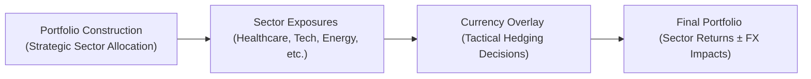

This section builds on the broader discussion in Chapter 18, “International Investment Flows and Hedging,” by diving into the nitty-gritty of global sector allocation and the strategic layering of currency hedges—or currency overlays—onto those sector bets. Yep, we’re bridging two worlds here: the selection of international sectors (think Technology, Healthcare, Energy, etc.) and the decision to hedge (or not hedge) the associated currencies.

Before we get too deep, I want to admit something: back in my early days as a junior analyst, I thought currency hedging was basically an afterthought—like a little tweak you threw in once your portfolio was built. But the more I analyzed global equity returns, the more obvious it became that currency movements alone could contribute or subtract a lot—sometimes overshadowing the underlying sector performance. So, let’s unpack why currency matters so much when it comes to sector rotations and how you might employ overlays to dial up or down your foreign exchange (FX) exposure.

## Sector vs. Geographic Allocation

Let’s start with the difference between choosing sectors vs. choosing countries:

• Sector-based approach:  
  – In a global sector allocation strategy, you pick industries or sectors that you believe will outperform based on economic cycles, technological innovation, or corporate earnings potential.  
  – For example, you might overweight Technology globally, underweight Utilities, and be neutral on Financials. You’re essentially focusing on sector fundamentals, not specifically on whether the stocks are from Germany, Brazil, or Japan.  
  – This approach recognizes that many large companies increasingly compete on a worldwide scale. Apple sells iPhones everywhere, and BP extracts oil from across the globe, so focusing on sector growth drivers can sometimes be more relevant than picking a single market like the UK or Japan.

• Country-based (geographic) approach:  
  – This method focuses on picking entire markets or regions, say overweighting emerging Asia because of strong GDP growth, or underweighting Europe due to a weak macro environment.  
  – The emphasis is on overall country-level variables such as local interest rates, inflation, trade balances, and fiscal policy stability.  
  – Currency risk (e.g., the yen, euro, or peso volatility) becomes part of your primary analysis because you are essentially buying assets denominated in that local currency.

So which is better? A lot depends on your investment philosophy, the composition of your fund, and macroeconomic factors that might heavily inform your approach. Nowadays, many institutional investors actually use a hybrid: they start with a macro or geographic overlay, then refine that with a micro or sector approach. The key is that each approach introduces unique ways for currency risk to creep in, and that’s where a good currency overlay strategy can help.

## Currency Overlay in Sector Allocation

Let’s say you decide to overweight the global Energy sector. You open positions in large multinational oil and gas companies whose stocks are mostly listed in, well, quite a few countries. But your base currency is USD, so you’re inherently getting exposure to the currencies where these companies are domiciled (e.g., the U.K. for BP, euros for TotalEnergies, Canadian dollars for some Canadian oil producers).

• Currency offset vs. amplification:  
  – If your home currency depreciates significantly, that foreign exposure might yield a bigger payoff when translated back into dollars, effectively amplifying your returns.  
  – Conversely, if your home currency appreciates, your otherwise smart sector bets might barely break even—or even turn negative once FX movements are factored in.

• Selective overlays on high-volatility currencies:  
  – You might choose to hedge only a portion of your exposure in notoriously volatile currencies while letting other exposures ride.  
  – For instance, you might hedge the Brazilian real heavily (because it can move drastically on political developments or commodity cycles) but keep some unhedged exposure if you foresee future real appreciation or want to diversify.

• Competitive relationships in sectors driven by FX rates:  
  – Some sectors are export-oriented, meaning their revenue is dollar-based (or euro-based), while their costs are denominated in local currency. If the local currency depreciates, they become more cost-competitive and might see rising profit margins.  
  – A currency overlay can be used to manage or accentuate that effect. If you believe the local currency is likely to strengthen, you might choose to hedge that exposure to protect your sector bet from currency headwinds.

In short, any global sector allocation program should incorporate at least a cursory analysis of FX exposures. And often, you’ll implement partial or dynamic hedges—sometimes call them overlays—to keep the currency risk in line with your overall portfolio objectives.

## Cross-Sector Correlations and Diversification

Now, let’s address the matter of correlations. Not only can different sectors move in and out of favor based on macro conditions, but the currencies of different regions can shift in tandem, in opposition, or bizarrely out of sync entirely. It can be a lot to manage, trust me, especially when you’re looking at multiple sectors across multiple currencies. A quick story: once, I remember trying to figure out why our Healthcare sector exposures in Switzerland (heavy in francs) were offsetting our Technology exposures in the U.S. (heavy in dollars). It wasn’t obvious until we looked at cross-currency correlations combined with cross-sector correlations.

• Changing correlations between sectors in different regions:  
  – For example, the correlation between Financials in the U.S. and Financials in Europe might be high during stable markets, but diverge substantially in times of localized stress (e.g., a sovereign debt crisis in Europe).  
  – Currency movements can either dampen or increase that correlation. If the euro is crashing vs. the dollar, that may cause a negative correlation between U.S. and European equity returns in dollar terms.

• Sector rotation strategies that factor in currency:  
  – If you expect a weaker home currency, you might rotate into export-sensitive sectors that benefit from a weaker currency environment.  
  – Conversely, if you think you’re heading into a cyclical downturn, you might move into more defensive sectors—and maybe hedge the currencies that historically blow up in a crisis.

• Diversification benefit:  
  – The big win from analyzing correlations is capturing a diversification effect. You don’t necessarily want all your sectors to be hammered by the same wave of currency gains or losses.  
  – By mapping the cross-sector and cross-currency correlations, you can find the sweet spot that maintains sector diversity while controlling for currency volatility.

## Tactical vs. Strategic Allocation

When we talk about sector allocation and currency overlay, we should differentiate between two big modes of decision-making:

• Strategic allocation (long-term):  
  – Sets the broad guidelines for sector weighting based on fundamental, top-down macroeconomic analysis or bottom-up views of industry fundamentals.  
  – Possibly sets a baseline currency policy, such as “We hedge 50% of all foreign exposures to reduce short-term volatility” or “We hedge only high-volatility emerging market currencies.”  
  – This is like setting the blueprint for your portfolio so that you’re aligned with big-picture objectives (e.g., risk tolerance, desired exposure to global growth, etc.). It’s not meant to change every month.

• Tactical overlay (short-term or medium-term moves):  
  – This layer adjusts short-run exposures in response to changing market conditions. For instance, if you see a strong momentum in the Japanese yen or expect a rate change from the Bank of Japan, you might hedge or unhedge your Japanese equities for a quarter.  
  – Common approaches include momentum-based overlays (going long currencies that are trending up, short currencies that are trending down) or carry-based strategies (buying higher-yielding currencies, shorting lower-yielding ones).  
  – From a sector perspective, you might rotate out of cyclical sectors into more stable ones if you see an uptick in global risk. Or you might see an opportunity in, say, a strong Chinese economic rebound and temporarily increase your weighting in export-oriented machinery or materials sectors (paired with a partial hedge on the renminbi, maybe).

Getting these two layers right can be tricky, especially because your strategic allocation might call for a certain weighting in, say, emerging market consumer staples, but your tactical read of near-term currency risk might push you to hedge everything or even reduce the exposure short-term.

## Security/Instrument Options

Let’s do a quick inventory of instruments you might use for sector-based investing combined with currency overlays:

• Sector-based ETFs (and currency-hedged ETFs):  
  – There are ETFs that focus on global Healthcare, global Technology, emerging market Consumer Discretionary, etc. Some of these come with built-in currency hedges that automatically offset exposure to certain base currencies.  
  – Pro: Easy to trade, transparent, and typically have reasonably good liquidity.  
  – Con: May not perfectly track your strategic weighting if you want to be more selective within the sector.

• Sector swaps or total return swaps:  
  – You can enter into a swap with a counterparty to gain the returns of a specific global sector index without directly purchasing all the underlying securities.  
  – You can add an FX forward or option to the swap to lock in or partially hedge currency.  
  – Pro: Potentially more flexibility in customizing your exposure and providing leverage or short positioning.  
  – Con: Counterparty risk, complexity, and possibly higher transaction costs.

• Options and futures on currency indexes:  
  – You might hold your sector exposures in standard equity markets and then separately buy or sell FX futures (or currency index futures) to overlay.  
  – This is common in institutional settings, where currency overlays are managed by specialized teams.

• Currency ETFs:  
  – If you prefer a less derivative-heavy approach, you might implement partial hedges by investing in currency ETFs that track particular foreign exchange exposures.  
  – For instance, if you hold a basket of European Energy stocks but want to hedge out some volatility, you could short-sell (or buy an inverse) euro currency ETF or go long a USD/EUR hedge ETF.

• Transaction costs and liquidity considerations:  
  – Always watch out for costs. If you frequently rebalance across countries or sectors and re-hedge your currency exposures, costs can stack up.  
  – Some currencies, especially from emerging markets, have less liquid forward or futures markets, leading to wider bid-ask spreads.

Ultimately, your palette of instruments is as broad as your risk appetite and operational infrastructure. Many large asset managers have specialized overlay desks that handle currency hedging, letting the equity or fixed-income team concentrate on sector picks.

## Example of a Combined Sector Allocation & Currency Overlay

To visualize how these pieces interact, consider the flowchart below:

1. You begin with your strategic portfolio targets for each sector.  
2. You build positions in those sectors using, say, global ETFs or direct equities.  
3. You then analyze your total FX exposures across all these positions and deploy a tactical hedge (maybe you want to hedge 70% of your yen exposure but only 20% of your euro exposure).  
4. The net result is the combined sector + currency outcome seen in your final portfolio returns.

## Best Practices and Pitfalls

• Best practices:  
  – Have a clear policy on how much currency risk you want to bear and align this with your risk tolerance.  
  – Regularly monitor correlations between sectors and currencies; historical correlations can shift quickly under volatile market conditions.  
  – Keep an eye on the relative valuation of currencies—sometimes a cheap currency can be part of your investment thesis if you believe it’s poised for a rebound.

• Common pitfalls:  
  – Ignoring cross-currency correlations entirely. You might create unintentional overweight or underweight positions that amplify risk.  
  – Over-hedging. Sometimes investors hedge too aggressively and miss out on a beneficial currency tailwind.  
  – Misalignment between strategic and tactical decisions. If your short-term currency trades repeatedly countermand your longer-term sector objectives, you could churn your portfolio and rack up transaction costs.

## Glossary

• Sector Rotation:  
  An active investment strategy where you move allocations among different sectors (e.g., Technology, Energy, Consumer Staples) based on macroeconomic outlook or market cycles.

• Strategic vs. Tactical Allocation:  
  A distinction in investment decision-making horizons. Strategic allocation is long-term and aligned with fundamental beliefs and portfolio objectives. Tactical allocation is shorter-term, exploiting transitory market conditions or currency moves.

• Carry-Based Strategy (Currency):  
  A strategy that borrows in lower-yielding currencies and invests in higher-yielding currencies to capture the interest rate differential (the “carry”). Often used as a currency overlay approach to generate extra return, but it can be risky if exchange rates move against you.

## References
• Sorensen, E. H., & Danko, D. W. (2020). “How Specialized Currency Overlays Enhance Global Sector Allocations.” Journal of Portfolio Management.  
• “Sector Rotation and Currency Correlations,” Morgan Stanley Research:  
  https://www.morganstanley.com  

Other recommended reading includes the CFA Institute’s official curriculum on International Investing frameworks and currency risk management, as well as advanced texts on global tactical asset allocation.  

--------------------------------------------------------------------------------

## Test Your Knowledge: Global Sector Allocation & Currency Overlay



### 1. Which of the following statements best describes the main difference between a sector-based and a country-based approach to asset allocation?

- [ ] A sector-based approach focuses on GDP growth in each region, while a country-based approach emphasizes industry fundamentals globally.
- [ ] A country-based approach avoids foreign exchange exposure, while a sector-based approach usually involves hedging strategies.
- [x] A sector-based approach focuses on industries that transcend borders, while a country-based approach emphasizes national macroeconomic conditions.
- [ ] There is no meaningful difference; both approaches prioritize currency hedging above all.

> **Explanation:** A sector-based approach concentrates on industries regardless of location, whereas a country-based approach typically focuses on domestic macroeconomic conditions and local market factors.

### 2. An asset manager is overweighting global Technology stocks while completely hedging all foreign currency exposures. Which of the following is the most likely outcome if the manager’s home currency depreciates significantly?

- [ ] The manager will capture a currency-related gain on these Technology holdings.
- [x] The manager will not benefit from the currency depreciation, limiting returns to only the sector performance.
- [ ] The manager’s portfolio will fall in value because foreign currency gains will be magnified.
- [ ] The manager will be completely unaffected in terms of performance or currency.

> **Explanation:** Because the exposures are fully hedged, the significant depreciation of the manager’s home currency does not boost the value of foreign holdings when translated back; the hedge locks in a certain exchange rate.

### 3. In a currency overlay strategy, selectively hedging only the most volatile currencies primarily helps an investor do which of the following?

- [ ] Remove all currency risk from the portfolio.
- [x] Limit downside exposure and reduce overall portfolio volatility.
- [ ] Achieve guaranteed enhancements to total return.
- [ ] Minimize taxes on foreign-sourced income.

> **Explanation:** Selective hedging of highly volatile currencies can mitigate risk in the most extreme FX scenarios, reducing portfolio volatility without foregoing potential gains from more stable currencies.

### 4. A key reason to review cross-sector correlations across different regions in a global portfolio is:

- [ ] To ensure every sector is positively correlated with the local currency.
- [x] To identify whether currency movements amplify or dampen sector returns, helping to optimize diversification.
- [ ] To eliminate the need to rebalance across sectors.
- [ ] To avoid having to monitor economic indicators from multiple countries.

> **Explanation:** Examining how currency and sector returns interact helps you achieve better diversification and calibrate sector weightings and hedges more precisely.

### 5. A tactical allocation approach differs from a strategic allocation approach in that it:

- [ ] Abandons the use of currency hedges entirely.
- [x] Focuses on short- or medium-term market conditions and exploits temporary dislocations.
- [ ] Never changes sector weightings in the portfolio.
- [ ] Avoids taking views on interest rates or inflation dynamics.

> **Explanation:** Tactical allocation involves shorter-term shifts in sector or currency positions in response to emerging trends or dislocations, whereas strategic allocation is more about long-term, fundamental positioning.

### 6. A carry-based currency overlay strategy involves:

- [x] Borrowing in a lower-yield currency and investing in a higher-yield currency to capture the interest rate differential.
- [ ] Hedging all currency exposures to reduce volatility to near zero.
- [ ] Investing only in currency swaps tied to interest rate movements.
- [ ] Shorting all currencies from emerging markets regardless of yield.

> **Explanation:** Carry-based strategies rely on the interest rate differential between two currencies. The investor borrows at a low rate and invests in a higher-yielding currency, aiming for a net gain.

### 7. If an investor believes that an emerging market currency is undervalued and likely to appreciate, how might this affect a global sector allocation decision?

- [x] The investor might maintain or slightly increase unhedged allocation to sectors in that emerging market.
- [ ] The investor would hedge 100% to avoid missing out on potential local currency gains.
- [ ] The investor would reduce holdings in that market due to potential currency volatility.
- [ ] The investor would rely solely on sector ETFs without any currency overlay.

> **Explanation:** If an investor believes a currency is poised for appreciation, they might increase or keep some unhedged exposure in that market to benefit from FX gains, especially in sectors likely to benefit from stronger local demand.

### 8. One major pitfall in implementing currency overlays is:

- [ ] Allowing FX exposures to remain in the portfolio.
- [ ] Only selecting derivatives with minimal transaction costs.
- [ ] Balancing currency exposures across multiple markets.
- [x] Over-hedging and missing beneficial currency moves.

> **Explanation:** Over-hedging can eliminate the chance to benefit from favorable currency swings, potentially dragging down the total return if a currency moves in the investor’s favor.

### 9. Which best describes the value of monitoring changing correlations among sectors and currencies?

- [ ] It removes the need for overlay managers to watch interest rates.
- [ ] It guarantees that sector performance is unaffected by global macro variables.
- [x] It provides insights into new diversification opportunities or risks as correlations shift over time.
- [ ] It is less relevant than looking exclusively at historical average correlations.

> **Explanation:** Shifting correlations create new opportunities or risks, so proactive monitoring helps optimize hedging strategies and sector weightings.

### 10. True or False: In a global portfolio, all currency overlays should be purely tactical, with no strategic hedges in place.

- [ ] True
- [x] False

> **Explanation:** Many portfolios maintain long-term (strategic) hedges based on overall risk policy, supplemented by tactical overlays when market conditions warrant short-term adjustments.


