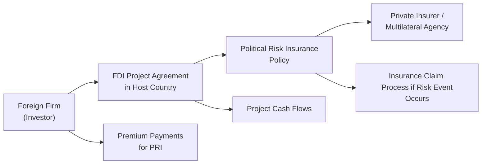

## Opening Thoughts
Direct Foreign Investment (DFI)—or more commonly, Foreign Direct Investment (FDI)—often feels like grabbing the bull by the horns. You’re venturing into a potentially unfamiliar market environment, perhaps with different legal systems, a new consumer base, or uncertain political climates. I recall being on the advisory team for a mid-sized manufacturing company that wanted to expand into Eastern Europe many years ago. We were brimming with excitement, but also a bit worried about currency volatility and local regulations. The team realized that simply running a cost–benefit analysis wasn’t enough; we had to factor in political risks, expropriation concerns, and how best to insure against them. In this section, we’ll break down why and how companies embark on FDI, what sorts of political risks they encounter, and how political risk insurance (PRI) helps them sleep better at night.

## The Nature of Direct Foreign Investment
Foreign Direct Investment is about taking a controlling interest in an enterprise abroad. It’s very different from picking up a small equity stake in a foreign firm. With FDI, you literally put boots on the ground—building factories, offices, or distribution centers in a new country—or you merge with or acquire an existing local entity. Let’s outline the core motivations and types of FDI:

• Market Access: Often, companies invest directly in a foreign market to overcome trade barriers or reduce logistical costs. Think of an automobile manufacturer building a factory in a key export market to sidestep tariffs or reduce transportation fees.  
• Resource Acquisition: Certain regions have coveted natural resources (oil fields, valuable minerals, specialized labor force). FDI can help secure a consistent supply for your home-market operations.  
• Cost Efficiencies: Many multinationals use FDI in lower-cost countries to save on wages or raw materials. They might build a plant where labor is cheaper or where local tax incentives sweeten the deal.  
• Diversification of Operations: Entry into new markets spreads your risk. If the home economy sputters, robust sales from an overseas market can keep your business afloat.

### Greenfield Investments vs. Mergers and Acquisitions
Two main flavors of FDI make headlines:

• Greenfield Projects: You establish everything from scratch—construction of new production facilities, creation of subsidiaries, hiring teams on the ground. This approach demands more time and money upfront but can be tailor-made to your specifications.  
• Mergers & Acquisitions (M&A): You jump-start your operational presence by purchasing or merging with a local firm. M&A deals might be quicker, though cultural integration issues, local brand equity, and synergy management can complicate the process.

From a currency perspective, these investments can imply long-term exposures. A newly built factory means local-currency expenses for labor, raw materials, or overhead. At the same time, the parent firm might expect to repatriate profit back home in another currency. Understanding how to hedge these exposures (see related sections on currency risk in Chapter 2) is a must for financial managers who don’t want exchange-rate fluctuations trashing their margins.

## Political Risk: Categories and Mitigation
You’re expanding abroad for growth: great. But let's pause for a second and ask, “What if the host government suddenly decides to nationalize vital industries?” Or worse, what if there’s civil unrest that cripples your facilities? These scenarios may sound dramatic, but many multinational corporations (MNCs) will tell you such threats are very real. Political risk can be broadly categorized into:

• Expropriation or Nationalization: The government might seize some or all of your local assets. Sometimes they’ll offer partial compensation (sometimes not).  
• Breach of Contract: Government entities might renege on legal contracts or force renegotiations under new or more restrictive conditions.  
• Transfer and Convertibility Restrictions: Profits could be trapped if the government imposes foreign exchange controls. Suddenly you can’t convert local currency into your home currency or wire it out.  
• Civil Unrest and War: Armed conflict, terrorism, or riots can harm personnel, disrupt supply chains, and destroy facilities.  

### Incorporating Political Risk in Valuations
Practitioners often try to capture political risk via a country risk premium in discount rates. This can lift the weighted average cost of capital (WACC) and reduce project net present value (NPV). Alternatively, one may adjust expected cash flows downward to reflect potential disruptions. Either way, ignoring such risks can easily lead to unrealistic project valuations.

Some folks rely on macro or political stability indices—like the World Bank’s Governance Indicators or specialized consultancies that track geopolitical risk. The higher the perceived political risk, the greater your discount rate or the lower your expected free cash flows. If you’re unlucky, you get a double whammy: higher operating costs due to disruptions and a bigger discount rate. That can kill an otherwise promising FDI project.

## Political Risk Insurance (PRI)
One approach to containing these headaches is Political Risk Insurance (PRI). Just as property insurance might cover your house from a storm, PRI protects your cross-border ventures from specific non-commercial risks. Typically, PRI covers expropriation or confiscation, political violence (war, terrorism), currency inconvertibility, and breach of contract by host governments.

### Key Providers of PRI
You can think of PRI providers as a patchwork of public, private, and multilateral players:

• Private Insurers: Commercial insurance providers like Lloyd’s of London that might underwrite certain political risks. Keep in mind that these providers often limit coverage amounts or durations.  
• Multilateral Organizations: For instance, MIGA (Multilateral Investment Guarantee Agency)—part of the World Bank Group—focuses on encouraging investments in developing countries by offering a comfortable risk cushion. MIGA’s main coverage areas include expropriation, war, breach of contract, and currency inconvertibility.  
• Export Credit Agencies (ECAs): Government-backed agencies (e.g., U.S. Export-Import Bank) may offer coverage that fosters exports or FDI by domestic companies.

Below is a quick visual showing how FDI projects might integrate PRI into their risk management plan:



In words:  
1. The foreign firm invests in a host country via a project.  
2. It arranges a political risk insurance policy with a private or multilateral insurer.  
3. The foreign firm pays a premium, and the policy would reimburse certain losses if specified political risks come to pass.

### Coverage Scope, Durations, and Limitations
Typical PRI durations range from 3 to 15 years, though they can be extended for especially long-lived projects such as infrastructure or power plants. Premiums are influenced by many factors, including project type (infrastructure, mining, manufacturing), location specifics, and coverage limits. Policies might exclude certain risks if the underlying cause is deemed commercial (e.g., local competition driving you out of business).

One must be aware of claim procedures and waiting periods. For expropriation coverage, there can be a “loss determination period,” during which it must be proven that assets have indeed been taken or that the government’s actions effectively destroyed your ability to operate. Similarly, for currency inconvertibility coverage, you might need proof that standard channels for currency conversion have been blocked for a specific length of time.

## Contractual Protections and Arbitration
Even with insurance, MNCs often prefer to build contractual armor. Bilateral Investment Treaties (BITs) and Free Trade Agreements (FTAs) are pivotal. These treaties commonly include:

• Protections against expropriation without adequate compensation.  
• Dispute resolution mechanisms, including recourse to international arbitration.  
• Fair and equitable treatment obligations, forcing the host government to treat foreign investors on par with domestic ones.

### International Arbitration Bodies
Realistically, no one wants to litigate, but having the safety net of an international entity such as ICSID (International Centre for Settlement of Investment Disputes) can make the difference between a secure deal and a fiasco. ICSID, as part of the World Bank Group, provides an impartial forum for dispute resolution. If a country has ratified ICSID conventions, the foreign investor can bring claims against the state in the event of alleged breaches of investment protections. In theory, ICSID awards are enforceable under international law, though real-world enforcement can be messy in certain jurisdictions.

## Valuation of FDI Under Risky Conditions
We hinted at the discount-rate approach. Let’s expand on that. Typically, you start with a baseline cost of capital or required return on equity that you’d use for a project in a stable environment. Then you layer on a “country risk premium” to reflect additional uncertainties—political, macro stability, or currency instability. Alternatively, some analysts cut expected cash flows to reflect the probability of adverse events (like partial expropriation or operational disruptions).

### Simple Discount Rate Example
Suppose your baseline Weighted Average Cost of Capital (WACC) is 8%. You judge that operating in a high-risk region might demand an extra 4% premium for probable political, regulatory, and financial uncertainties, giving a total discount rate of 12%. Let’s see how that might transform the net present value (NPV) of an FDI project.

• Without country risk premium (WACC = 8%):  
  – Projected free cash flow for the next five years:  
    – Year 1: 10 million  
    – Year 2: 15 million  
    – Year 3: 18 million  
    – Year 4: 20 million  
    – Year 5: 25 million  
  – Terminal value in Year 5 (assuming 2% perpetuity growth): 25 × (1 ÷ (0.08 – 0.02)) = 25 × (1 ÷ 0.06) = approx. 417 million  

  The NPV is computed by discounting each year’s cash flow plus the terminal value at 8%. For quick reference:

  NPV ≈ Σ(CFᵗ ÷ (1 + 8%)ᵗ) + (Terminal Value ÷ (1 + 8%)⁵)

• With a 4% extra country risk premium (WACC = 12%):  
  The discount rate is higher, so the NPV is significantly lower. If you were borderline about proceeding, that difference might push you to reconsider or to investigate mitigation strategies like PRI.

### Scenario Analysis Integrating PRI
You can also run scenario analyses:

• Scenario A (Base Case, no major political disruption): Probability 60%, NPV = 100 million.  
• Scenario B (Partial expropriation or severe business disruption): Probability 25%, NPV = –50 million.  
• Scenario C (Mild disruptions only, as you hold a PRI policy that covers some losses): Probability 15%, NPV = 40 million.  

Weighted average NPV = 0.6 × 100 + 0.25 × (–50) + 0.15 × 40 = 60 – 12.5 + 6 = 53.5 million.  

In real practice, you might refine each probability or even expand scenario B and C. The big lesson: factoring in coverage from political risk insurance might raise your scenario-based expected project value. Conversely, if coverage is limited or too costly, the net effect might not justify taking the plunge.

## Practical Example: Estimating Project Feasibility with Python
The next snippet is purely illustrative—just to show how one might programmatically integrate basic parameters of a feasibility model.

```python
import numpy as np

cash_flows = np.array([-100, 10, 15, 18, 20, 25])
discount_rate_no_risk = 0.08  # 8% baseline
discount_rate_country_risk = 0.12  # 12% with risk premium

def npv_calc(cash_flows, discount_rate):
    npv = 0
    for t, cf in enumerate(cash_flows):
        npv += cf / ((1 + discount_rate)**t)
    return npv

npv_no_risk = npv_calc(cash_flows, discount_rate_no_risk)
npv_country_risk = npv_calc(cash_flows, discount_rate_country_risk)

print("NPV without country risk premium:", round(npv_no_risk, 2))
print("NPV with country risk premium:", round(npv_country_risk, 2))
```

In an actual feasibility study, we might incorporate random shocks to model expropriation or add lumpsum payouts if a PRI policy triggers restitution. The final decision hinges on whether the expected economic benefits (factoring in all these probabilities and insurance coverage) remain positive.

## Common Pitfalls and Best Practices
• Overlooking Political Climate: Nothing kills an FDI project’s profitability faster than ignoring, say, an upcoming election that could introduce capital controls.  
• Inadequate Contractual Safeguards: Failing to secure investment treaty protections or arbitration clauses can leave you with no recourse should the host government breach your agreement.  
• Underestimating Insurance Limits: Believing your policy covers “all political risks” might be overly optimistic. Check the fine print carefully.  
• Not Adapting the Discount Rate Properly: It’s easy to tack on an arbitrary premium. Ideally, triangulate from country risk indices, credit default swaps (CDS) on sovereign debt, or other market-based metrics.  
• Failing to Revisit Assumptions: Political situations evolve. Keep revisiting your risk assumptions and coverage needs—don’t treat a one-time analysis as final.

## Final Exam Tips
For the Level II exam (especially item-set questions involving multinational operations), remember these key strategies:

• Carefully read the vignette’s details about host-country conditions. Look for clues on expropriation risk, local government stance, or currency controls.  
• When they ask you to value an FDI project, check if they hint at adjusting the discount rate or if they want you to degrade your free cash flows for potential disruptions.  
• Watch out for partial coverage or waiting periods in an insurance scenario. The exam might require you to compute the net effect of a potential expropriation after insurance payouts.  
• Rely on conceptual linking: how does the existence of a Bilateral Investment Treaty reduce your perceived risk? Could that reduce your discount rate add-on?  
• Time management: If the item set presents long narratives with political risk data, highlight the essential pieces—like the risk premium figure, coverage details, or probability of expropriation.

## Glossary
• Greenfield Investment: Establishing operations from the ground up in a foreign location.  
• MIGA (Multilateral Investment Guarantee Agency): A World Bank Group institution providing political risk insurance to support foreign investment in developing economies.  
• Expropriation: A government takeover of private property or assets, sometimes with partial or no compensation.  
• ICSID: International Centre for Settlement of Investment Disputes, an arbitration forum for disputes between states and foreign private investors.

## References
• UNCTAD “World Investment Report”: https://unctad.org/wir  
• International Finance Corporation (IFC) investment guides: https://www.ifc.org  
• Official CFA Institute Curriculum, CFA® 2025, Level II, Volume 2  
• MIGA official site for details on political risk coverage: https://www.miga.org  

--------------------------------------------------------------------------------

## Test Your Knowledge: Direct Foreign Investment and Political Risk Insurance



### A multinational corporation is considering an FDI project in a country with a high risk of expropriation. Which factor would be most relevant in deciding whether to bring in Political Risk Insurance (PRI)?
- [ ] Historical inflation rates in the host country
- [ ] The corporation's relative market share at home
- [x] The government’s record of seizing foreign investors’ assets
- [ ] Global oil price forecasts

> **Explanation:** Expropriation risk is directly tied to the host government's history of seizing foreign assets. PRI providers closely review such precedents when underwriting policies.

### Which of the following describes a common benefit of Greenfield FDI compared to M&A?
- [ ] Lower upfront capital investment
- [x] Greater control over corporate culture and production processes
- [ ] Immediate access to an existing customer base
- [ ] Reduced risk of political disruption

> **Explanation:** With Greenfield FDI, the investor designs and manages operations from scratch, offering greater control over culture and processes. However, an M&A approach often provides quicker market access.

### Under a Bilateral Investment Treaty (BIT), foreign investors typically gain which type of protection?
- [ ] Guaranteed minimum 20% return on equity
- [x] Legal recourse for dispute settlement through international arbitration
- [ ] Elimination of income taxes for 10 years
- [ ] Currency hedging provided by central banks

> **Explanation:** BITs commonly include provisions for fair and equitable treatment, as well as the option to resolve disputes through international arbitration bodies such as ICSID.

### What is a key difference between expropriation and breach of contract in the context of political risk?
- [x] Expropriation involves government seizure of assets, whereas breach of contract is failure to honor agreed terms
- [ ] Breach of contract is the government’s right to tax foreign firms at a higher rate
- [ ] Expropriation doesn’t require compensation, whereas breach of contract generally does
- [ ] Breach of contract only occurs during civil unrest or war

> **Explanation:** Expropriation is the involuntary takeover of foreign-owned property, while breach of contract refers to a violation of a binding agreement. They are distinct events, each with its own risk implications.

### A company invests in a developing country using a discount rate of 8%. After reviewing political instability and currency issues, it decides to use 10%. Which of the following best explains this adjustment?
- [ ] A shift to a more optimistic scenario
- [ ] Recognizing that business risk is virtually zero
- [x] Incorporating a country risk premium
- [ ] Using an industry average cost of capital

> **Explanation:** Increasing the discount rate often reflects a country risk premium to account for political or economic uncertainties in the foreign market.

### An example of “transfer and convertibility” risk is:
- [x] A foreign government banning currency outflows, preventing profit repatriation
- [ ] A local competitor winning a major contract
- [ ] A severe drop in the foreign exchange rate due to inflation
- [ ] A forced currency peg that stabilizes the host currency

> **Explanation:** Transfer and convertibility risk arises when a government restricts the ability to convert local profits into hard currency or prevents outflows altogether.

### What is one potential limitation of Political Risk Insurance?
- [ ] It always covers commercial bankruptcy
- [ ] It replaces due diligence for credit analysis
- [x] It sometimes has waiting periods or exclusions that delay or limit payouts
- [ ] It automatically pays out in case of currency depreciation

> **Explanation:** PRI coverage often includes certain waiting periods or exclusions, meaning payouts aren’t guaranteed the moment a political event occurs or if the claim doesn’t meet specific criteria.

### Which of the following statements best describes how a war clause in PRI might be triggered?
- [ ] Whenever currency appreciation occurs
- [ ] If the local stock market declines by more than 10%
- [x] If assets are damaged or destroyed due to civil disturbance or armed conflict
- [ ] When an important local supplier goes bankrupt

> **Explanation:** War clauses typically cover damage incurred from civil disturbances, uprisings, or outright armed conflicts.

### In an FDI context, which scenario is most likely to shift a project’s expected NPV higher?
- [ ] Escalating tensions between the host government and foreign investors
- [x] Purchase of robust political risk insurance that covers expropriation
- [ ] Significant local currency devaluation
- [ ] Increasing the discount rate to reflect volatility

> **Explanation:** Securing insurance coverage for political risks can reduce potential losses (or improve recourse), effectively raising the project’s expected value.

### True or False: MIGA, part of the World Bank Group, provides all-inclusive commercial insurance for labor disputes, patent issues, and competitor lawsuits.
- [ ] True
- [x] False

> **Explanation:** MIGA focuses on political risk (expropriation, currency inconvertibility, war, breach of contract). It does not cover purely commercial disputes or typical business litigation like patent lawsuits.


