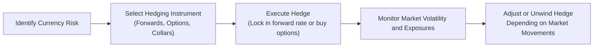

## Introduction and Overview

I remember a time—maybe some years back—when a friend of mine was on a trading desk freaking out over a sudden devaluation of the local currency. She called me in a panic, saying, “Why is my perfect hedge not working?” Well, her hedge wasn’t exactly perfect. In times of heightened volatility or unexpected policy announcements, even well-designed hedges can unravel. So let’s walk through what can happen in these volatile markets and see how professionals typically address these challenges when managing cross-border exposures.

We’ll dig into actual examples from the trenches, talk about the tools used to protect portfolios, and compare hedging in emerging vs. developed markets. Then we’ll see how everything shakes out once the dust settles. The goal is to show how these lessons flow directly into the CFA Level II exam and, more importantly, into real-life decisions you’ll likely make in your career.

## Real-World Scenario Analysis

Imagine you’re managing a global equity portfolio with significant exposure to Country X’s currency (call it the X-dollar). Suddenly, the central bank in Country X announces an unanticipated interest rate cut—or maybe there’s some political turmoil that triggers a flight to quality in other currencies. The result? The X-dollar tanks overnight, often with no immediate reliable signal of when the downward spiral will end.

### A Brief Mini-Case

• Setting the Scene:  
  An investment manager holds a basket of equities in Country X. The benchmark is denominated in USD. Right after the surprise policy move, the X-dollar slides by 15%.  
• Knee-Jerk Market Impact:  
  Because the local currency weakens, the equity holdings denominated in X-dollars lose value in USD terms, even if the local share prices remain somewhat stable.  
• Hedging Actions:  
  1) The manager quickly initiates forward contracts to lock in a future USD value for some of the X-dollar holdings.  
  2) To protect against further downside, the manager might also buy X-dollar put options (or USD call options) in an over-the-counter market.  
  3) If the manager had an existing hedge, there might be a need to “roll” (close out old forward contracts and open new ones) at new market rates.  

Below is a simplified flow of the hedging process in a forex crisis scenario:

## Market Crisis Hedging Tools

When you anticipate a potential tail risk event—where the currency or asset moves by more than three standard deviations—several strategies come to mind:

### Protective Options (e.g., Out-of-the-Money Puts)

• Goal: Limit downside loss on the underlying currency exposure.  
• Example: Buying a put option on a currency so that, if the currency weakens beyond a certain strike, the option payoff offsets losses in the underlying position.  
• Pros: Clearly cuts off extreme downside.  
• Cons: Premium costs can be high, especially when volatility escalates—a scenario ironically when you’d want these options the most.

### Collars

• Definition: A collar involves buying a protective put and simultaneously writing a call option to partially offset the put premium.  
• Why It’s Used: Reduces the net cash outlay for downside protection.  
• Trade-Off: Upside potential is forfeited above the short call’s strike price.  

### Dynamic Hedging

• Concept: Adjust hedge ratios (or re-hedge) continuously (or frequently) as market conditions change.  
• How It Looks in Practice: If the currency starts trending downward beyond a threshold, you increase your short position or buy more puts to maintain a prescribed target hedge ratio.  
• Challenges: Transaction costs can escalate quickly, and markets might gap, meaning prices can skip certain levels, making it expensive to fully adjust in real time.

## Hedging in Emerging vs. Developed Markets

Not all currency markets are equal, and if you’re dealing with an emerging market currency, you have to consider:

• Liquidity: In developed markets, currency futures and swaps are abundant, with narrow bid–ask spreads. In emerging markets, the instruments might be harder to find, or the spreads might be wide.  
• Counterparty Risk: Local banks in emerging markets may pose higher default risk, especially during crises. A cross-currency swap you negotiated might be at risk if your counterparty faces insolvency.  
• Capital Controls: Some emerging markets restrict foreign exchange flows. This could limit your ability to open, close, or roll over a hedge as freely as you’d do in a developed market environment.  
• Political and Regulatory Factors: Sudden legislation or an overnight ban on short-selling the local currency could jeopardize your strategy mid-position—something that’s less likely to occur in, say, USD, EUR, or JPY markets.

### Mini-Case: Capital Controls in Action

• Scenario: You manage an emerging market (EM) local bond fund. There’s speculation that the government might impose capital controls to prevent capital flight.  
• Hedge Attempt: You want to short the local EM currency via forward contracts.  
• Outcome: Right after you initiate the position, new rules ban certain OTC derivatives, or the central bank imposes mandatory licensing for foreign investors. Your ability to roll forward expires or you face heavy penalties. The cost of the hedge shoots up, or you are forced to unwind it at an unfavorable price.

## Post-Event Feedback and Lessons Learned

Once the mania subsides, it’s crucial to run a post-mortem on your hedging program:

1. Compare Actual vs. Theoretical Outcomes:  
   - Did your put-spread or collar really protect as much as you modeled?  
   - Did basis risk (the mismatch between the hedge instrument and the underlying exposure) cause unexpected slippage?  

2. Track and Analyze Changes in Hedge Ratios:  
   - In dynamic hedging, how often did you adjust positions, and were the transaction costs justifiable?  

3. Calculate Realized P&L:  
   - Sometimes a hedge might look like it’s losing money on paper until you realize that it preserves the portfolio’s overall value in your home currency.  

4. Stress Testing as a Daily Habit:  
   - Model new “what if” scenarios for potential policy changes, capital controls, or extreme price moves.  
   - For the CFA Level II exam, expect item set questions that assess your ability to interpret scenarios of rising volatility or changing interest rates and determine an appropriate hedge strategy.

## Glossary

• Tail Risk:  
  The risk of an asset or portfolio moving more than 3 standard deviations from its current price, often due to rare but severe market events.

• Collar Strategy:  
  A hedging approach involving buying a protective put option while simultaneously selling a call option to offset part of the put’s premium. It reduces net cost but limits upside.

• Dynamic Hedging:  
  Continuously adjusting your hedge (either by rebalancing positions or adding new ones) in response to movements in the underlying asset or market volatility.

## References

• “A Practical Guide to Hedging Currency Risk in Emerging Markets,” World Bank Publications.  
• CFA Institute case studies on crisis hedging tools:  
  https://www.cfainstitute.org  

• Additional Reading:  
  - Chapter 2 and Chapter 3 of this Volume cover currency quotes, arbitrage, and interest rate parity.  
  - For advanced guidance on evaluating policy shifts, see Chapter 5.  
  - Sample vignettes showcasing the holistic integration of hedging under crisis can be reviewed in Chapter 10.

## Test Your Knowledge: Hedging Strategies in Volatile Markets



### An investor wants to hedge against a potential sharp decline in the Brazilian real (BRL). Which of the following strategies is the most direct way to limit downside exposure?

- [ ] Writing a call option on the BRL.  
- [x] Purchasing a put option on the BRL.  
- [ ] Selling a put option on the BRL.  
- [ ] Buying a collar by writing a put and buying a call.  

> **Explanation:** Purchasing a put is the most direct form of downside protection. It provides a right to sell BRL at a specific strike price, limiting downside in the event of a BRL depreciation.

### In a collar strategy, the main trade-off for reducing your total option premium is:

- [ ] Reduced loss if markets remain stable.  
- [x] Limited upside beyond the call option’s strike price.  
- [ ] Increased liquidity compared to a forward contract.  
- [ ] Higher margin requirements in OTC markets.  

> **Explanation:** By selling a call, you partially fund the cost of buying a put, but you cap potential gains once the underlying price goes above the call strike.

### When a currency’s volatility increases dramatically, option premiums tend to:

- [x] Increase, making protective options more expensive.  
- [ ] Decrease, making protective options cheaper.  
- [ ] Remain unchanged since volatility is priced in.  
- [ ] Not be affected by implied volatility.  

> **Explanation:** Implied volatility is a major factor in option pricing. As volatility rises, the cost of options typically increases significantly.

### In a dynamic hedging program, one potential drawback is:

- [ ] It eliminates the need for stress testing.  
- [x] Frequent rebalancing can incur high transaction costs.  
- [ ] It only works in fully efficient markets.  
- [ ] It is only available to large institutional investors.  

> **Explanation:** Dynamic hedging requires constant monitoring and adjustment, leading to considerable transaction costs and slippage, especially during a crisis.

### Which factor most commonly halts or disrupts FX hedging in emerging markets?

- [ ] Currency pegging to the USD.  
- [x] Imposition of capital controls.  
- [ ] Steady interest rates.  
- [ ] Foreign banks offering unlimited hedging facilities.  

> **Explanation:** Emerging markets may impose capital controls to prevent capital outflow, which can limit the availability and liquidity of hedging instruments to foreign investors.

### A multinational company sees the local currency depreciate by 10% even though it bought put options for protection. The firm is puzzled because it still suffered losses. This scenario may best illustrate:

- [ ] The collar strategy was implemented incorrectly.  
- [ ] The company forgot to buy enough calls.  
- [ ] The forward contract was mispriced.  
- [x] Basis risk or an incorrect hedge ratio.  

> **Explanation:** Even when a hedge exists, mismatches in the notional quantity hedged or differences between the underlying exposure and the chosen hedging instrument can lead to residual losses.

### A corporate treasurer chooses to hedge half of the exposure in a currency forward and half in an at-the-money put. Why might this be advantageous?

- [ ] It offers unlimited upside while costing zero premium.  
- [x] It splits the cost of hedging and retains partial upside if the currency appreciates.  
- [ ] It’s a no-cost collar that always earns a premium.  
- [ ] Forwards always outperform options in a crisis.  

> **Explanation:** By combining a forward and a put, the firm balances guaranteed protection (from the forward) with some upside potential (via the unhedged portion plus the put’s optionality).

### Stress testing a hedging program primarily aims to:

- [ ] Identify unrealized gains at the end of the quarter.  
- [ ] Discontinue hedges that produce negative cash flows.  
- [x] Evaluate how extreme market moves affect the portfolio and hedge effectiveness.  
- [ ] Satisfy only regulatory reporting requirements.  

> **Explanation:** Stress testing helps managers quantify potential losses and ensure hedges perform under adverse market conditions. It’s crucial for risk management, not just compliance.

### When a currency is highly correlated with the global market index, hedging decisions should:

- [ ] Be made independently of the correlation.  
- [x] Consider that losses on the currency may coincide with broader market downturns.  
- [ ] Always ignore correlation since it’s insignificant.  
- [ ] Focus only on interest rate parity.  

> **Explanation:** If a currency tends to weaken along with global markets, your total portfolio risk could be amplified. Understanding that correlation can shape more effective hedges.

### A tail-risk event is characterized by movements typically beyond how many standard deviations?

- [x] 3  
- [ ] 1  
- [ ] 2  
- [ ] 5  

> **Explanation:** Tail risk refers to the probability of extreme events occurring in the far ends (or “tails”) of the distribution, often defined as 3 standard deviations or more from the mean.


