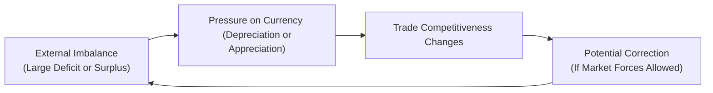

## Introduction and Overview

Have you ever wondered why some currencies seem to weaken relentlessly, while others practically exude unstoppable strength? One main reason often boils down to external imbalances—those persistent surpluses or deficits in cross-border trade and financial flows. In this section, we zoom in on how external imbalances develop, why they matter for exchange rates, and how they sometimes realign, often in dramatic fashion.

Our journey starts by defining external imbalances and quickly ascends to policy and real-world crises. We’ll touch on topics like “twin deficits,” the infamous “sudden stops” phenomenon, and the different ways countries scramble to restore balance. We’ll even comb through a few case examples—like the abrupt Swiss franc revaluation from a few years back—to grasp the magnitude and significance of exchange rate realignments. Let’s dive in.

## Defining External Imbalances

External imbalances generally refer to a persistent mismatch between a nation’s inflows and outflows of goods, services, and capital. The most prominent measure of this mismatch is the current account balance, which in broadest terms reflects:

- Exports vs. imports of goods and services,  
- Net income from abroad, and  
- Net transfers (like foreign remittances or aid).

When a country’s current account is in deficit, it’s essentially importing more than it exports (or paying out more in net income/transfers). A surplus means the opposite. But here’s the kicker: large, sustained deficits or surpluses can create big distortions. If your country carries a massive current account deficit, you need foreign capital inflows (like FDI or portfolio investments) to finance that gap. Persistent surpluses might mean the country is exporting capital or accumulating foreign reserves.

### Relationship to the Capital Account

It’s often helpful to recall from Chapter 4 that the current account and capital/financial account are mirror images. A deficit in the current account must be financed by a surplus in the capital account (and vice versa). So, external imbalances rarely exist in isolation. If the current account is lopsided, you’ll see corresponding flows in the capital account, such as heavy bond buying, equity participation, or foreign direct investment. When a nation depends heavily on these ever-increasing inflows, it becomes more vulnerable to any quick shift in global risk sentiment.

## Impact on Currency Valuations

Persistent current account deficits can be like a slow leak in a currency’s lifeboat. Over time (and I’ve seen this in my own investment gigs), deficits erode investor confidence. They typically push a currency to depreciate, which in turn can make the country’s exports cheaper and imports pricier. In an ideal world, this depreciation helps fix the imbalance by encouraging exports and discouraging imports. Of course, if there are structural issues—like a lack of competitiveness or heavy reliance on foreign commodities—then depreciation alone may not cure the deficit.

For surplus countries, the opposite dynamic can unfold. Large, persistent surpluses might increase demand for their currencies over time. Investors see that robust export engine and start treating the currency as relatively “safe,” driving up its value. However, as the currency appreciates, it can reduce export competitiveness, eventually nudging the surplus down.

### Real Effective Exchange Rate (REER) Perspective

A key measure for analyzing currency valuation vis-à-vis trade competitiveness is the Real Effective Exchange Rate (REER). Conceptually,


\text{REER} = \text{NEER} \times \frac{P^*}{P},


where NEER is the Nominal Effective Exchange Rate (a trade-weighted average of bilateral exchange rates), \\(P^*\\) is a measure of foreign price levels, and \\(P\\) is the domestic price level. When REER rises, it implies a currency is becoming more expensive relative to trading partners, potentially leading to reduced export competitiveness.

## Adjustment Mechanisms

External imbalances can adjust through both market forces and policy interventions:

1. **Exchange Rate Shifts (Market-Driven):** The currency of a deficit-running country tends to weaken; that of a surplus country often strengthens. These shifts can correct the imbalance by altering trade flows.

2. **Monetary Policy Stance:** Central banks may tweak interest rates to influence capital flows. Facing large deficits, some authorities might raise interest rates to attract foreign investments—though this can hamper growth.

3. **Fiscal Policy Tools:** Expansionary policies (like larger government spending or tax cuts) can spur domestic demand, sometimes worsening a current account deficit if imports surge. Contractionary policies can do the opposite.

4. **Capital Controls:** Countries sometimes limit inflows or outflows of capital to manage or slow down realignment. For instance, imposing taxes or quantitative restrictions on certain types of foreign capital can delay sharp currency swings, though these measures can distort markets.

5. **Managed Exchange Rate Regimes:** Fixed or pegged regimes can artificially sustain an overvalued or undervalued currency. Eventually, sustained imbalances can break the peg (as many found out in the 1997 Asian financial crisis).

Below is a simplified flowchart illustrating how an external imbalance may arise and get corrected (or not) over time:

## The Twin Deficits Hypothesis

Ever heard the phrase “twin deficits”? It refers to the notion that a government’s budget deficit (fiscal shortfall) often strolls hand in hand with a current account deficit. Picture an economy running a large budget deficit—perhaps due to heavy social programs or defense spending—without a matching increase in domestic savings. This mismatch means the country must import savings from abroad, leading to more external debt or foreign capital inflows. Over time, these inflows could prop up the currency, ironically delaying the current account correction until it becomes even bigger.

### Practical Example

Let’s say Country A enacts major tax cuts and increases spending (both expansionary fiscal moves). Its domestic demand surges, boosting imports. If the private savings rate doesn’t rise and overall output growth doesn’t keep pace, the current account deficit balloons. Foreign investors buy the government’s bonds to finance the deficit. Eventually, markets might question the sustainability of both deficits, leading to a sell-off in government bonds as well as the local currency—and a bigger day of reckoning.

## Risk of Sudden Stops

At times, the reversal in capital flows can be abrupt—what economists call a “sudden stop.” It feels pretty jarring if you’re an investor in the local markets. One moment, everything’s cozy; the next, foreign capital flees, the currency plunges, and financing dries up. Central banks might expend their foreign reserves trying to defend the currency. If they fail, the country’s exchange rate can spiral downward, inflation can spike, and businesses holding foreign-currency debt face severe repayment difficulties.

Recent history is littered with examples. The 1997 Asian financial crisis is often cited: a series of countries (Thailand, Indonesia, South Korea) faced massive capital outflows when investor sentiment soured. Coping with a sudden stop can require painful austerity measures, bailouts from international organizations, or debt restructuring—none of which are fun.

## Terms of Trade Effects

Commodity exporters are especially prone to big swings in external balances because global commodity prices can be wildly volatile. A surge in oil or mineral prices can abruptly generate a current account surplus. Think of the early 2010s commodities boom for exporters like Australia or Brazil. Conversely, when prices collapse, these nations can quickly move into deficit. Their currencies typically fall, reflecting diminished foreign-currency earnings and shifting investor sentiment.

The ratio of export prices to import prices—known as the terms of trade—can cause big external balance swings without any structural change in a country’s economy. If your key export’s price doubles but import prices remain the same, you’re in surplus territory—at least until that commodity’s price reverts. Commodity exporters often set up stabilization funds or manage currencies to buffer these effects, but the volatility remains a major headache.

## Structural vs. Cyclical Causes

Not all external imbalances point to the same root problem. Some are purely cyclical:

- **Cyclical Imbalances** might come from temporary booms or recessions. Once economies normalize, so do the current account balances. For instance, a recession might reduce imports, temporarily shrinking a deficit.

- **Structural Imbalances** reflect deeper issues: limited domestic production capacity, chronic underinvestment, policy-induced distortions, or lack of competitiveness. Reversing such imbalances can require large-scale reforms like diversifying exports, improving infrastructure, or overhauling labor markets.

Policy responses should ideally differentiate between these two. Slapping on short-term solutions (like currency interventions) to a structural deficit is almost guaranteed to fail in the long run.

## Policy Coordination

In highly interconnected global markets, you isolate your currency policies at your own peril. Nations that engage in competitive devaluations risk retaliation from trading partners. In worst cases, this morphs into a “race to the bottom,” harming global trade overall. That’s why major central banks sometimes coordinate foreign-exchange interventions. For example:

- **Swap Lines**: During crises, central banks (like the Federal Reserve, the European Central Bank) establish swap lines to ensure liquidity in each other’s currencies, preventing a meltdown.
- **Monetary Policy Coordination**: Major economies occasionally reach diplomatic accords (think: the Plaza Accord in 1985) to address persistent imbalances by guiding exchange rates in a more sustainable direction.

## Empirical Indicators for Monitoring External Imbalances

Analysts typically keep an eye on these metrics:

- **Trade Balance**: Net exports of goods and services.  
- **Current Account Balance**: Broader than the trade balance, including net primary income and net transfers.  
- **Net International Investment Position (NIIP)**: The difference between a country’s external assets and liabilities. A heavily negative NIIP can signal future vulnerabilities.  
- **Real Effective Exchange Rate (REER)**: As described, a measure of competitiveness that adjusts for inflation differentials (see formula above).  
- **Foreign Exchange Reserves**: Large reserves can help a country weather external shocks or defend a currency peg—but may denote persistent intervention.  

## Case Examples of Imbalances and Re-alignments

### The Asian Financial Crisis (1997–1998)
Several Southeast Asian countries had large external deficits financed by hot money inflows. When foreign investors got spooked, the capital dried up, leading to currency plunges and severe recessions. The crisis taught the world that an over-reliance on short-term foreign capital can be fatal.

### Swiss Franc Unpegging (2015)
Switzerland pegged its currency to the euro to prevent excessive appreciation—until it didn’t. In January 2015, the Swiss National Bank scrapped the peg, leading to an overnight surge of the franc. Exporters got hammered, and markets were stunned. This scenario highlights how sudden, policy-driven realignments can reshape competitiveness and global capital flows in the blink of an eye.

### Eurozone Peripheral Debt Crisis (2010–2012)
Countries like Greece, Portugal, and Spain found themselves with outsized fiscal deficits (and, in some cases, high current account deficits) but limited ability to devalue because they used the euro. Adjustment happened slowly through austerity and internal cost-cutting, illustrating how not having an independent exchange rate can prolong the pain.

## Best Practices and Pitfalls

• **Be Ready for Volatility**: External imbalances can linger for years, then unravel spectacularly. Keep an eye on central bank reserves, capital flow data, and the NIIP.  
• **Policy Overreach**: Overusing capital controls or pegging a currency at unrealistic levels eventually backfires. Aim for sustainable macro fundamentals.  
• **Twin Deficits Danger**: Fiscal discipline can help reduce external imbalances. A mismatch in public finances often spills over into the current account.  
• **Diversify Revenue Streams**: For commodity exporters, establishing stabilization funds or diversifying exports can help mitigate swings in the terms of trade.  

## Glossary

• **Current Account**: A broad measurement of a country’s international trade in goods and services, net income, and net transfers.  
• **Twin Deficits**: The scenario where a fiscal deficit and current account deficit occur simultaneously.  
• **Terms of Trade**: The ratio of a country’s export prices to its import prices, directly affecting the external balance.  
• **Real Effective Exchange Rate (REER)**: A trade-weighted exchange rate adjusted for inflation differentials across trading partners.  
• **Sudden Stop**: A scenario where foreign capital inflows abruptly cease, often leading to sharp currency depreciation and financial crisis.

## References and Suggested Readings

• Krugman, P., Obstfeld, M., & Melitz, M. “International Economics: Theory & Policy.” A classic text explaining core concepts of external imbalances and exchange rate adjustments.  
• Bank for International Settlements (BIS) Publications:  
  – https://www.bis.org  
  These cover extensive research on currency realignments, capital flows, and global monetary coordination.

----

## Test Your Knowledge: External Imbalances and Exchange Rate Re-alignments



### What best describes a broad definition of external imbalances?
- [ ] A mismatch between a government’s spending and earning in a single fiscal year
- [x] A persistent mismatch between a nation’s inflows and outflows of goods, services, and capital
- [ ] A temporary shock to commodity prices causing short-term currency fluctuations
- [ ] The gap between public sector and private sector budgets

> **Explanation:** External imbalances are more comprehensive than just a fiscal imbalance; they encompass a country’s broader international position, including trade of goods, services, and capital flows.

### Which metric indicates that a currency might be losing competitiveness over time?
- [ ] An increase in government budget deficits
- [ ] A surge in foreign exchange reserves
- [ ] A lower net international investment position (NIIP)
- [x] An upward trend in the Real Effective Exchange Rate (REER)

> **Explanation:** A rising REER generally signals that a currency is appreciating in real terms compared to its trading partners, potentially eroding export competitiveness.

### In a twin deficits scenario, which two deficits move in tandem?
- [x] Fiscal deficit and current account deficit
- [ ] Government spending and private savings deficit
- [ ] Trade deficit and capital account deficit
- [ ] Federal budget deficit and the balance of payments deficit

> **Explanation:** “Twin deficits” refer specifically to the concurrent occurrence of a fiscal deficit (government deficit) and a current account deficit.

### What is a “sudden stop” in the context of external imbalances?
- [ ] It is when a government enacts an immediate freeze on public spending
- [x] It is an abrupt cessation of foreign capital inflows
- [ ] It is a complete trade embargo imposed by trading partners
- [ ] It is a voluntary policy measure used to prevent currency appreciation

> **Explanation:** A “sudden stop” arises when foreign investors abruptly cut off funding, often triggering severe financial turbulence.

### Which of the following factors is most likely to worsen a country’s external imbalance in the long run?
- [x] Structural lack of competitiveness in export industries
- [ ] A short-term surge in global oil prices
- [ ] Temporary currency depreciation encouraging moderate tourism inflows
- [ ] Adoption of a new inflation-targeting framework

> **Explanation:** Structural issues like a weak export base can hinder a country’s ability to correct chronic imbalances; short-term price changes are usually cyclical rather than structural.

### Why might a surging commodity price quickly shift a country’s external balance from deficit to surplus?
- [ ] Because short selling on futures markets is disallowed
- [ ] Due to the automatic elimination of public debt
- [x] Higher export revenues for commodity-exporting countries
- [ ] It reduces the local currency’s real value

> **Explanation:** Rising commodity prices boost export earnings for commodity exporters, potentially turning a deficit into a surplus.

### How can a pegged exchange rate policy affect external imbalances?
- [x] By delaying necessary currency adjustments and potentially making imbalances larger
- [ ] By always ensuring a balanced current account
- [x] By requiring significant foreign reserve intervention to maintain the peg
- [ ] By immediately eliminating all trade distortions

> **Explanation:** A pegged rate can keep a currency artificially high or low. Maintaining the peg often requires extensive reserve use, and it can conceal or amplify underlying external imbalances.

### What is the main risk when heavy reliance on foreign capital finances a current account deficit?
- [ ] The domestic currency will appreciate uncontrollably
- [ ] The government gains more flexibility in monetary policy
- [x] A sudden stop of foreign capital could trigger a crisis
- [ ] A permanent trade surplus will develop

> **Explanation:** If a deficit is funded by external capital, any abrupt reversal (sudden stop) can destabilize the economy and spark a currency or financial crisis.

### Why does a rising REER eventually reduce a nation’s current account surplus?
- [x] It makes exports more expensive and imports cheaper
- [ ] It causes immediate capital inflows that eliminate the surplus
- [ ] It prompts the central bank to reduce money supply drastically
- [ ] It permanently lowers the fiscal deficit

> **Explanation:** An appreciating real exchange rate makes exports less competitive on global markets, thus shrinking export volumes relative to imports over time.

### True or False: Coordinated exchange rate policies among major economies can help avoid destructive “race to the bottom” devaluations.
- [x] True
- [ ] False

> **Explanation:** Cooperative actions, such as coordinated interventions or formal accords, can reduce the risks of competitive devaluation spirals.


