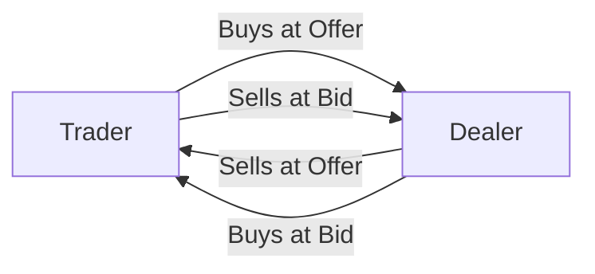

## Introduction

Have you ever opened a trading platform and watched those flickering numbers on currency pairs—like EUR/USD at 1.2000 or USD/JPY at 110.50—and wondered what’s really going on under the hood? Even if you’re used to them from Level I, it can still feel like a complicated puzzle at first glance. But don’t worry—we’re about to simplify this. In this section, we’ll chat about how currency quotes work in both the “spot” and “forward” markets, why bid–offer spreads matter so much, and how to interpret all of this in a practical sense. 

Let’s start with a simple personal anecdote: the first time I ever glanced at a real-time FX quote, I remember feeling slightly intimidated. It was a live EUR/USD rate, flashing something like 1.2320 – 1.2322, and I thought: “Okay, that’s two pips wide. But wait, which side is the bid and which side is the offer?” Turns out, it’s not rocket science—just a set of conventions designed to keep quotations standardized. We’ll cover all of that (and more) right now.

## Spot Currency Quotes

A spot exchange rate is the price set for immediate delivery (though in many cases “immediate” means settlement in two business days for most major currency pairs). Essentially, when you see something like EUR/USD = 1.2000, this means that 1 EUR (the base currency) is worth 1.2000 USD (the quote currency). If you want to buy or sell EUR for USD at the spot rate, you typically settle that transaction within T+2 business days. 

• Base Currency: The first currency in a pair.  
• Quote (or Counter) Currency: The second (or “quoted”) currency in a pair.

### Understanding Direct vs. Indirect Quotes

A direct quote is when your domestic currency is the quoted (i.e., counter) currency. If you live in the US, a direct quote for GBP would look like GBP/USD = 1.2500, because 1 GBP (foreign) costs 1.25 USD (domestic). Indirect quotes simply flip this relationship. If your domestic currency is USD, then an indirect quote might be USD/GBP = 0.80, meaning that 1 USD buys 0.80 GBP. 

However, keep in mind each country or trading platform might adopt different “conventions.” In the major global markets, pairs like EUR/USD are typically expressed in USD as the quote currency, while pairs like USD/JPY keep USD as the base. You’ll quickly pick up the pattern by looking at how quotes are commonly presented.

## Forward Currency Quotes

Unlike spot rates, forward exchange rates are agreed upon today for settlement at a future date—commonly 1 month, 3 months, 6 months, or even 1 year from now. Market participants enter forward contracts to hedge exposures, lock in future exchange rates, or speculate on price movements.

### Forward Points vs. Outright Quotes

A forward quote can show up in two ways:

• Outright Forward Rate: Quoted just like a spot rate, for example, EUR/USD 3-Month Forward = 1.2100.  
• Forward Points: Quoted as small increments (added or subtracted from the spot price) to get the full forward price. For instance, if EUR/USD spot is 1.2000 and the 3-month forward points are +0.0100, you’d get a forward rate of 1.2100.

In many real-world trading terminals, forward points appear as decimals or fractional pips. You simply add them to (or subtract them from) the spot rate to figure out the forward rate.

### Basic Formula for Forward Prices

You’ll often see forward rates connect directly to interest rates of the two currencies. If we let:
• S = current spot rate (DC/FC, where DC is domestic currency, FC is foreign currency)  
• i₍DC₎ = domestic risk-free interest rate  
• i₍FC₎ = foreign risk-free interest rate  
• t = fraction of the year (e.g., 3 months = 0.25)

Then, a fairly standard approximation for the forward rate F is:


F \approx S \times \frac{(1 + i_{\text{DC}} \times t)}{(1 + i_{\text{FC}} \times t)}


While the actual forward points might deviate slightly in the real market due to supply-demand conditions and credit risk, this formula gives you the theoretical forward rate based on interest rate differentials.

## Bid–Offer Spreads

Currency quotes almost always come with two numbers: a bid and an offer (ask) price. Let’s say you see EUR/USD quoted as 1.2000 – 1.2002. That means:

• Bid Price (1.2000): The price at which a dealer (or the market) is willing to buy the base currency (EUR) and sell the quote currency (USD). As an investor, if you want to sell EUR, you’d “hit the bid” at 1.2000.  
• Offer Price (1.2002): The price at which a dealer (or the market) is willing to sell the base currency (EUR) and buy the quote currency (USD). If you want to purchase EUR, you’ll pay the “offer” at 1.2002.

The difference between the bid and offer is known as the bid–offer spread (in this example, 0.0002 or 2 pips). It represents transaction costs and liquidity. Narrow spreads indicate high liquidity (think EUR/USD in normal times). Wide spreads often show up in exotic currency pairs or in times of extreme market stress (like small frontier currencies or during a major political shock).

### Why Spreads Matter

Spreads matter for anyone converting currency—an importer/exporter hedging exposures, a bond portfolio manager adjusting currency weights, or a traveler exchanging cash at an airport kiosk. The narrower the bid–offer spread, the cheaper your transaction costs.

During quiet periods with stable flow—say around mid-day in London—the EUR/USD spread can be just a fraction of a pip. But if a surprise central bank announcement causes sudden volatility, that spread may widen in a heartbeat, reflecting the higher risk that dealers face when quoting prices in unstable conditions.

## Inside the Market: Dealers and Market Makers

In the interbank FX arena, large banks serve as market makers by continuously quoting bid and offer prices to clients and other banks. These dealers profit from the bid–offer spread and manage inventory risk by adjusting their positions. In a typical scenario, a bank sets a bid and offer rate, waits for clients to buy or sell, and then either lays off the risk in the interbank market or offsets it with another client’s trade.

Here’s a basic flow diagram to illustrate how this looks:

Notice that if you’re buying EUR, you’ll pay the dealer’s offer price. If you’re selling EUR, you’ll receive the dealer’s bid price.

## Example: Interpreting a Set of Quotes

Let’s look at an illustrative example that a candidate might face in a vignette.

Imagine you have:

• Spot Quote (1) for USD/EUR: 0.8333 – 0.8335  
• Spot Quote (2) for EUR/GBP: 0.9000 – 0.9002  

Question: If you want to convert 10,000 EUR to USD, which price do you use?

1. We check USD/EUR because we need to see how many US dollars per one euro. But the quote we have is inverted from what we typically see for EUR/USD, right? So we reinterpret: 
   – Base currency is USD.  
   – Quote currency is EUR.  
   – The bid price (0.8333) is how much the dealer is willing to pay in USD per EUR.  
   – The offer price (0.8335) is how much the dealer wants in USD per EUR to sell you USD.

Actually, I can almost hear your mind spinning: “Wait, I’m the one with EUR. I want to swap them for USD. So am I buying or selling EUR in that scenario?” You are effectively selling EUR to get USD. So you look at the side of the quote relevant to someone who’s *selling* EUR. That would be the dealer’s bid for EUR, which is 0.8333. So your 10,000 EUR will yield:


10{,}000 \times 0.8333 = 8{,}333 \text{ USD}


Of course, if you reversed the direction (buying EUR with USD), you’d use the 0.8335 number instead, which is the offer price. 

## Impact of Volatility and Market Events on Spreads

Market-moving events—like a surprise rate cut, a change in political leadership, or an unexpected policy announcement—often widen the spread dramatically. With higher volatility, dealers face a bigger risk of adverse price movements while they hold positions. They’ll compensate by quoting a wider spread, ensuring that they can still earn a return on the additional risk. 

In stable times, major pairs like EUR/USD might have a spread of less than 1 pip (0.0001), but for an emerging market currency or in a crisis, that spread can escalate to 50–100 pips or more. It’s important to keep a pulse on economic calendars and news flows because even a scheduled event (like a central bank meeting) can see liquidity drop just before the announcement, causing spreads to spike.

## Common Pitfalls

• Mixing Up Bid and Offer: One of the most frequent errors is flipping which side of the bid–offer quote you should apply to your trade. If you’re selling the base currency, you look at the bid price. If you’re buying the base currency, you use the offer price.  
• Ignoring Transaction Costs: The bid–offer spread can erode (or inflate) your actual proceeds or costs if you simply assume mid-market rates.  
• Confusing Base vs. Quote Currency: At times, you may see the pair reversed (e.g., JPY/USD instead of the more common USD/JPY). The key is always to determine which currency is the base or the quote in the context of your trade.  
• Not Accounting for Settlement Differences: Spot trades typically settle in T+2 (except USD/CAD, which can be T+1). Forwards have their own settlement dates. Always align the contract date with your actual payment or hedge requirement.

## Practical Advice for the CFA® Exam

• Make Friends with the Exchange Rate Conventions: Be extremely comfortable with which currency is base and which is quote.  
• Identify Which Side of the Market You’re On: Are you buying or selling the base currency? Pick the correct side of the bid–offer.  
• Watch Out for Time Pressure in Item Sets: Exam vignettes can bury the currency pair or quote convention detail. Highlight them to avoid confusion.  
• Practice Quick Conversions: You want to be able to do these conversions swiftly and accurately under exam constraints.  
• Revisit Forward Pricing for Additional Concepts: We’ll dive deeper into forward valuation, arbitrage, and mark-to-market calculations in sections 2.2 and 2.3.  

## References and Further Reading

• “Foreign Exchange Markets” by Financial Times guides (an overview of real-world FX exchange mechanics)  
• CFA Institute standard texts on currency market mechanics (Level II curriculum)  
• BIS (Bank for International Settlements) website for statistical data on global FX volume and typical spreads:  
  – https://www.bis.org/

---

## Test Your Knowledge: Spot and Forward Currency Quotes Quiz



### You see EUR/USD quoted as 1.3100 – 1.3102. If you want to sell EUR, which price do you get?

- [ ] 1.3102  
- [x] 1.3100  
- [ ] The midpoint (1.3101)  
- [ ] Neither, because this is a quote for buying EUR  

> **Explanation:** Selling EUR means you access the dealer’s bid for the base currency (EUR), which is 1.3100.

### Which scenario most often leads to a wider bid–offer spread?

- [ ] High liquidity and stable market conditions  
- [x] Market stress or heightened volatility  
- [ ] A heavily traded currency pair like EUR/USD during peak hours  
- [ ] Central bank currency pegs  

> **Explanation:** In times of stress or uncertainty, dealers assume more risk and widen their spreads to protect themselves against adverse price moves.

### A forward rate can be quoted as an outright quote or:

- [ ] A partial quote  
- [ ] A pegged quote  
- [x] Forward points added to spot  
- [ ] A direct quote only  

> **Explanation:** Forward points are often quoted separately from the spot rate, and you add (or subtract) them to get the outright forward quote.

### You have a spot quote for GBP/USD = 1.4200 – 1.4205. You want to purchase GBP. Which rate applies?

- [ ] 1.4200  
- [x] 1.4205  
- [ ] 1.4202  
- [ ] The average, 1.42025  

> **Explanation:** Buying the base currency (GBP) means paying the dealer’s offer price, which is 1.4205.

### What is the main purpose of forward contracts in FX markets?

- [ ] To pay banks more commissions  
- [ ] To speculate on daily market fluctuations only  
- [x] To lock in an exchange rate for a future date  
- [ ] To trade currencies under pegs  

> **Explanation:** Forward FX contracts allow parties to fix an exchange rate today for settlement in the future, often used for hedging or long-term currency exposure strategies.

### In a quote for USD/CAD = 1.2800 – 1.2802, which currency is the base?

- [x] USD  
- [ ] CAD  
- [ ] Both USD and CAD, depending on perspective  
- [ ] Neither  

> **Explanation:** The first currency in the pair is always the base, so here USD is the base.

### If the spot rate for EUR/USD is 1.2000 and the 3-month forward points are +0.0050, what is the outright 3-month forward?

- [ ] 1.1950  
- [x] 1.2050  
- [ ] 1.2100  
- [ ] 1.2005  

> **Explanation:** Add the forward points to the spot (1.2000 + 0.0050 = 1.2050).

### You see a quote for AUD/USD of 0.7700 – 0.7702. If you have USD and want to get AUD, you want which side?

- [ ] The bid side at 0.7700  
- [x] The offer side at 0.7702  
- [ ] The midpoint at 0.7701  
- [ ] A direct quote in USD/AUD  

> **Explanation:** You’re buying the base currency AUD, so you pay 0.7702 (the offer).

### All else being equal, a currency pair with very high liquidity typically has:

- [x] A smaller bid–offer spread  
- [ ] More pegging requirements  
- [ ] A larger bid–offer spread  
- [ ] No bid–offer spread  

> **Explanation:** High liquidity means lower transaction costs and narrower spreads due to intense competition among market makers.

### Forward contracts differ from spot transactions primarily by:

- [x] The settlement date  
- [ ] The type of currencies involved  
- [ ] The ability to set the bid–offer spread  
- [ ] The involvement of central banks only  

> **Explanation:** Forwards lock in today’s exchange rate but settle at a future date, while spots typically settle within two business days.


