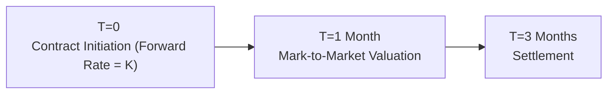

## Understanding Mark-to-Market in a Forward Context

Imagine you lock in a forward contract to purchase a foreign currency three months from now—perhaps because your company needs to pay an overseas supplier. At inception, you and the counterparty agree on a “forward price,” K, which is the exchange rate you’ll pay on settlement day. But after a few weeks, interest rates change, or the spot exchange rate moves. Even though you don’t have to pay or receive cash until maturity, your contract’s economic value—even if not realized—fluctuates. That’s the essence of mark-to-market (MTM): you’re tracking how the contract’s value changes over time.

In the futures market, everything is standardized, and margin accounts are marked-to-market daily. But currency forwards, typically done over the counter (OTC), don’t settle or margin daily. The result? Potential credit exposure can balloon if one side is “in the money” and the counterparty defaults. We’ll walk through why and how we measure that exposure (and also how you might handle partial or full termination of the contract if desired).

## Key Considerations: Forwards vs. Futures

It seems to me that the biggest conceptual leap here is comparing this to exchange-traded futures. Futures are standardized, traded on an exchange, and they’re so helpful because daily settlements reduce credit risk. By contrast, forwards are private contracts between two parties. No daily settlement. No exchange clearinghouse acting as a guarantor. That’s why simply doing a forward contract might be cheaper or more flexible for you—but the credit risk is yours to monitor.

So, yes, forwards deliver the same functional payoff at maturity as futures, but you’ll see big differences in credit risk mitigation, daily cash flow, and liquidity. Hence, the impetus for marking forward contracts to market from time to time. You want to keep an eye on how much you’d gain or lose if you had to exit the contract early or if your counterparty might default.

## Deriving the Forward Mark-to-Market Formula

At any time t before the contract expires, we can measure how “in the money” or “out of the money” the contract is. Let:

• F(t) = Current forward rate for a contract that would expire on the same day as our existing forward. This is the new market forward price if we were to initiate a brand-new contract now.  
• K = Agreed-upon forward rate (the rate locked in when the forward was initiated).  
• Notional = The currency amount underlying the contract (e.g., GBP 1,000,000 or EUR 1,000,000).  
• Discount Factor = The appropriate factor to bring future cash flows back to present value, often derived from risk-free rates, or sometimes from relevant yield curves for that specific currency.

The general “fair value” (or mark-to-market value) of a currency forward can be found using:


V(t) = \bigl(F(t) - K\bigr) \times \text{Notional} \times \text{Discount Factor} 


If \\( F(t) > K \\), the contract to buy foreign currency at K is favorable. If \\( F(t) < K \\), it’s unfavorable if you’re the buyer. That difference, multiplied by the notional, is the economic value. Finally, discounting is typically minimal for short-dated contracts, but for multi-month or year-long forwards, you definitely want to reflect that future net cash flow in present value terms.

## Step-by-Step Example: Mark-to-Market in Action

Let’s walk through a very straightforward example. Suppose on January 1, you enter a three-month forward contract to buy 1,000,000 euros at a forward rate of 1.2000 USD/EUR. That’s your K. One month later, interest rates have changed, and the forward rate for the remaining two months on a brand-new contract is now 1.2300 USD/EUR. So your original contract is locked to buy euros cheaper than the new forward market suggests:

• F(t) = 1.2300 USD/EUR (new forward rate for the time remaining)  
• K = 1.2000 USD/EUR  
• Notional = EUR 1,000,000  

Now, your forward is in your favor by (1.2300 – 1.2000) = 0.0300 USD/EUR, or 3 cents per euro. If the discount factor for that two-month period is about 0.995 (assuming a small annual interest rate), then:


V(t) = (1.2300 - 1.2000) \times 1{,}000{,}000 \times 0.995 



= 0.0300 \times 1{,}000{,}000 \times 0.995 



= 29{,}850 \text{ USD (approximately)}


You might say, “Well, if I wanted to exit, I could close this with a reverse forward at the new forward rate and basically lock in that $29,850 gain.” Indeed, you could. That’s the logic behind the formula.

## Effect of Time, Interest Rates, and Spot Changes

Now, let’s look deeper:

• Time to Maturity: The closer you get to maturity, the discount factor gets closer to 1. Mark-to-market adjustments shrink if interest rates remain stable and if there’s minimal time value left.  
• Interest Rate Changes: If domestic or foreign interest rates shift significantly, the forward price F(t) might change. Expect big jumps in forward rates for longer maturities or volatile interest rate environments.  
• Spot Rate Changes: Although forward quotes are primarily driven by interest rate differentials, the spot rate itself also matters. Perhaps the spot leaps in response to a central bank announcement (discussed more in upcoming sections of this chapter). Then people adjust forward quotes to reflect new expectations.  

So your forward’s value is a dynamic target: it moves with interest rates, spot changes, and the passing of time.

## Practical Mermaid Diagram

Here’s a quick timeline representation of marking a forward contract to market over its term:

• At T=0, you agree on the forward rate K for settlement at T=3 months.  
• At T=1 month, you can compute the contract’s MTM value by referencing the new forward rate for the remaining 2 months, F(1).  
• At T=3 months, your contract is settled at the original K, and your gain/loss is realized in actual cash flow or currency delivery.

## Credit Risk Management

Now that we’re all excited about the formula, we need to tie it back to credit risk. Mark-to-market reveals how much one party stands to lose if the other side defaults. Suppose you’re the beneficiary of a $29,850 gain. If your counterparty goes bankrupt, you might not recover that amount without a netting arrangement, collateral, or other credit protection.

In an exchange-traded futures contract, the exchange clearinghouse is a central counterparty. Defaults are settled out of margin accounts, so you rarely lose out. But in OTC forwards, you face your counterparty’s credit risk directly. That’s why many corporate treasurers request collateral or measure “counterparty exposure” daily. They track the forward’s mark-to-market value to see if they need to adjust hedges or request additional collateral. Sometimes, they might close the position early or partially offset it with an offsetting forward, especially if the credit exposure grows large.

## Corporate Use Case: Treasury Hedging

Consider a multinational firm’s corporate treasurer, who might be hedging future currency receipts from an overseas subsidiary. They enter a forward contract to sell foreign currency in the future. If the foreign currency strengthens, the treasurer’s forward position loses value. They track this mark-to-market because:  
• It indicates potential margin calls (if there’s a collateral agreement).  
• It highlights the net exposure if there’s a risk the counterparty (or the company itself) must close the contract early.  
• It helps them plan for alternative hedging strategies or renegotiations if market conditions change drastically (for instance, if they no longer expect the foreign revenue in the same amount or at the same time).

## Best Practices and Common Pitfalls

• Overlooking Discount Rates: If you’re ignoring the present value factor, your valuation might be off a little. For short maturities, the difference is usually small, but for multi-year forwards, discounting can be significant.  
• Mixing Up Sign Conventions: In calculating \\( F(t) - K \\), if you’re the seller vs. the buyer, the sign of your net payoff might reverse. Keep track of whether you’re expecting to receive or deliver foreign currency.  
• Not Checking Credit/Economic Exposure: If you never revalue your contract, you might be in for a rude awakening if your counterparty goes bust.  
• Confusing Futures with Forwards: Futures are marked to market daily with margin settlements. Forwards have no daily margin, so “mark-to-market” is more an accounting exercise and credit risk measure.  
• Ignoring “What If” Scenarios: Don’t forget policy changes (such as central bank interventions or capital controls). These can drastically alter interest rates or spot markets, changing your forward rate assumptions.

## Additional Illustrative Example

Let’s do one more question-style example. Suppose it’s a three-month forward on 2 million British pounds (GBP). The contract rate set at inception is 1.3500 USD/GBP. After one month, the new forward quote for the remaining two months is 1.3400 USD/GBP. From your perspective, you’re obligated to buy GBP at 1.3500 but the current two-month forward rate is 1.3400, which is favorable if you want to buy at the new rate. So your existing forward is out of the money if you’re buying. Let’s say the discount factor for the two months is 0.996:


V(t) = (1.3400 - 1.3500) \times 2{,}000{,}000 \times 0.996 \\
V(t) = (-0.0100) \times 2{,}000{,}000 \times 0.996 \\
V(t) = -19{,}920 \text{ USD}


This negative value means your forward contract lost $19,920 in economic value from your perspective—if you wanted to close early, you’d effectively pay that amount in the market to offset your position.

## Practical Tips: Dealing with Early Termination

Occasionally, you might not want or need the forward anymore. Suppose your overseas contract fell through, or maybe you locked in a different hedging instrument. To close the position:  
• Enter an offsetting forward (effectively setting up a “reverse” trade).  
• Negotiate a termination payment with your counterparty, typically close to the current MTM value.  

From a CFA exam vantage point, you may see vignettes where a company has an existing forward, new interest rate data, and a change in planned currency needs. The item set might ask you to compute the net gain or loss for closing out the position now. That’s precisely Mark-to-Market Value 101.

## Encouraging Continuous Practice

I recall messing up discount factors early in my career—only to realize later that even a slight difference in annualized rates can produce thousands of dollars of discrepancy. So if you’re practicing, keep re-checking:  
• The correct discount rate for the relevant maturity (e.g., 30 days vs. 60 days vs. 3 months).  
• The sign of your net payoff.  
• The notional currency.  

It makes quite a difference if you get these details wrong under exam conditions.

## References & Further Reading

• Hull, John. Options, Futures, and Other Derivatives. A classic for derivative pricing theory and practical examples.  
• Journal of Finance articles on forward/derivative pricing for robust theoretical frameworks.  
• CFA Institute Level II Curriculum on derivative pricing.  
• Chapters in this Volume:  
  – Section 2.1: Spot and Forward Quotes  
  – Section 2.2: Forward Premiums and Discounts  
  – Section 2.4: Triangular Arbitrage Opportunities  

## Test Your Knowledge: Mark-to-Market in Currency Forwards



### Which statement best describes the mark-to-market value of a forward contract prior to expiration?

- [ ] It is always zero because no cash exchanges hands until maturity.
- [x] It can be positive or negative and is computed using the difference between the current forward rate and the contracted rate, discounted to present value.
- [ ] It is determined solely by the spot rate at the time of valuation.
- [ ] It does not exist because the contract is not traded on an exchange.

> **Explanation:** The MTM value reflects how “in the money” or “out of the money” the forward is, based on the current forward price versus the contract price, discounted appropriately.

### A currency forward has a contract rate (K) of 1.2500 USD/EUR and three months to maturity. After one month, the new two-month forward rate (F(t)) is 1.2700 USD/EUR, and the discount factor is 0.995. For a notional of EUR 1,000,000, what is the approximate mark-to-market value?

- [ ] USD 19,500
- [ ] USD 24,500
- [ ] USD 35,000
- [x] USD 19,900

> **Explanation:** The MTM value = (1.2700 – 1.2500) × 1,000,000 × 0.995 = 20,000 × 0.995 = 19,900 USD.

### Which factor primarily drives the difference between a currency forward’s agreed-upon rate and the current forward rate at a later date?

- [ ] Transaction costs only
- [x] Changes in interest rates or interest rate differentials
- [ ] Central bank foreign exchange interventions only
- [ ] Changes in the futures price of the underlying currency

> **Explanation:** The forward rate is largely influenced by interest rate differentials between the two currencies. Spot rate moves and market expectations also play roles, but interest rate changes are a key driver.

### An investor is long a forward contract. If the new forward rate for the remaining term rises above the original contract rate, then:

- [ ] The contract value decreases because the investor is losing money.
- [x] The contract value increases because the investor can buy at a cheaper rate relative to the new forward price.
- [ ] The contract value remains unchanged until final settlement.
- [ ] The investor’s counterparty stands to gain.

> **Explanation:** A higher current forward rate relative to the original rate means a favorable locked-in price, boosting the long position’s value.

### Why do corporate treasurers often mark their forward contracts to market?

- [x] To keep track of current credit exposure and potential gains or losses
- [ ] To comply with exchange margin requirements
- [ ] To protect themselves from changes in regulatory regimes
- [ ] To ensure they are meeting anti-money laundering standards

> **Explanation:** Mark-to-market calculations help treasury managers measure the current replacement cost or gain/loss if the forward is terminated prematurely. It is also useful for credit risk monitoring.

### In valuing a currency forward, one must discount the difference between the forward rate and contracted rate because:

- [x] The value is realized at contract maturity, so any interim value must be expressed in present-value terms
- [ ] The value is always zero without discounting
- [ ] Forward contracts pay continuous dividends
- [ ] Regulatory rules require immediate settlement of the difference

> **Explanation:** Discounting accounts for the time value of money because the contract payoff is realized in the future.

### Which best explains the difference between forward and futures mark-to-market procedures?

- [ ] Both forward and futures are marked to market daily.
- [x] Futures are marked to market daily via margin, while forwards typically do not require daily settlement.
- [ ] Forwards are standardized and require margin, while futures do not.
- [ ] Forwards and futures have no material difference in credit risk.

> **Explanation:** Futures contracts have daily settlement and margin requirements. Forwards are private contracts, generally without daily marking to market or margin calls.

### A decrease in the domestic interest rate relative to the foreign interest rate will likely:

- [x] Increase the forward exchange rate of the foreign currency (domestic currency depreciates forward)
- [ ] Decrease the forward exchange rate of the foreign currency (domestic currency appreciates forward)
- [ ] Have no impact on forward quotes
- [ ] Immediately drive spot rates upward

> **Explanation:** If the domestic interest rate decreases (or the foreign rate increases), the domestic currency tends to weaken in forward terms, raising F(t) for the foreign currency.

### If the spot rate moves sharply in favor of the long forward position, but interest rates remain unchanged, the forward’s mark-to-market value will:

- [x] Likely increase because the forward rate may adjust to reflect spot price shifts over time
- [ ] Remain unchanged because the forward is locked in
- [ ] Decrease since the forward price is unaffected by the spot
- [ ] Fall to zero because no daily margin is posted

> **Explanation:** Although forward prices are largely based on interest rate differentials, a large spot rate move (plus market expectations) will influence the forward rate. Therefore, the value to the forward holder changes.

### Mark-to-market helps monitor credit exposure in forward contracts because:

- [x] It quantifies the contract’s current replacement cost, which could be lost if the counterparty defaults
- [ ] It ensures daily margining so that no losses accrue
- [ ] It eliminates the need for a clearinghouse
- [ ] It transfers settlement risk to the exchange

> **Explanation:** The mark-to-market value shows how much one party is potentially owed, indicating exposure if the other party cannot fulfill the contract.


